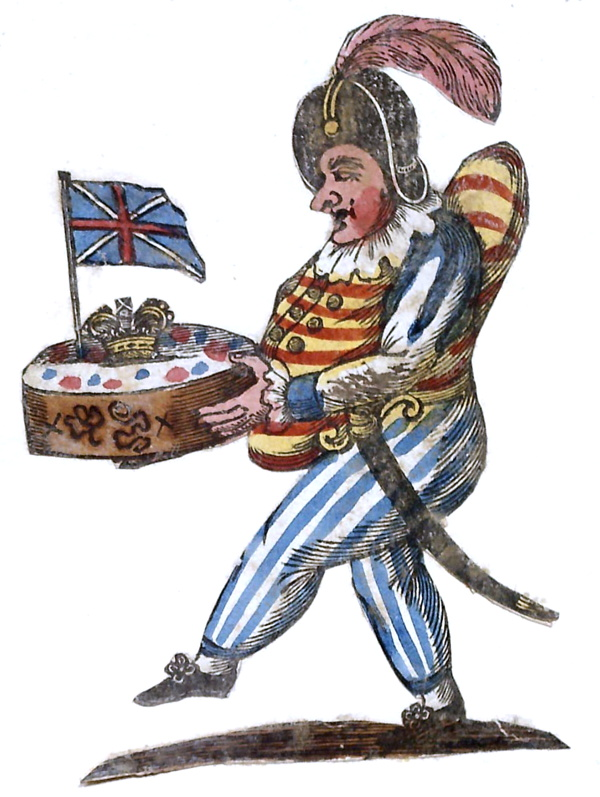

Miss Porden

If gifts the stern fair one to pity can move  
Their power at this time let your Valentine prove  
At the suit of Poor Punch, Eborina relent  
For say what more *rich* can a Lover present.  
If your heart may be moved or by honours or gold  
On the top of my Offering a crown you behold  
Let the Flag that waves o’er it your canopy make  
And untouched you have still a most noble plumb cake  
Where fruits from all countries are mixed in a paste  
That must surely delight any damsel of *taste*  
Then let it your mind to compassion incline  
And allow at the least I’m a *sweet* Valentine.