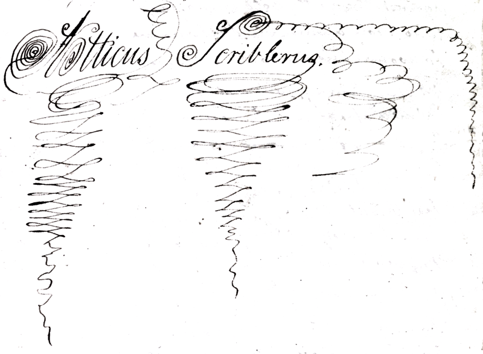

Mr Porden

> Epistle the 1st

> To the Editor of the Attic Chest  

##### Justice! Justice!! Justice!!!

Forgive, dear Sir, an injured poet,  
Who’s wrong’d — who’d wish the world to know it,  
Who, by a dire deceiver’s art  
Is wounded in his tenderest part,  
If in epistolary song  
He cry for Justice! loud and long.  
Yes, worthy Sir, success i’ th’ Attic  
Chest had waked feelings quite ecstatic,  
And all my soul with ardour glow’d  
While my kind friend the member show’d  
The meed of praise, upon my verse bestow’d:  
But Ah! too soon, with altered cheer  
And many a dark surmise, I hear  
That there was read a second letter  
In which I plained me of a debtor  
For verses in the way of trade,  
Who made me *write*, but never *paid*  
And tho’ I did not fairly name him  
Enclosed the verses, Sir, to shame him.  

Now, on my word, this “Lamentation”  
(Although it met with commendation)  
Was none of mine — for I had spurned  
E’en were my verse on hand returned,  
To seek revenge for such offence  
By one betraying confidence.  
No, ’tis the work of angry rival  
Who’d wish himself the trade to drive all,  
Or jealous damsel — fie upon her —   
Who’d steal my only wealth — my honor.  

O, aid me all ye sacred Nine!  
Fill me with energy divine!  
And, as the lion’s lashing tail  
To swell his fierceness doth avail,  
So let my goose-quill wave in ire,  
To fan the flame of fury dire!  
But no — to mortal if ’twere given  
To dart at will the winged levin  
Poetic vengeance frequent hurl’d  
Would soon of bards deprive the world.  
And so, without a further fuss  
I’ll call the gentle Zephyrus  
Or fiercer wind of rougher name,  
T’extinguish quick the rising flame,  
E’er its effects are seen on paper;  
Like careful maid, with evening taper.

But, tho’ no vengeance dire I foster,  
Against the witty bold impostor,  
Who stole a humble poet’s name,  
To wound his honour — share his fame;  
Yet still I may, without offence  
Calmly assert my innocence;  
Assure my friends their secret’s kept  
By me, as in a tomb I slept;  
And Mr Editor, with leave,  
Lest rivals should again deceive,  
Your critic eyes, I’ll fix some signs  
By which you’ll know Scriblerus’ lines.  
The first and best, that Pindus’ quire  
Fill them with spirit, grace and fire;  
Next graphic elegance and skill  
With the same pen my page do fill  
And nought is mine, in different hand;  
Lastly, a signature I’ve planned,  
“Which,” like his name whose dross we buy  
“To counterfeit is felony.”  
Requires aught else of seal or token  
To keep my character unbroken,  
It shall be done, with zeal most fervent  
By your obsequious humble servant  

Atticus Scriblerus
