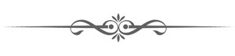

## Book IX

### The Embassy of Adel

Вut Richard ceas’d not from the work of death, 
Sheath’d not his sword, nor gave his charger breath, 
Till not one turban’d warrior stood to rear 
The useless sabre or presumptuous spear. 
Then on the turf his painful helm he threw, 
In Arsouf’s torrent cleansed his sanguine hue, 
And, with uplifted hands and ardent gaze, 
To Heaven he gives the glory and the praise. 
Sad thoughts succeed; the blood that stains his wreath; 
The grief, that conquest must be bought with death! 
For Percy’s blighted youth he now deplored, 
D’Oyley the brave, and Ferrars’ veteran lord; 
But most, where pale the great D’Avesnes was laid, 
Ηίs manly sorrows mourn’d th’ illustrious dead. 
He bids whate’er of funeral pomp may give 
Fame to the past, or solace those that live, 
In Arsouf’s walls the honour’d corse await— 
(Arsouf, where ruled his valiant sires so late).[^1] 
&emsp;New grief succeeds; Matilda’s loss he hears! 
Now wrath inspires, and now fraternal fears. 
Now would he follow through the night, and claim, 
By force and threat’ning arms, the ravish’d dame. 
Now reason rules; his calmer feelings rest 
On Adel’s pledge, and Raymond’s rage represt. 
“Nay, seek not useless death, my friend, distrust 
Provokes deceit, and makes the falsehood just. 
Arabs have faith, and Adel’s worth is known 
In deeds not prais’d by Moslem lips alone. 
But if the dawn a broken compact shew, 
Thou shalt not find a brother’s vengeance slow.” 
Meanwhile the Christians, resting from their toil, 
Spread through the desert camp, and share its spoil. 
Night closes round, but frequent watchfires gleam 
On Arsouf’s tented slope and mountain stream; 
And ruddy torches glanced along the plain, 
Where hasty tombs received the nobler slain, 
Where friendship waked, the last sad rites to pay, 
Or the rude plunderer stripp’d his lifeless prey; 
And flash’d, while frighted wolves at distance bay’d, 
On dusky hills and Sharon’s magic shade. 
&emsp;The morning dawn’d, but ere its earliest light 
Had Raymond climb’d to Arsouf’s giddiest height. 
While yet the mist forbade an eagle’s ken 
To rest on plain, or stream, or shadowy glen. 
Around, the clouds engage in fearful clash, 
And forked lightnings glance, and thunders crash. 
Terrific thunder, heard by those alone 
Who list the giant on his mountain throne! 
Then sunk the storm, and many a verdant brow 
Shone, like blest islands on a lake of snow; 
Broad rose the rayless sun, and widely spread 
The skies with gold, the billowy mist with red. 
But lo! those mists have melted in his beam, 
Or lingering only near each mountain stream, 
In fleecy wreaths, like clouds of summer skies, 
Hang o’er the winding waters whence they rise. 
&emsp;Far off, emerging from a woody glen, 
Now seen, now veil’d by hills or groves agen, 
A moving line appears, and flashing light 
Glows, as from helms or spears, on Raymond’s sight. 
Now borne upon the breeze a gentle sound, 
Like strains of elfin harpers, breathes around; 
A crag obstructs his gaze, but on his ear 
The welcome music swells, till full and clear 
The royal drum proclaims a Monarch near. 
Now from the hill to view distinct advance 
Warriors with glittering helm, and shield and lance; 
Standards whose black and tawny volumes roll’d 
O’er turbans, rich with purple, green, and gold; 
Eunuchs, whose robes of spotless muslin flew, 
In wayward contrast to their Nubian hue; 
And Mamlukes, leading by the gilded rein 
Arabian steeds, that scarcely touch the plain; 
And fair-form’d slaves, whose veils of dazzling white, 
Imperial presents screen’d from vulgar sight. 
Next Adel rode, conspicuous o’er the rest 
By the white waving of his triple crest. 
Behind, two chosen youths of Georgian race 
Led on a camel, train’d to gentlest pace, 
The roseate folds of whose rich palanquin 
From curious eyes some royal beauty screen. 
&emsp;No more th’ enraptured Raymond paus’d to view, 
On wings of love from Arsouf’s cliff he flew, 
And breathless reach’d the distant camp, as staid 
At Richard's tent the gorgeous cavalcade; 
As on its knees the well-taught camel bends, 
And glad Matilda from her seat descends. 
The courteous Adel guides her trembling frame, 
And to her brother yields the royal dame; 
While his fair Queen, her peer in youthful charms, 
Folds her loved sister in rejoicing arms. 
To Adel then a thousand thanks were pour’d, 
And ready menials spread the festive board. 
In each bright eye confiding pleasure sate, 
And concord smooth’d the wrinkled front of hate. 
But when his Mamlukes spread to Richard's view 
The Soldan’s gifts, the sister-Queens withdrew; 
And Raymond too retired, to ease a breast, 
With rapture now, as erst with grief opprest. 
&emsp;Rich vests of honour, gems that knew no price, 
And bowls enchased with many a rare device; 
Hot Saba’s spicy wealth, and Yemen’s gums, 
Whose fragrant fume from silver censers comes: 
Conserves, till now to Western taste unknown, 
And fruits, the produce of a warmer zone;<a href="#note09-b" class="footnote-ref">b</a> 
Sabres, whose blades delicious odours breathe, 
And amulets, that warn of guile or death. 
All these display’d, the slaves stood meekly round, 
With folded arms and eyes that sought the ground, 
When Adel spoke: “I do not wait to hear 
Repeated thanks that sicken on my ear, 
But I, myself no common herald, bring 
The proffer’d friendship of no common King. 
&emsp;“Thus then of Ayoub’s blood, of Joseph’s line, 
Shield of the Faith, speaks mighty Saladine— 
His days may Alla guard, his power increase, 
Till earth be changed for Heaven’s eternal peace! 
&emsp;“When baffled hunters quit the idle chace, 
When distanced runners feign to yield the race, 
Fear prompts, or shame; and some might deem that fear 
Brings me for peace a vanquish’d suppliant here: 
Yet think what hosts shall arm at my command 
From Cashmere’s vales, from Nubia’s sultry sand; 
From Egypt, where within his giant tomb 
The Patriarch sleeps from whom my fathers come;[^2] 
To mighty Kaf, on whose untrodden brow 
The Bird of Ages dwells in endless snow, 
Where Sultans ruled ere Adam’s race began, 
Where Angels bow’d, and Eblis scoff’d at man.<a href="#note09-c" class="footnote-ref">c</a> 
All these, and more, beneath my favour shine, 
And blend in prayer their Caliph’s name with mine! 
Then say if fear can dwell with Saladine? 
To one less great could Joseph’s heir descend, 
Or seek one less than Richard as a friend? 
&emsp;”Perchance as numerous tribes thy rule obey, 
And realms as various bless thy Western sway, 
That other seasons, other stars adorn, 
And fade in night when ours salute the morn: 
Yet what of wealth shall mightiest conqueror save, 
But the cold sheet that winds him in the grave?<a href="#note09-d" class="footnote-ref">d</a> 
While one poor peasant from his hamlet driven, 
Has power to blast him on the bridge of Heaven.[^3] 
A few short years, perforce our strife must cease, 
Our sons may fight, but we shall sleep in peace. 
&emsp;“Behold me then, for either chance prepared, 
For peace or war, as now thy lips award; 
Say why, innumerous as the crested waves, 
Your annual fleet the wondering Ocean braves? 
What rancour fires to quit your tranquil reign? 
What shun ye there, what here attempt to gain?” 
&emsp;“Twice fifty snows are gone since Godfrey bore,” 
Thus Richard spoke, “the Cross on Syria’s shore, 
And asks your Monarch now, why all most dear, 
Friends, kindred, home, we leave to perish here? — 
The land from hence to Jordan’s sacred tide, 
The precious Cross where meek Messiah died, 
His tomb, and where Jehovah’s temple stood— 
These have we vow’d to purchase with our blood.” 
&emsp;“And these,” said Adel, “while these climes retain 
Their faith, their Prophet, must thou never gain. 
That senseless wood ye prize—it once was ours; 
But, if by Genii curst, or Angel powers, 
Rapt from our view, ’tis ours to yield no more, 
Might we that scandal to our creed restore.<a href="#note09-e" class="footnote-ref">e</a> 
Nor can we to rebellious hands resign 
The sacred City (and it ne’er was thine), 
Salem, nor last nor meanest of the seven 
That Islam honours by command of Heaven; 
For there the faithful Genii meet, and there 
Rose the great Prophet through ambrosial air, 
What time, yet clothed in mortal flesh, he trod 
The sevenfold heavens, and view’d the living God. 
But if thou wilt, this contest yet shall cease, 
And Strife’s crude apple yield the seeds of peace, 
&emsp;“As late thy sister to the Soldan’s breast 
Recall’d a form in halcyon youth imprest, 
When Eleanora with her former lord[^4] 
In Antioch dwelt, by Turk and Frank adored, 
He wept to think how he with deadly strife 
Pursued her son—that late he sought thy life; 
But I with less paternal eyes beheld 
Matilda’s charms, and rued my pledge to yield. 
&emsp;“Hear then, great King! and if your martial vow 
And jealous faith such bridal rites allow, 
Beneath our blended sway shall Syria bow; 
In all that splendour shall Matilda live 
That Egypt’s wealth to Judah’s throne can give. 
Free as in Christian lands, her gates of gold 
To all she lists shall unreproved unfold; 
While in my realms, unquestioned as in thine, 
Shall Christians pass to every sacred shrine; 
My slaves obedient shall protect their faith, 
And aid them dying, and entomb in death. 
&emsp;“Then ponder well, a hostile realm to gain, 
By arms to win it, and by arms maintain, 
Or bid at once the strife of ages cease, 
And all the ends of war acquire by peace.” 
&emsp;“Vast is the stake, nor lightly to decide 
Becomes my youth;” the English King replied. 
“True, I have kingdoms, fruitful realms and fair, 
That now, perchance, demand a Sovereign’s care: 
Unmatch’d in arts and arms, a fertile isle, 
Whose vales are green in Summer’s temperate smile; 
Where nor hot winds nor fierce tornadoes blow, 
Nor Winter brings unmitigated snow; 
While half those regions Philip calls his own, 
In corn and vines are clothed for me alone: 
Yet may I not desert a promise given, 
Or quit for earthly cares the Cause of Heaven. 
Salem has yet a King,—a King my friend, 
Can I crush rights I pledg’d me to defend? 
Or should nor Heaven nor Lusignan withstand, 
Without her sanction plight Matilda’s hand?— 
I call my council,—thou meanwhile may’st bear 
My courteous greetings to the Soldan’s ear; 
Whate’er of friendship war like ours can know, 
Christian and Infidel, or foe and foe. 
Say, should we close our contest or renew, 
If e’er again mу native land I view, 
Not his own bards in warmer phrase than mine 
Shall sing the power, the worth of Saladine.” 
&emsp;Soon to his Peers convoked, the Monarch shew’d 
The proffer’d terms of peace, and then pursued: 
“Thus speaks the Soldan —and I yield the choice 
Of truce or conflict to the general voice. 
Think, if such terms our faith with Heaven fulfil? 
To leave the Turk on Sion’s Holy Hill; 
To yield a Christian Princess, and to prize 
As friends and kindred those our God denies? 
Ye ministers of Heaven! its will explain; 
Thou, Lusignan! thy menaced rights maintain; 
Be every claim in equal balance tried, 
Weigh well, oh Princes! weigh them, and decide.” 
&emsp;He spoke, and wondrous, not a breath was heard, 
Nor whispered murmur, nor dissentient word. 
It seem’d as some Lethean spell had crept 
Round each fierce heart—that even discord slept: 
Till, like the last faint sigh when tempests cease, 
One sound they uttered, and that sound was “Peace!” 
The Asian prelates, Acre, Nazareth, Tyre, 
And peers of France, that France and home desire, 
Wearied of war, and conscious that the shame 
Or praise alike will cling to Richard’s name, 
Each in his turn the offered rites allows, 
And brings meet instance of resembling vows. 
How oft Amalric leagued in strict accord 
With great Noureddin, and Iconium’s Lord; 
Nor fear’d in Egypt Chaver’s cause to join, 
Even in his youth, the foe of Saladine.<a href="#note09-f" class="footnote-ref">f</a> 
“Ha!” Raymond thought, “no martial voice, not one! 
Discord and valour both with Conrad gone! 
But Lusignan arises,—heavenly power! 
Thy priests are faithless in this fatal hour, 
Make then the claims of pride and interest strong— 
Matilda’s fate is trembling on his tongue.” 
&emsp;Yes, Lusignan arose, and ne’er before 
So sweet a grace his calm, fair visage wore. 
From his bright hair Judea’s crown he took, 
And view’d awhile with mild and pensive look. 
“Beloved in life, and honour’d in the grave, 
To me this wreath Amalric’s daughter gave; 
Pledge of her truth, affection’s sweet reward, 
I hail’d the glittering weight, and vow’d to guard. 
Yet few like me, the sport of fate, have found 
What thorns are hidden in its golden round; 
That this wide earth contains no wretched thing 
Despised, insulted, like a throneless King! 
Not by ambition, but by duty driven, 
I prized what seem’d the sacred gift of Heaven; 
Nor grief, nor chains, nor Conrad’s threats unjust, 
Could make my faithful soul desert its trust;— 
But now if heaven resume it, I resign— 
Heroic Richard, be its glories thine! 
Guard if thou wilt, or where thou wilt bestow, 
No jealous pangs this grateful heart shall know;— 
May he who wears, his realm in triumph free, 
Like me be faithful, but more blest than me. 
Some tranquil small domain, alone I crave; 
A place of rest, an uncontested grave.” 
&emsp;“Enough, my friend—till Heavens decree be known, 
In trust I take the delegated crown; 
Not for myself—my own paternal land 
Is amply vast to fill one sceptred hand. 
Yet must not thou, who saw’st the mightiest bend 
Beneath thy rule, from kingly rank descend. 
My recent prize, beyond description fair, 
Deserves a Monarch’s undivided care; 
One half the Templars hold, the rest be thine 
Its wealth, its regal honours I resign.”g 
&emsp;“Too generous King!” glad Lusignan replies, 
“Not the wide earth could yield so dear a prize. 
Hail, Cyprus! fairest isle beneath the sun, 
So freely yielded, as so nobly won.”— 
&emsp;The Monarch smiled, when Raymond, struggling long, 
For looks less troubled and less faltering tongue, 
Abruptly spoke:—“Is all our virtue gone? 
Plead I for heaven’s, for glory’s rights alone?— 
Is war so irksome now, that in the field, 
The hour of conquest, ye those conquests yield! 
Acre, that three long years your arms withstood, 
Acre, whose stones are red with kindred blood; 
Acre upbraids ye with each sacred stain, 
Arsouf implores ye by her glorious plain. 
All they adjure—but thee with holiest power, 
By the warm pride of victory’s purple hour, 
Oh! Cœur de Lion! theirs, thy fame to save, 
And shield from grief the spirits of the brave. 
Soul of D’Avesnes! alas! I deem’d thee blest, 
That in the grave thy senseless ashes rest, 
But thou shalt grieve in heaven—the injured slain 
Shall nightly shriek round each polluted plain; 
Till Islam’s frighted slaves the region shun, 
And yield again the realm their valour won. 
Oh! if in vain a Saviour’s tomb implore, 
Does Honour, does Ambition fire no more? 
And Richard—late I saw thy manly brow 
Pale with fraternal fears,—and canst thou now 
For ever yield her—yield her spotless soul 
To barbarous hands, to Infidel control— 
Force to a spouse abhorr’d her struggling will?” 
&emsp;“And can’st thou, Raymond, judge thy friend so ill? 
Now, by this Cross, I would not yield a rood 
Of all these regions, purchased with our blood; 
Or give Matilda to a yoke abhorr’d, 
To reign wide Asia’s uncontested Lord. 
Call forth Sicilia’s Queen.” In steady tone 
He made the terms of proffer’d treaty known. 
“Think not,” he added then in soften’d voice, 
“I give the name without the power of choice. 
Think not, though all a Monarch’s cares I feel, 
My power more precious than my sister’s weal. 
Adel is generous, has a princely soul, 
But his fierce passions never felt control; 
Splendour would wait thee on Judea’s throne, 
But thine is not a heart for pomp alone. 
This hour assembled Princes wait thy voice, 
And peace or war may hang upon thy choice: 
But should they all with armed hosts demand, 
I would not yield him thy reluctant hand; 
Circled by those of alien faith alone, 
Frightful to view,—speech, manners all unknown; 
Perchance without a friend thy heart to share, 
Matilda! think, could’st thou be happy there?” 
&emsp;While thus he spoke, a bright but quivering streak 
Oft flush’d and faded on Matilda’s cheek; 
At length it died, yet still her eye was bright, 
Bright with a loftier and diviner light; 
Her air serene contrasting with the glow 
Of troubled passions all around her shew, 
With the deep terrors Raymond’s looks express, 
She bow’d her head, and meekly answer’d—“Yes!” 
All eyes had centred on her beauteous face, 
The slightest signs of labouring thought to trace: 
While Richard, on whom hers were fix’d alone, 
To hide conflicting passions, screen’d his own; 
Yet now he shares in Raymond’s shuddering start, 
And a deep sob betray’d his tortured heart. 
&emsp;“Matilda! Princess!” eager Raymond cried, 
“Oh! pardon feelings which I cannot hide, 
Nor let—but can I speak and be forgiven,— 
Ambition lure thee in the guise of heaven. 
To be the bond of peace, to free again 
That Tomb which myriads bled to win, in vain; 
Proud is the destiny—so proud, so high, 
How gladly could I grasp such prize and die! 
But years of misery wait thee; ’tis not now 
Thy heart shall pay the penance of thy vow: 
Wounds are but spurs in battle’s glorious day, 
’Tis the slow cure that wears the soul away. 
To one—ah, pause!—a lawless Moslem, chain’d, 
Thy faith contemn’d, thy liberty restrain’d, 
That sickness of the soul, the exile’s curse, 
Which thine own virtues shall conspire to nurse— 
Like the cold silent drop that wears the stone, 
Shall waste thy cheek, till all its bloom be gone; 
And as the wretch, becalmed on Indian seas, 
Decks the loath’d billows with imagin’d trees, 
Shall pining fancy paint thy natal shore,—  
E’en Etna’s fires may charm, when fear’d no more. 
Think, though thy brother, as his rank commands, 
Supprest his grief, and named these hateful bands, 
Still anxious for thy weal he bids thee chuse— 
His heart will bless thee, should thy lips refuse.” 
&emsp;A painful blush her burning visage dyed, 
And with a voice supprest the Queen replied: 
“He could not glory in his sister’s shame; 
His love might pardon, but his reason blame. 
Oh! Raymond, more than thou or he I know 
Each certain sacrifice, each threaten’d woe: 
What ’tis to part with all that sweetens life, 
Yet lack whate’er endears the name of wife. 
Yet why such thoughts, when Solyma shall be 
Freed to each Christian step, and freed by me! 
Can I at such exalted lot repine, 
When pilgrims, crowding to each honour’d shrine, 
With every bead a grateful tear shall shed, 
And call a blessing on Matilda’s head?— 
When, should my heart confess a moment’s gloom, 
My lifted eye shall view a Saviour’s Tomb; 
And hope spring upward to that happier shore, 
Where all I love shall meet—to part no more. 
Then rouse thee, Richard, hast thou cause for shame? 
Oh! no, thy sister will not taint thy fame. 
Look on thy own Matilda, look, for here 
’Tis I should falter, and ’tis thou should’st cheer.” 
&emsp;“Alas!” he answered, “all the pride I feel 
In thy pure faith, thy self-devoted zeal, 
Makes but thy loss more dear; yet shall not He 
Who feeds the desert bird have charge of thee? 
Strong in thy loneliness, perchance design’d 
A torch of truth to that benighted kind; 
But thy mild eye implores me, and I will— 
Down, rebel heart! ye struggling thoughts be still. 
&emsp;“Princes! who know what strife was wont to stain 
Our loud debates, and make our prowess vain; 
If now with me ye deem some mightier power 
Attunes our souls in this auspicious hour, 
Be peace our choice; but let us still retain 
All by our swords redeem’d from Moslem reign; 
Nor knit the bonds of concord, till we know  
If Tyre’s proud Chieftain rest a friend or foe. 
Fierce though he be, in one communion join’d, 
No separate truce our selfish hands should bind.” 
&emsp;“Yet hear me, King, one moment I implore, 
By this, the ensign of my pastoral power!” 
’Twas Hubert spoke. “I had not paused so long? 
But hoped the sanction of some elder tongue. 
Richard, not yours the choice of war or peace, 
Nor can yourselves your own free vows release: 
Alone to one on earth such power is given, 
The one, unerring delegate of Heaven; 
It may be He this compact shall allow, 
His praise confirm Matilda’s generous vow: 
Yet, by your wealth, your blood, so nobly shed, 
Risk not his censure on your regal head; 
Still let the choice be his, his sacred word, 
Which rous’d to war, direct or sheathe the sword; 
We need not fear our conquests to maintain, 
Till your swift envoy seek these shores again.” 
&emsp;“Such mild reproofs, oh! Prelate, ever bring 
The keenest shame,” rejoin’d the generous King; 
“I blush to think that my rebellious thought 
Could dream of treaty, his consent unsought. 
To Celestine shall Leicester now repair, 
Our mandate thou to Asia’s sovereign bear: 
Say Heaven’s vicegerent only can release 
Our plighted faith, and sheathe our swords in peace; 
Till his decree be known, we still must keep 
Our hostile state, nor let the conflict sleep.”

The Synod parts, and with a friendly wind 
Soon Leicester leaves the Syrian shore behind. 
And now the changing gales to Richard bear 
His mother’s tablets, fraught with weighty care. 
“How Ely govern’d with too proud a hand, 
Till discontent was rife throughout the land; 
And John, to rebel courses ever prone, 
Declared his brother dead, and claim’d the throne.” 
“Alas! dear England! while I speak, perchance 
These broils are foster’d by perfidious France. 
(Forgive me, comrade of my youth, that now 
My heart has bodings which distrust thy vow;) 
Yet hence vain fears—to Heaven my sword was given, 
And my lone kingdom is the charge of Heaven,”

Arsouf meanswhile, despoil’d of all her pride, 
Daroun and Ramla fling their portals wide; 
While Jaffa, which the Soldan threats in vain, 
Exulting turns to Christian rule again. 
From Tyre to Gaza, Palestine implores 
The conqueror’s mercy, and receives his powers. 
The Moslems, scarce in menaced Sion sure, 
With stronger walls her native strength secure; 
And Richard leads his gallant comrades on, 
To win Damascus’ rival—Ascalon. 
&emsp;Each eager eye explored the naked plain, 
And scann’d th’ horizon’s ample bound in  vain. 
No marble domes the vacant scene adorn, 
No gilded turrets glitter in the morn; 
From no strong fort the tawny standard flies; 
Nor walls, nor towers, nor minarets arise. 
&emsp;“Oft have I heard,” the wondering Pardo cried, 
“That imps malign in Asian wilds reside; 
In arid sands bid seeming lakes delude, 
And shade with gorgeous piles the mimic flood: 
But now, methinks, some envious demon shrouds 
The actual city in aerial clouds.” 
&emsp;“Nay,” Albert spoke, “observe upon our right 
Those low-built dwellings, glittering in the light, 
Like Moslem tombs; they speak the city nigh, 
’Tis but yon grove that veils it from the eye.” 
Swift to the spot the eager troops advance, 
Then, fill’d with awe, exchange th’ inquiring glance. 
“Where is the proud, the mighty city gone? 
Were these white stones imperial Ascalon?” 
&emsp;Far as the keen-eyed lynx can measure round 
The splendid fragments cover all the ground; 
The column’s broken shaft, the painted dome, 
Soft carpets, glowing from the Persian loom, 
Mirrors and cloth of gold, defiled and scorn’d, 
That tell how rich the halls they once adorn’d. 
But all was silent, save the breeze that sigh’d 
O’er those fair ruins, late an empire’s pride. 
&emsp;Has earth, beneath the weight of marble prest, 
Heaved the proud structure from her jealous breast? 
Or man, unfaithful to his father’s trust, 
The work of ages levell’d with the dust? 
Oh! not when Carthage met her dreadful doom, 
In rival vengeance seal’d by conquering Rome, 
When nor rude axe nor hungry flame forbore, 
And night and silence fled th’ affrighted shore: 
Not then her sons o’er fairer domes bewail’d, 
In ruin scatter’d or in fire exhaled. 
&emsp;Now changed the scene: with painful steps they trod 
Where treacherous ashes hide the burning sod; 
And ever, as some smouldering heap they broke, 
Oozed from its black recess the heated smoke. 
The vulture haunts the desert house of prayer, 
The ruin’d palace is th’ hyena’s lair; 
And wondering thousands unreproved explore 
Sequester’d beauty’s desolated bower— 
Her pomp, her pride, her busy crowds are gone, 
And Syria’s spouse is fall’n like Babylon. 
&emsp;One tower alone, a massy structure, stood, 
Reared on the confines of the land and flood; 
Though scathed with flame, with angry blows assail’d, 
Dark frown’d its antique walls, and steel and fire had fail’d.[^5] 
Wondering the warriors view th’ unshaken stone,— 
When from its vaults resounds a sullen moan! 
Keen was their search, and soon in piteous plight 
They drag a wasted wretch to upper light. 
On his dark brow, though stain’d with dust, were seen 
Some tatter’d shreds of Mecca’s holy green; 
His beard was silver’d with the snows of age, 
Yet glared his eyes with unextinguish’d rage; 
While, as from some sepulchral cavern, came 
A voice ill-suited to so worn a frame, 
With quivering lips, but unabated pride, 
To Richard's words the spectre form replied: 
&emsp;“But that the tale may grieve thee, Infidel! 
Not all thy tortures should one sound compel. 
Go gaze on Shiraz, on Damascus gaze, 
Or where through Cassius’ vale Orontes strays; 
Bid Saba all her spicy wealth exhale, 
Cull all the sweets of Cashmere’s palmy vale; 
Then may’st thou guess how fair thy treasure gone, 
And half the pride of ruin’d Ascalon! 
But far her splendour and her wealth above 
Her zealous offspring prized their Prophet’s love,— 
That never here should Infidel command, 
Or Egypt’s wealth be borne to Christian hand,[^6] 
They vow’d—they heard of Acre’s fall—again 
The screaming vultures told of Arsouf’s plain; 
Dark o’er the splendid domes a cloud was hung, 
And night and day with direful portents rung. 
The fated city knew her hour was come, 
And the sad Soldan, shuddering spoke her doom. 
Yet t’was not when the powerful throng’d the gate, 
When camels sunk beneath their costly freight; 
When music wail’d, or houri forms were seen 
Half to undraw the silken palanquin, 
To see once more the only home they knew, 
And left but once, yet left for ever too; 
Nor when the new, the gorgeous palace fell, 
That desolation rais’d her fearful yell. 
The great have wealth to win another home, 
And spread a Paradise where’er they roam; 
But when the poor, that saw their dwellings fall, 
In every little hut bewail’d their all,— 
When houseless infants round their fathers clung, 
When on their arms their wives imploring hung,— 
E’en by their very weight to stay the blow, 
And check an arm already weak with woe; 
’Twas then the Soldan wept, and in despair, 
Called on his Mufties to relent and spare— 
Th’ averted head, that sought the mantle’s fold, 
The frequent sob, their dreadful sentence told; 
‘Oh! I had rather that these walls had stood, 
Like Acre, purpled with her offspring’s blood; 
But Islam’s weal demands’—he spoke, and then 
Snatch’d the red torch, and led his weeping train. 
Himself he fired whate’er was precious, rare, 
The tombs of ancient saints, the mosques of prayer; 
Till the high feeling caught from man to man, 
Each with his home the work of fate began; 
O’er its slow wreck his sullen vigil kept, 
The eye was tearless, ’twas the heart that wept. 
Each fatal hour some princely pile consumed, 
Night after night terrific fires illumed; 
Till the dark heavens their silent sorrows shed 
O’er the wide havoc which their winds had spread.h 
&emsp;“Mourn, then, thou miscreant! thou the cause of all! 
On thee may Islam’s gather’d curses fall! 
Think of this jewel lost, the weight of care, 
The toils, the battles thou hast yet to dare, 
With those who thus to death and flames consign 
All they most love, ere they will yield it thine.” 
&emsp;“Think thou what fervor Christian hearts must fill 
Who strive with such, nor doubt of conquest still! 
Short is your triumph:” thus the King replies, 
&emsp;“This phœnix from her fuueral flames shall rise. 
Exult! my friends! proud city! live once more. 
Thy sons destroy’d thee, but thy foes restore. 
Go! tell thy Lord, in vain his soul exceeds 
All record shews of great and daring deeds; 
Undazzled we his radiant course can trace, 
And hope to match—perchance outstrip his race.” 
“Even as thou wilt, but here my sorrows close; 
This spot that first beheld shall end my woes— 
Once blest with all that mortal might desire, 
A happy husband, an exulting sire, 
I prized Morayma’s worth all wealth above, 
Nor gave a rival to her faithful love. 
The plague broke forth—with every wretched day 
My comrades died, my household pined away; 
My children sicken’d—less than mother’s care 
Had turn’d appall’d from features late so fair; 
But fearless, speechless, o’er their couch of death 
That angel watch’d, nor shunn’d their tainted breath; 
Till as her fingers, moisten’d in the wave, 
To their blue lips a moment’s freshness gave, 
She sunk, Affection’s martyr, at my side, 
Raised to my face her pitying eyes, and died! 
What followed ask not—stupor seized my frame, 
I saw not, heard not, till when reason came 
I stood on yonder tower; the Eunuchs gave 
My heart’s lost treasure to a wat’ry grave; 
Pale, but yet lovely, for not death might dare 
To change the mansion of a soul so fair. 
Still with her last, her fondest look, she gazed, 
And as she fell her snowy arms were rais’d— f
Was it a dream—they pointed to my boy, 
The latest, dearest pledge of vanish’d joy! 
I snatch’d him from the slaves, I watch’d the wavе 
Till even its ripples died, then sought the cave 
Where late you found me stretch’d, and, spent and wild, 
Gazed like a nurse that tends her sleeping child. 
I could not pray, I had no hope,—I sate 
As one whose senseless sorrow mock’d at fate. 
Methought he moved, and with the sudden start 
The blood thrill’d backward from my stiffening heart. 
For hours I felt his languid temples beat, 
And gently chafed the slow-returning heat; 
Till tears, to ease my bursting bosom, came, 
Warm’d his cold limbs, relax’d his rigid frame. 
Why need I say how my young Ali grew 
Whate’er my hopes had feign’d, my wishes knew, 
And pleasure’s emptied chalice brimm’d anew! 
Nor careless of the power that saved his days, 
On Mecca’s sands I knelt in prayer and praise. 
Heard’st thou not, Heaven!—but gaze not thus on me, 
Christian! my woes shall be no jest for thee!” 
&emsp;“Where is this boy?” “Where! that should I demand— 
On Arsouf’s plain he perish’d by thy hand! 
Where sleeps he now? perchance that cruel breast— 
’Tis said thy hatred loves the impious feast.” 
&emsp;“Nay, ’tis thy frenzied malice forged the tale— 
Old man, I know how little words avail, 
Yet oft I mourn the blood my hand has shed; 
What would’st thou now? can I relieve or aid?” 
&emsp;“No! nought from thee—not aught from Christian hand; 
Not e’en to hide these aged limbs with sand, 
Will Helim ask—not sorrow’s last request 
To share his Ali’s grave—that barbarous breast. 
Recoiling Nature points a fitter tomb; 
Yet glory not, while gazing on my doom; 
Here in the grave shall all my griefs repose, 
But thy rash triumph finds no quiet close. 
For me the gates of Paradise unfold, 
For me Al Cawthar chafes its sands of gold.[^7] 
For me th’ eternal groves of Eden flower, 
For me Morayma decks her pearly bower. 
Hark! for the warbling gates invite me in— 
But thou, aye drain thy painted cup of sin; 
Drain to the dregs, for poison harbours there, 
Then sleep—the trump shall wake thee to despair.” 
&emsp;At once his limbs a youthful vigour found, 
And breaking from th’ astonish’d guards around, 
Onward he springs, with Herculean power 
Clasps the rough stones, and climbs the lofty tower. 
“That prayer at least th’ Eternal heard,” he said, 
“The axes broke, the hungry flames were staid, 
Now fall, and whelm yon interdicted train;”— 
Then wildly gazing on the foaming main, 
“I come, Morayma, to thy tranquil grave.”— 
He spoke, and plunged and perish’d in the wave. 
&emsp;Now through the desert town the Monarch hies, 
Marks the wide moat, or bids the ramparts rise. 
“Here form the massy citadel, and here 
Shrin’d in its breast Messiah’s temple rear;k 
A princely bower, a spacious arsenal there; 
And where those orange groves bloom fresh and fair, 
Let the calm convent from their bosom rise, 
And holy hymns, and penitential sighs, 
Float with their native incense to the skies.” 
&emsp;Vast was the labour,—but the means were vast; 
An army wrought, and proudest Princes cast 
Their crested helms and blazon’d vests aside, 
To mix in works a Monarch deign’d to guide: 
While, proud to labour on a foreign soil, 
The meaner crowd resum’d their wonted toil; 
And many an Arab youth, or Nubian slave, 
Wrought for his hire, yet curs’d the hand that gave. 
The portly Mede, the supple Greek were near, 
And frigid Georgia’s blue-eyed mountaineer; 
The Israelite, scarce suffer’d in the land 
Where rul’d his father’s by divine command, 
And rich Armenia’s active sons unfold 
Their gem-wrought hangings and their stuffs of gold. 
They blend with gothic masses, rude, grotesque, 
The varying charms of playful arabesque, 
The forms of classic Greece, severely chaste, 
Or the light polish of Ionian taste.

Yet not to Ascalon the mighty mind 
Of England’s Monarch all its force confin’d: 
Oft with slight train he scour’d the hostile land, 
Strong forts subdued, and routed many a band; 
His rank in vain a crestless casque conceal’d, 
The puissant arm the “Lion Heart” reveal’d. 
Once, when the King and two tried warriors more 
The white Bernoose of Arab wanderers wore, 
They reach’d a lofty hill, whence glancing down 
With raptur’d eyes they view’d the Sacred Town. 
Bright in the glowing autumn’s sunset beam 
Thy vale, Gehenna, and the winding stream 
Of torrent Kedron, while a ruddier glow 
Tinged the Green Mount, and Sion’s adverse brow. 
Beneath, half cloth’d in light, half lost in gloom, 
That fane whose walls enclose a Saviour’s tomb; 
And that proud mosque, whose gilded turrets shine 
Where erst Jehovah fix’d his chosen shrine; 
There beams the crescent, there in triumph glow 
The yellow banners of Messiah’s foe. 
It was a sight to fire a warrior’s brain: 
With armed hosts he crowds the vacant plain; 
Godfrey, Rinaldo, Bœmond, Tancred, rise, 
From huge machines the stony tempest flies, 
And martial clamours thicken on his ear, 
Triumphant notes, himself may hope to hear! 
With outstretch’d arms he views the beauteous town, 
“Shalt thou,” he cries, “shalt thou be yet my own?” 
And tears, yet such as valour’s cheeks may grace, 
Unbidden, wondering, dew’d his manly face. 
&emsp;Fast wanes the day; they spur their camp to gain, 
Till in a glen they mark’d a Moslem train. 
Bold in disguise, the hostile ranks they scan,— 
’Twas sultry Mecca’s annual caravan: 
Bound from that shrine where countless pilgrims hold 
The double rites of Islam and of gold.[^8] 
The Zemzem ‘s sacred wave, and odorous spice[^9] 
From India brought, and silks of rare device, 
Brooms with the Caaba’s precious cobwebs graced,[^10] 
And Korans that the holiest hands had traced; 
A thousand treasures dear to Moslem eyes, 
Oman’s rich pearls, and gems that all can prize, 
The loaded camels to Damascus bear, 
Safe in the guard of Mosul’s dauntless heir. 
&emsp;But Richard with a leader’s rapid sight 
View’d as he past th’ encampment of the night; 
Then home he hastens, and selects with care 
A knightly band, the bold emprize to dare. 
&emsp;While yet their course the doubtful twilight veil’d, 
Each in a Bedouin’s ample cloak conceal’d, 
Urged his fleet Destrier; morning mists were still 
Drawn like a curtain round each swelling bill, 
When the glad Monarch from a lofty brow 
Points to the pilgrims in the glen below. 
Some stretched beneath their steeds repose supine,[^11] 
Some on buge bales of costly stuffs recline; 
Some, where light tents exclude the dews of night, 
Or the dim watchfire fades in purer light; 
While some, more wakeful, roused the lingering guard, 
The camels loaded, and the steeds prepared. 
Now all was life, and ’mid the busy train 
The camels knelt, and burthen'd, rose again. 
The prancing steeds the breath of morning feel, 
The fearless pilgrims snatch their simple meal; 
When hark! the tambour every breast alarms! 
The coward flies, the warriors spring to arms: 
Yet half in scorn survey the scanty band 
Of Bedouin wanderers, refuse of the land; 
Hardy and brave, yet all unskill’d to cope 
With Mosul’s veterans, and her princely hope. 
But soon their pride was quell’d, when doom’d to feel 
The weight of England’s mace, and England’s steel. 
From rank to rank a panic terror spread, 
And from the little troop the thousands fled. 
&emsp;Join’d by the few that fought, with lance in rest, 
To Richard’s front Seiffeddin’s offspring prest. 
“Shekh, of what tribe and whosoe’er thou art, 
Not this methinks a true believer’s part— 
When foreign wolves, rude, merciless, and bold, 
Molest our faithful flocks, for lust of gold  
The shepherd should not rob his neighbour’s fold.” 
&emsp;No answer Richard deign’d, but cast aside 
The downy cloth that veil’d his helmet’s pride. 
The Prince look’d round—are all his warriors gone! 
Gone at that dreaded glance?—he stands alone! 
Yet unabash’d, resolved his fate to brave, 
Nor stain a life that flight might fail to save. 
When Richard: “Thou whom e’en thy foes admire, 
For happier fields restrain thy martial fire; 
Go to thy Sultan, to thy warlike Sire, 
And say that England’s King rejoiced to see 
How truly fame had spoke in praising thee. 
Say more, we bid them not too idly trust, 
For Ascalon is rising from her dust; 
Ourselves have seen where Sion’s towers ascend— 
When next we see, we warn them to defend.” 
&emsp;With graceful mien th’ intrepid Prince obeys, 
Pleased and yet blushing at a Christian’s praise. 
T’was strange, the syren that his fancy sway’d, 
In darkest hues the once-loved King pourtray’d, 
He vow’d revenge—yet whensoe’er they met, 
He gazed admiring, and forgot to hate. 
O’er fraud so much prevail’d his generous mind, 
Nor strife could jaundice, nor affection blind. 
&emsp;Now whispering Pardo near, he gaily smiled, 
“Hast thou no greetings for Almanzor’s child?” 
“What should I send? why speak of smouldering fires, 
Of memory lingering on, when Hope expires?”— 
“Send love and joy,” his laughing friend replies: 
If thou hast seen where Sion’s ramparts rise, 
Thou know’st by Silöe’s brook her Golden Gate;[^12] 
If there some moonless night thou dare to wait 
Till the mid-watch be set, I know a spell 
May ope the Haram’s jealous doors—farewell. 
Better to rush on death than thus to pine, 
And if betray’d, my life is risqued with thine.” 
But Richard’s eye o’er countless spoils has run, 
And marvell’d at the wealth his valour won. 
Nor were his numerous vassals less elate, 
When camels throng’d the city’s spacious gate;[^13] 
And e’en the miser wearied to behold 
Silks, carpets, camphor, frankincense and gold. 
Largely he gave to each confederate band, 
And friends and aliens blest his bounteous hand, 
In terms that sicken’d Otho’s envious ear, 
And Gaul’s proud Barons burn’d with shame to hear. 
But as the sun through cloudless æther glides, 
Regardless of the meaner orbs he hides, 
In plenitude of splendour beaming round 
His light of life to earth’s remotest bound; 
Thus through his radiant course the Monarch goes, 
Blest in each blessing that his hand bestows.

## Book X

### The Quarrel of Richard and Leopold

So swift, while myriads lent their willing aid, 
The city rose, so wide her circuit spread, 
That Islam ponder’d on her tales of old, 
When Solyman the sons of fire control’d, 
And piled stupendous many a fabric fair, 
Colossal works! man’s envy and despair. 
&emsp;’Twas night—with unaccustom’d toil opprest, 
Now Peers and Princes seek the couch of rest; 
When hark! a thousand clamorous tongues require 
The wearied king—the lords return from Tyre. 
Impatient throngs explore each clouded look, 
That told of evil ere a word was spoke. 
And soon with tears was many a cheek bedew’d, 
For sad the tale—a tale of guilt and blood. 
&emsp;From Acre’s plain the noble envoys crost 
Scandalion’s ridge, and gain’d the Tyrian coast. 
By Asia’s fervid suns unnerved no more, 
Now Philip linger’d on Phoenicia’s shore; 
While Saladine, with policy refined, 
In princely gifts display’d his courteous mind. 
With these, to heal the Monarch’s languid frame, 
Abdollatiph, the pride of Asia, came,a 
With all the lore of Ind or Persia fraught, 
That Avicene, or sage Averrhöes taught;b 
That Grecian erst, or wise Chaldæan told, 
And all Damascus’ royal schools unfold. 
Unwearied yet he hastens to explore, 
What lingering knowledge lives on Nilus’ shore; 
That shore where first she lit her mystic fire, 
So soon to flourish, and so soon expire. 
And now, though grief for Arsouf’s ravish’d fight 
Secludes the Soldan from his servant’s sight, 
His bounty graced the sage—he bids him shew 
His wonted wisdom, and restore his foe. 
But vain was all his healing skill to find 
The King’s disease, the canker of the mind; 
As vain the zealous Prelate’s earnest prayer, 
Or envious Austria’s, fill’d with timely fear, 
Lest hated Richard rule without a Peer. 
&emsp;“Canst thou,” the Duke began, “so deeply taste 
Of glory’s cup, yet quit the rich repast? 
Or see those laurels by thy vassal won, 
Which, near his lord, he durst not call his own?” 
&emsp;“Degenerate offspring of a sainted sire,” 
The priest exclaim’d, with all a zealot’s fire, 
“How far unlike to him whose active youth 
Bled in the cause of Sion and of truth;[^14] 
Whose honour’d age a pontiff’s wants supplied, 
And gave that home his rebel states denied.c 
Thou, but that bounteous Heaven delay’d thy reign, 
Hadst join’d the kings of England and Almayne. 
How may’st thou now, oh, sceptred recreant! bear 
That outraged palm, that Cross abandon’d wear? 
Or yield at Dionysius’ honour’d shrine, 
With festal hymns, his Oriflamme divine?[^15] 
Thy injur’d God beholds; he speaks his claim 
In that gaunt malady which wastes thy frame. 
His curse shall linger on thy tainted life, 
Treason, and conflict, and domestic strife.” 
&emsp;They plead, they threat,—but prayers and threats are vain, 
He climbs his ship, and launches on the main; 
To Paris’ walls the Soldan’s gifts he bore, 
A nation’s wonder on that distant shore. 
&emsp;Far other Conrad’s mien,—austere and high, 
He checked reproof, and made a proud reply: 
“Prelate, forbear thy threats, and thou, my friend, 
These vain entreaties,—Conrad cannot bend. 
I once defied your church, and know that man 
May live and prosper though he bear its ban.[^16] 
Me nor false hopes nor bigot zeal inspire, 
My quest dominion, glory my desire. 
Would Richard win my love, its price is known, 
I treat with none that brings not Sion’s crown: 
Though well is all his former scorn repaid, 
When that proud tyrant seeks Montferrat’s aid. 
Yet Leopold, even for thy triple claim 
Of kindred blood, of danger, and of fame, 
Thus far I yield:—On my behalf to treat, 
Now Sidon’s Prince and Asia’s Soldan meet; 
Wait then th’ event,—should Ayoub’s son decline 
The peace, then Richard's foes again are mine. 
But mark! no more in common fight to blend- 
Foe of his foe, but never Richard's friend.” 
&emsp;Impatiently they waited many a day, 
Till Conrad kindled at the long delay, 
His greatness outraged in his herald’s stay; 
He scorned to veil his thoughts, and at a feast, 
Whose princely splendour dazzled either guest, 
“Let Saladine beware,” he sternly said, 
“Dire be my warfare if he scorn my aid!” 
The Prelate, anxious still th’ accord to bind, 
And fix the changing current of his mind, 
Cried, as he pledged him in Ionian wine, 
“As I your guest, be you to-morrow mine.” 
&emsp;Day past, and bright the evening banquet shone, 
And Conrad graced the feast, but not alone; 
Rinaldo swell’d his train; and, ere he spoke,[^17] 
The envoys knew th’ expected concord broke. 
Their blighted hopes alike the Tyrians feel, 
And all in silence sped their tasteless meal; 
When Conrad rising, from his purple vest 
Drew forth a scroll, and thus the Peers addrest: 
&emsp;“The Soldan, yielding to our terms of peace, 
Is well content to bid the contest cease; 
Unransom’d he restores our captive sire,[^18] 
He owns us sovereign potentates of Tyre:— 
Envoys of England, learn your errand vain, 
And tell your Lord, that when we meet again 
The ground he holds his falchion must maintain.” 
&emsp;The Austrian stood aghast, in mute amaze,— 
“All-seeing power!” cried Philip of Beauvais, 
“Was ever yet so foul an union sped? 
Heaven linked with Hell, the living with the dead!” 
&emsp;“Peace, Prelate, peace! and practise what you teach:— 
Go! to your own neglected Normans preach; 
But learn I govern here; and Tyrian lords 
Are wont to guard their honour with their swords. 
What, thine is sharp! but let its hilt be still, 
This froward humour suits thy mitre ill; 
Though well I deem, of Asia’s Pagan throng 
Thy steel has more converted than thy tongue. 
Nor on my head the holy thunders cast, 
My breast is adamant, it scorns the blast; 
And policy forbids to hurl them forth 
Save on the fools whose terrors raise their worth. 
Yet more,—that Richard, whom your zealots sing 
The Church’s prop, the model for a King, 
He too is leagued with Saladine!—’tis said 
He yields his sister’s charms to Adel’s bed. 
Nay why that unbelieving scorn? Behold 
The wondrous legend, character’d in gold! 
May I not now the proud example own? 
Or are his faults in Richard prais’d alone?” 
&emsp;“Not so, blaspheming wretch! Alike on all 
Who stain our faith, th’ impartial censures fall; 
The more I lately prized his worth, the more 
I blame his fall—I wonder and deplore. 
But thou, that Heaven’s great delegate defied, 
Thou worse than faithless to a blameless bride, 
Link’d with another’s wife, in bonds that shame 
Revolted Europe, and the Christian name! 
No wonder can another crime impart; 
The interdict I spare is in thy heart. 
Heaven suffers long, but will not always bear; 
Its vengeance may be near thee—Prince, beware!” 
&emsp;The Prelate ceased; but where was Conrad gone? 
Threat’ning he left the crowded hall alone, 
But back he came not. Hark! that piercing shriek, 
Which drives the blood from every fading cheek! 
Each seized a torch, and rushing forth in fear, 
 Ran to a grove that rose in darkness near. 
They start, they scream, ’twas Conrad’s bleeding form, 
So lately rich with life, with fury warm, 
Thus murder’d, unconfessing, unforgiven. 
And meditating outrages on Heaven. 
Beside him sate a female, ghastly, fair, 
As though to shame the torches’ ruddy glare, 
Struggling through stormy clouds, the moonlight threw 
On her pale form a cold unearthly hue. 
How sunk her rayless eye! her cheek how spare! 
Yet beauty, rapture, love, had once been there; 
And passion’s April changes lent their glow 
To features fix’d in deadliest anguish now. 
Forgetful of herself, of all around, 
Her soul seem’d lost in Conrad’s gory wound. 
“Too well avenged,” in smother’d tones she cried, 
And tore her robes to stop the welling tide. 
Scarce was their midnight deed of horror sped, 
When at her phrenzied shriek th’ assassins fled. 
With desperate impulse to his side she flew, 
At once her pitying glance he caught and knew; 
O’er his stern brow a strong convulsion past, 
The pang she gave his keenest and his last. 
The Leach approach’d; with accents of command 
And frantic look she check’d th’ officious hand; 
“Hold! hold! not Isabelle should now divide 
My Conrad from his first, his lawful bride. 
She has not rights so holy, so divine, 
Hers was his living couch, his grave be mine. 
Methinks (yet ah! these sunken eyes are dim, 
And all around unreal shadows swim,) 
Yet if some bold Crusaders hear me now, 
That heard in Sophia’s fane our bridal vow, 
Defend, I charge ye, by your fathers’ fame, 
To that last home sad Theodora’s claim. 
Oh! from that hour when fame too truly shew’d 
His broken faith, and o’er the angry flood 
I came, rash pilgrim, fated to behold,— 
But hush! and be the guilty rites untold,— 
I fled, I lived,—but ask not where or how; 
Somewhat of cold, of drenching damps I know, 
Of mountain caves, of chambers of the dead, 
Of hinds that from my moonlight spectre fled, 
Of happy chance, behind a leafy screen 
That shew’d my Conrad’s form, my own unseen: 
One hope sustain’d me—Oh, mysterious Heaven, 
Why is it cross’d? why died he unforgiven? 
I lived to tread the earth that Conrad trod, 
To reconcile the offending wretch to God; 
I lived —I saw him fall a murderer’s prey, 
I saw his spirit pass unblest away. 
Earth is a desert now, and oh, despair! 
Heaven too were joyless, for he is not there! 
&emsp;“But see that drop—those noble limbs are chill! 
But round his heart warm life may linger still; 
Mine too are cold—the fever of my brain 
Has suck’d the blood from every wasted vein. 
Yet could I to his bleeding frame resign 
The last faint heat that feebly beats in mine, 
‘Twere worth whole lives for meaner purpose given, 
The stake eternity, the purchase Heaven.” 
&emsp;She stretched her limbs upon his lifeless breast, 
To his cold cheek her paler lips she prest, 
And clung with such a fond, devoted grace, 
She seem’d to slumber in the dear embrace. 
At length they raised her, but her languid head 
Hung powerless back, and either soul had fled. 
&emsp;How fares the Queen?—the heart that shed no tear 
For her lost sister, mourns not o’er their bier. 
Yet for herself she feels, her power is gone, 
Her dreams of glory fled—she stands alone. 
Where may she fly, to what protector turn? 
The good must hate her, and the proud would spurn. 
Thoron once loved her, and if she descend 
To kneel for pardon—no! she could not bend. 
In sooth the dame, of rarest beauty vain, 
Had mark’d its power on Henry of Champagne; 
She knew him young, ambitious, fond of rule, 
Yet one a meaner mind than hers might school, 
And more, his blood to England’s King allied, 
Might win respect for claims he late denied. 
She called her maidens, deign’d such weeds to wear 
As made each beauteous feature seem more fair; 
Left Tyre and all its weeping train behind, 
Coil’d like a serpent round her lover’s mind; 
And ere the day when funeral anthems gave 
Her lord and victim to their silent grave, 
Again was Acre stain’d with guilty joy, 
At rites that outraged every holy tye.c 
&emsp;“Oh!” cried the Prelate, “dim the day arose, 
And sad and silent linger’d to its close, 
When through the Tyrian streets the funeral train 
With solemn pomp moved on to Mary’s fane. 
The night array’d in sorrow’s dismal hue, 
Round each red torch her gloomy circle drew, 
And faintly shew’d, on one dark bier disclosed, 
Where, pale in death, th’ illustrious pair reposed. 
No sound was heard, nor sob, nor labouring sigh, 
Though the big tear stood round in every eye, 
Till with the dirge the solemn chorus rose, 
The single utterance of a nation’s woes. 
For Conrad, though on Heaven’s behests he trod 
Reckless, and chose ambition for his god, 
To regal cares his powerful mind addrest, 
And made his city great, his people blest. 
The priests in stoles of unpolluted white, 
The mournful household clad in robes of night; 
Warriors whose hearts a warrior’s loss deplored, 
Youth, manhood, age, all sorrowing for their lord, 
Exiles to whom his power a home had given, 
And monks and virgins dedicate to heaven: 
All wan and ghastly as th’ unconscious dead, 
Breath’d a low prayer with every tear they shed. 
But most that aged priest, whose just alarms 
For menaced Sion rous’d her sons to arms; 
To Europe’s Kings his Tyrian crozier bore, 
And preached the new Crusade from shore to shore. 
He from his cell, where sinking to the tomb, 
He writes in tears his chronicle of gloom, 
Look’d on the world once more; with feeble breath 
The aged patriarch rais’d the chaunt of death, 
Yet oh! if ever prayer from heart sincere 
Avail to speed the parted soul, or e’er 
Might earthly mould angelic soul enshrine, 
Or human sorrow touch the ear Divine, 
William of Tyre, thy tears for Conrad shed, 
Thy hymns, not idly o’er the marble said, 
Shall aid the latest wish, the latest sigh 
Of her he wrong’d to win his peace on high.”d

Such was the tale that spread through all the host 
Dismay and gloom, but Richard sorrow’d most; 
And from the hall in mournful silence stole, 
To vent alone the sadness of his soul. 
The Princes linger’d there, and still aghast 
In every varying light review’d the past; 
Till Otho, who with Hautefort’s Baron bold, 
And Raymond talk’d apart, and Leopold, 
Exclaim’d, “Methinks the weightier sense we lose 
Of Conrad’s death, in Theodora’s woes. 
No stripling’s arm could stretch him on the sand, 
Whose then the guiding will—the acting hand?” 
&emsp;“Whose!” Bertrand spoke, by hatred self-deceiv’d, 
To utter words *that* hatred scarce believ’d; 
Whose, but the man that profits in his fall, 
He, now the proudest, mightiest of us all; 
Who talk’d of peace (a peace he means to break), 
Yet brook’d not Conrad separate terms should seek; 
’Tis plain—his nephew weds the widow’d dame, 
To rise on Lusignan’s abandon’d claim.” 
&emsp;“Prais’d be St. Ursula!” cried Leopold, 
“A stranger’s tongue my secret thought has told. 
Princes! for Conrad’s blood, so basely shed, 
His kinsman claims revenge on Richard’s head. 
Yet who would dare a frowning front to shew, 
Who breathe suspicion on so proud a foe?” 
&emsp;“Who?” Raymond answer’d in indignant tone, 
“All that believe the tale! not England’s throne, 
But Richard's virtue makes our swords his own. 
Vengeance on him, if he that blood have spilt, 
Vengeance on both the partners of his guilt! 
On Philip of Beauvais, on Leopold— 
Nay, let its sheath thine angry weapon hold; 
But if by Richard’s will the Prince were slain, 
The murderous hand was in his envoy’s train.” 
&emsp;“Nay! who,” said Otho, “heeds th’ ignoble hand, 
If his the profit, his the will that plann’d. 
Be silent, flatterer! for the glorious sun 
Oft shews a blot, and Richard may have one.” 
&emsp;“Methinks I ill have earn' d a flatterer's name. 
Who singly dared the peace he urged to blame; 
Nay, deem’d me wrong’d, because he ne’er descried, 
And outraged feelings I had sought to hide. 
Yet, prais’d be heaven! his merit shines too high 
To dread the mists that dim our nether sky. 
Pause, ere you dare so base a thought impart, 
Or meet the scorn of every honest heart.” 
&emsp;Speaking he turn’d—fierce Bertrand through the gloom, 
Gazed on his stately step and tossing plume: 
“Go thou, for nought thy trusting soul could move, 
So fix’d in Richard’s—or his sister’s love; 
Thy generous zeal has something wildly great, 
I honour thee for loving him I hate.” 
&emsp;“Will then that hatred,” Otho urged, “combine, 
In quest of just revenge, thy force with mine?” 
&emsp;“Aye, where ye list—slight cause unsheathes my brand, 
But hate like this might nerve a dead man’s hand.” 
&emsp;The wily Austrian murmur’d: “Count, beware! 
Let Raymond’s anger teach a timely fear; 
He shines too high for force to reach his throne, 
Our vengeance lies in secret means alone.” 
But Bertrand starts,—his eyes that flash with fire, 
And wrinkled brow, bespeak ungovern’d ire. 
“By secret means! could I to such descend, 
He had not lived to trust thee as a friend. 
I hate him, and to feed that hate have given 
More than my earthly bliss, my hopes of Heaven. 
Those black suspicions, crafty Leopold, 
That first I dared to breathe, I dare uphold. 
‘Twere joy to find them stablish’d, but beware! 
For should your meanness meditate a snare, 
A timely warning in his ear to speak, 
Where the best vengeance Bertrand’s hate could seek?” 
&emsp;He too is gone; with eyes upon the ground 
Stood either chief, then cautious glanced around; 
Then rais’d, then dropp’d, as each had fear’d to trace 
Indignant virtue in his fellow’s face; 
Till half assured the wary Austrian bends, 
Half breathes in smother’d accents, “Are we friends?” 
“Yea, to the death!” stout Otho’s answer came 
From lips that moved not, and a rigid frame. 
“What then the means?” the fraudful Duke exprest, 
“All means are sacred, and the safest best; 
But to my tent for further speech remove, 
Lest Bertrand’s honour watch, or Raymond’s love.”

Short was the rest the active Monarch knew, 
And the cool dawning’s first empurpled hue 
Amid his rising works beheld him stand, 
To aid his noble labourers and command. 
“Yet why, my Lord of Austria,” Richard said, 
“Do now your knights withhold their wonted aid? 
Such high-born chiefs have mingled in the task, 
‘Twere scarce too much your princely hand to ask.” 
&emsp;“No, proud Plantagenet, I am not skill’d 
The block to fashion, or the trowel wield.[^19] 
Such arts may suit thy kestrel kind, for fame 
Hath been familiar with thy mother’s name— 
Thou should’st not bid expecting heirs inquire 
If England’s Sovereign had a regal sire; 
My high-bred eagle soars a nobler flight, 
Nay, scorns to slay a foe except in fight.” 
Oh! who can speak the Monarch’s wrath—his hand 
Unconscious grasp’d, half drew, then sheath’d the brand. 
“Now by yon orb that rising gilds the sphere, 
A coward only would insult me here! 
Thou know’st the holy vοws that bind me fast; 
In Europe breath’d, those words had been thy last. 
Yes is it here, beneath Duke Robert’s hand, 
Where fell the leader of the Parthian band, 
Whose trophies yet the dauntless deed proclaim; 
Thou darest to trample on my parents’ fame! 
But give thy slander words, injurious Lord! 
What secret blood has tarnish’d Richard's sword?” 
&emsp;Now had he fail’d, but Otho’s piercing eye 
Forced from his livid lips the firm reply. 
“And think’st thou, tyrant, did no bonds confine 
My lips from challenge, I would wait for thine? 
That Conrad’s blood had cried to Heaven so long, 
Had less than Heaven compell’d to bear the wrong? 
But here I brave not one beyond the laws, 
Nor trust to doubtful steel a kinsman’s cause; 
For Rome I sail, and even thou may’st dread 
The only belts that strike a regal head.” 
&emsp;“Proud Duke, thy aid is free—or sail or stay; 
Thou need’st not storm, I shall not bar thy way. 
Thy falsehoods to repel, to shew thy guile 
I will not stoop, they but deserve a smile. 
And, Lords, ye know that for the general weal, 
Not for my own, I urged your willing zeal, 
To raise these towers; yet if by conscience moved 
To shun a treaty ye so late approved, 
On to Jerusalem, but vow with me 
Never to leave her till you leave her free, 
While our tough lances boast one barb of steel, 
Or our best steeds can yield a single meal.”e 
&emsp;His truncheon high exulting Bertrand shook, 
“Spake I not sooth, these hateful bonds are broke! 
Oh, how I love the very name of war, 
And like a vulture snuff the scent afar! 
Yet think not, King, that Leopold alone 
With Conrad’s murder stains the English throne, 
For all who know what shameless rites combine 
Champagne and Isabelle, the rest divine.” 
&emsp;“Nor think,” said Otho, “we will bleed and toil, 
That thou may’st wear the glory and the spoil; 
I sail with Leopold, and with me bear 
The force Augustus trusted to my care. 
Thou too wert best to quit this purple field, 
To guard thine honour, and thy realms to shield.” 
&emsp;“Sail then!” cried Richard—“may the favouring gales 
Be ever prompt to swell your recreant sails, 
That your own lips may first your flight reveal— 
Oh! never truly touch’d with holy zeal, 
To yield a prey that almost courts your hand! 
Sail then—but here I fix my proudest stand; 
My glory living or my death betray’d, 
Shall stamp your infamy, and mock your aid. 
And oh! for England—solemnly ’twas given 
To noble Eleanor, to guardian Heaven, 
To Heaven’s vicegerent here; and Celestine 
Will brook no hand should strike one fort of mine; 
While still she boasts her ships, her hearts of oak, 
Let those be strong that meditate the stroke: 
Her steel to death such sheep-clad wolves shall doom, 
The Pontiff’s curses to the death to come.” 
They sail’d, but still the lofty works went on, 
And rose in finish’d beauty, Ascalon; 
While all the faithful host with one accord 
Confirm their vows, and rally round their Lord. 
Yet small the space their narrowing camp conceal’d, 
And thin their columns on the darken’d field; 
No longer theirs the overwhelming weight, 
To rush on Sion, and command her fate. 
Their leader, watchful precious blood to spare, 
Now bids them frame those vast machines of war, 
The Catapult, the Ram with brazen head, 
The giant slings that blazing arrows shed, 
The light fascines in hollow moats to fall, 
The rolling towers that match the hostile wall; 
With all those “Torments” Roman art employed, 
And all that Milan’s massive works destroy’d.[^20] 
Yet, for the mind its generous force may spend, 
And skilful archers oft their bows unbend, 
Not seldom was the tilt; the new built halls 
Were gay with sumptuous feasts and courtly balls, 
And oft in Sharon’s woods the tardy morn 
Rous’d at the chiding of the hunter’s horn; 
And oft, a polish’d boar-spear in her hand, 
Behind some copse would Berengaria stand, 
Robed like the Virgin-Huntress of the wood, 
To watch the beast and shed his sable blood. 
Or on her palfrey, whose resplendent white 
Display’d his jewell’d seat and housings bright, 
With hooded falcon on her wrist she came, 
To wound in air the many-tinctured game. 
&emsp;One morn more loud th’ inspiring bugles blew. 
To higher pitch the keen-eyed falcons flew, 
The full voic’d hounds the guiding leash disdain, 
The snorting steeds impatient tug the rein. 
Fired at the sight, “Do thou, my gentle bride, 
War with the plumy race, while on we ride 
For nobler game,” the royal hunter cried. 
&emsp;Already had his eager chace subdued 
Th’ inferior tenants of the mazy wood, 
And to the camp his train in triumph bear 
The cunning fox, swift deer, and timid hare; 
When high in cloudless noon the orb of day 
Pierc’d the thick branches with a sultry ray, 
And Richard sought, to shun the burning beat, 
In thicker shades a cool and calm retreat. 
Albert and Pardo by their sovereign rode 
In converse on the chase, when near tbem stood 
A mighty boar, the monarch of the wood. 
Him nor their weapons nor their shouts dismay— 
He views, he circles, and affronts his prey. 
Furious, immense, the dreadful beast appears, 
With horrent bristles and erected ears; 
With hideous roar th’ affrighted grove he fills, 
And o’er his gnashing tusks the foam distills; 
But Richard, watchful to prevent his foe, 
Aim’d at his mighty chest th’ unerring blow; 
Deep sunk the spear, but high the monster stood, 
Seized with his paws, and tugg’d and snapp’d the wood. 
Maddening with pain and rage now twice he tried 
To wound the King, who leaped his steed aside, 
Then sternly waits him as he springs again, 
And drives his biting falchion to the brain. 
The knights his tusks and mighty bulk admire, 
And eyes, yet red with half extinguish’d fire. 
Delighted now they view th’ inviting scene; 
Close girt with jealous shades a fairy green, 
A shadowy lawn, which tender hearts might chuse 
For amorous speech, or bards that court the Muse; 
For ne’er by confluent streams, or lake, or grot, 
Did fabled Naiad hallow lovelier spot. 
A fountain, bursting from the earth, became 
A lucid pool, and fed a murmuring stream; 
Its emerald verge a thousand blossoms dyed, 
And azure lilies gem’d the crystal tide. 
A sycamore, the patriarch of the glade, 
O’er the clear spring his ample foliage spread; 
Behind, amid the olive’s darker green, 
Gleam’d the blue fig, the ruddy grape was seen. 
Soon o’er the Monarch’s eyes soft torpor creeps, 
And by the waters lull’d young Albert sleeps; 
But lovelorn Pardo mark’d the moon on high, 
A thread of silver in the midday sky. 
“Fair planet, never lover watch’d in vain 
Thy swelling orb, as I thy lingering wапе! 
Swift through thy sphere of viewless crystal roll, 
Auspicious Cynthia! to thy western goal, 
And veil the stars in darkness, when I wait 
The midnight hour by Sion’s Golden Gate.” 
Then in bright wreath his nimble fingers wove 
The jasmine, sacred to Amina’s love. 
“Sweet flower,” he sigh’d, “thy freshness shall not fade 
Ere these glad eyes behold the blushing maid;” 
And as more thick a lover’s day-dreams throng, 
His buoyant fancy prompts the minstrel song.

> “Oh sing not of love with his bended bow, 
> And the silver fillet that binds his brow, 
> And his fluttering plumes behind; 
> For the love that wounds is a smiling pest, 
> The love that has wings is a treacherous guest, 
> And worthless the love that is blind.
> 
> “No! love is a frank and a brave cavalier, 
> His saddle is jasper, of gold is his spear, 
> And his armour the diamond bright: 
> Mirth dips his gay mantle in rainbow dyes, 
> His cheeks are the bud of the rose, and his eyes 
> Are the stars on a moonless night.
> 
> “Sweet Modesty comes, as his blooming bride, 
> The bride-maiden, Mercy, attends at her side, 
> And Loyalty rides as his squire; 
> The roses spring up at his palfrey’s tread, 
> And the woodbine blossoms around his head, 
> To the songs of the feathery quire.”

He ceased—do sportive fairies haunt the glade?— 
Or does he clasp his own Arabian maid? 
Trembling and breathless, both with haste and fear, 
Drawn by the sound, yet dreading danger near, 
She came,—then screaming in her wild delight, 
Darts like a sunbeam to th’ enraptured knight. 
Now melts in tears of extasy, and now 
An angry father sees in every bough; 
Scarce can she trust her dream of bliss, or tell 
The chance that guided to that leafy dell. 
&emsp;Oh! from that hour, that wretched, rapturous night 
Of Acre’s capture, and her hasty flight, 
Her thoughts still linger’d on one sacred spot, 
And him once seen, but never more forgot; 
Her only solace, when Almanzor blest 
The cares, the silver voice that lull’d to rest, 
Or Philomel in sympathetic strain 
To Eve’s pale star deplored a love as vain. 
With grief her sire beheld his drooping flower, 
And bade Moheddin speed the nuptial hour. 
Each drop that o’er her faded beauty stole 
But fix’d the fatal purpose of his soul, 
“No more,” he cried, “this childish coldness shew, 
Nor feign disgust for one thou cans’t not know; 
Soon shall his fondness dry these tears, and move 
E’en thy young heart to feel the power of love.” 
&emsp;Alas! too well the power Amina knew 
That robb’d her cheek of youth’s celestial hue, 
And made those lips that mock’d the aloe’s bloom, 
Or breath’d the blushing Amra’s mild perfume 
Pale as the lily, “ah!” she thought, “how vain 
The tardy blessing, should we meet again! 
My heart would but a deeper grief deplore 
When these changed features should be loved no more. 
But hark!”—’twas mellow evening’s stillest hour 
When the soft Vina sounded near her bower, 
(That bower which eastward from the Town of God 
Look’d out where Kedron’s winter torrent flow’d, 
Where silver Silöe bubbles into light, 
And dusky olives clothe the farther height;) 
And soon a plaintive song attention moved, 
For sweet the strain, though not the voice beloved:— 

> “The Bulbul sings in the distant bower, 
> Far, far from his Rose’s anxious ear; 
> But the Zephyr may waft to the drooping flower 
> The sigh of the heart that she holds most dear.
> 
> “And hid in this garland of mystic bloom, 
> She may feel the breath of that sacred sigh; 
> In the scentless amaranth’s rich perfume, 
> In the pale acacia’s deepening dye.
> 
> “Let it fan the blush on her faded cheek, 
> Till it glow as though her lover were near; 
> For even this silent wreath may speak 
> The wish of his soul in a faithful ear.”

A wakeful eunuch heard the closing strain, 
And sought the venturous youth, but sought in vain; 
While the sweet maid, no longer languid, pale, 
Snatch’d the blest wreath that told so sweet a tale. 
&emsp;But Aladin to Asia’s lord declares 
Fierce Richard’s menace; Solyma prepares 
For instant siege, and deep in Sharon’s shade 
Almanzor’s care secludes the timorous maid, 
Where murmuring streams, and birds, and fragrant flowers, 
Erst join’d with youth to chase her careless hours. 
But ah! that loved retreat is wrapp’d in gloom, 
The birds have lost their voice, the flowers their bloom; 
And she whose lips responsive music breathed, 
Or in gay knots their fleeting glories wreathed, 
Sits pale beneath her favourite tree, and flings 
Her hands, scarce conscious, o’er the gilded strings 
Of her soft lute; now wakes a plaintive strain, 
Now drops it from her hand, and weeps again. 
The past is like a vision of delight, 
For ever lost, the future veil’d in night. 
&emsp;But Saladine, who held Moheddin dear, 
With myrtle wreaths would bind the brows of war; 
To Lidda’s camp he now the maid invites, 
And speeds with courtly pomp the bridal rites. 
In mirth and pomp Almanzor’s household vied, 
And all were joyful, save the wretched bride. 
Passive, amid her maiden slaves she stands. 
While the red hinna stains her snowy hands, 
While with rich gems they deck her ankles fair, 
And braid with orient pearl her glossy hair; 
Then in a gay and gilded palanquin, 
Whose gaudy splendour mocks the grief within, 
They place their victim, and the march begin. 
But as, to wile the sultry noon, they staid 
Their weary steeds in Sharon’s deepest shade, 
While all around her careless guardians slept, 
From her soft couch the timid virgin crept; 
The roughest path, the wildest brake she chose, 
Anxious alone, when death should end her woes, 
To perish faithful—or perchance to move 
Some wandering knight to guide her to her love.

Such was her story,—but till poet’s art 
Can paint the joy that shone in either heart; 
Her silver tone, the inexpressive grace 
That lit her dark blue eyes, and glowing face; 
Ill may he teach what made that hour sо dear, 
Or that slight tale so sweet to Pardo’s ear. 
But never on affection’s stream, in sooth, 
Long smiles the sun, or is its channel smooth.[^21] 
The sable Lyard, Richard’s favourite steed, 
With one bold effort from his bridle freed, 
Bounds through the glade, while Pardo strives in vain 
To rush before and catch the broken rein: 
Still as he came the wayward horse was gone, 
Yet such slight space as lured the warrior on; 
Nor marked he, till again he soothed its pride, 
How far it led him from Amina’s side. 
Bewilder’d now, and by his haste betray’d, 
He wanders farther from the anxious maid. 
“Thou sable beast,” th’ impatient lover cried, 
“Scarce are thy pranks by Moslem fears belied, 
Which swear some demon fills thy dusky hide! 
Yet poor the sport, all vicious as thou art, 
To wring with grief a true and tender heart.” 
&emsp;The daylight sunk—in vain he look’d on high, 
And curs’d, what late be wish’d, the moonless sky; 
Bewilder’d, wearied, till the morning shone 
On the new walls of distant Ascalon. 
Revived by hope, he spurs his steed, but there 
All was confusion, terror and despair; 
Pale every cheek; one single thought opprest 
And still’d the warring crowd of every breast; 
And soon he hears a dreadful tale, that drove 
Even from a lover’s heart the dream of love; 
In one sad tone, one mournful phrase they spoke, 
“Their Monarch captive to the Soldan’s yoke.” 
Th’ assembled Peers in dismal conclave sate, 
How best to bear, and how reverse his fate; 
Their minds benumb’d, partake the general gloom, 
A thousand plans propose, reject, resume; 
Even heroes scarce were men; when needed most, 
Courage, and hope, and sense itself seem’d lost. 
But hark! a shout—they see a knightly train, 
As captives long deplored, or wept as slain; 
The matted locks, the pale and wrinkled brow 
Spoke suffering past, but all was rapture now; 
And happy Albert from the grateful ring 
Bounds in his transport, and demands the King. 
&emsp;“Hast thou not heard,” the mournful Raymond said, 
“How in his slumber to the foe betray’d—” 
&emsp;“Nay! my loved friend, no Moslem chains confine 
The Lion Heart, the captive lot was mine! 
With sylvan sport and noontide heat opprest, 
A gurgling fountain lull’d the King to rest; 
I slumber’d near, when from a happy dream 
I started, waken’d by a woman’s scream, 
And saw a maid, who wept with anguish wild 
As stern Almanzor claim’d his truant child. 
Large was the hostile band, too large for strife, 
The pressing danger threaten’d Richard’s life, 
(For well I knew, by honour unreprest, 
What deadly hatred fired the Arab’s breast;) 
And boldly rushing ’mid the armed ring, 
‘Preserve my life!’ I cried, ‘preserve the King!’g 
Nor fail’d the fraud,—though all in battle field 
Had known his broomy crest and lion shield, 
The peaceful garb deceived; the valleys rung 
With shouts of rapture as we pac’d along, 
And oft my secret fancy wander’d here 
To paint your fears, and joy that vanquish’d fear. 
Yon woods may still the wandering King detain, 
But England’s glory wears no Moslem chain.” 
&emsp;“Alas!” said Raymond, “’twere a happier doom; 
Some beast may tear him now, or gulf entomb.” 
&emsp;“Peace, Raven! croak not yet,” young Pardo cried 
“Hope is a fairer and a safer guide. 
’Tis madness thus th’ inflicted grief to swell;— 
But speak, dear Albert, how thy fetters fell?” 
&emsp;“Nor were the tale of pleasing interest void 
In happier hour,” the gentle youth replied. 
“They led me to the Soldan: nor his eye 
Flash’d with the meteors of intemperate joy, 
Nor glared with rage, when, as the truth I shew’d, 
His baffled satraps clamour’ d for my blood. 
‘That King must ill a Sovereign’s duty know 
Who harms the loyal, though he serve a foe,’ 
He answer’d mild; ‘such zeal in half my train 
Had made thy Monarch’s bold invasion vain, 
Yet not too lightly must such knight be freed— 
Twice fifty thousand bysants be the meed.’ 
&emsp;“With grief I heard, beyond a subject’s power, 
My ransom rated at a princely dower. 
When now the Soldan smiling led me forth, 
‘Nor mourn,’ he said, ‘this tribute to thy worth; 
The Christian warriors, when they hear thy plight, 
Shall vie with gifts to ransom such a Knight: 
And trust me, though a different faith be mine, 
I hold the name of chivalry divine; 
Too well, in sooth, its foes are taught to prize 
What makes frail man so glorious and so wise. 
Fain would my soul th’ ennobling precepts hear, 
And fain my limbs the sacred tokens wear.’ 
&emsp;“Amazed I ponder’d—could the holy flame 
Descend to warm a misbelieving frame?” 
&emsp;“‘Believe,’ he cried, ‘with no impure desires 
To join your Order Saladine aspires, 
Nor were its glory tarnish’d, should a parth 
Of its pure doctrines reach an Arab’s heart.’ 
&emsp;“So modest! thought I—could I still forbear? 
I waived the vigil, waived the rites of prayer: 
But in the bath his hardy limbs I laved,i 
Symbol of man by vows baptismal saved; 
Then at my will a simple couch he prest 
In sleep, the emblem of our mortal rest, 
And rose regenerate—o’er him next I threw 
The linen robe of truth’s unspotted hue, 
That asks as pure a frame; the scarlet vest 
That claims devotion from the constant breast, 
Danger and death for knighthood’s sake to brave, 
And loath dishonour far beyond the grave. 
Then passings by his rank imperial sway’d, 
Th’ accustom’d blow, the friendly accolade, 
I bade him guard a soul from falsehood clear, 
And more than wealth or power the truth revere; 
With liberal heart enjoy what heaven should send, 
Observe the holy rites the church ordain’d, 
And still be prompt, by selfish views uusway’d, 
His life or limbs to risk in beauty’s aid; 
For ill that wretch the name of Knight may bear 
Whose callous heart is closed to woman’s prayer. 
&emsp;“‘No more I muse,’ th’ attentive Soldun cries, 
‘For from such source can less than heroes rise? 
And let me prove I bear no heedless mind— 
Go! seek the gold from all of Christian kind; 
But if two summers past thou suest in vain, 
My power unwilling claims its thrall again.’ 
“I knelt my thanks:—yet ere I journey hence, 
I here my suit at knighthood’s feet commence; 
Largesse! Largesse!—from thee so wise and bold, 
I ask a portion of the Soldan’s gold! 
&emsp;“‘Who trusts in Saladine shall never find 
That trust betray’d,’ the new-made Knight rejoin’d; 
‘I like thy suit—deem half thy ramsom told, 
And ten brave warriors that my dungeons hold, 
There lingering since Tabaria’s fatal fight, 
By thee restored to liberty and light.’ 
&emsp;‘He spoke, and leading past the ample gate, 
In solemn council where his Emirs sate, 
From all around, to loose my captive chain, 
He craved their bounty, nor he craved in vain. 
Seiffeddin and his son with prompt accord, 
And Egypt’s King, and Sindjar’s valiant Lord; 
Young Afdhal, worthy shoot of Ayoub’s race, 
And bold Zeineddin, fair Arbelia’s grace, 
Vied in their gifts; alone Almanzor frown’d— 
When thus the Chief for sanguine arms renown’d:[^22] 
‘Warrior, this gem is thine, but know that He 
Thy fraud preserved had found no grace from me; 
Say that the Soldan’s camp is rich with one, 
Whose wrongs, whose hatred seek his life alone; 
Nor care I, though the haughty boast display 
The Western lineage that my lips betray.’ 
&emsp;“Wondering I heard, for strange it seem’d to find 
Such rooted hatred in a stripling’s mind; 
Whose form and beardless cheek seem’d fitter far 
For lady’s service than the toils of war. 
&emsp;“Now all had given, but of the mighty debt 
Twelve thousand bysants were uncounted yet; 
When from his stores the Soldan these demands, 
And gives the treasure to my wondering hands. 
‘Receive this pledge of just esteem,’ he cried, 
May still the lasss you teach your actions guide; 
And still your garners every blessing hold. 
As you, when I reclaim, shall pay the Soldan’s gold.’ 
&emsp;“Thrice happy gold! too long in bonds opprest, 
The Monarch’s gift what captive pilgrims blest! 
I claim’d my steed, and hasten’d to depart, 
With lighten’d hands, but with a lighter heart; 
My fate, my safety, eager to declare 
To those, I knew, who held that safety dear, 
Nor thought, alas! what hopeless grief was here.” 
&emsp;“Not so! till we have trodden every glade, 
In yon ill-omen’d forest,” Pardo said. 
“We might have known, from Arsouf’s dreadful eve, 
What demons there the spells of horror weave. 
Yet bless me, Prelate! and with heaven my guide, 
Through all its glens undaunted will I ride; 
Bring back my living Liege, or find my rest 
On the cold sod his princely limbs have prest.” 
&emsp;Her sorrows shrouded in her ample veil, 
The anxious Queen had heard the warrior’s tale; 
But yesterday, to treacherous ease betray’d, 
By the cool breezes and the fragrant shade, 
She linger’d, while her maidens sporting round, 
Spread the light banquet on the mossy ground. 
Her gay guitar th’ Iberian virgin strung, 
And to her uprightly songs the forest rung; 
There Lusignan beneath the conscious shade 
Told his soft story to the captive maid: 
“How blest were he, would Cyprus Princess deign 
To share her just, hereditary reign.” 
Her glowing cheeks moist eyes, and heaving breast 
Emotions strong as love awakes confest; 
Th’ enamour’d King in breathless rapture gazed, 
But soon she crush’d the hopes her silence rais’d: 
“Ah no!” she sigh’d, “the fates have fix’d my doom, 
A lonely heart, a convent’s pious gloom.” 
&emsp;She spoke, and wandering sought the thickest shade, 
Till sober twilight sadden’d every glade. 
“Alas!” she thought, “while yet a reckless child, 
How oft have I at Cypriot maidens smil’d, 
When gathering flowers, that, bathed in mystic dew, 
Should kindle love, or bind their lovers true. 
Officious memory marks their bloom too well, 
But honour, duty, bid me shun the spell; 
Yet there are plants which, cull’d in twilight hour, 
O’er love unblest assert a holy power.” 
&emsp;Alas! how weak against Maimoune’s guile 
All the soft magic of her amorous isle! 
Not her’s imagination’s love-sick dream, 
Which fancy wakes and fancied balm can tame. 
Yet might she bless the idle search that now 
Had spared her wounded breast a heavier blow, 
And led her distant from the scene of woe; 
When on the breezes borne, the billows roll’d, 
The Moslem shouts their fancied capture told. 
&emsp;As maids, that dancing in the blossom’d mead, 
Hear the deep thunder pealing o’er their head,— 
As mariners, when winds with sullen moan 
Portend the storm, that find their rudder gone,— 
So fared the Christian host; even bearded men, 
That oft had fronted death, were children then. 
In tears the mild Matilda melts away, 
And lost in stupor Berengaria lay; 
Not soon her flowing sorrows gave relief, 
Or her firm spirit rose to strive with grief. 
The hope that long on Albert’s words reposed, 
Died in her bosom, ere his story closed; 
In silence now she turn’d her to depart, 
New cause of anguish smothering at her heart, 
When Bertrand loud in scoffing accents spoke 
(For Richard’s loss his gloomy rapture woke:) 
&emsp;“Ye, who beguil’d the hours in yonder shade, 
May tell perchance where pale Evanthe stray’d, 
And what soft scenes conceal the pensive maid; 
Or they who mark’d how oft her faded cheeks 
Glow like the morn, when royal England speaks, 
May bid our hearts from idle fears be freed, 
And guess the riddle she alone can read?” 
&emsp;Impetuous anger blazed in Raymond’s eye, 
And Lusignan prepared the warm reply; 
But Berengaria’s glance reproachful stole 
To the dark depths of Bertrand’s sullen soul. 
“And were it thus,” the Queen indignant cried, 
“What fiend is he that tells it to his bride! 
Alas! sweet maid, too much my wretched lot 
Usurp’d my soul; her absence was forgot. 
It wakens hope—with joy her loss I learn 
May she with Richard stray, with him return; 
For know, base slanderer, wheresoe’er they ride, 
Heaven is their guard, and honour is their guide.” 
&emsp;With hasty steps the noble dame withdrew, 
And baffled Bertrand shrunk abash’d from view.

## Book XI

### The Prince of the Assassins

Pardo meanwhile, in lighter mail array’d, 
Prepares оn foot to tempt the dangerous shade. 
But first he calls his gallant friend apart, 
And thus relieves his agonizing heart: 
&emsp;“I would not, Albert, that our comrades fear 
I too am lost; ye know not how or where, 
But do not ask my venturous quest to share. 
I brought the sorrow, let me brave the pain;— 
Nay start not, conscience shall not speak in vain. 
Fool that I was! absorb’d in selfish joy; 
For Lyard heard, and warn’d of danger nigh. 
But thou wilt laugh, my friend, and while I speak 
Shame well may redden on my burning cheek, 
That I, who scorn’d the wanton archer’s power, 
Lost my proud freedom in one luckless hour; 
That many a night, for fair Amina’s sake, 
My heavy eyes have learn’d like thine to wake; 
Well mayst thou taunt me, none so well as thou— 
But check those smiles, I cannot bear them now; 
In happier hours, should happier hours befall, 
Pour forth thy gibes, and I will bless them all. 
&emsp;“Farewell! if now my eager search be vain, 
And I am lost, in heaven we meet again; 
But should my King, my more than sire return, 
To hear my wandering doom, perchance to mourn, 
Say, if his erring favourite still be dear, 
’Twas my last hope that pious hands might rear 
A simple pillar by yon forest side, 
To mark for Richard’s love that Pardo died. 
Oh! had I bled to guard his precious days, 
Or shared thy danger, Albert! and thy praise! 
&emsp;“Still with one anxious wish my heart is fraught— 
My steed—yet ’twas not of my steed I thought; 
I know that thou the faithful beast wilt take, 
And prize my noble roan for Pardo’s sake. 
But she, Almanzor’s child—Oh! while I vow 
My days to Richard, peril waits her now! 
I dare not think—but if impell’d by fear 
She seek this camp, and one no longer here, 
On thee, my generous Albert, I depend; 
Receive, protect her, be indeed my friend. 
Once more farewell—nay give one smile to bless 
My venturous way, bright omen of success.”

And is he gone? He sprung upon his quest, 
As though his haste might give his feelings rest, 
And thought, with all her torturing train, depart, 
Like the pale phantoms at the dreamer’s start. 
But though the sun in morning splendour glow’d, 
To him dark horror wraps the hateful wood; 
Ah, that those hills, those conscious shades would tell 
At least the fate of him he lov’d so well. 
His anxious eye in vain he glanc’d around, 
Or on his horn the well-known summons wound; 
Tis but the fawn that from his presence flies, 
’Tis but the echo to his call replies. 
At length (for oft through devious paths he stray’d) 
With weary steps he reach’d the fatal glade; 
As sweet a fragrance fills the balmy air, 
As cool the fountain seems, the fruits as fair; 
And the soft spirit of departed joys 
Breathes from each flower, and swims before his eyes. 
What froze his glance?—a scarf distain’d with gore! 
A scarf! just Heaven! that late Evanthe wore. 
“Oh! then were Bertrand’s base suspicions true! 
And what dread tale is in that sanguine hue? 
Yet ever be the hateful lie abhorr’d, 
Think, Pardo, think more nobly of thy Lord; 
And emulate his Consort’s trust, to prove 
Thy heart, like hers, deserves a hero’s love. 
And for that stain, behold where all around 
The slaughter’d boar has died th’ enamell’d ground; 
I will not fear—no not till proof be found. 
Be hope my guide, and lo! those flowers betray 
The tread of steeds—sweet seraph, lead the way!” 
&emsp;Scarcely he stays to lave his burning brow, 
Or pluck the purple clusters from the bough; 
And fresh as at the earliest hour of morn 
Onward he hastes, and winds his mellow horn. 
But daylight fades,—he ill may brook delay, 
Yet fears again in tangled wilds to stray; 
Nor dares he slumber on the mossy green, 
Lest wolves assail, or scorpions wound unseen. 
“I love,” he thought, “a soldier’s death to brave, 
But would not wish a lion’s paunch my grave, 
Or court an aspic’s bite—perchance ’twere best 
To make yon sycamore my eagle’s nest, 
Though snake perchance, or vulture harbour there, 
Fearless I trust our common parent’s care.” 
&emsp;Up the broad trunk with agile grace he wound, 
To the tough boughs his ample mantle bound, 
And slept;—unnoticed sung the bird of night, 
Nor e’en Amina charms his dreaming sight. 
&emsp;What odours from a thousand glowing flow’ers, 
Fair as the bloom of Irem’s fabled bowers!a 
What strains from birds all glorious to behold, 
With wings of purple, emerald and gold, 
All strange to Europe’s niggard summers, borne 
Round the young sleeper, speak th’ awakening morn- 
Again the wood his hasty meal supplied, 
Again his steps the frequent footprints guide; 
Here stately trees obstruct the cheerful day, 
Here time-bow’d veterans bar the weary way; 
Here rocks arise or narrow lawns are spread, 
Here tangled brushwood closes all the shade. 
And now he reached a stream; through narrow space 
The sunbeams break upon its crystal face; 
Th’ acacia with its tufts of golden hair,b 
And taller trees, and flowers more fresh and fair 
Hang o’er its waves, to view their image there; 
Save where the lotos, as in wanton pride, 
Spreads her broad leaves, and veils the lucid tide. 
&emsp;Scarce mark’d the wanderer that the forest grew 
Thin and more thin, and now retired from view; 
For still, to screen him from the noontide beam, 
A belt of verdure clothed the winding stream. 
Till now a moss-grown arch contracts the wave, 
In darkness chafing through the echoing cave; 
And by a wall where clustering ivy twined, 
Still veiled in wood, the devious path declined. 
It reach’d a narrow gate; the iron pin 
Yields to the warrior’s hand,—he ventures in. 
It was a garden, such as Arabs love, 
Half art, half nature, wilderness and grove. 
Myrtle and orange here, and cassia grows, 
The dusky olive, and the glowing rose,c 
Here the lost stream, in mazy channels led, 
Cools the hot breeze, and visits every shade; 
The thick-wove foliage of the laurel bower, 
And the pale star of sad Amina’s flower. 
But all was lonely, not a living sound— 
And now he ventures on forbidden ground; 
The Haram walls, as infant, maid, or wife, 
Where Moslem beauty wastes her captive life. 
’Twas as not the thought that death might wait him there, 
That with a strange oppression loads the air; 
That stole its freshness from each fount that falls 
In diamond showers within the glittering halls, 
Where eastern luxury all her pride displays, 
In many a lamp of gold and sculptured vase, 
Or made the gay kitarr and amorous lute, 
E’en to a lover’s active fancy, mute. 
The bath, whose wasses a costly scent diffuse, 
And shine o’er marble of a thousand hues; 
Where roseate curtains shed voluptuous light, 
And silken seats the weary limbs iuvite; 
Charm’d not the warrior’s free-born sense, nor stole 
One softer feeling through his kindling soul. 
“No!” he exclaim’d, “a purer stream I quaff’d, 
This Circe’s cup has poison in the draught; 
The bird within its gilded cage may sing, 
That never knew through azure fields to spring; 
And beauty may be idly happy here 
Nor dream that heaven had will’d a higher sphere; 
That she has sweeter duties, nobler powers, 
Or soul more lasting than those birds and flowers. 
And yet I love an Arab maid!—but why? 
Because her spirit sparkles in her eye, 
And inborn greatness lifts her far above 
These idle triflings that her sisters love.” 
&emsp;Swift through the gloomy passages he ran, 
That join the Haram to the halls of man.d 
But could a despot’s lone abode impart 
A sense more grateful to a Christian’s heart, 
Without one spell the hateful truth to hide, 
They spoke of rapine, cruelty and pride. 
The cells where many a wretched, hopeless slave 
Toils, bleeds, and sinks unpitied to the grave; 
The long divan in Persian silks array’d, 
The curtain’d galleries round the chamber spread, 
Or those beneath, where day shall never come, 
Where martial spoils are shrouded in the gloom, 
Or murder hides the victim and the tomb;e 
Shuddering he saw; but all was lonely there, 
And forth he rush’d to breathe a freer air. 
He reached the court, where still in Arab state, 
Chain’d by the foot, two harness’d coursers wait.[^23] 
One dark as stormy clouds or wintry night, 
One as the lily’s spotless blossom, white. 
&emsp;“Wide is the plain, and hot the noontide ray, 
No branches now will check a horseman’s way; 
Fortune, 1 take thy proffer’d gift—Oh! speed 
My anxious wandering, as thou send’st the steed;— 
For thee, thou raven beast, my cause is slight 
To love thy dusky hue,—I choose the white.” 
&emsp;But little use he found of spur or rein, 
For like an arrow glancing o’er the plain, 
As with his freedom pleas’d, th’ unfetter’d steed 
Holds on his course with more than mortal speed. 
Soon has he left each cultured scene behind, 
He skims the sand, he snuffs the desert wind; 
Bounds where th’ enduring camel moves with pain, 
And the red waves are like the stormy main. 
The warrior faints beneath the noontide heat, 
’Gainst the hot casque his painful temples beat, 
Yet o’er the waste, with unabating force, 
The wondrous courser holds his arrowy course. 
&emsp;At last, ’twas at the sunset hour, he staid 
Where fruitful palms a desert fountain shade; 
And cooler gales its belt of herbage fann’d, 
A verdant island in that sea of sand. 
With joy the wanderer quits his wilful guide, 
Culls the ripe dates, and drinks the cooling tide, 
And slept—till with the morn beside him stood 
The wond’rous horse, and seem’d to court his load. 
&emsp;“Methinks, if once from this waste region freed, 
The sluggish ass shall be my battle steed; 
I well deserve to lunar wilds to soar, 
If, black or white, I trust in palfrey more! 
Who knows the treason should the traitor fly,— 
But sands surround me I must mount or die.” 
&emsp;Thus still the Knight o’er desert realms was borne, 
While swelling Cynthia fill’d her silver horn; 
Nor man he saw, nor aught of living kind, 
Save the vast ostrich, running with the wind; 
Or the swift pelican, that flies to bring 
Her nestlings water from the distant spring, 
While still the courser stopp’d, as evening fell, 
Where clustering palm trees shade the lonely well, 
And welcome sleep the wanderer’s strength renew’d, 
The spring his beverage, and the date his food. 
At length more wild the barren region grows, 
Near the hot desert snow-crown’d mountains rose; 
The dews fell thick, the evening gale blew chill, 
As rush’d the steed up many a rugged hill. 
Each glen seem’d ruder, keener every blast, 
And each steep ridge was loftier than the last. 
And now he reach’d a height—one well might deem 
The moon shed coldness in her piercing beam, 
On naked peaks and brows for ever white, 
And azure glaciers, glittering in the light. 
But still by many a torrent’s dangerous edge, 
By many a precipice, whose slippery ledge 
The mule might fear, with unabated speed, 
And surer footing bounds th’ unwearied steed. 
&emsp;From a broad arch of undissolving snow 
A rushing torrent sought the dell below; 
Undazzled by the foam, or glittering light 
Of pendant ice that fringed that vault of white, 
The steed plunged in, where not a straggling beam 
Shew’d the dark cradle of the roaring stream. 
Onward he holds, nor heeds the dashing spray, 
Nor fails his footing on that dangerous way; 
The dread abyss might seem the path of hell, 
Till opening on a rock-encircled dell, 
Whose smooth steep sides shake off the feathery snow 
And shut the moonbeams from the depth below; 
Save where one fallen peak with ruin strew’d 
The rocky bottom, fragments vast and rude; 
And, through the chasm, one silver ray was flung, 
Where on the adverse wall a bugle hung. 
&emsp;Its ample round the youth with music fills, 
And wakes the echoes of a thousand hills; 
When lo! the flinty barrier rolls away, 
And unseen doors a lamp-lit cave display. 
“Almighty Power! what now thy will?” he cried, 
But be thou yet my guardian and my guide,” 
&emsp;He quits his steed, which started off agen, 
Draws his bright sword, and plunges in the den. 
Again the valves have closed, the walls repeat 
Nought save the echoes of his rapid feet; 
Shew nought but rocks with tawny moss o’ergrown, 
Or where the snow-damps filter through the stone; 
The half-froze drop that caught the flickering light, 
White clustering spar, and pendant stalactite. 
&emsp;“Oft have I heard, in Arab story told, 
How scaly dragons guard the cavern’d gold, 
And fain would court such bold emprize: but fear 
Aladdin’s glittering garden shines not here; 
And though I rubb’d yon rusty cressets bright, 
They would not bring one giant friend to light, 
Else should his lips a monarch’s story tell— 
Alas! my own is doubtful! who can dwell 
In scenes like these, whose savage gloom would fright 
The holiest sage, the sternest Eremite? 
My living dungeon, and perchance my grave! 
But lo! where yon white veil divides the cave—” 
&emsp;T’was but a bound,—he long’d to know his doom, 
He drew it back, and stood within a room, 
Shewn by a single lamp, half glare, half gloom. 
Its lustre fell upon a plain divan, 
Where sate in robes of white an aged man. 
Nor joy nor fear his changeless check exprest, 
To daunt or welcome his astonish’d guest, 
While pointing to the coarse repast that spread 
Th’ untap’stried floor, in tranquil tone he said: 
&emsp;“Hail, Christian! thou art late—advance and eat, 
Hunger like thine should make the banquet sweet; 
Nay! pause not—warriors are not nicely fed, 
Nor need voluptuous, and ’tis wholesome bread.” 
&emsp;“Nay, father! who art thou, by seeming spell 
That wait’st me here, and know’st that need so well?” 
&emsp;“Hassan, the Mountain Prince!” 
“Ah! then too late,” 
The youth exclaim’d, “I know my dreadful fate, 
For thou hast murder’s deadliest arts, to strike 
The distant victim and the near, alike; 
Once mark’d by thee, the tyger knows his prey, 
Or wasted wretches pine their lives away. 
One only boon, Assassin Chief! accord, 
Thy poisons spare, and kill me with the sword.” 
&emsp;No feeling o’er his furrow’d visage past, 
And cold and rayless was the glance he cast. 
“Trust me, young Knight! thou hast no cause of fear, 
For murder wherefore should I bring thee here? 
It had been easier far to bid thee fall 
While lingering in Almanzor’s lonely hall, 
Or by the forest fountain—foolish boy! 
My wish is now to save thee, not destroy.” 
&emsp;“Then in the name of heaven I eat,” he said, 
“For He who walked the printless waves, and fed 
Thousands with less than this; whose power divine 
Lives in the sacred wafer (mystic sign!) 
Shall sanctify the meal.”—Yet oft he gazed 
On that old man, and still the more amazed. 
&emsp;The winters of that desert realm had shed 
Their whitest snows upon his aged head; 
The rose his pallid cheek might once have known, 
The modulation of his youthful tone, 
The lustre of his changeless eye were flown. 
Fix’d as th’ uncoffin’d dead, or those that, lost 
In Alpine regions, feel the grasp of frost; 
Yet not the kindly calm of pious sage, 
Nor wrinkles those of meek and reverend age: 
Though anger sate not on his brow, nor trace 
Of evil passions darken’d on his face, 
It was an apathy that told of sin, 
And seem’d to speak the silent heart within 
Cold as the glaciers, that but melt to shew 
The dark abyss or flinty rock below; 
Nor spoke it false, who knew his youth might know. 
&emsp;Health shed her beam on Hassan’s vernal hours, 
And pleasure woo’d him to her tempting bowers; 
Glanced in each mountain damsel’s laughing eye, 
As like the fleet gazelle she bounded by, 
And breathed voluptuous in each scented gale 
That swept the flowers of Casbin’s fairest vale. 
So cool the fountains, and the banks so green, 
Such tranquil beauty clothed the smiling scene, 
The parted soul might wish its Eden there, 
Or Peries for their odorous feast repair: 
Behind, Elburza’s rugged chain arose, 
High o’er the clouds, a wilderness of snows. 
But smiling beauty won not Hassan’s love, 
The stream soft murmuring, nor the shadowy grove. 
Nor yet to see those glittering peaks arise, 
Fair as fond fancy pictures distant joys; 
Oft would he break the charm that distance shed, 
And plant on horrid heights his venturous tread; 
Nature he loved, but in her wildest form,— 
The raging sea, the earthquake, and the storm. 
He fled from Shiraz’ palace-groves, afar 
’Mid the lone halls of column’d Istakar, 
To tread her ruin’d terraces, and gaze 
On the cold moon, or Naptha’s fitful blaze; 
And think upon those wretches that below 
Move in one whirl of burning, endless woe. 
&emsp;As yet young Hassan’s heart was free from crime; 
But trust him not, the tempter knows his time— 
The sting of pain, or sorrow’s wasting rage 
May cloud with frowns the wrinkled brow of age; 
But trust not him who, yet in sunny youth, 
Wants the frank smile, the open glow of truth; 
Whose cold perverted fancy never roves 
To dream of faithful friends and happy loves, 
But rashly wanders in ambition’s maze, 
That winds, and knots, and darkens as he strays. 
Not that ambition which for glory stakes 
Peace, health, and life, and gilds the wreck it makes; 
But that which, mindful of the present hour, 
Stops not for crime, and grasps alone at power. 
&emsp;Yet Hassan had a friend, and one whose mind 
No bonds, save virtue’s, ever yet confin’d; 
His thought through nature’s various realms would range, 
Explore her wonders, ponder every change, 
And own in all that Being, whose control 
Created, keeps, and renovates the whole; 
Bids the same laws the small and great confine, 
Bids for one end discordant means combine; 
One power renew what other powers destroy, 
And clothes the whole in beauty and in joy. 
&emsp;Oh! how could darkness love the cheerful light, 
Or Nizam’s smiles with Hassan’s gloom unite? 
Perchance, that though of different race, they drew 
Milk from one breast, or through the morning dew 
Chased the fierce panther, or the rapid deer, 
Each, save his equal friend, without a peer. 
Perchance, that both insatiate in the draught, 
They from one fount the streams of science quaff’df 
Nizam would snatch the blossom from the shoot, 
And in its embryo trace the future fruit; 
His friend would poison from the leaves distill, 
And try on puny beasts its power to kill; 
Honey from each the mind of Nizam stole, 
From each its venom flow’d to Hassan’s soul. 
&emsp;The Persian Sultan heard of Nizam’s worth; 
From Casbin’s peaceful shades he call’d him forth, 
O’er all his realms his sole vicegerent made, 
Loved as himself, and like himself obey’d. 
But the young sage, though pomp and power were new, 
To seek his friend from courtly scenes withdrew. 
He found him on a rock, intent to throw 
His baits upon the stream that foam’d below, 
And while his panting victims round him lie, 
To wanton in their dying agony. 
“Up, Hassan—throw these childish sports aside, 
Seek nobler game, an empire’s cares divide; 
Our bounteous Prophet,” thus the youth began, 
“Showers on thy friend the smiles of Arselan. 
Come then to Shiraz—trust thy Nizam’s care— 
My wealth, my power, my Sovereign’s favour share.” 
&emsp;His moody friend scarce rais’d his sullen eyes, 
And thus with proud and curling lip replies: 
“What should I share?—think’st thou the gaudy gold 
That decks thy caftan and thy turban’s fold 
Has charms for me?—that Hassan would resign 
His own free mountains for a fame like thine? 
My simple robes exclude the heat as well, 
Thy pomp but makes them heavier.—Canst thou tell 
For thee if richer fruits adorn the tree, 
Or shines the sun with brighter light—for thee?” 
&emsp;“Dear Hassan, is it thus? Hast thou forgot 
Our youth, our vow to share one common lot?[^24] 
Art thou content! has thine aspiring mind 
All its ambitious views at once resigned?” 
&emsp;“No, fool! Ambition still is Hassan’s joy, 
I scorn thy proffer, for I look more high; 
He that is foremost when the race begins, 
May cheat the betting crowd, but seldom wins. 
’Tis thou that never yet her fire hast nurs’d— 
The second in the realm, and not the first! 
Thou lovest to hear the throngs that trumpet forth 
Thy mercy, justice, piety, and worth, 
(A thousand gifts that none discovered here, 
But heap them all upon their new Vizier;) 
Nor think’st those talents, now so lustrous grown, 
Would blaze with tenfold light beneath a crown. 
Thy master to thy grateful heart is dear; 
Be kind, and send him to a happier sphere. 
Thou start’st—then, Nizam, we are friends no more: 
Thou would’st not dare to look where I will soar. 
Without one bright tomaun, one robe of state, 
I’ll fix my power beyond the reach of fate; 
High as the Simurgh’s nest shall be my home, 
Where thou or Arselan can never come; 
I’ll stand erect upon a lofty wall, 
When he shall totter—thou perchance may’st fall.” 
&emsp;Vex’d at the drops that gather’d in his eyes, 
With hands uprais’d sad Nizam thus replies:
“Eternal God! is then the vision o’er? 
Can Hassan speak it, we are friends no more! 
Ah, then farewell, clear streams and shadowy groves, 
And each dear witness of our early loves; 
Like the sad flowers that waste their virgin bloom, 
The lamp that glimmers in the silent tomb, 
Ye speak of broken ties, of pleasure past, 
Bright as the rainbow, and to fade as fast.” 
&emsp;Years roll’d away, and Nizam still approved 
His wondrous worth, by king and people loved, 
Bokhara’s farthest bounds their rule obey, 
And flowery Cashmere courts so mild a sway. 
But to the west, amid Elburza’s snows, 
A mountain chief to strange dominion rose. 
He had not wealth the sordid soul to move, 
Nor those free manners that the generous love, 
Nor could his dwelling youth or age invite, 
The strongest fortress of a desert height. 
Yet he had followers, eager to fulfil 
What they believed their God’s dictated will; 
Nay, some declared that wondrous man had given 
To them a foretaste of his promised heaven; 
And he who dared to doubt what they should tell, 
Or on his mind a strange conviction fell, 
Or murder struck him in his inmost cell.g 
Slaves trembled for their lives, and kings were prone 
By his alliance to secure their own.h 
&emsp;Yes! Hassan knew to work upon the soul, 
Till e’en instinctive conscience lost control. 
He knew each power that cuts the thread of life, 
What taint will enter with the venom’d knife; 
What unobserv’d will present death procure, 
What saps the hardy frame, unmark’d, but sure. 
The toad, the basilisk of dangerous glance, 
The snake, whose noise betrays his swift advance, 
The shining fly with wings of emerald light, 
The dog that maddens with its phrenzied bite; 
Each weed that curses Afric’s sands, or grows 
By fens contagious, or on desert brows; 
The sullen yew, the fatal manchineal, 
Or those blue flowers that sense and feeling steal;[^25] 
And all those mineral poisons, deadlier still, 
That earth secretes, were subject to his will. 
Nor these alone—at midnight he would dwell 
On those dark books that things forbidden tell,— 
The spells of numbers, and in baleful hour, 
How holiest names may have unholy power. 

By Kaf, in the Domdaniel's caves accurst, At Istakar, beside the fires they nurst, He talk'd with those 'twere impious but to name; At night on highest hills unhallow'd flame Blazed for his orgies, and the cloudless moon Withdrew her beam, though in her fullest noon. 500 But Arselan was gather'd to his sires, And his brave son, whom frequent conquest fires, From Omar's gulf to Oxus' frozen wave Convenes his force to crush the rebel slave. In vain—that Prince whom half the east obey'd, Was powerless here; his army fear'd and fled. 1 His star grew dim, nor ever brighten'd more, For Nizam, bulwark of his giant power, Fell from his favour in that fatal hour. Too late recall'd, while yet he rued the smart 510 Of courtly wrong, a dagger reach'd his heart. Lamented Sage! was this thy mournful end? Did Hassan thus requite his early friend? Sanjar, the Sultan, with a bolder train, Assaults Alhamout's rock-built fort in vain. Amid his guards, and in his tent of pride, The Ataghan was planted by his side:
" Did not the Mountain Prince thy worth revere, Thy heart ss-erc softer than this marble here.'" 1 Such was the Chief that sought the Christian yoke; That Eudon and that Conrad dared provoke, And Saladine disdain'd, till Hassan sent Three midnight murderers to his inmost tent. Startled he woke, and darkling baffled all, Till the rous'd menials hasten'd at his call. One wretch his arm had slain, a second fled, And headlong leap'd the lofty balustrade; The last with poison'd weapon picrce'd his side, And gloried that in Hassan's cause he died. 1 Such man was he, if he indeed were man, 530 Whose wondrous life surpass'd our mortal span, Till he like Egypt's cavern'd dead became, Nor time had power upon his wither'd frame- He sate in silence, and with serpent gaze Watch'd the young Knight, whose cheek no dread betrays, ť< Chief, I have proved my trust; requite it now. Why am I here?"—In accents calm and slow- Grave Hassan spoke: " that all thy race may bc Won through thy teaching to my faith and mc."
íť Nay, Hassan í I am better skiil'd to bleed 540 In Hcaveu's pure cause, than reason on its creed; And if its mysteries pass the mind of man, 111 may I read what prelates cannot scan. Prepare thy tortures,—Prince, I dare to die! But never shall my recreant tongue deny My vows baptismal, or this sacred sign 4 Given but to Christians, knighthood's badge divine." > " If but to Christians, how to Saladine?" * The Chief rejoin'd; (i but be thou mute and hear: OT Like thee the One pure Being I revere; 550 And He whose humble steps Judea trod, Inspired of Heaven, though misbelieved a God. Nay, start not—is this truth unheard before? Do half your Christian sects confess him more?—- But not to Him alone my faith is given, For Islam's Prophet is the priest of Heaven. But nor Mahommed's creed, nor Christ's can win Eternal joy, without that light witimi, That faith—yea Christian thou account'st them blest, Who quit the world, upon some mountain crest 560 To tame their rebel flesh by fasts severe, Vigil, and prayer, and penitence austere."
4Í Aye, Mountain Chief, the anchorite we prize, Yet holiest they," the ardent youth replies, " Who pure as hermits in their rock-hewn cell, Have yet a sword to strike the infidel." ťť Forbear, rash Christian—curb thy venturous thought, Nor give me vantage farther than I sought, For such am I—for many a lonely year, Such were my hours of abstinence and prayer; 570 Till the cold moonbeams blanch'd my naked head, And from my brow the trace of passion fled; Then dawn'd upon my soul a heavenly light. By glimpses first, then purely, calmly bright. Thou deem'st me curst, that human victims bleed At my behest; and doubly curst indeed Where I, if human passion bade their death: But Heaven's own oracles inspire my breath. I know the holy transport,—calm and still My humbled soul receives th' Eternal Will; 580 Its chosen Avenger—yet my eyes grow dim, And nature shudders, till I think of Him Whose realm was ravaged by th' offended Lord, When human mercy check'd his conquering sword; What praise was His, that with unmoisten'd eyes Led forth his Son, the destin'd sacrifice;
How Judith's hand th' Assyrian's life-blood shed, How last, for man a Holier Victim bled."— " Pervert not thus," burst forth th' indignant youth, (i To ends accurst th' eternal Word of Truth.— 590 Vengeance is his! or when to mortal given, Has stamp'd in blood the characters of Heaven. Its Will confined not to one narrow breast, The sun has paus'd to view, the world confest. But for a Holier Name—this den of death Would sink in ruin, if I gave it breath. Think of His life, thou fiend! and think of thine! If thou hast power, miscall it not divine." {i Misjudging youth! nor at thy warmth I muse, Nor chafe to hear—I pity and excuse 600 The zeal I soon shall prize; and give indeed, To win thy faith, what should have been its meed. My power, like that to zealous Peter given, To those I love unfolds the gates of heaven; Living they enter, living to return, But ever, thirsting for that blest sojourn, They work my bidding, nor can pain annoy, Nor death appal—a death that leads to joy. Say! if my spirits waft thee hence aloof, Wilt thou believe? wilt thou abide the proof?" 610 VOL. ιι. ι
ci Chief! I am in thy power," the Knight replied, "And well I guess that, were the proof denied, Unarm'd as now thou secm'st, thy lightest words Could fill these cups with death, this cave with swords. Yet, wizard! practis'd as thou art, beware; Clear be thy fountains and thine houris fair, And green thy shades—they has'e not to deceive One half-convinced in wishing to believe, But one who trusts in Heaven's sustaining power To pierce the spells of thy Circean bower." 620 " Nay! think not of deceit, or death, or fear, But share my cup, and know my love sincere." Th' Ismailian spoke, " and more, if doubt oppress, " Or weariness intrude, (though well I guess Thy stay will seem too short, that bower too dear), One wish sincerely breath'd will waft thee here. I know thee, Pardo! though not here display'd Thy leopard shield; I know the hand that laid Thee, helpless babe, where monarchs past, nor guest That royal currents mingled in thy breast; — 630 Nay, let not eager hope thy cheek inflame, \ The hour, rash youth, that tells thy princely name,p> Shall be an hour of torture and of shame. y
To prove my friendship, hear one wonder more,— Thy Monarch lives, but on a western shore." He spoke, and deep the grateful liquor quafTd, The knight in silence took, and pledged the draught, And sank, with deep and sudden trance opprest," Ere he could ask one blessing on his rest. Sure there are hours when gentle spirits keep 640 Their hallow'd vigils o'er our reckless sleep; And e'en though dreams be hush'd, the conscious mind Awakes lo pleasure, nameless, undefined. Yet now less pure the subtle spell that stole A soft voluptuous thrill through Pardo's soul; Or that sweet voice, whose mellow cadence seems To echo those that charm'd his rapturous dreams. ťť The dews of morning gem the flower, The morning gales refresh the bower, And grateful birds to Heaven prolong 650 The incense of their matin song; Yet still their watch the Peries keep, To bless one earthly pilgrim's sleep. ι 2
ťí Awake thee, youth! the moments fly, Too short will be thy dream of joy; Earth claims thee back to woe again, Till Azraei burst thy mortal chain. Then wake, thy store of rapture reap, Nor лvaste one hour of Heaven in sleep." The knight in thought had vanquished all the joys Voluptuous Moslems hope in Paradise, But lo! his sylphlike guard his breast alarms With no exuberance of obtruded charms; Her braided hair, her starry circlet bright, Her zone, her vesture of embodied light, That changed through every hue—Oh! could a form That aw'd assembled demons, fail to warm Such youth as his? through his delighted soul, With every glance insidious passion stole, So calm, so pure, that nor his virtuous pride, 670 Nor e'en Amina's image, rose to chide; Such love it seem'd as pious vestals feel For Saint or Angel watching o'er their weal. The pensive languor of Maimoune's eye, The breathing perfume of her gentle sigh,
Charm'd more than smiles by earthly beauty given, They look'd, they whisper'd of her native heaven. She led him forth, while still the duteous grove Bow'd o'er her head in reverence and in love.* She shakes ætherial odours from her hair, 680 Disdains the envious turf, and glides in air. (C And is this Heaven? was ever, since the birth Of Sin and Death, such Paradise on earth? Can all be true that bards reveal'd of yore, Armida'? garden, and Acrasia's bower? Or of those starry halls where Peries wonn, Throned in the splendours of the evening sun? Shadukiam's golden towers, for ever bright, And Amberabad, sublime in purple light?"f A thousand fountains glitter'd in the beams, 690 A thousand flowers were imaged in the streams; And trees unknown extended wide and high Their long arcades, a leafy panoply.,i'3
Th' unfading amaranth, with its gorgeous hue, The lotos, robed in empyrean blue, The rose, whose hundred leaves of beauty spread, Th' agave, rearing high its stately head; Less fair by Pharphar's banks the flowers appear, Or Yemen's glens, or valleys of Cashmere, Not brighter green the groves of Shiraz clad, 7OO Less pure Choaspes' fount, or vaunted Roenabad. It were a joy to list the waters flow, Or watch them rippling o'er the stones below; While fearless of the hook the fishes glide, Like living gems, and wanton in the tide; And birds like those (as Moslem tales presume) * In which just spirits wait their day of doom, Wave their green plumage o'er each lucid rill, Soft music murmuring from the rosy bill. And for the fragrance, 'twas that sense refined, / M That breathes a sweet delirium through the mind; That says a kindred spirit lingers nigh, And wakes the memory of forgotten joy.
And oh! Maimoune's converse—ye who prove How trifles charm us from the lips Ave love, May guess what grace her look, her dulcet tone Lent to her speech, and made each theme her own; How doubly sweet to him, who left but now Elburza's cliffs, and Hassan's awful brow. Nor lack'd there aught that fabling Suras tell 7^0 Of that blest garden where Believers dwell; The crystal dew that falls in odorous showers, Cool streams of milk and wine, and pearly bowers; And here were palaces, that shine and seem As they had caught the morning's violet beam, While seats of flowers unfading, undeprest, Surround the glittering halls and tempt to rest; And banquets, such as kings in vain desire, Come with the wish, and at a wfch retire. ' f How fair," the youth exclaim'd, " how glorious this! 730 Yet why fbr us alone such la\ ish bliss?" (S Is yet thy sight so dim?" Mainionne said, And on his brow her rosy fingers laid; (k See where on mossy banks my sisteis lie. And lap the Faithful in eternal joy." ι 1
He look'd again, aud radiant forms were seen In each cool grot, each shadowy walk of green, Beneath each trumpet-flower's gigantic bell, On each sweet tuft of golden asphodel; Their syiphic weight the docile peacocks bear, 740 They wanVon in the waves, they glide in air, With the light clouds they wheel in mazy dance, And rapture beams in each ætherial glance. Night comes not here; those dark and silent hours, When the warm sun no gladdening influence showers, Are gay with lamps, whose silver radiance falls In tenfold splendour from the crystal walls; The founts that breathing coolness through the glade Beneath his beams in rainbow beauty play'd; Blush as he sets, with innate lustre bright /50 Send through the gloom their thousand jets of light. New glory gilds th' acacia's polish'd stems·', Its flowers are spangled with the dancing genib; And as she sits beneath its feathery shade, A halo dances round Maimoune's head. E'en thus, beneath Magellan's southern skies, The ocean brightens as the daylight dies; Ami half alarm'd the mariners admire Their oars, their vessel, bathed in liquid fire.
Here pleasure leads her joyous train along, 760 In one gay round of frolic, feast and song; Fatigue and pain the happy region fly, And slumber sits not on th' unwearied eye. The youth, forgetful how he braved the spell, Whose soft oblivion proved its power too well, Nor doubting if those bowers of bliss had given All pious Christians hope and dream of heaven, If sad reflection once asserts her power, Looks in Maimoune's eye, and thinks no more.,END OF BOOK XI.
CŒUR DE LION.,BOOK XII.,THE PILGRIMAGE OF BERENGARIA.
ARGUMENT.,THE PILGRIMAGE OF BERENGARIA. Return and story of Evanthe — Her wandering in the forest—The cemetery — Mysterious appearance of Leo¬ pold — His prisoner — Humanity of Aladin — Raymond accuses Bertrand of treachery — Story of Bertrand — Embassy of Aladin, and truce with the Soldan — Confession of the Assassin, and departure of ABer~ trand — The vision of Berengaria — She sails with Albert for Europe — Her shipwreck — Albert proceeds to England — Queen Eleanor — Narrative of events in Europe — Rebellion of John and perfidy of Philip Augustus—Albert arrives at his castle, and finds it deserted—Discovery of Edric—He relates the sur- príse of the castle and seizure of Rosabelle by a band of unknown warriors — Death of Edric, and departure of Albert for Germany.
CŒUR DE LION.,BOOK XII.,THE PILGRIMAGE OF BERENGARIA. Three days are past—in vain is every glade Explored for Richard and the captive maid; To all the saints are solemn vows addrest, Each soul is bow'd; in many a haughty breast Wakes slumbering conscience; crimes forgotten long Speak from their graves, andforceth' accusing tongue. Dire penance follows, vigil, fast, and prayer, A thousand pious frauds to cheat despair; So may offended Heaven avert the stroke, And spare the judgment which those crimes provoke.
At length Evanthe came, but weak and pale, As flitting spectres in the twilight vale. She sought the council-hall, and fearful roll'd Her hollow eye, " Where, where b Leopold?" " Ha!" thought her lover, " did he share her heart? " Know'st thou not, Princess, since we saw him part, The moon has wax'd and wan'd? But dost thou bring No words of hope, no tidings of the King?" cť The King!" she cried—' v Oh Heaven! what dreadful light Breaks on the doubtful visions of the night! 20 But, save for ill, could Austria linger here?— Nay do not smile, I am not crazed by fear, Last night I saw the traitor—must I call The Lion Heart his victim or his thrall?" Chill horror reign'd, while each revolves too late His mutter'd threats and ill-dissembled hate. Yet how contrived? such treason might demand A bolder genius and a firmer hand. The Queen approach'd, but soon Evanthe's tears, Chase her young smiles and waken darker fears; 30 Silent she clasps her friend, her sorrows flow In mournful prescience of th' unutter'd woe.
But she who seem'd as though her breaking heart Had ceas'd to beat, arises with a start: " I must not linger, or my strength will fail, Ere I can utter half the dreadful tale. ť Thatnight," (but here a blush her cheek o'erspread) " When from your side in yonder grove I stray'd, Heedless I wander'd, seeking many a flower In childhood cherish'd on my natal shore, 40 Till darkness gather'd round—I sought again My distant friends;—I ran, I cail'd in vain; And fear, that rous'd my cries, at length subdued, Fear of the savage beasts that haunt the wood. Now midnight came, but then í reach'd a dell, Where a cool fount in pleasing murmurs fell; I drank the clear fresh wave, and almost blest The chance that gave so sweet a place of rest. Day dawn'd at last, the turf was stain'd with gore, Nor was the victim far, a mighty boar; 50 The King perchance to this green spot had chased The lordly prey, abandon'd in his haste. Yet slowly I the track of steeds pursued, "4 My steps were feeble, and the луау was rude, > And daylight faded ere I left the wood. J
Blue misty hills the northern prospect crown'd, But where the ocean form'd a nearer bound White buildings rose; with all the little force I yet could summon, I renew'd my course. Alas! too soon I found my hope betray'd; 60 O'er turban'd domes the mournful cypress spread, A place of grief, a City of the Dead; Vast as Larneca, where in endless line, On Cyprus' shore the marble fabrics shine.* My heart gresy sick—was this my destined home, E'en while I breathed, a tenant of the tomb? Living to waste beside the wasting dead, No eye to mourn me, and no prayer to aid. Yet Fancy slept with all her idle gear Of gouies and goblins, childhood's favourite fear; 70 Nor was my heart unnerv'd by conscious sin, I cail'd on Mary's name, and ventur'd in. Soft gleaming from a new-built tomb, a light Shone, like a friend amid the dismal night. The senseless clay луа8 sepulchred beneath, But o'er the bier, in all the pomp of death, The snow-white pall was spread; soft odours came From virgin flowers, and lamps of silver frame From Saba's oils dispens'd a fragrant flame.
For here with every Jama's sacred morn, 80 To weep their friend the Moslem maids re'turn; Renew the lamp, the votive wreath bestow, And feed with tears their unavailing woe, b " Alas! like them, my tale prolongs the grief, Its lingering cannot change, I will be brief.— 4i I know not if to lengthened toil a prey, Or that those odours stole my sense away, Entranced I sunk:—I saw, but all might seem Illusive shades, and past as in a dream. " Before the gate ray hand forgot to close, 90 O'ergrown with moss, a humbler fabric rose; Two men approach'd:—the first in seeming dread Started and paus'd, but took me for the dead. How had I pray'd, while yet the prayer seem'd vain, To hear the sound of human voice again! Christian or Moslem seem'd not then my care, So my last sighs were breath'd in human ear; But with the sight of armed men, a chill Crept o'er my heart, and terror held me still. Their hands unbarr'd the antique tomb, and led 100 A fctter'd captive from its awfiil shade; No ray reveal'd his face,—though dimly seen, His form was noble and august his mien. vol. и. к
But as his jailor parting turn'd, I knew Tbe crest, the mail, the Cross of Austrian blue: I do not fable, as my soul would hold Its hope of heaven, that man was Leopold!— With haste that seem'd beyond my wasted frame I rose, pursued, implored him by his name: They heard me, Princes! yet they did not heed, 110 Or, deaf to pity's claims, increas'd their speed; Nor had I reach'd them, but the prisoner broke His chain, and levell'd with a vengeful stroke His other foe; but soon a lawless throng Pour'd from the ship, and forced their prey along. " The last was springing through th' empurpled wave, ŕ Oh, aid a dying wanderer! aid and save!' I cried:—he answer'd with a mournful sign, ' Hush thee, poor maid, or instant death is thine!' The galley sail'd, I sunk upon the sand; 120 A glittering baldric lured my feeble hand,— Say, has my fancy coin'd one horror more, Or is this belt the belt that Richard wore?" c Alas! the Queen's convulsive start has shewn How well to her each fatal gem was known;
While pale as hers each hardy cheek became, And only Bertrand's brow was flush'd with shame. " Was then that captive Richard?" Albert cried; " Such were not then my thoughts," the maid replied. fi I could not dream such guilt—but deem'd him come To seek some Moslem, prison'd in the tomb. Yet never, sure, had Richard heard the cry Of feeble wretch, and left her there to die!" " Alas!" said Lusignan, " thus faint and worn, What guardian saint has sped thy safe return? " Strength fled with hope—this belt depress'd my mind With fearful bodings, dark but undefined. Hours past unheeded—for the sun was high Ere I again unclosed a conscious eye, Propt in a stranger's arms:—but alien tongue, HO Nor turban'd brow could wake my terrors long— T'was Aladin, who with the tenderest cares Revived my wasted strength, and sooth'd my fears. He gave me nectar from the wounded palm,* That bleeds by day in wine, by night in balm;,it 2
Before him placed me on his Arab steed,— ' Bound to yon northern hills, the Soldan's need 111 brooks delay,' he cried, c yet would he fain That need should wait, ere woman sued in vain.' Each dingle of the tangled wood he knew, 150 And, heedless of the weight, his courser flew; He bore me to the gate of Ascalon, Staid not my thanks, but like a dart was gone." cc Heroic youth!" cried Philip of Beauvais, (( Alas! that Moslem should extort my praise." " Alas!" said Raymond, " that a prelate's mind Should harbour thought so earthly, so confined! But mark that scowling Baron—while I speak, Mark each quick change on Bertrand's felon cheek! And lurks not treachery there?—in him who first 160 With Conrad's blood the godlike Prince aspers'd? Nor deem'd it shame secluded speech to hold With Philip's bosom snake, and Leopold! Chain'd though he be (and may an evil end Befall the traitors!) Richard has a friend." 4 He spoke, and Bertrand rose;—his eye of fire Flash'd for a moment with ungovern'd ire,— But soon a starting tear supprest the glow, And deepest sadness gather'd on his brow.
" Raymond 1 proud Raymond! I thy taunts forgive: Yet none but thou should make such speech, and live. I hate the Monarch, nor my hate disguise, And he who fears not him, the world defies. ln youth, on whom could fairer fortunes shine? What hopes so gay, what heart so light as mine? Dear to Prince Henry, to his sister dear— Yes! royal Helen smil'd on Bertrand's prayer. How firm my friendship, and how fond my love, To distant years my ardent lays shall prove. I hate not Richard for our early strife,— 180 A passing storm-cloud in the morn of life; Nor that I bow'd beneath his matchless sword — e He, generous then, my life and lands restored; But deepest vengeance, deadliest hate attends On smiling enemies, and faithless friends. Young Henry died,—my grief, that mock'd control, Drew love and pity from his father's soul; f That fatal blow was dealt by heaven alone— The death-wound of my peace was Richard's own! ’Twas he who fix'd on Helen's charms mine eyes, 190 And, pleased to see my fond emotions rise, Bade me so high my daring wishes raise, And taught my willing lyre to sound her praise; к 3
Yet while with treacherous hopes my flame he fann'd, The Saxon Duke was graced with Helen's hand! s What would I give, brave youth, to feel agen The boiling agony that tore me then! With brow erect I met the shaft of fate, And made all Europe subject to my hate. Witness the ceaseless wars, the floods of gore, 200 From Ebro's stream to Brabant's eastern shore; The strife whh Philip, oft with pain subdued By Pope or Legate, and as oft renew'd. h The blood of thousands scarcely quench'd mine ire, Ob! that their curses could relume the fire! " Fame had no charms, and vengeance died at last, A deadlier calm succeeded to the blast; My frozen heart nor love nor hate could warm, Grief had no sting, and pleasure lost its charm. The youthful wonder'd that my check was wan, 210 And shunn'd the silent, melancholy man; Nor could the aged rest on me their cares, My woes could never sympathize with theirs. I fled wherever tumult held her reigu, For there alone I seem'd to breathe again; And but where battle's fiercest fury glow'd, My torpid blood with healthful vigour flow'd.
c£ Twelve tedious years my grief have soften'd now, And toil and pain have blanch'd a youthful brow, Yet from my heart one pang can never move— 220 The conscious memory of its outraged love! E'en when my lips a smile fallacious wear, Λ One mournful feeling broods for ever there,— > A silent, secret pang that none can share. j That love in heaven could make my hours unblest, That hate for Richard s r ex a martyr's rest î Then, Chiefs, suspect not Bertrand's soul of guile, He dares to frown, but treachery wears a smile." " Yet," cried the Emerald Knight, who ne'er till then In council spoke, aud never spoke agen, 230 Why vents a Knight his rage in idle words? Warriors should trust their quarrels to their swords!" " I would, but Richard ever shunn'd the strife, He said, his sister bade him spare my life; His sister!"—here a scornful laugh he tried, But the feign'd mirth in sobs convulsive died. ic Indeed," ('twas Raymond spoke) " I did thee wrong, My zeal traosgress'dy—forgive th' intemperate tongue; May heaven like mine thy cause of wrath remove, And bind again the broken links of love. 240 к 4
Hate should not live in souls where honour grows, For demons triumph when the good are foes." Another week, a week of anxious care, Brought to their council Mosul's generous heir. In peace he came, and those that wont to shun His arm in war, his mild demeanor won. ŕí From Joseph's royal seed, from Asia's King, Her Shield and Sword; health, greeting, love I bring: Such love as heroes mingle with their war, And pity, such as noble foes may bear. 250 His soul is panting to renew the strife, Where sword with sword contends, and life with life; But like a viper darkling to destroy, Becomes not him; —the eagle perch'd on high, Respects the helpless dove that roosts below; The hungry lion spares the slumbering foe. And from yon regions where the prince of day Bursts through the hills, to where his parting ray Gilds with ætherial hues the dancing brine, His scouts have scour'd the plains of Palestine. 260 Whate'er his lot, the dungeon or the tomb, Our hands are guiltless of your Monarch's doom.
Yet more—the godlike Soldan scorns to press, Ev'n on his foes, in weakness and distress; Till him you mourn, returning like a star, Dispel your darkness and restore the war, Or till the moons bring round the various year, Rest! Christians, rest! unharnťd and harmless here. Bid yon ripe fields their nodding gold resign, Press the fat olive, ease the burthen'd vine; 2/Ό But Λνΐιβη the days of proffer'd truce expire, As warriors wait him, or as friends retire." But Raymond now, who mark'd that every eye To his was lifted, gave the prompt reply: iC Bear back our greetings—bid the Soldan own Our souls are worthy, since we take his boon; Peace, for our Monarch's sake, we stablish here, Till Richard come, or till the closing year." The Prince but staid to share with cheerful soul The pledge of truce, the feast, the brimming bowl, Then, vaulting on his faithful steed, once more To Syria's lord the pledge of concord bore. Yet still with spicy sweets the goblets flow, And chace the clouds from each relaxing brow; When ’mid the Chiefs, with mien uncouth and rude, A dark brown man in garb monastic stood.
" Whence and what art thou?" fiery Bertrand cried; " What thou wilt blush to hear," the monk replied. " Slave to the Mountain Prince, and Conrad's foe— He will'd the murder, and I gave the blow; 290 I and Alkamor, who already lies Blest in our master's promis'd Paradise. Thou deem'st a Christian King the poniard sped, But he who smiles when heaven enjoins to shed The blood of Misbelievers, bids ye know He hated Conrad, and he laid him low." 1 " Unhappy wretch!" ('twas Hubert's holy voice) te Deluded, canst thou murder and rejoice? Nor conscience checks thee, nor the timely fear, That death and tortures wait th' Assassin here." 300 ' c Death!" he exclaim'd, " oh, ne'er for idle breath Did coward sue, as Hassan's slaves for death. Who once has tasted heaven, finds earth a void; Yet sheathe your swords; not thus to be destroyed, To me his hands the happy poison gave— Your tortures cannot reach, your malice save." O'er his pale brow the painful flushes came, And stroug convulsions shook his sinewy frame; Yet with each pang his phrenzied raptures rise,— "\ tC Now rend my flesh, insulting Giaours," he crics,> My soul is blest-—it soars to Paradise." j
And backward as he fell, his clenching hand And angry Ьголу defied the алуевП'иск band. k But fix'd as though th' infectious venom spread Through his cold veins, and pallid as the dead, Fierce Bertrand stood,—and when at length he broke His silent trance, he felt not that he spoke. e< How little deem'd I, in iny years of youth, When all my thoughts were love, my accents truth, That one black drop could poison all my mind!— 320 Must I, who held that passion луав not blind, Nor bate unjust—e'en while my slanderous tongue Spoke what my heart denied—confess the wrong? Perfidious Richard!—oh, the time has been, Who injured thee had found my falchion keen; When I, methinks, had wonder'd less to see The sun all darkness, than a spot in thee. Had'st thou been faithful, I could bend me yet— But to bc humble, луЬеге Ι νοΛνΜ to hate; To thee, yet tarnish'd лу1Й1 so deep a stain— 330 Oh! could that blot be cleans'd! could'st thou again Seem to my soul what I believed thee first, That, that were rapture, though my heart might burst!" That very eve, array'd in palmer's луееа, With staff* and palm-branch, shell, and scrip and bead,
Alone he left the camp: and none might tell, If foes enthrali'd him, if he lived or fell; His squires in vain the Baron's fate explore. And Perigueux receives her lord no more. ’Twas at the midnight hour when all was still, 340 Save the soft zephyr and the murmuring rill, The convent chaunts that glided on the air, Or the low murmur of secluded prayer; That Richard's bride the Virgin's name adored, And called a blessing on her absent lord. Small was the chapel, but no vulgar hand Had framed the holy fabric, simply grand. Light rose the cluster'd shafts, till far aloof They branched and knotted on the gilded roof; Or broke in pointed arches, where between, 350 The foliaged tracery form'd an open screen. There never prying eye or noon-day glare Burst on the tranquil sanctity of prayer, But through the windows' rich and complex frame, Solemn and soft, the various radiance came; On the rich pavement deeper hues were thrown, And sculptured Saints in holier grandeur shone.
But most the Virgin's form—oh! surely wrought By hands inspired, the marble breathed and thought! Her look so radiant with maternal grace, 360 Such opening glory in the infant's face! She stood behind a gem'd and gilded shrine, That made her simple beauty more divine; While mimic stars and skies of purple hue, O'er the bright vision purer lustre threw. One lamp alone diffused a steady light On Berengaria's robes of spotless white; For though, while dubious of her consort's fate, She quench'd each taper that in festal state Had deck'd the shrine, and meekly laid aside 370 Her splendid robes and ornaments of pride, She shunn'd the mourning vest Matilda wore, And aught might whisper, Richard lived no more! She forced her cheek the hue of hope to wear, Nor flow'd her tears, save at her secret prayer. In meek devotion ЬолуМ her pious soul, Her eyes were raised to heaven; her sorrows stole, Silent, unconscious------But what light divine Beams from the sculptured form, the gorgeous shrine? The gilded glory grew to lambent flame, 380 O'er the cold cheek a living lustre came;
'Mid gales from opening Eden breathed around One heavenly light, one pure seraphic sound: Yet sweeter far than angel harpings, broke Th' entrancing accents, when the Virgin spoke. " Rise, Berengaria s Heaven approves thy prayer, Thy dauntless Richard claims celestial care; Let prudence now thy daring purpose veil, But Europe waits thee,—spread the willing sail; Nor tremble thou when whirlwinds chafe the tide, 390 The power that bids thee go, shall guard aud guide." She ceas'd,—th' aerial music sunk away, The form grew cold, the glory ceas'd to play; But one pure beam, thence never more to part, Of faith, of comfort, fill'd the mourner's heart. Now to her sight the brave Toulouse she bade, Albert, Matilda, and the captive maid. With joy they heard the words of hope, and prest \ To share her toils, and heaven-directed quest; s. But smiling she her mild reproof addrest, 400 y te When thus supernal wisdom points the way, It fits not us to question, but obey. While to your prudence only I confide My venturous errand, be it yours to hide.
Alone I mount the bark,—or if indeed, Whom angels guard a mortal champion need, Let Richard's choice be mine; a noble knight, Beloved by all, alike in bower or fight, Whose open truth with strictest honour blends, Whose frankness charms, whose freedom ne' er offends. Say, gallant Albert! know'st thou whom I seek? Or has thy modest worth a sight too weak? A monarch traced the portrait, when he gave The charge, erewhile, to guard me o'er the wave." " Nay, generous lady, whose th' ungrateful ear, That would not glow at praise thus doubly dear? To Richard, who the knightly badge bestow'd, And Richard's Queen, my faithful sword is vow'd; But thus preferr'd, while hopes I dared not speak Strove in my heart, and burn'd upon my cheek, 420 What words may now my secret transports tell!"— \ « Aye," said the Queen, "I read thy riddle well, > Thou long'st to cheer thy widow'd Rosabelle, — y But sigh not now—I hear the matin lark! His next blithe strain shall call us to our bark. 'Tis meet that we to Richard's mother shew The dire occasion of our public woe.
To fix what means may loose the Monarch's chain, What war must force, or embassy may gain, Albert, the care be thine—thy mission known, 430 Shall blind suspicious eyes, and hide my own. My sex and rank a pilgrim's weeds shall veil, Nor blazon'd arms betray the royal sail."* Mild breath'd the southern breeze, the vessel flew, Now Ascalon, now Jaffa sinks from view; Dark Arsouf's wooded heights, and Napolose, And Cesarea fade; then Carmel rose, And conscious Acre;—still in sanguine hue St. George's Cross from every rampart flew. Alas! how different was ttľ extatic hour 440 When first she hail'd that long-expected shore! When countless galleys gem'd the ocean round, And lights were glimmering on the blue profound; When streamers waved, when every joyful tongue In holy transport rais'd the sacred song; And rapture woke, till every heart became, Like earth and ocean, bathed in floods of flame. How many, then so full of hope and joy, Live but in fame, yet fame that cannot die î
And he the loftiest—but she might not dare 450 To feed such thoughts, they bordered on despair. Scandalion now, and Blanco's jutting coast, And the dim peaks of Lebanon are lost; Desponding Tyre, and Sidon, great no more, Or honour'd only for her fame of yore; And that capricious stream, now pure and clear, That erst, when spring revived the flowery year, Ran purple, mindful of Adonis' wound, With annual rites bewail'd, with annual garlands crown'd.* Berytus now, and Tripoli they past, 460 And now, rejoicing in the changing blast, For Cyparissa's favourite isle they steer;— First Famagousta's marble domes appear, And known Limisso; next Colosso rose, Soft shadowy Paphos, and th' Olympian snows;,Paradise Lost, VOL. If. I.
Till leaving far those conquer'd shores, again The vessel bounded o'er th' Ionian main; From Rhodes, where soon/mid famine,fire, and death, Thy Knights, St. John, shall earn th' unfading wreath, To white-cliff d Crete, Jove's once selected shore; 470 Corinth and Argos, mighty now no more. But soon dark clouds the azure heaven o'ercast, From southern regions came the angry blast; In vain the pilot seeks Sicilia's coast, For with the hidden stars his hopes are lost. 1 He drives by Cephalonia's fruitful isle, Zanté, where cloudless suns for ever smile,™ And old Corcyra; now Rygusa's towers Are near, and now Ancona's rival shores. Now through the falling torrents dimly seen, 480 Shone like a star the Adriatic Queen. In vain with strenuous oar and shifting sail They seek the harbour, for the furious gale Drives on the bark, while, oh! portentous sight, Burns on the helm dire Helen's fatal light!" The shore, so long desired, is now too nigh, Where countless shoals in fatal ambush lie! Alone, unmoved, serene amid despair, With folded arms, and lost in silent prayer,
On the tall prow the seeming pilgrim stood, 190 And gazed un fearing on the boiling flood, The billow broke, the crashing beams give way, The lordly castle is the ocean's prey! She sinks beneath the wave—then Albert sprung, Her name, her secret trembles on his tongue! But ero wds w ithheld the youth, " Beh old," they cried, " Heaven chose its victim! mark the sinking tide, Mark on the helm th' auspicious fires divide! Let yon feign'd saint his secret guilt atone (Pure as he seem'd), nor all be risk'd for one." 500 He heard them not, nor had the loyal knight Been thus restrained, but now the flashing light Beams o'er the calmer deep, and bids him mark How on that wrcck, as on a gallant bark, She stems the sea; and every surge that to«t Their heaving galley, wafts her to the coast. And now she quits her hold 5 she springs to land, Treads firm in hope, and waves them from the strand. Nor vainly waves,—before the changing gale, Down the deep gulf the merry seamen sail; 510 Messina's dangerous straits are past, more near Sardinia's ite and Atlas' snows appear; L 2
Steep Calpé's brow and Lusitania's shore Rí 'e,·— they hail their native cliffs once more. Soon Albert spurr'd bis steed, nor paus'd to view How different from the prosperous realm he knew, The peaceful happy home, was England now! Where fear and sorrow darken'd every brow! He hastes whcre Windsor, from her height of pride, Awes woods and vales, and Thames' meandering tide; Nor lingers, saddening o'er the alter'd scene, Λ When ruin mark'd where recent war had been, > Till now~he bends before the Regent Queen. ) Years, more than oft the temperate peasants know, Had traced deep furrows on her polish'd brow; To silver hue had changed her raven hair, And thinn'd her cheek,—but still its rose was there; Not yet one sparkle from her eye was fled. Unbent her form, and firm her stately tread. Once that keen eye and flushing brow confest 530 Passions too strong to fit a female breast:— But wrongs arous'd them,—she had heard her name In Antioch blacken'd with unworthy shame; Divorced, despised, had fled the Gallic strand, With sows of vengeance on her native land;
Again a Queen, in captive gloom had borne, Her faithless Henry's private, public scorn. Her rage broke forth, she sought in desperate hour Her lovely foe's involved and wondrous bower; ’Twas said the venom'd bowl and murderous brand, In dreadful choice she tender'd to her hand: But this was slander, Rosamond the while, Atoned her guilt in Woodstock's convent pile; Now o'er her dust the sculptured marble rose, And daily masses sought her soul's repose. 0 But Eleanor the pilgrim Knight embraced, Then, while her heart its swelling grief represt, Ask'd of her favourite son,— that son whose reign Freed her from bonds, and gave to power again. p " Fear not to speak—his fatal loss we know— 550 111 news fly fast, 'tis good that travels slow."* " Lady, he lives! and heavenly lips betray, Or soon his foes shall yield their royal prey." Then to her ear alone the Knight confest The wondrous vision, and his Sovereign's quest; Till she, who never bent in adverse hour, Pour'd from her aged eyes a joyful shower;,L 3
And oft and oft, with growing interest, sought To hear the deeds her Cœim de Lion wrought. " Speak of that battle, Albert! speak again— 560 'Tis my sole solace now—Oh! that Mor taigne Had been like him we mourn, or never been. Look out, on all this once delightful scene, Look through the land, its curses breathe in vain On him, alike unfit to serve or reign; False to his King, and, worse, Augustus' tool; A traitor to the state he seeks to rule! Leagued with its foes—but he may find too late Their specious friendship deadlier than their hate." Sad was the tale.-—Though faithful, Longchamp's ч hand f Had proved too feeble for a realm's command;— í With power inebriate, he opprest the land, J Afiected more than courtly state, defied His mitred colleague, and inflamed his pride: Till Durham, conscious of his wealth and power, Call'd his new Primate from the Norman shore. 4 He, son of Clifford's fair and erring child, Led for his reverend robes a life too wild j Loved more the midnight bowl and wanton lyre, Than Ebor's matchless fane and solemn quire. 580
And royal Richard, ere he left the west, Gave with a brother's kiss a King's behest; (The same to John with oaths confirm'd before), For three full years to shun the English shore/ But John was early false, and Geoffrey now Deem'd that his priestly rank absolved the vow. With Pembroke join'd, the princely pair demand The delegated seals from Longchamp's hand; While Eleanor, by frequent insults moved, Too rashly sanciion'd what her lords approved.* 590 But the torn kingdom, drown'd in blood and tears, Soon proved the justice of her Monarch's fears. How little, when with lavish hand he shed Princedoms and honours on his brother's head. Had Richard seen from whence the storm should lour, Or thought his gifts but gave rebellion power! In scorn of Arthur's infant rights, Mortaigne Now spoke of heirship to his brother's reign. Homage at Philip's feet he hastes to pay;* Philip, who false to heaven and Vezelay, 600 Now claims the Norman rule; —with virtuous pride, Her hoary Seneschal the King defied;,L 4
Enraged he prest to arms,—but vainly prest, For honour, banish'd from the Sovereign's breast, Lived in his nobles,-—" they had truly sworn l To guard his rights, till Richard should return." 1 Sick at the light that makes his glory pale. (For Richard's triumphs breath'd on every gale,)" He heard of Conrad's fall—his slanderous tongue With darker scandal swells the Austrian's wrong; 610 And swears the Monarch, now by practice grown Expert in murder, next intends his own.* Indignant England smiled, but soon deplored, Captive or slain, her dear heroic Lord; As when o'er Egypt heavenly vengeance moved, Seem'd each sad heart to mourn its best beloved. Revered, yet not for regal pomp alone, His martial fame and far-descended crown, But for that hand, whose gifts prevent distress, That soul, which revell'd in its power to bless; 620 Whose first command absolved the prisoner's chain, Lest one lorn wretch should hear and curse his reign.*
He loved the dance, the feast, the minstrel song Himself could raise so well, the glittering throng Of princely jousts:—<oh! could his realm forbear To worship one to whom its sports were dear! Guilt drops her mask,—the rebel, bolder grown, Now fables Richard's death, and mounts the throne. Through Gloucester's fruitful vale, (her ample dower) xAvisa spreads revolt*—from Thikehill's tower, 630 From Durham's hill, from Derby's massy keep, To where th' Atlantic laves St. Michael's steep, The battle raged; but soon from Neustria's coast Th' intrepid Queen leads on her little host; With York, who, faithful to his Monarch, now Laments his rash revenge and slighted vow. Against the rebel force her powers combine, The martial Durham, Cestria's Palatine, Leicester, in Syrian fields with glory crown'd, Bardolf and Stutevillej Strigulph, long renown'd 640 In Erin's wars, and for his matchless bow/ All sheathed in arms, with loyal ardour glow. Windsor they save, they guard the menaced shores/ And draw their lines round Thikehill's reverend towers.
The Norman confines Philip threats in vain, The Queen upholds her Son's invaded reign. " Yet," she resumed, " not yet is Thikehill ours, Nor Nottingham, nor steep St. Michael's towers j III may the cause one faithful Baron spare. This weighty mission must be Albert's care. 650 Before th* imperial synod boldly stand, And from the Austrian Duke the King demand; When to his Peers his treason yoii proclaim, If not to justice, he must yield to shame.— Seek then with happiest speed thine own domain, And from thy vassals chuse the fitting train; But think, a nation's curse will brand delay, Not e'en thy lovely bride must win thy stay." Six times the dawn beheld him on his course, Six welcome nights reposed his weary horse; 660 But with the seventh, at sunset's purple hour, Peer'd o'er the dusky woods his well-known tower. " See, see, my squire, the light that glimmers there, In that lone cell thy Lady chose for prayer! To Syria's holy war her fancy roams— Yes! heaven has heard thy Λνί^ίι, thy Albert comes.
Swift, swift, and she shall soothe thy pride, and feed And bless thee for my weal, my faithful steed; Swift í thou hast yet some weary leagues to pass, And deep and dangerous is the green morass." 670 Not idle was the fear,—while yet he spoke. The ground beneath their floundering palfreys broke. With much of time and labour freed at last, Their way was dangerous and the daylight past; The dancing wildfire gleams on every side, Bewildering only whom it seems to guide; Oft in deep bogs the faithless path is lost, Oft by tall reeds and tangling brushwood crost; And ere again they reach'd the open wold. The night was black, the midnight bell had toU'd. 080 Slow rose the clouded moon, long shadows fall, And dark and massive frown'd the castle-wall. " The bridge is down!" cried Albert; " why so late? No bolts secured, no warder at the gate? The light is vanish'd from my Lady's tower, Sweet dove î thou sleep'st iu an unguarded bovver, This horn must chase thy dreams." Alas! how well That deep full strain was known to Rosabelle! How oft, when seated in her father's hall, Her blush betray'd she kne tv the distant call! 690
How oft would she from dreams of pleasure wake, When echo bore it o'er the moonlight lake! Why wakes not now? has she forgot the strain! And all his vassals?—hark! he breathes again. Yet no reply—the silence chilis his breast, With naked weapon o'er the bridge he prest; He reach'd the hall—the embers still were red, There still the fragments of the feast were spread, But all was lonely; to his lady's bower He flew; his cries re-echoed through the tower! 700 In vain—her snowy veil is on the chair, Her favourite dove securely roosted there; And where her maidens wrought th' embroidered vest, Still in th' unfinish'd work their needles rest; And in that cell, where every morn and even She poured her fervent orisons to heaven, Her opened missal on the cushion spread, Her cross and rosary by its side were laid; And from the wreath луЫсЬ bound her auburn hair, A vagrant rose stili bloom'd unwithcr'd there; f\0 There was the book she laid aside for prayer, The plaintive lay some troubadour had wove, A mournful legend of forsaken love.
Still her mild spirit seem'd to breathe around, And fancy, starting at the slightest sound, Hears in the wailing breeze her silver tone, Or light approaching step,—but fancy hears alone. Oh! height of grief! but Bernard ventures near, Half roused to mirth and half deprest by fear: " Sure some magician rules these lonely halls! 720 The steeds yet feed securely in their stalls, But not a wight is nigh—yet come, for you, My master, have I spread the feast anew; The crackling blaze shall cheer the wakeful hour, At morn, perchance, the spell may lose its power.— But why that vacant gaze? and from thy hand Why drops, unconsciously, the blazing brand? No signs of war, nor blood nor arms are here, Nor wert thou wont the wizard's art to fear— Trust me, my lord, to cheat her lonely hours, 730 Thy lady seeks Iltz Ranulph's Cestrian towers; Her lovely cousins there with her prolong The lively dance, the feast, the choral song." " Peace!" Albert cried, "oh! think not to deceive (S With hopes you cannot, while you speak, believe; If mirth like theirs could cheer her widow'd heart, Would Edric, would my warlike train depart?
What spirit dropp'd the veil, the rosebud there, Or through this lattice shed the treacherous glare? Curse on the bog, the dark and tangled shade— With that lost hour my earthly bliss is fled! Yet bring my steed,--if Ronald struck the blow, Yet Ronald ever was a generous foe,— Nor here one trace of war; this murky night Again may wilder, we must wait for light. In such an hour to lose thee, Rosabelle, — Ah! no—the morning will not break the spell." A cheerful blaze was in the lonely hall, That shew'd the banners on each trophied wall; 750 Therounded arch, through which the night wind sigh'd, And shook the mouldering wrecks of martial pride; The mighty chesnut beams, that, in disdain Of time and mining worms, the roof sustain; Where shapes grotesque barbaric sculpture traced, Or the fine forms of classic Rome debased. The oaken board—whose merry guests were gone,— The chair of state and bench of massy stone; On all by turns the flickering radiance play'd, Here broad in light, there sunk in sable shade. 760 With vizor down, that Bernard might not trace His varying thoughts reflected on his face,
book The warrior sate remote, and watch'd his squire Drain the red bowl or slumber by the fire j One might have deem'd that grief had conquered rest, But the long toil his weary frame opprest, And nature claimM her hour,—as long he mused On his dear loss, still more and more confused, His aching head perplex'd the painful theme, And wild conjecture glides into a dream. 77® Through the long windows now the morning light Streams various on the hall—up starts the knight: {S Wake! Bernard, trim the fading fire once more,— But lo! what mean these blood drops on the floor? Perchance these dancing rays confuse my sight, No! it is blood, nor was it here at night!" Full in their view and vivid was the stain, No man was near them, and conjecture vain. Why should a friend have fled? and if a foe, What from his slumbering prey withheld the blow? And whence the blood? what hand could give the wound? They rise and search, above, below, around; Each winding corridor, each trophied room, The turrets' airy height, the dungeon's gloom.
The bridge their haste at night forgot to raise, Is lifted now, and sanguine stains betrays; Hence, if for good or ill, the walls contain The mystic guest, whom yet they seek in vain. His blood flow'd freely in the dauntless chief, 790 Hope waked again, and wonder master'd grief; But every noise the trembling squire appalls, Rejoiced when Albert sent him from the walls. " Go to Lord Ronald's border tower, and well Observe his bearing, and conjure him tell, If aught he know of Lady Rosabelle? Mark, at my greeting if his cheek be pale, Or his frank nature kindle at the tale, Then speed thou here; some mystery hovers round, Nor will I hence until its clue be found." 800 Forth rides the gladden'd Squire—the knight alone, His grief and wonder wore a softer tone, And pausing as he paced the echoing hall, Or gazed on trophied arms that graced the wall, His memory waked again the hopes and fears, The woes, the pleasures of his early years. Oft on that seat reclined the aged pair, Who train'd the friendless orphan as their heir.
One stormy night, when all was drear and dark, Sunk on Northumbria's rocks a founder'd bark; 810 One plank alone through tossing surges bore An helpless female and her child to shore. Vain were the Baron's cares, his lady's vain, For scarce her languid eyes unclosed again; She gazed upon her sobbing child, she sigh'd, Drew from her hand an emerald ring,—and died! Above his years appear'd the orphan's pain, But kindness won his rosy smiles again; Nurs'd by the childless pair, who saw with joy His grateful heart, and blest his laughing eye. 820 Oft, breathless, had he listen'd when they told Of ancient worthies, courteous, wise, and bold; That shield, which now the rust of ages wore, Great Arthur's Peer, white-handed I vain bore, And that, whose orb the spotless steed reveal'd, The Conqueror braved on Hastings' fatal field. The Baron gloried in his graudsire's might, Who bled for freedom and his country's right, Then, ’mid the wreck of all her native band, By arms maintain'd his honours and his land; 830 While Albert's heart his alien race denied, And felt in each bold chief a filial pride. VOL. II. ΛΙ
Here, too, as years increas'd, his fancy wove The fairy day-dreams of awakening love.· - Oh! how was every happy vision crost! His reverend guardians gone, his lady lost! Cail'd by bis Sovereign in his bridal hour, To bear the Holy Cross on Syria's shore; Yea, on the day that should have crown'd his bliss, Yet e'en a lover's fears had spared him this.— 840 He sought her chamber, and with throbbing breast Kiss'd her white veil, her silent dove carest; He rais'd her book, oh! sacred song has power To calm the wildest, soothe the saddest hour! And well this tale might charm, whose lofty tone Now rais'd the hero's soul, now bade him moan O'er kindred griefs—but as the interest grows, He hears behind the chamber door unclose; He starts, he lifts the falchion at his side,— From the rais'd latch a hand appears to glide; 850 Forward he springs, he speaks, but nought is there;— In vain he rushes down the winding stair: He hears a closing door, and following fast, He reach'd a room, whose narrow windows cast A doubtful light, and columns, thick and plain, The low-brow'd arches of the roof sustain.
The walls are darken'd with his moving shade, The floor re-echoes to his iron tread; But there he stands alone—nor foe was nigh, Nor way appear'd through which such foe might fly! Wearied and sad, he yet his search renew'd, Till Bernard spoke, re-entering from the wood. " Courteous was Ronald's mien, nor blanch'd his cheek With conscious treachery, as he bade me speak: c I greet Lord Albert on his safe return,— His Sovereign's fate, his lady's loss I mourn. When Europe sees Messiah's foes subdued, Our hands again may wake our Border feud; But doubt not me, тпу fury never falls On helpless women and unguarded walls: 870 True to the peace for Sion's holy cause, And true to honour's yet severer laws, Had I but known this treachery, aim'd too лл т е11, My sword, my life, had guarded Rosabelle.' As home I sped, not careless of my quest, My cautious speech each labouring hind addrest; But war has spared thy halls—nor has Mortaigne, With lawless plunderers ravaged thy domain; And yesternight, as for her honour'd lord, Thy lady's will had spread the bounteous board," 880 m 2
Alas! the hope that buoyed is fading полу, And blank despondence sits on Albert's brow. The evening shadows loug and darker fall, The rusty armour rattles on the wall; Chill breathes the wind—forth fares th'officious squire, To seek fresh fuel for the fading fire. What means that shriek? lo! gasping, pale, aghast, Comes Bernard back, and speaks with pain at last, ci I saw him! there the hooded spectre past—" " Peace! Peace! thou dream'st—But soft! what form is there?"— 890 Up springs the knight, and down the winding stair, Regardless that the figure seem'd to tread A different path, to that dark chamber sped. Screen'd by a pillar's shade, Λνίίΐι aching brain And breath suppress'd, he watch'd, nor watch'din vain: With shrouded torch, that scarce his features shew'd, And tatter'd garments, black with clotted blood, Silent and slow, as though his tottering frame Scarce bore his weight, the hideous phantom came. It bent to earth, and from the hollow floor 900 Strove, feebly strove, to raise a secret door; But from his lair the watchful Albert springs, Prone on the ground th' astonish'd wretch he flings:
" Speak or thou diest,"— et Yes! rather will I die, Than shew thee where my master's treasures lie." " Edric!—just Heaven!—then all may yet be well, 'Tis Albert speaks—but where is Rosabelle?" a My master! thou art safe!—then prais'd be Heaven! Yet was it but for this my life was given? To tell thee this—but fear may worse foresee, 910 She lives, I trust, and yet may live for thee." Soon Bernard drest the couch and spread the board, When Edric spoke, to transient strength restored. " Alas! 'tis vain—my wound can never heal, Yet let me, луЫ1е I may, its source reveal. But yestermorn so fair, so blythe of cheer, Here was my lady, all thy vassals here; Long had she loved to muse and weep alone, But then warm hope inspired her cheerful tone: * Long hast thou seen, good Seneschal!' she said, 920 ' How ill my cares this niggard myrtle paid; Behold it now, how gay since yesternight, In fragrant blossoms drest of bridal white! Say, Edric! wilt thou mock my lively cheer, Or trust my omen that my lord is near? m 3
Nay, smile not·—if a dream, 'twill fade too fast^— But let this day in martial games be past; Too long røy sadness has your mirth represt, But now I bid you spread the joyful feast.' " Ill-omen'd feast 1 perchance less strongly barr'd Our gates were left, less watchful was our guard. The sun was set, the goblet circled round, AH lesser noise our jovial chorus drown'd; When lo! an armed band, unmark'd before, From the full board three struggling yeomen bore. ’Twas dusk—helm, sword, and shield were laid aside, But with such arms as haste and chance supplied We rose—across the bridge and through the wood, The stranger villains fled, and we pursued; Unconscious of the lurking ambuscade, 940 To death or slavery were our band betray'd. Confused, unarmed, the flower of all our train With thee in Syria, our defence was vain; To each unguarded heart the falchion sped— Yon bog engulph'd the dying and the dead. " And now a troop, who shamed the spurs they wore, Thy weeping lady from tlie castle bore, And all her train!—Oh! had I then been free,— Yet what were one?—I bent the suppliant knee,
I proffer'd half thy wealth.—With scornful smile, 950 Their Chief replied, < For many a weary mile, O'er land and flood, from distant realms we came For this fair prize, and shall I yield the dame? Forego the hope!—yet be thy treasures shewn; Her freedom heed not, but secure thiue own: So thou, if here thy wandering lord return, May'st tell thy tale, aud teach him how to mourn.'— (t Ney er" —I said. i( Die then, rash fool!" he cried, And pierc'd, unknightly, my unguarded side. Senseless I fell:—when thought return'd, I found 960 The villains fle л , and all in silence round. Feebly I totter'd here, a knight and squire Were all I saw, safe slumbering by the fire. Oh! had I guest it thee, my gallant Chief, What joy had given my bleeding heart relief!" " And know'st thou not fromwhence the trai tor came, His rank, his arms, to give my vengeance aim?" " His speech was Austrian, and his antique shield, A Griffin dreadful on a crimson field." Soon Edric's spirit wing'd its peaceful flight, 9/0 And weeping England claim'd her lingering knight. " Too long have private woes delay'd," he cried, t( Alas! those fatal words, c not e'en thy bride.' Λί 4
Yet said he not au Austrian? Heavenly Power! Thy ways are wondrous! teach us to adore. For there at least shall Schorndorfs noble heir My sorrows lighten and my dangers share. Friend of my youth, oh! should'st thou, Theodore, At once my Sovereign and my bride restore!"— He left his desert halls and lone domain; 980 "ч Two reverend Abbots form'd his peaceful train, \ And favouring breezes bore him o'er the main. 1,END OF BOOK XII,
CŒUR DE LION.,BOOK XIII.,THE CASTLE OF TRIVALLIS.
ARGUMENT.,THE CASTLE OF TRIVALLIS. BerengaHa assumes the garb of a minstrel—Meets with Count Maynard of Gortz, and accompanies him to his castle — Entertains the lady with her minstrelsy — Gathers information from the domestics of an unknown prisoner at Trivallis — The lady warns her of danger from the Count, and assists her to escape — Tlie castle of Trivallis — The song, and recognition of Richard —The meeting with Longchamp.—Journey of Albert through the Black Forest, and appearance of the mys- terious flame—His arrival at Schorndorf— Behaviour of Ulric and Theodore — Discourse of the vassals at table-—The captive lady — The shield — The ring — Theodore and Albert — The prophecy — Departure of Albert—The rural bower, and appearance of Rosa- belle — Arrangements for ht τ escape — Albert loses himself in the forest, and f olL-ws the mysterious fire to the sepulchral cavern — The treachery of Ulric — The death of Theodore — Fulfilment of the prophecy — The Queen and Longchamp arrive at Schorn¬ dorf.
CŒUR DE LION.,BOOK хш.,THE CASTLE OF TRIVALLIS. Mkanwhile the Queen, in safety borne to land, Knelt, meekly thankful, on the desert strand. Nor town nor tower were near;—she sought repose, Where on the beach a fisher's hut arose: There, lone in age, a hospitable pair The wanderer welcomed to their homely fare. A minstrel youth, his lowly state above, Who saw his lady's charms, and dared to love, Erewhile, as from his jealous lord he fled, To this lone shore malicious fortune led. 10
To ocean's winds he pour'd his plaintive song, Or sigh'd that river's shadowy banks along, Which, bursting from Goritia's heights, retains Its mountain cold in Aquileian plains.* One sultry noon he sought the frigid wave, Too rashly dared, and found a wat'ry grave. Now for her dripping weeds the gentle Queen His harp assumes, and vesture, white and green;f With liberal hand a due reward bestow'd, And took at early dawn, her lonely road. 20 Oft as she stray'd, while passing fancies fire, She wakes soft music from the trembling lyre.— ’Twas autumn: yet, by fervid noon opprest, Now on a shelter'd bank she paus'd to rest -, A knight who homeward leads with gentle pace His train, victorious in the morning chace, Glanced on the bard,— who, heaven-directed, strung The ready harp, and thus spontaneous sung:
" Turn, knight! a weary minstrel sings; The dews relax his trembling strings, 30 And hunger chills his tongue; Yet blest shall be the hand that brings, A cup to cheer the Child of Song. ťí From fair Provence, my native land, I've roam'd to many a foreign strand, Nor found my wandering» long; While still my strains repaid the hand, Which cheer'd the vagrant Child of Song. f< Thou goest—then take the minstrel's curse,— Be bold, be great, but never verse 40 Thy memory shall prolong; Forgot, ere lifted from thy hearse, For thou hast scorn'd a Child of Song." íť A winning strain!" the haughty Maynard cried, Thy saucy boldness I were best to chide: Yet come with me, I reck not of thy curse, But my sick dame may love thy southern s r erse; And (or thy art will poorly pay thy pain) For lady's ear thou timest a softer strain."
Dark was Coufit Maynard, and his scowling look 3 Had yet less promise than his accents spoke. The towers of Gortz, upon the forest side, Less shew'd his liberal spirit than his pride. There all was grand, and numerous vassals found His ample board with daily plenty crown'd; But ’mid the guests still lurk'd distrust and fear, Nor habit chaeed restraint, nor wine could cheer. His dame was one whose early fancy wove, And young experience broke, her dreams of love; She found her lord still first in tilt or fight, 60 Still drest in smiles for high-born beauty's sight, But the smooth brow, the courtier grace, that shone In other mansions, never cheer'd his own. Though still due honours to her rank he gave, And gilt his victim's cage—a splendid slave— Her heart was chiil'd, her hour of rapture o'er, Her roses wither'd, ah í to bloom no more. Her disappointed spirit oft was shewn In look of discontent, or peevish tone; And her harsh chiding, ’mid her virgin train, 70 Oft sprung the tear her kindness dried again. And now, though anxious for his promis'd heir, Count Maynard's pride could ape affection's care;
His tardy smile was answered by a tear, And wrung the heart it beam'd too late to cheer. As for a friend, she languish'd for the grave, And wish'd to perish in the life she gave. A gorgeous coueh her faded beauty bore, As Berengaria near the chamber door Leant on her harp;—a blush was on her cheek, 80 And her soft eyes her pitying soul bespeak. " Advance, young bard!" began the pensive dame, " I love the heart that beats alone for fame; Yet thou, who livest ’mid visions of thine own, Of bliss and virtue to the world unknown, Has thine ideal realm one charmed strain, To wake departed hope, or lull the stings of paia?" í( Oft, lady, boasts the muse such magic power, But such, perchance, is scarce your minstrel's dower; Yet where her spirit in Provençal vales, 90 Plays in each stream, and breathes in all her gales, My youthful ear her noble minstrels heard, And caught a strain from each sublimer bard. Vidal, who roams in fancy's wildest maze, Soft Marie's tales, b Alphonso's princely lays f His Sister, who beloved by Phœbus' quire, "4 Wakes in Provence her Arragonian lyre; > Bertrand de Born, whose youthful songs ss'ere fire;^
Arnaud, whose strains the female heart allure/ And England's pride, her Royal Troubadour. 100 Erewhile, in famed Avignon's shadowy grove When the gay Monarch held his íť Courts of Love," Oft have I heard, while raptured crowds were mute, Sweet Philomel, Love's Advocate, dispute On points of tender faith, with all the train Of gaudy Finches, fickle, light, and vain. For fancy wanton'd thus in frolic guise, When Princes bought, and Queens adjudged the prize." 1 " And who art thou, whose vaunting phrases tell," Observ'd the Count, íŕ of greatness known so well?" " Blondel my name; and, but I prize the lyre \ Above the glory gallant deeds acquire, \ My birth might well to knightly rank aspire." j Thus spoke the Queen, by love impell'd to wear The name of one in youth to Richard dear. i( And well such title fits a form so fair," The dame replied, ς ' those eyes, that golden hair. Now tune thy harp,—-I fain would learn to live In thai brijht clime poetic fancies give; But hing not love, for love is wild and mad, 120 Wrings the lorn heart, and makes the happy sad;
It dreams of joy that mortals never gain, And faith, that lives but in the Minstrel's brain; Sing not of love—I could not bear the strain." " Nay, Lady, would'st thou break my sweetest string?— Yet can your bard in phrase romantic sing Those bolder notes that swell the northern lyre, And knightly youth to deathless deeds inspire/ Of awful magic, erst to Merlin known. Or lighter pranks by moonlight fairies shewn, 130 Of glorious war, of wounds with sword and lance, Great Arthur's peers, the Paladins of France."— " Strange songs for lady's ear! Thy wayward muse," The dame rejoin'd, iC some gentler theme may chuse. Let warriors court the laurel glory weaves, I shudder at the blood that stains its leaves." " Would then some biting satire please thy mind, That paints the crimes and follies of mankind? Such Pierre 3 has framed—" " Nay, nay, thy themes are strange, Capricious bard, hast thou no fitter change?" 140 " Nay, by my knighthood, the caprice is thine," The Count burst in, " or hear him or decline. VOL. II. N
Sing what thou wilt, keen satire, arms, or love, Or blend them all, and all shall then approve." Blondel obey'd—a pleasing air he rung, As Huon's wild and wondrous quest he sung. The merry squire, but most that beauteous fay, Whose tiny limbs celestial grace display; His lily crown, his never-fading youth, His dance-inspiring horn, the test of truth; 150 His bowl, whose ever-brimming sweets allure The guiltless touch, but shrink from lips impure: Of Huon's love, of Rezia's charms and woes, л Their mutual crime, and how the tempest rose, ч Till in a desert isle they found repose; у And by their matchless truth at length restored The fond Titania to her elfin Lord.*· At first the dame with taste fastidious heard, Scann'd every thought, and carp'd at every word; Then sigh'd if fabled woes recall'd her own, 160 Then thought and felt in Huon's fate alone; Till on her cheek the long-lost colour rose, And her rous'd spirit mourn'd to hear the close.
"'Take this," she cried,and loos'd her golden chain *. " Take this, young bard, 'twill better pay thy strain," The Count began. With grateful glance he took And kist the chain, but turn'd with careless look From the full purse: " I am no venal bard, Your praise, your favour, are my best reward." ťí Ha! 'tis not полу, as when in years ot' old, 170 Castalia's fountain quench'd the thirst of gold, Too long, too well, our northern bards 1тл г е known To scorn the muse that pays with smiles alone;" Thought the stern Count, and dark suspicion spoke In his black brow, and keen inquiring look; Till as the seeming youth in haste withdrew, All her soft sex was in her glowing hue. In fear, yet forced her terrors to restrain, Silent she sate amid the menial train; Resolved to quit the fort with rising morn, ISO Nor thought how oft she pass'd th' untasted horn; Till now she ask'd what princely halls were near, Whose bounteous lords the wandering minstrel cheer. ' c Few," said an aged page, <ť since Leopold Grasp'd this fair duchy in his iron hold, Their wealth betray, or dare their gates untold; N 2
And since his minions, from a foreign shore, That unknown captive to Trivallis bore."— " Nay wherefore pause? oh! why should fear inspire? Lurks fraud in youth, or treachery in the lyre? 190 Oh speak! the Muse on tales of sorrow feeds. Reveal the path that to Trivallis leads." " Deep in a mountain wild, sublimely grand, And black with age, the triple turrets stand: 'Tis whisper'd those forbidden chambers hold Unnumber'd victims, and uncounted gold; This much is sure, whoe'er the Prince offends, In speech or action, foes, suspected friends, Those walls receive. They enter—ask no more! For never yet did that relentless door 200 Disgorge its prey, th' irremeable bourne, Whence, like the gates of hell, is no return. Nay, there are tales (and bold we deem the wight Who views that castle but by noonday light) Of dreadful screams, and sounds of mortal pain, And sheeted forms that drag the clanking chain; And one who there, amid the moonlight stood, Deem'd that each guilty turret blush'd with blood. These halls erewhile a transient shelter gave To one departing for that living grave: 210
To speak was death, none knew his name or face, Yet sure such care betray'd a princely race; And once, from yonder loophole dimly seen, I gazed at distance on his martial mien: I longed to give him arms, and bid him stand, Or fall as fits a warrior, sword in hand; And mourn'd to think that famine's slow decay, And grief and chains, should wear those limbs away— But thou art pale, poor youth—thy wish forbear, The bard, believe me, wins no fas T our there." 220 While yet he bends to hear, a damsel came And call'd hím forth, to cheer her pensive dame. But pensive, languid she appear'd no more, A healthful glow her lingering beauty wore. ťŕ Fair youth," she spoke, ťí or, by that blush betray'd, If right I guess thy secret, lovely maid! My Lord has said,^— { be is not what he seems/ And chains are near when thus Count Maynard deems. Nay, do not speak, nor to my ear confide What wedded duty should not hear and hide; 230 But I am grateful for the only jo) That years have brought, and ssould repay it, boy. Go to thy couch, but eve the dawning day My damsel guides thee bs a secret way, N 3
Beyond our walls; if then a thought I claim, Breathe one brief prayer for Gortz' unhappy dame; Thy youth has many a rainbow dream to come, But mine are past, I sigh but for the tomb." i( Nay, gentle lady, rouse thee from despair, Not les 1? than thou I know the weight of care; 240 Perchance had all for which thy nature sighs, Perchance have lost what most thy heart would prize. But for the grave! oh! if thy fearless soul, Recoiling, start not from the dismal goal, Think that its rest is but for those who tread This darksome vale unfaltering, undismayed. 'Tis that beyond, for which we bravely beai The ills of life—oh î fix thy wishes there. It cannot chase thy woes, but they will seem Like passing clouds that melt beneath the beam , 250 While every flower that decks the glistening spra), Each bird whose carol hails the orient day, Shall lift thy grateful thought to Him on high, Who in that radiance gives them life and joy." " I would—1 wili— oh ' could'st thou safely stay— Thou heed'fet not gold, but, can I aid thy ss ay >" ťť Lady, these paths are rude; my weary feet Bleed at th' unwonted toil." " My steed is fleet,
And shall bc thine—farewell, be heaven thy guide; Λ But mark me, where thou see'st the way divide,260 V Turn to the right,—'tis to our Austrian pride, j Vienna! but beware the left hand path, It leads to dread Trivallis, chains and death. Farewell, and pray that I may sleep in peace."— (i Dame, I will pray that soon thy griefs may cease; But, rous'd to hope, new joys and softer fears, And proud of all a mother's pleasing cares, Till thou, like Huon and his bride, shall find Heaven yet is gracious, when it seems unkind." Freed from the castle ere the dawn of day, 270 The minstrel Queen pursued her anxious way; Scarce on the right hand path one glance bestow'd, But took, impetuous, the forbidden road. Scarce could she still the beatings of ber breast, Or pause herself, or give her palfrey rest, When the hot sun in cloudless skies was bright, Or glimmering stars diffused a doubtful light. She trod the burning crags, whose ruins spread The dizzy ledge, and beetled o'er ber head; Plunged in rude dells, unconscious of the beam, '260 Or to ib cradle traced tho brawling stream; л 4
Nor sought the goatherd's shed, —her scrip supplied The scanty meal, she drank the limpid tide. Till when at last those awful walls appear'd, Which cowards fled, and e'en the valiant fear'd, They seem 41 like forms in waking visions wrought, When hope obsequious paints the secret thought. Feli'd was the nearer wood—beyond, it rose To screen the fort, but not to hide its foes: High on a hill, the triple towers were seen, 290 On three huge crags, with horrid depths between;'' A triple fosse the vast enclosure bound, And massy walls the triple vallum crown'd. The stones were black with age, the struggling day Scarce through the loopholes sent a scanty ray. From those dark halls no sounds of welcome breathe, No hamlet shelters in its shade beneath; One awful beam th' autumnal evening threw, That tinged the western front with sanguine hue; While from behind, the moon arising bright, 300 Clothed the pale landscape in contrasted light. She left her steed beneath the beechen shade, (( And art thou there, my best beloved 1" she said,
ťC Upbraiding all that to thy help should fly, Nor think'st ΛνΙίαΙ fond, what anxious heart is nigh." Eve's last soft flushes fade, and all is still, While veil'd in gloom, she climbs the arduous hill. Rude was the path, nor oft by pilgrim worn, O'ergrown with briars, long, ţvildering and forlorn: Scarce might the horseman trace that dangerous way, Through brakes, impervious to the summer day, Now wrapt in night; while onward as she hies, Scared at her step the birds of carnage rise. At last, yet shrouded in the castle's shade, Cautious she crost its spacious esplanade; Marked each strong wall with towers begirt around, The massy keep ΛνΙ^ lofty turrets c^vn'dj The boy who never dreamt of war might know Those алупл1 ramparts would but mock the foe -, While not one light the abode of man confest, 320 Or gave the weary pilgrim hope of rest. Those grated loopholes o'er the gate—ah there Perchance her Richard wastes ΛνΗΙι secret care! Whose gifts were kingdoms, now by famine dies— His only prospect those relentless skies, His only visitants the bats, that pnnvl Round the grim tower, or nightly hooting owl!
Mournful she stood; but soon the breeze that sighs Through her lone harp, bids other thoughts arise: " Yet, yet," she said, " some dear familiar strain 330 May reach his cell, and bolts and bars be vain; While, should some jealous warder mark the lay, 'Tis but a minstrel sings to cheer his way. Ah, me! that air to early love so dear, Even in the tomb might rouse my Richard's ear; Oh! could ï pour his deep clear tones along, And steal his accents as I steal his song.' " Frown, frown, Clorinda —I would prize Thy smile o'er all that arms might gain; O'er wealth and fame; yet mock my sighs, 340 My faded cheek, my tears despise, Nor I my fate arraign; While every rival's grief I see. And know that all are scorn'd like mc." She ceased, for from on high a fuller tone, Though faint in distance, blended with her own; That voice, those words could come from one alone.
Ct Oh smile not, if thou e'er bestow On others, grace I think sincere; Such smiles are like the beams that glow 350 On the dark torrent's bridge of snow, And wreck the wretch they cheer. Thine icy heart I well can bear, But not the love that others share." Bright hour of rapture! who may dare to tell In her fond breast what blended feelings swell! With parted lips, closed eyes, and hands compren, To still th' impetuous beatings of her breast, Listening she stood; while conscious memory strays, To that blest hour when first she heard the lays. 360 Extatic dream—at length her faltering tongue Its grief exprest in emblematic song: " The widow'd dove can never rest, The felon kite has robb'd her nest; With wing unfcired she seeks her mate, To share or change his dreadful fate." Again she paused, and listening, from on high Caught from the friendly gale the faint reply.
" But kites a higher power obey, Th' Imperial Eagle claims the prey, — k 370 Hence! to his spacious eyrie go, The Eagle is a nobler foe." She strikes the harp—" Farewell? farewell!" Her thrilling notes o f transport swell: " The monarch bird may build his nest On oak, or tower, or mountain crest,— But love can match his daring flight, Can fell the tree, or scale the height." " Ho! who art thou," a surly warder calls, Ci That därest to sing beneath Trivallis' walls >" 380 " A wandering bard, good friend, who fain would win, These awful gates to let the weary in," " Nay, hence—nor dare to touch thy harp again, And thank thy saints 'twas I that heard the strain; Tired as thou art, fly swiftly o'er the heath, And shun these walls as thou would4t shun thy death." But was that pilgrim weary 5 oh í less fleet The mountain chamois plies itb fearless feet:
" Farewell! my ears are blest though not my eyes, Thy chains shall fall," she warbles as she flies; 390 i{ Thou gentle guardian of my steps, my will, Take my soul's blessing and direct me still. At Haguenau soon the empire's magnates meet, Oh! touch the Eagle's heart—oh! guidemy wandering feet." For many a day through Austria's wide domains, By woods of tapering pine, or mountain plains, By hills the venturous goat alone had track'd, By placid lake or rushing cataract, She wander'd on; and still at evening fall, The woodman's hut, the convent or the hall Had given her rest, till now at day's decline NearEglisau she reach'd the rapid Rhine; Where from the lake its azure current pours, And antique forests crown the lofty shores. Along the verge the lingering sunbeam show'd Before her far a rough and shadowy road. She glanced around, but saw no cottage nigh. A cross was on the crag; lier shuddering eye, Turn'd, awe-struck, from the monument of blood, л But stray'd not far, for, bosom'd in the луоо(1, 410 > Rear'd o'er a spring, a humble chapel stood. *
No glittering shrine, with paltry gems disgraced, Or gaudy hues, deform'd its simple taste; The fount within its marble basin play'd, And, gushing downward in a full cascade, CuiTd o'er its pebbly channel, calm and bright, Then leap'd tumultuous from the woodland height; Huge stones disturb its course, and thickets hide Its humble confluence with the mightier tide. Above the spring, in spotless stone pourtray'd, 420 Near her grave husband stood the Mother-Maid, While He whose s'oice inspired his Lord foreshew'd, Pour'd on his head divine the sacred flood; The opening heaven reveal'd the Dove divine, Beneath, this legend graced the modest shrine: ' e Whoe'er thou art, lone pilgrim, pause and pray, For one like thee, who trod this woodland way; But in the fane his holy zeal had plann'd, Fell by a midnight villain's impious hand. This stream, now deeply purpled with his blood, 430 Ere thou can'st see, shall roll a stainless flood; And He Immortal, who in mercy gave A holier power of cleansing to the wave, Bids prayers for his salvation breath'd alone, In heaven's bright book be treasur'd for thine own."
" Nor shalt thou lack them, whosoe'er thou art!" Cried the fair wanderer, " 'twere an ingrate's part, To rest me by thy fount, nor ask thy weal; Hear me for him—yet oh! with warmer zeal, Hear me, Great Source whence all our blessings spring! 440 For my loved lord, for England's captive king."— ic Her captive king!" a voice behind began.— Starting she saw a venerable man, In convent cowl; she fear'd her trust betray' d — " May I not pray," in faltering tones she said, " Albeit in realms where ne'er his virtues shone, For him whose gentle sway has blest my own?" ic Nay, fear not me, poor youth î but thou hast said The captive monarch—I had mourn'd him dead." t( Dead', reverend father—can'st thou think the foe, Who work'd his death would hide so bold a blow? Christian or Moslem were too proud to tell, By them the first of English heroes fell."-— " Oh! Iliad hoped thouhad'st some cause of trust— Nay, I will buy thy frankness if I must. A faithful subject never will betray His Monarch's friend—this cowl of humble gray
Hides the proud Longchamp—thou hast heard my fall, My flight, my dangers—I deserv'd them all. My soul, too high by power unwonted wrought, 460 Forgot the meek humility it taught; Durham forgot it too, but that is past— His rage is sated—and forgiven—at last— Yet ’mid my countless crimes my faithful zeal Was ever, only, for my Monarch's weal; Tell me he lives, that 1 to bim may fly, May ask for pardon at his feet, and die." She rais'd her minstrel cap—her locks of gold O'er her green cloak in bright luxuriance roll'd; a Talk not of death, but live to set him free, 4/0 And know his first, most anxious friend in me," Of all her joys, of all her griefs she spoke, And on their speech the early morning broke. ei Now let us forth; to Haguenau's towers I go, Where meets th' Imperial Court." " But dost thou know," The Prelate said, " in whom thou wouldst confide! Imperial Henry, with his father's pride, Though green in years, combines the Austrian's guile: Think, should he кполу thee, should some daring wile
Send thee to share that lot thou seek'st to change; 480 Where not a tongue could tell, or hand avenge. Or go, with thine acknowledge rank thy shield, Or safer, in some envoy's train conceal'd:— We, thus disguis'd, through every Gallic ward, May reach thy Norman Peers, and chuse thy guard; Then as to Henry's court we boldly come, Rouse to our aid the thundering wrath of Rome." The Queen consents, and with her reverend guide Track'd, many a weary mile, the vviading tide. Albert, meanwhile, to shun suspicious eyes, 490 Leaves far the Flemish coast, and courts disguise: France he avoids, and quits his priestly train, By routes distinct th' Imperial States to gain, And meet at Schorndorfs friendly fort again. Fears for his bride, affection for his King, Lent him the swiftness of the falcon's wing. While near the Rhine he now his course pursued, Through those vast forests of primeval wood; Hercynian shades, that, like an awťul cloud, Whole regions darken ssith their sable shroud j 500 Where from their rocky springs the rivers run Their long dark course, and never see the sun; vol. и. о
Where vales in vain their ample bosoms spread, And lordly mountains lift th' aspiring head, Nor know the dazzling realm their peaks invade. The noontide twilight fades, and long and loud, Ferocious beasts yell dreadful through the wood; Scarce Albert's heart was firm, and Bernard's breast Is chill'd with fears, increasing, ill supprest: When full before their way a globe of light, 510 Of crimson flame majestically bright, Sends forth its magic glare î Some hidden cause Their hastening steeds with strong attraction draws: Nor would the Knight resist, he feels the glow, The mystic ardour souls superior know, Twinborn of hope and dread, and wildly sweet, That bids them rush uncertain ills to meet; And long, albeit with natural terrors pale, From airy shapes to draw their midnight veil. " Oh, turn, my master," cried the trembling squire, " Infernal spirits fight that sanguine fire! Thou know'st me brave,—I never shrunk with fear, From aught that man could threat, or thou could'st dare; But I was warn'd by her лупо gave me breath To shun this forest more than pain or death.
These wilds, where bears and fiercer ruffians prowl, And stronger, nameless horrors thrill the soul; Where Druid orgies mock the Name Divine, And human victims heap Irmensul's shrine: Where guilt and fear the avenging kindred shun, 530 And wizards meet for rites that blot the sun; Lure hapless w anderers to the fatal wood, Or roam as wolves, to feast on human blood. 1 She told of murder'd forms that ride the gale, Weep in the rain, and in the tempest wail; Of shrieks and b^vlings—Ha! dost thou not jee, Where tortured spirits writhe on es T ery tree? Oh! 'tis in scenes like these, in such an hour, That sleepless demons know their baleful power! Turn, turn, while yet our steeds may fly the spell, 540 No eye cau see thy shame, no tongue can tell."— " And think'st thou, Bernard, Honour has no power In noble breasts, though at the midnight hour? That I could wear these spurs a monarch gave, And know me base, yet mingle with the brave? Trust me, if hellish sprites have influence here, 'Tis not on those who dare, but those who fear. My head by Heaven's anointed servant blest, The sacred symbol glittering on my breast, о 2
1 mock them all, and would not turn ше now, 550 But for my faith to that ill-omen'd vou. My mission done, if yon red beam invite (And I will court it,) fear to whimper flight." He spoke—his steed obey'd the rein once more, The flame was gone, the spell had lost its power. The night was starless and the hour was late, When Albert blew the horn at Schorndorfs gate: In vain the warrior told so great a name, And urged a knight's, a stranger's, pilgrim's claim; Or hints at mission from the Holy Land:— 560 No gate was loosen'd from its iron band. At length he spoke, " If Theodore be near, fC Tell him that Albert, that his friend is here; Not thus your youthful Chief would bid me wait, Or bar so long th' inhospitable gate." His Λνο rds at length a surly yeoman bore, And from the revel came young Theodore. Flush'd was his cheek, his eye shone wildly bright, But he with rapture hail'd the ivandering Knight: While compliments and fair excuse he showers, 570 Of dangerous times, and late, unwonted hours, Through many a hall he leads the wondering guest, To where the Baron urged the midnight feast.
With courtesy that pride well knows to wear, lie «eat* bi« tviemi, and calls for choicer fare. Vast was the hail, and bright ti. о taper's glow, And large the knightly troop that sate below; But in each swelling Up and fiery eje Shew'd mere of pride than ruth or courtesy: Loud was their converse, unre^train'd and bold» 580 Of love, of arms, in coarser phrase they told; And Albert fears their next reply may claim The burning blush of anger, or of shame. Grave was Lord Ulric,—yet no frown represi, Nor angry word rebuked the boisterous jest; While as the goblet circled ’mid the crowd, The eye grew brighter, and the laugh more loud. Even Albert's brow a gayer aspect wore, At the blythe wit of ardent Theodore; When thus a youth his fellow squire addrest: 590 u Hugo, to-night, as from the hunt I prest, I pass'd our lovely prisoner's woodland bower,— Beneath the porch she stood, its fairest flower; Lonely and sad, her tears in silence stole,— Fool that I was! her sorrow pierced my soul. Think'st thou that if to distant lands I rode, And my bright Maude contending nobles woo'd, о 3
She thus» would lock m\ image in her breast, .\or deem the present lo\er was the best '" ts Soon w lit thou prove her, when on Ь}П<*'ь coa--t, \\ ith our лоишг loid we bia\e the Pa\mm host."— ťí But will he sid ">—no more he longa to rove; He U no ws» his sire suspects his rival-love. The more the Baron's ha^ie, the moie hi^ fuir To leave her in his power, defenceless heie , And, what will both theii ghost-rid fancier fright, The mvstic Beacon re-appear'd to night'"— " Hush! these are themes we may not speak so neai; Om hves may answer, should the Baron heat." As Albert hbtening turn*, his glances fall 610 Where, brown with age, a trophy graced the wall The mail was canker'd, but the massy shield Bore a fierce griffin on a crimson field; And of conflicting thoughts a torturing tram Ruhh'd, like a whirlwind, through his diz/y biam. He rais'd his hand his altcr'd brow to hide, When, while m vain a careless tone he tried, Loid Uhic spoke: ** If to admite," said he, " Be wrong, your pardon for discourtesy, But ne'er beheld I emerald l'ng so bright,— 620 Perchance some token of tiiumphant fight >"
The Knight presents it:— i( If by fortune mine, Baron, thou likest it, and 'twere freely thine, But 'tss'as a Mother's gift,—the only trace She left in death to find my name or race." The Chief return'd the ring, nor more inquir'd, Broke up the revel, and in haste retir'd. A thousand fears torment his guilty mind, Nor was his guest to calmer thought inclin'd. Why on his ring should Schorndorfs Baron dwell? And could th' imprUou'd dame be Rosabelle! The Shield, the Beacon, seem to form a train, All link'd to him by some mysterious chain! He longs for morn, that Theodore may hear Each strange event, each wild conjecture clear. Grey Bernard now, attendant on the Knight, Told dreadful stories of the forest light. Beloved by all the vassals of his land Was Schorndorfs former lord, brave Hildebrand. Some twenty winters past, he sought alone 640 The morning chace, sithence his fate unknown; But from that eve, with bright and sanguine beam, Deep in the wood a light was seen to gleam: All gazed in wonder, but the vulgar said, That where it shone a murder'd corse was laid! o4
Perchance their lord's·!—that flame a warning gave, To guide th' Avenger to the Victim's grave:— To reach the spot bis bravest warriors swore,— The wood they enter'd, but return'd no more. A wife he had,—a dear, an only *on, 650 But soon by prowling ruffians both were gone; And from the hour Imperial Frederic's hand To Ulric's claim resign'd his brother's land, The light had vanish'd; and bis vassals fear To name the theme; they know their lord severe:— He said that Memory could not bear to dwell On the sad fate of those he loved so well. The Squire scarce gone, young Theodore appears; With oft-reverted glance, like one that fears, Slow step, and finger on his lip imprest— 660 \ While, springing from his couch, his joyful guest > Meets his loved friend, and strains him to his breast,* The youth began, while stroug emotions trace Their quick succession on his changing face. " Albert, for life reciprocally given, Our faith was plighted in the sight of heaven; By vows on Sylvia's conquer'd ramparts made,'" I come at once to claim and promise aid.
" My Síre, in youth, by lust of glory fired, The future fortunes of his life enquir'd; 670 The foiest trembled, and these words divine, In flames were murmur'd from Irmensul's shrine: ť Thod shalt bk Schohndorf's Lord, but mark,' it said, ť тнк hour that sees turk ch1ldlkss, sees thkb dead!' A numerous race he own'd; but all are past, Like summer blossoms,—I remain the last; And hence, more careful of the double life, He long withheld my eager soul from strife: Now, strange reverse î for Sion's holy land He bids me sail j and, Albert, I withstand! 680 " I could not stoop to fear a stepdame's reign, And heard with joy his will to wed again; I hoped that female smiles again might shower, Serener beams on Schorndorfs gloomy tower. He brought his bride; she scem'd of foreign race, But grief and hate were pictur'd in her face; What human heart could see her tears unmoved? Mine paid its tribute,—I beheld and lo\ r ed. I promis'd help, but my returning sire Check'd my imfimsh'd speech, and storm41 in ire. 690
Deep in the wood, sequester'd from my aid, Oh! can 1 sail and leave the wretched maid? Nought but his death his purpose can withstand, I am his son—that thought restrains my hand; But thine is free!"— With horror Albert hears The knell of friendship sounding in his ears; i( Accursed wretch! no farther taint the air With words so impious, that I blush to hear; My heart enshrined thee once,—but Theodore, Spare thy lost friend, and let us meet no more." 700 Upsprung the youth, with sad but eager look He seized the Knight's reluctant hand, and spoke: " Nay, Albert, cast me not in scorn away-*- Think of our mutual deeds in battle fray; How we one board, one couch, one danger shared, How oft this hand hath been thy guide, thy guard; Or how thy words, when resting from our toil, Fell, still I hope, on no ungrateful soil. Yet Fcarcely wean'd from dark Irmensul's shrine, We bow, but coldly, at the Name Divine; 7Ю And deeds that startle in your happier clime, 'Mid these rude shades were scarcely deem'd a crime. Inur'd from earliest youth to blood and war. To push the spear, or whirl the scythed car,
Scarce stronger bonds unite the sire and child Than bind the tenants of yon sable wild; And why should mine be dear? His stern control Check'd each kind feeling of my opening soul; In his harsh sway my mother droop'd and died,— His pride, not love, my infant wants supplied; 7^0 My hawk was kinder; I was forced to roam, And seek from beasts the kwe denied at home. Thou can'st not tell how hearts, long doom'd to find All they should prize, repulsive and unkind, Cling to a friend—how dear thou wert to mine! I listen'd, and my soul seem'd wrapt in thine. Behold thy sway, the thought that stain'd my heart, Once blamed by thee, for ever shall depart; I vow to guard his life—but this fair flower, And thou, dear youth! thou too art in his power. 730 Despise, distrust, detest me if thou wilt, Yet 'twas for thee I plunged so deep in guilt; And, but my father knows our fates entwined, I had not lived to thwart his jealous mind. But late I left his side—with smother'd breath He said he fear'd thee, bade me work thy death. ť Father,' I said, ť if thou my friend destroy, The hour that Albert falls, thy son shall die.'—
ŕ Then perish first, rash fool ľ he madly said, But o*er his brow a livid paleness spread: 740 * The Prophecy ľ he cried, and dropp'd his blade.. Not less the guilt that made him Schorndorfs heir:— Depart at dawn, and oh! my friend, beware!" He rose, and slowly to the portal crept, Then turned, and fell on Albert's neck, and wept. ťť We meet again, perchance—but jealous eyes Will watch, thy safety then will need disguise; Thou can'st not feel what weight is at my heart— Coulďst thou forgive me, Albert—ere we part?" " Alas!" he answer'd, cC plunged so deep in ill,— Hast thou, poor youth, auch kindly feeling still? Farewell,—thy pardon must be sought from heaven, By my full heart thou wert too soon forgiven." His parting paid, ât dawn the generous Knight Rides from the fort, now hateful to his sight: Yet round the walls, though danger hover near, He still must linger, 'till his train appear j— Meanwhile he purposM , mld the forest shade To seek the guiding light and captive maid. He traced a devious path, now smooth and plain, 76^ Now sunk in wood, and now reveal'd again;
Yet deeper in the endless groves it wound, And darker, denser, closed the forest round. Gigantic elms, vast sheets of sable pine, With beech, and birch, and knotted oak combine; And blasted trees, whose branches scorch'd and bare, To fancy's eye terrific semblance wear. The raven croaks above the warrior's head, And wolves howl dreadful in the dismal shade; And bears, scarce shrinking from the doubtful day, Stalk through the brakes, and seem to mark their prey. When lo! enshrined amid the darkest wood, A fairy bower in sweet seclusion stood! The groves retiring, left a lovely vale Bare to the south, hut screen'd each ruder gale; And flowers of sweetest scent diffused around, With living gems enamell'd all the ground. The gentian here in heaven's own azure glows, The lily pale, and Austria's golden rose; On this fair scene the moonbeams longest play, 780 The sun enamour'd darts his earliest ray; And when the woods a sober livery wear, His latest radiance loves to linger there. Low was the bower, through woodbines dimly seen* Sweet eglantine, and ivy's clustered green;
But jealous care secures th' enchanted ground, Deep trenches guard, and iron spikes surround. By hope and fear, and love's impatience torn, The Knight yet dreads to wind his bugle horn; When, murmuring from a cell, unseen though near, Soft female accents strike his joyful ear; Oh, love alone- those whisper'd words might hear: " Ela, my keeper grants my suit—once more To see myfriend, the generous Theodore; Yet little does he deem, by him restored, That my fond bosom trusts to meet its lord. How can this Baron think my faith to move! Ere Albert sought me I repuls'd his love— But hark! that horn!" With hurried hand she drew The branches baek, and blest her warrior's view. 800 Who then might paint their eloquence of joy, In speech, in silence, or th' expressive eye; Yet vainly Albert scann'd the guarded ground, His starting steed refused the dreadful bound. "Oh, tempt it not, sweet Lord!" she cried, " to¬ night My love and prudence shall contrive our flight y At midnight, by his snowy plumage known, Comes Theodore, in silence and alone.
Wear thou the silvery plume, thy sure defence, Prevent th' appointed hour, and bear me hence: 810 The bridge once down, the portal once unbarr'd, Weak is my keepers arm, and slight the guard. But hark to yonder bugle's warning notes, See where on high the bloody banner floats! My tyrant comes; oh, shun his jealous eye! The hateful Ulric—do not speak, but fly." He turn'd, and plunging in the thickest shade, " Ride thou before, my trusty squire," he said, " And to that hamlet where the passes met Bring the white signal ere the daylight set." 820 The knight, meanwhile, whose joyous fancies rove, Lost in delightul dreams of bliss and love That break and knit a thousand times the chain, Drops on his palfrey's neck the careless rein; Nor mark'd his devious wanderings, till at last An oak's rough branches brush'd him as he past. The sun already sinking in the west, Of time mispent the sickening thought imprest; At every step he marks the fading light, And fate, malicious, seems to urge the night; 830 While if his steed some fancied track pursued, His hopes deceitful, sunk in denser wood.
Chill darkness reigns, when Io! with brighter beam, Large and more near, shines forth the mystic flame. Fain would he now repulse the potent spell, And turn his struggling steed to Rosabelle; But vain the curb, each moment gives it force, He yields at last, and spurs his foaming horse. He follows long, till full before the Knight, Deep in a cavern fix'd the wondrous light! 840 Sure awful nature in her wildest hour Framed this stupendous monument of power! Less vast, less splendid, Staffa's vaunted cave, Whose broken pillars chafe the northern wave. White as the spacious vault they bore aloof, Light, slender columns rear the fretted roof; 'Mid the rich spars the mimic flowers appear, And ghastly faces grin grotesquely there: In arches here the rich concretions bend, And bases there to meet their shafts ascend, 850 Thick twined with wreaths of rainbow crystal round, As if some fay the mimic garlands bound. Not long the Beacon stood,—its wondrous light Again leads on, unfolding to his sight New caves, new arches, regular and grand, That mock the pigmy toils of mortal haud:
At length, condensing all its scatter'd fires, The sanguine globe shoots upward and expires. Th' affrighted steed stops short, and hark! the sound Of roaring streams beneath the hollow ground. 860 The Knight dismounts, but every beam is fled, And deepest darkness gathers round his head: When glimmering torches through the woods appear, And clattering hoofs announce pursuers near. The brightening lights approach, and now they shone On a tall aisle with ivy half o'ergrown: Scarce had he reach'd its shade, when sword in hand Perfidious Bernard leads the treacherous band; With blazing torch he rushes to the cave, \ " This way he past, nor all his saints can save, 870 > Yet wield your weapons well, my lord is brave!" j He spoke—they gallop'd o'er the cavern floor, Sunk in the hidden gulph, and rose no more. Scarcely the Knight his grateful soul had rais'd To guardian Heaven, when lo! the Beacon blazed j And stood majestic on a mouldering pile, Embosom'd deep within the vaulted aisle, Where the dark cypress in funereal gloom, Wept o'er the mound that should have been a tomb. VOL. η. ρ
But all uncover'd, on the stone was laid 880 The wasted form, in splendid arms array'd, And yet untouch'd by time, his burnish'd brand Grasp'd in the skeleton's unyielding hand. His crimson shield the griffin's wings display'd, The sable griffin nodded o'er his head. Brave Albert touch'd the sword, the rigid clasp Was loosen'd, and he fits it to his grasp; Admiring, as its ponderous length he sway'd, The jewell'd hilt, the red and fiery blade. But now a second, larger band appears, 890 And heavier steeds, and louder shouts he hears! He turns, he trusts to see the flame expire, But broader, brighter glares the magic fire; Shoots back its beams from every sparry height, And wraps the warrior in one sheet of light: While as again the fiery sword he raised, The wondrous blade with living lustre blazed. They hurry on, impetuous as the wind, Ulric alone, fierce Ulric lags behind— But when they saw the dread, mysterious light, 900 The луеН -known armour of the lifeless Knight, The funeral mound, as if by sudden spell The steeds were stopp'd, the lifted lances fell.
The hoary Seneschal, at Albert's feet (Stung by remorse) drops powerless from his seat: " It is fulfill'd!—my murder'd master's brand Gleams in his injur'd son's vindictive hand! Albert of Schorndorf— here I saw him bleed— Arise, avenge him—'twas his brother's deed!" " Tis false! " cried Ulric; ťí seize the stranger Knight! What! do ye doubt? then arms shall-prove my right!" But guilt unnerv'd his arm, and Albert sway'd. Strong in his truth, th' hereditary blade. The Baron fell,—when now his comrades bore The lifeless corse of ardent Theodore: The silvery plume the youth to death betray'd, The father's treason reach'd his offspring's head. Sadly they laid him by his parent's side, Who own'd just Heaven's avenging hand, and died. And now the flame dilating, broad and bright, 920 Moves in a pyramid of sanguine light: Wrapp'd in one blaze, in one sad heap were piled The murder'd lord, the brother, and his child; All night it glow'd, a self-sustaining fire, Till with the dawn th' unearthlyiflames expire. Soon in a temple's consecrated gloom The pious Albert shrined his father's tomb; p 2
And whcre to Heaven appeal'd the righteous blood, The cloister rose, the nightly anthem flow'd. 'Twere long to tell what Albert now was told, 930 His father's fate, and Ulric's crimes of old; How with her infant son his mother fled, To all unknown, the Baron deem'd them dead; Or how that prophecy, concealed from all Save Theodore, and that grey Seneschal, "When Schorndorfs heir shall wield his father's sword, Then shalt thou perish, childless, undeplored." How waked suspicion, and how Bernard sold His honour and his master's life for gold. ’Twas night—the lute's soft sound, the trumpet's clang 940 Was heard, the dance had ceas'd, the beakers rang; With love and joy the antique chambers ring, And merry minstrels touch'd their blythest string, While the full vaults their richest nectar pour'd To Albert's bride, and Schorndorfs new-found lord. The warder came, i( beneath the castle door Two weary strangers rest and aid implore; A hoary pilgrim one, sedate and sage, One bears a harp, and seems of tender age."
" Fling wide the gates, and spread the choicest cheer, Our deadliest foe to-night were welcome here," Blythe Albert spoke, and then with gesture bland, Cf Hail! pilgrims, hail, from Syria's holy strand! Speak, if perchance your happier speed may bring Tidings of England's host, or England's King?" " Oh, joy unhoped!" the younger stranger cried, Stout Longchamp flung his broad-brimm'd hat aside, While Berengaria, o'er her neck of snow, Gave her rich locks of burnish'd gold to flow. Th' astonish'd vassals knelt—with courteous grace, Their Queen uprais'd them in a warm embrace; Each of the other's fate in haste inquir'd, Nor fail'd the theme, nor mutual wonder tired, Till o'er the zenith night's black coursers flew, And each glad guest to late repose withdrew.,END OF BOOK XIII,,Ρ о
CŒUR DE LION.,BOOK XIV.,THE IMPERIAL SYNOD.
ARGUMENT.,THE IMPERIAL SYNOD. The departure from Schorndorf — Meeting ivith the Archbishop of Cologne and Count Maynard, who are escorting King Richard to Haguenau — Interview between Albert and his Monarch—The Envoys of Austria resign their captive into the hands of the Em¬ peror — Fisit of Berengaria and Longchamp to Rich¬ ard in his prison—The assembling of the Diet — The Ambassadors of England demand the King, and threaten the Emperor with war. — The reply of Henry —-The charges againstRicMAiiD — His vindication — The ransom proposed — Magnanimity of the German nobles — Transactions in Palestine — Behaviour of Hermesind at a tournament—Amval of a band of female Pilgrims; and meeting of the Princess Helen with Matilda-—Continuation of the Pilgrimage, and illness of Helen — She is sheltered in the cell of an Anchorite—Her confession; and discovery of the Hermit-—Death of Helen, and of the Hermit.
CŒUR DE LION.,BOOK XIV.,THE IMPERIAL SYNOD. Long years had past since morning rose so bright On Schorndorfs towers, or waken'd hearts so light; The nightmare-weight of Ulric's rule was gone, And like a sunbeam Albert's virtues shone: But shone not long, to claim their Lord again The reverend Abbots came, and knightly train. One hour of busy grief, one sad fareweil, Were all that love might yield to Rosabelle; The Queen impatient sees, and hastes to part— Such scene was torture to her suffering heart. 10
Rode proudly forth the princely cavalcade, And plunged undaunted in th' Hercynian shade; While all around their hope's green livery wore, Exulting in the gloom they fear'd before. Thrice had the evening sooth'd them to repose, Thrice on their early way the morning rose j When on a heath with not one dwelling nigh, Hut, convent, castle, church, to fix the eye, Where each low hill the same dull curve defined And many a chance-worn path perplex'd the mind, 20 The sound of distant drums, and light that play'd On burnish'd arms, a knightly band betray'd. Soon by his gorgeous gonfalon was known The proud arch-priest, Rinaldo of Cologne:* He guards some prisoner—hopes fantastic spring In each glad bosom—'tis indeed the King ί ί( Whence and what are ye, Knights?" the Prelate cried.— <e From England's Regent Queen," the youth replied; " Before his Peers we hasten to demand Redress and justice from th' Imperial hand; 30
And pray your gracious pleasure to accord A moment's parley with our captive Lord." e< My leave is yours," Rinaldo then replied. ' f Would Henry brook such leave?" Count Maynard cried. " Thy master is not mine," Rinaldo said; " Nor am I here to load a captive's head With fresh dishonour,—but, to justice true, Alike I guard him from his friends, and you.— Escape thou murmurs't—nay, dismiss thy pain, These Knights have honour, and th' attempt were vain, 40 My single sword might quell such scanty train." Some paces back th' obedient guards withdrew, And to his Lord impatient Albert flew: Who o'er his neck his arms in rapture flings; — Yet not such joy as from despondence springs. For not when first on Acre's walls he stood, Not when on Arsouf's field his mace rain'd blood, Nor when on him th' anointing oil was shed, Such glory brighten'd round the Monarch's head; As, луЬеп in chains a felon scarce should wear, 50 The rock his couch, and coarse his scanty fare,
He paced Ыь dungeon; when hi& sickening eye Saw but the gloomy woods, the wint'ry sky, Unchanged save by the varying light, the blast That shook their tops, or clouds that hurried past. A bride despairing—a defenceless host, Perchance his fame aspers' d, his kingdom lost, He felt and bore; with more than poet's fire, Frequent he swept the long familiar lyre; Throng'd his scant cell with heroes famed of yore, 60 And cheer'd the gloom with gleams of faiiy lore. Thus, wafted onward by Etesian gales, Up the broad Nile the rapid Canja sails, Steady yet swift, the adverse current braves, And with unerring keel divides the waves; While he whose hopes are all on fortune cast, Like that same bark, bereft of sails and mast, Floats sidelong down the stream, without a guide, The prey of rocks, the puppet of the tide. " My faithful friend! amid her dreams of bliss, 70 And prompt release, Hope scarcely whisper'd this! How fares my realm, my Mother?—how my host? Is Sion reseu'd yet, or Acre lost?"
" Thy Knights," the warrior said, " have sheathed their eager swords, Safe in the truce a generous foe accords; But Philip's vows were like his sickness, vain, And—oh, my Liege, I grieve to give thee pain! Thy brother seeks thy crown; a hand less strong Than thy sage Mother's, might not hold it long." " And let him seize it—'tis my lightest fear, 80 An hour wins back his conquests of a year.* I loved him—hence his power to prove unkind,— Why will he shew a brother's love was blind? My mother toils and treason has defied, Nor bends with age thou say'st—but my sweet bride?" Speaking he turn'd, for she, unmark'd though near, Who drank each word with love's attentive ear, Strikes her light harp, and guides the longing eyes Whose anxious fondness pierced her slight disguise. But Albert gazed upon his Monarch's brow, 90*4 (( How will it glad each loyal heart to know ν That thou art found, and thus unchanged by woe Y'y " Aye! else I ill deserve to wear a crown,— He earns not Fortune's smiles who dreads her frown;
Insult and torture I might well defy, My only fear was unavenged to die Where none should hear my fate; but now I fare To meet my trial—nay, that glance forbear: If nought of Roman soul be their's beside, These German Cæsars have a Roman pride; 100 'Tis much their jealous hatred does not gruâge- A court of Princes and Imperial judge! But let their petty rage exhaust its skill, My dauntless soul shall prove me England still," The hour drew on,—the squires of Leopold Resign'd the prisoner and rcceiv'd their gold j And Frederic's wily son, who half in fear, And half in transport, found his victim near, (Unlike his Sire, whose greatness veil'd his guilt, And dried with glory's beams the blood he spilt,) 110 Through all his circles bade the summons fly, And urged the moment that he felt too nigh. And now to Haguenau Peers and Primates throng, One thought each heart possess'd, one theme each tongue j But temper some, some policy controll'd, \ One sides with Richard, one with Leopold, ч One Henry's threats seduced, or Philip's gold; y
One hated England's power, or Richard's fame, Nor came prepared to try, but to condemn. Yet some more nobly thought;—thy prince, Louvain! Who mourn'd by Henry's craft a brother slain; B Maguntium's Primate, and the Saxon pride, 4 Her Lion-Duke, to Richard more allied \ By kindred virtues, than his English bride; y He of whose race imperial Otho springs, And happy Britain waits her future kings.* The eve of trial came;—the wintry night Hid spires and turrets from the prisoner's sight; Th' Hercynian mountains, and the silver line Of hovering mist, that traced the nearer Rhine: 130 Yet horses tramp, and trumpets bray'd around, And hammers ring and clamorous shouts resound. Now torches gleam—in vain he strives to throw From his high grate the anxious glance below, Though sure one faithful eye is watching there; He paced his cell, half breath'd the broken prayer, Or listen'd as the jealous bolts were drawn. With feverish eagerness he longed for dawn,
Or eyed th' untasted meal, which ne'er in vain Had wooVl before, or shook his heavy chain: 140 Till, by the rush of warring thoughts opprest, He flung him on his couch and strove for rest. Sudden the hinges grate,—surprised he rose,— Two strangers entered, and the portals close. Dim burn'd the lamp, but darkness could not hide The one loved form, who flings her harp aside, Springs to his heart, and faints in rapture there; Her bonnet falls, and loose her golden hair O'er his dark robe in waving lustre flows, While as again her glistening eyes unclose, 150 She reads in his what grateful wonder glows. Their broken speech tumultuous joy controll'd, Till calm'd at last, the Royal Captive told, How, in his sleep secured with many a chain, His foes had seized and borne him o'er the main; Yet had his hand their treason half repaid, Prone at his feet Burgundia's Duke he laid, And the black soul in lingering tortures fled. b Next Berengaria, while her dewy eye Shot many a conscious beam of present joy, 160 Told her past griefs: how all bewail'd her lord, As captive first, and then as dead deplor'd.
The Soldan's profter'd truce, the heavenly light That shone to cheer; her shipwreck, and her flight. The guidance given by Gortz' unconscious dame, Of Albert's weal, of Longchamp's grief and shame. But now a sigh arous'd the Monarch's ear: " Who then art thou that sitt'st in darkness there?" ' e One who has err'd, nor, till by thee forgiven, Dares sue for pardon of offended heaven." 170 ' e My faithful Longchamp! can'st thou think that I, Who sin so oft, forgiveness would deny? Say, was I ss r ont to play so stern a part? Or dost thou deem that sorrow steels the heart!" With warmth the King his gladden'd friend em¬ braced, On either cheek his kiss of peace he prest. " If I could grieve o'er memory of the past, This meeting, Longchamp, how unlike our last! I then the Sovereign of two prosperous lands, Girt with such fleets, with such unrivall'd bands; 180 And thou the friend, the delegate of one Who own'd no prouder prince beneath the sun! Now all that rests,—so fast our fortunes mos^e,— Courage to me, to thee thy Monarch's los r e. vol. u. Q
Nay, check that sigh—regrets and shame are vain, Resume thy Seals, and be thyself again f Aside that penance garb must no%v be laid, And Ely's Prelate speak in Albert's aid. Yet sorrow strengthens—should I else have known Thy constancy, dear Longchamp! or mine own? 190 And one yet dearer! ΙιοΛν her fragile form ΒοΛνΉ like the reed, but broke not with the storm; And well redeem'd the boast of tender pride, In softness bold, indeed a hero's bride! Oh! Berengaria, think'st thou not our bliss, When fortune smiles, shall be more rich for this? But thou hast yet a task j Ι ΙίηοΛν thy zeal With smiles can leave me, if to seek my weal. At dawn my trial comes j—but why so pale? What can I dread at which thy heart should quail? They dare not bring me to the block or stake, For angel-guards o'er Heaven's vicegerents wake. Suspense and durance, there I read my doom,— My freedom, dearest! must be won from Rome. Wait not this solemn farce, this mockery,—go, Ere Maynard's glance the truant minstrel know; And hark! 1 hear the outer door unfold,— Here is thy bonnet,—hide those locks of gold.
Wait not to speak, thine accents will betray A heart too full,—my dearest love, away;— 210 Remember, Longchamp, be thyself again!— Minstrel farewell! I thank thee for thy strain." The Diet met, and purple glory shone Round the vain man who fill'd th' Imperial throne; And seldom King might boast a nobler band, Primates and princes, Magnates of the land , In wonder gazing on their captive there, His form majestic, and commanding air. d The envoys entered, and with dauntless look The tyrant's seat confronting, Albert spoke. 220 ff From England's Regent Queen, and each that bears A loyal soul, her Prelates and her Peers, We ask—no sign of hostile will foreshewn, Why thus thou hold's t our Monarch from his throne? And more: from thee, O Cæsar! we demand Justice on one, a vassal of thy land, The Duke of Austria,—who, against the troth Of men and nations, and his solemn oath Of Christian concord, dared by fraud enchain Our slumbering Sovereign, and in bonds detain." 230 Q 2
" One not" (as Albert ceased the Priest began) (i Sacred alone as monarch or as man, But by that Cross which holy Pandulph gave, To God devoted j and his God shall save." " And I am charged," again the warrior cried, " If his just freedom shall be still denied, From England, Normandy, Guyenne to bring Defiance, battle, till thou yield our King." "Defiance, not from England's strength alone, But every Prince who fills a Christian throne. 240 From all, by Clermont's solemn compact bound, In Holy War to tread the sacred ground, Or guard their absent comrades' lands from scathe, As they reposed upon their comrades' faith; And more, for every day his Tomb is stain'd By Moslem rites, by brutal scorn profaned, For every martyr's blood, for every harm The faith endures, deprived of Richard's arm, An angry Deity now speaks in me, And claims in wrath the mighty debt from thee." 250 The Prelate spoke, and Henry's cheek of pride, Pale as he listen'd, glow'd when he replied: "Strangers î I chafe not, though your speech be bold; Your Sovereign there, and there my Peers behold:
All that as vassals own Imperial sway, The mighty whom these ample states obey. Unheard I judge not, but from Austria's yoke I claim'd her captis'e, and these lords convoke: Be they the umpires;—but if I shall prove Your King not only worthless of your love, 260 But all unfit on any rights to call To be his shelter, who has outraged all; And black with crimes, by Heaven and man abhorr'd, That barbarous states had scrupled to record; Then, for this care of Europe's general weal, Your thanks, not censure, shall requite my zeal: Meanwhile, if to this court no cause appear To thwart our gracious wish, remain and hear." ťť Monarch," said Albert, " I my seat demand, As Schorndorfs Lord, and heir of Hildebrand. 27O As such to thee " (he knelt and loos'd his sword) " I tender homage as my Suzerain lord; Saving the faith to England's Monarch ow'd, Forlands and honours by his love bestow'd." Nor Henry dared the proffer'd homage scorn, He loos'd the collar which himself had worn, And while he fix'd it on his vassal's breast, With well dissembled joy the you h curest. Q 3
To Ely's Prelate gave an honour'd place, Then spoke with measur'd speech and plausive grace. " Princes and Peers, and Thou, illustrious Thrall! Fain would I win th' impartial ears of all; Fain every good and loyal heart incline To feel how painful is this task to mine; For Kings with livelier sorrow must expose A Monarch's guilt, or mourn a Monarch's woes. Sadly we sympathize, when such are brought, Even like the least, to answer deeds they wrought In wanton power; but sadder were the time, Should regal mantles prove a shield for crime. 290 " Richard Plantagenet, of England King, Branch of a stock from which myself I spring, Think not a jealous rival seeks thy wrong, That hate misleads, or guile inspires my tongue; Thy Lion-heart I loved, thy daring deeds, For every pang my kindred bosom bleeds; And while on thee my heaviest charges fall, 'Tis my first wish thou may'st repel them all. First then I charge thee, King! that in despite Of my Constantia's claims, and well-known right/
Despite those rights of blood which all respect, And Kings who rule by them should least neglect, Thou did'st compel th' unwilling realm to crown The base-born Tancred on Sicilia's throne, Perchance not William's child, at least no lawfulson. ct And next I charge thee, while affecting zeal For the lost Sepulchre, the Christian weal, That thou, to swell thy greedy power, hast bent On Christian kings thy mighty armament; My kinsman Isaac hurl'd from Cyprus' throne, 310 Made his rich spoils thy minions' or thine own; And, as a thousand tales of scandal prove, His daughter's youth abus'd with lassdess love. " And next, that on the day thy single poss'ers, The rest defrauding, seized on Acre's towers, Even from the rampart where his valour placed, Thine envious haud my vassal's banner cast; Him with a btow, and it with filth disgraced. Oh! must I speak the hateful truth aloud, And own that Austria's flag to such dishonour bow'd!" ’Twas here the Duke upon his captive roll'd Such glance as serpents on the prey they hold: But sunk abash'd beneath the mute reply, The calm, majestic scorn of Richard's eye. q 4
" And more," th' Imperial youth resum'd his tale, " I charge thee King, that still beneath the veil Of zeal and reverence for our Holy Cross, Thy stubborn pride has wrought it shame and loss. Still with new broils the Christian Princes vex'd, Their efforts baffled, and their plans perplex'd; 330 Till one could brook a vassal's scorn no more, And Gaul's brave Sovereign fled th' unconquer'd shore. 'Tis Thou must answer now for every day That injur'd Sion weeps a Moslem sway; For loss of all that Philip had subdued, Had saved of Christian, shed of impious blood. " Next, as his Suzerain, I of thee require The price of blood for Conrad, Prince of Tyre; Whose murder by thy coward hate was plann'd, In midnight darkness slain, and by an unknown hand. ci Next, that the same base treason aims the knife Of lurking villains at Augustus' life; And he, till now unwont to dream of fear, In every stranger dreads th' assassin near. íť But specious words might gloze these charges past, A seventh remains, the weightiest and the last: That while (despite that pride, which day by day Made half the host but gazers on the fray,)
Still the full current of success roll'd on, T'was thine to stay its course at Ascalon. 350 In servile tasks were noble hands employed, Vainly to raise those works the foe destroyed; While thy smooth speeches almost could incline The Chiefs to impious peace with Saladine. With him! the Infidel! in all his state, Still Sultan of the East, and Lord of Salem's fate ' cC Say, Princes! say, is this the Hero's sword, That weeping Sion has in dust deplor'd, The ťí Cœur db Lion," who alone could cope With Asia's King 1 the Christian's second hope! 360 Shall we not strip this Lion's hide, and shew The subtle fox, the coward sheep below? And what, though treason brought him to our throne, Shall we not make the cause of man our own? Or must we fix this monster in his reign, And give this demon back to power again? f But I transgress: he yet may all deny, Or with prompt wit some fair excuse supply; Yet, though I know his sweet and plausive tongue, I cannot, dare not, hope to find me wrong." 370
He ceased, and Richard hasten'd to reply,— Calm was his mien, but lightning in his eye. His not the pining captive's faded hue, From smother'd rage a livelier crimson grew; His ample beard and hair's neglected length, Seemed but an earnest of superior strength. With graceful air, yet as in high disdain, Oft as he spoke he waved his cumbrous chain. <f And who shall claim my answer? who shall bring A King to trial? who condemn a King? 380 There is one only court which Kings should fear, A Court Divine—and Thou shalt meet me there; But by th' anointing oil, the solemn hour That gave my sceptre, I deny thy power! Oft have I err'd,—and who that looks within, On memory's glass shall find no stain of sin?— Yet if I e'er misus'd my rule, or them He made my children, let my God condemn; To Him I here appeal, to Him I trust; I know hira Good, uor dread to know him Just. 390 Yet, while your haughty summons I deny, For my own irønour, Henry! I reply. " Me no kind purpose to Messina drove; In hate I enter'd, though I left in love.
A widow'd sister's freedom to restore, Her massy throne to claim, and regal dower, That ample board, whose golden round might hold Th' Armorie Peers or Paladins of old/ With all the wealth that William's last command Gave to my sire, I sought th' unfriendly land. 400 'Tis true that soon was every doubt dispell'd, And Tancreďs faith my hostile purpose quell'd; Yet if such concord breed distrust in thee, Why breeds it less to Philip thar to me? Is't that he urged him to destroy me there?— But the firm youth refus'd, and warn '4 ma of the snare.* " And next at Cyprus, wearied, tempest-tost, What was my welcome on that Christian coast? Chains to my soldiers, treachery to my Bride, Myself forbad to land, and aid denied! 410 What were he Anna's spouse, or Manuel's son,— I had not spared him, had he been thine own! " But for his daughter,—let a Knight beware How with incautious speech he wound the fair! Nor, save with chaste devotion, breathe a name, Pure as the snow in Cynthia's virgin flame;
Let Berengaria's matron praises tell The virtues she has known aud loved so well. " And for that rapturous hour, that glorious strife, More worth than thousand years of meaner life, 420 When Acre yielded, when my single powers (Yes, they were single!) storm'd her haughty towers j When England's unassisted might prevail'd, WhereFrance—where Europe and the East had fail'd! Was I to brook, upon the very day, The very rampart where I forced my way, A meaner flag,—a flag that did not share The glorious toil,—in rival triumph there? Thou art no warrior, yet perchance are here Some that may hold a warrior's feelings dear. 430 How would thy sire, at princely Milan's fall, Have brook'd an English banner on the wall? I tore it down—but if it wrought such hate. Why not acknowledge then, or shewn so late Must Conrad's death the poor pretext supply? \ But 'tis enough,—unless my life belie \ That foulest charge, I stoop not to deny."* y
He paus'd, for Albert rose: ť< Forgive," he said, (( Th' intrusive speech, but while I still delay'd On Syria's shore, a wretch before us stood, 440 Whose fiendish soul rejoiced in Conrad's blood; Sent by th' Assassin Prince he dealt the blow, And with his death confirmed the tale of woe." ťf Praise to that Power, our guardian and our guide! Praise to the God of Truth!" King Richard caed. " Must I speak more, or melts each charge away, Like mountain mists beneath the morning ray? I have not wrought in shade—a crystal screen Is rear'd the Monarch and his realm between, That not one foible veils from vulgar eyes, 450 But while it parts, displays and magnifies. Through such is Philip seen, and thousands know ’Twas Flanders lured him from his holy vow; And thousands heard him, ssdien he pledg'd again Those oaths o. friendship, pledged so oft in vain. Yet wherefore broke—the wondrous tale display— Not that my absence left my realm his prey; He talks of darts which I from Syria's shore \ Could hurl, perchance, or dark Trivallis' tower; > Of treacherous swords—but oh! if such my power, J
I were a fool to aim no shaft at thee, And live enthrali'd, when such might set me free. " One charge remains—the peace with Saladine,— Was it approved by all, or wholly mine? Forced ort the Chiefs for interests of my own; Or broke by me when left to fight alone? If any doubt my zeal, its truth shall breathe From earth, from heaven, and from the gulfs beneath; Thanks to that God for whom I all endure, The curse of dying Moslems makes it sure. 470 Whose was the flag that waved on Acre's height? Whose the red hand that won proud Arsouf's fight? Or whose the name that routed Islam tears, That Europe boasts, and Asia speaks with tears? I scorn to vaunt, but oh! when England's fame, Now dawning bright, shall cast its zenith flame; When even your cowering Eagles shall attest The Lion's friendship guards their tottering nest; Then shall· she bid her sons observe on high, Where shine my deeds in scrolls that cannot die. 480 " Now let these Princes, if indeed to them Such power be given, acquit me or condemn. Or if in thy belief I rightly deem The purple paler than the golden gleam,
That Cæsar's sceptre were itself a jest, Did no embroidery deck the Tyrian vest, What is my ransom? how must I unclose These dainty chains, so fit for noble foes? Yet mark me, Henry! Ί thy claim deny, To the last denier, and would sooner die 490 By daily torture in the darkest lair Of dark Trivallis, (if a worse be there,) But I am vow'd to Heaven—my idle sword That heaven rebukes, and England claims her Lord." He ceased; but through the hall loud murmurs ľise, And tears are glistening in unwonted eyes; h In dread his ransom and his thrall to lose, Preventive of their speech, the Emperor rose, " Hail! Cœur de Lion!—I with joy receive Thy proud denial, and I will believe. 500 Such be thy ransom as beseems thy fame, As fits with thee to yield, and me to claim; Ten thousand pounds, each thousand ten times told, Of Cologne weight, and of the purest gold/'' The Emperor paus'd, the Synod stood aghast: fť What King, they thought, " might pay a sum so vast!"
But Richard's soul no mean surprise could move, He knew his England's wealth, his people's love. " It shall be thine, ere yonder sun that now On southern regions sheds his summer glow. 510 Turn from the goat; yet haply I might fear Some treachery still, for treason brought me here." But ere he ceased the young Louvain arose, Still inly sorrowing o'er his private woes: " Nay, by that ghost which nightly round my bed Demands just vengeance on his murderer's head; May he through whom the deed of death was done, Ne'er for his guilt in penal fires atone; May this right hand, that never fail'd me yet, In my next field its wonted skill forget; 520 May thy just fury tear it from my side, If I behold thee wrong'd!" the warrior cried. " May Heaven in righteous judgment deal with me, On its Great Day, as I am true to thee, Thou injured Prince! Heaven's cause is now thine own. I swear!" exclaim'd Rinaldo of Cologne. And rising, all the Magnates of the land Vow'd on their croziers, or their arm'd right hand, To make their Emperor guard the faith he swore, Or yield allegiance to his crown no more.* 530
On their free vows the dauntless King reposed, And Henry parted, and the Council closed. Meanwhile in Palestine the months roll'd on, And Spring dawn'd bright on finish'd Ascalon. Already Albert comes: proclaims with joy, His Sovereign found, and bids them hope him nigh. Now either host the genial year inspires With martial zeal, with rival ardour fires; Yet who might think, to see the blended train, They once were foes, and shall be foes again? 540 Arabs with Christians break a harmless lance, To Arab lutes the merry Christians dance ý White mutual presents mutual kindness bound, This gives a hawk, and that returns a hound. Led by the Arabs, now the Knights invade The boar or panther in his native shade; By Christians taught, the Arabs course the hare, Or mark the falcon wage the fight in air j And when the Christians seek the fierce Castille, Or their light bands in mimic skirmish wheel, 550 The generous Saladine in wonder sees, * f Who may contend with foes whose sportsåre these?" 1 " VOL. II. R
And now, disbiirthen'd of her heaviest cares, In each gay scene the calm Matilda shares; Evanthe's bloom revives, and joy inspires Gay Hermesind's dark eye with keener fires; Elate when cail'd the evening dance to lead, Or at the tilt bestow the victor's meed. Once for that envied meed the Knight unknown Knelt at her feet, yet still his vizor down; 560 O'er his green helm the laurel wreath she threw, Then as she held the token forth to view, " May this poor glove," she said with winning grace, te Beneath that trophy find an honour'd place, Proof that thy heart, as courteous as 'tis brave, Scorns not her thanks whom thou hast deign'd to save." ic Nay, loveliest work of Nature's master-hand! My only badge must be this laurel band; I seiwe a jealous goddess, nor must wear The pledge of mortal maid, however fair j 570 Would'st thou be grateful, wait awhile," he said, " Then weave my shroud for Honour's bridal bed." His voice had sunk, and something stirr'd her mind, Remembrance vague, and terror undefined; But on her cheek indignant blushes burn'd,— To pale Ricardo's trembling gaze she turn'd;
" Wilt thou redeem me from unwonted scorn? Shall this poor token on thy casque be worn? The Knights of old, or false our tales declare, Served honour best when best they serv'd the fair;— I, for my sex's fame, this glove require At the next tilt to waken all thy fire; So may'st thou tear yon scornful wreath away, And claim the prize, the thanks misplaced to-day." He kiss'd the precious gift, and would have spoke, When on the sports a strange appearance broke j All clad in pilgrim garb a female baud, The palm and ozier cross in either hand. " From distant shores," they cry, " to every shrine We track the weary plains of Palestine j 590 Weep in each spot to pious memory sweet, Kiss each green turf that bore Messiah's feet; Then let your bounty prove your faith as true, And feed the hungry lips that pray for you." But one of pallid front and lofty mien Sought private audience of Sicilia's Queen; Her veil thrown back, she stood in silence there: " Whence art thou, gentle friend, and what thy prayer? " " Are we then both so changed?" the stranger cries; But at the well-known voice Matilda flies, 600 в 2
" My sister!" and her tears impetuous throng, To deлv the луагт embrace that held them long. But Helen, as she fix'd her anxious gaze, Spoke луШ1 a smile,—a smile of other days; " What years, Λνΐιαί changes, ah! what griefs have past, My own Matilda! since we parted last í I, wont to seek a King's paternal hall, And lead iu spirit as in rank the ball j To shine at jousts the gayest of the gay, Or listen Bertrand's plaintive virelay; 610 (Bewitching dreams, why will ye haunt me yet? When 'tis my wish, my duty to forget;} Thou in thy cell, thy heart no sorrow кпелу, Thine eye no tear, save what devotion drew; While to thy buoyant hope the world unknown, Seemed like that Heaven whence thy young thoughts had flown. Methink this staff and tippet should bc thine; Thy front's ambrosial Λνι -eath should circle mine!" " Yet I had sorrow too," Matilda cried; *' That I have borne, I praise a heavenly guide." 620 " Yes! but thou could'st not madden, day by day, To think thy folly flung thy peace away;
That thou had'st all which seem'd to make thee blest, Yet not one gleam of sunshine in thy breast: Yes! thou art changed! but not like me, for thou 4 Wert ever calm, and art as lovely now;— > But I—is this my bloom, my open brow? J These dim sunk eyes, oh! grief and death are there— Nay, do not weep to think my rest is near; I did not come, Matilda, to increase 630 Thy woes or mine; I came to pray for peace. Is Bertrand here?" fi Oh no! ere Autumn's rain, He took a pilgrim's garb, nor comes again." i( 'Tis well! we should not meet—but thou may'st say His hatred wrongs my brother—bid him pray Heaven's mercy on that sin, and curse alone The only heart unjust to him—my own." " Nay, Helen! Sister! wherefore feed thy grief? The God that bids us ask can give relief." *' My crime was dark, nor is my penance light, 640 But it is nearly past— we part to-night." fe To-night! dear Helen?" " Yes! our pious band Takes but such rest as nature's wants demand. r 3
Of late I bade my princely lord farewell, Then sought my brother in his gloomy cell; Frank, generous, gay, as in his youth's first hour, Unbent by sorrow, as unspoil'd by power. This parting is my last, and if again We meet on earth, it shall not be in pain; I pray for peace,—and if in vain I call, 650 I yet shall find it, where 'tis found by all. Thou weep'st again! yet thine are griefs that break But for a moment the clear placid lake; While mine are flaws, that scarcely speck the glass, Yet spread and lengthen till they burst its mass. Once more farewell!"—and her white arms are thrown Around Matilda's neck; she kiss'd her and is gone. The gentle pilgrims still their course pursue, At holy Bethlehem yield observance due, Forbidden Salem's distant towers adore, 660 And trace the winding Jordan's shadowy shore. Diverging now, o'er wide Esdrælon's plain, Jesreel and Nazareth's sacred walls they gain; Till as by Thabor's lonely base they tread, Tiberias' ample lake before them spread,
Whose fruitful shores perpetual harvests rear, And bid the vine blush purple through the year. Its waves they pass, and on its eastern coast See mountain peaks in stormy chaos tost To Jebel's height, whose rounded summits show 670 The velvet softness of eternal snow. Here, in those wilds where long a Saviour trod, And angel-legions serv'd th' acknowledge God; Or he who shew'd the coming light, and gave A holy virtue to the simple wave; Or those the Saints of later times, that fraught With ardent zeal, his great example caught, Here from their kind to rocks and ravens fled, And life sustained with what the desert bred: They kneel at every Cross; yet shuddering hear Of stripes and fasts, and penance most austere; Nor covet, while they praise, a glory bought so dear. Now pine-crown'd cliffs meet darkling overhead, Huge stones their path; beneath, a torrent's bed; And Helen's feet, unus'd to ways so rude, Miss the smooth rock, or stain the stones with blood. She faints—she grasps a crag—one moment more, And she may sink amid the deafening roar. a 4
Worn like herself, yet form'd of stouter mould, The sister band her sinking frame uphold. 690 No roof is nigh—far distant is the height, Crown'd by the convent they must reach to-night; But where a Cross surmounts yon beetling brow, That shades the cataract, yawns a cave below; There may she rest, a sister at her side, Till Anna's Monks send back a surer guide. Low was the arch, but inward as they wound, Say, do the rocks send forth that solemn sound, The Virgin's vesper hymn? The pious train Repectful paus'd, then rais'd th' accordant strain. 700 The dusky cedars on each chalky brow, The rocks, the caves, the flood that foam'd below, Join the full voice,—from hill to hill it flies, And glen to glen, and stream to stream replies. Still o'er the heights the closing echoes ran, When from the cave appear'd a reverend man; As towards the train his pious hands were spread, One golden sunbeam touch'd his hoary head. <c The peace of heaven, th' eternal peace that knows .Kor change, nor sorrow, on your duteous brows! Yet луЬепсе inspired to trace a path so rude? For, save the mule that brings my weekly food,
The goat, or eagle ou yon craggy height, For months no living thing hath blest my sight." iC As pilgrims we thy solitude invade, A fainting sister craves thy pious aid." Onward he led where Mary's image stood, And a rude'altar bore a Cross as rude: He from the rock had scoop'd the forms divine, And a rough lamp that burn'd before the shrine. 720 A skull and hour-glass spoke of time and death, A scourge of penance; o'er the wither'd heath, That form'd his couch, a faded scarf he spread, "\ Which had been gorgeous once; (i Approach!" hef said, í And on its folds their senseless load they laid. / (C Our vows, О Hermit! and the coming eve, Forbid delay; but in thy charge we leave Our helpless friend. Thou laugh'st at pomp and power, But she was once a kingdom's fairest flower, And nurs'd iu purple; aid her in her need, 730 For Mary's sake, and to yon convent lead Her steps recovered; so our prayers shall rise, And win thee wealth in worlds beyond the skies." With ivory crucifix, whose classic taste Mock'd the rude sculpture o'er the altar placed,
He kneels, and on th' unconscious pilgrim throws The torrent's gelid wave—her eyes unclose. " And have I pray'd for death, yet fear to die!" Inly she groan'd,— ťí Oh! were some Father nigh To hear my parting shrift, to hear and save!" 740 She started up, and glancing round the cave, " Oh blessed Hermit! if thou art indeed, By heaven commission' d at my utmost need, Attend! and may a Gracious God bestow ^ One hour of strength!" She bared her livid brow, ъ- íť Not she who nurs'd myyouthwouldknowmenow,^ But I, when English Henry's name was fear'd, Was deem'd his favourite child, and then appear'd As fed on roses, wild with health and bliss— The weight of secret guilt hath made me this!" 750 The Hermit starts, and as he draws more near His open cowl, replies in tone severe: " Yes, Helen! for upon thy soul shall rest The crimes, th' eternal doom of those who loved thee best." if Have then these deserts breath'd it? Human ear Yet never heard!—Thou man of faith austere, To thee a dying penitent I sue; Be just, yet in thy justice gentle too."
" Daughter proceed! If endless pangs are thine, The lips that doom thee never shall be mine." 760 " 'Tis not thy pity I would seek to move, Or mock thy saintly ears with tales of love. All Europe knew my Sire—too fond of rule, A kingdom's idol, but Ambition's fool! Through me fresh schemes of worldly power he plann'd, Pleas'd when the Saxon Henry sought my hand. Warriors, who named him Lion of the war, Bespoke him brave, and maidens called him fair: The voice of fame his presence soon approved, His worth I honour'd, aad believ'd I loved; 770 And, save my tender years forbade the band, I then had given an unreluctant hand. —- But there was one, I know not if his lay, His form or valour stole my heart away, Or that my generous brothers held him dear; For I was blest but when De Born was near. Profuse, or proud, or rash—let others call These things his faults, I loved him for them all. Thou art impatient, and I will be brief:— Yet, Hermit, 'tis that I have wrong'd this Chief, 7&0 'Tis that my fancied falsehood warp'd his brain, I thus have pined for years—oh! is my sorrow vain? "—
íť But seeming false!" th' indignant Hennit cried, ίζ Trne to De Born, and yet the Saxon's bride! Trifle not, daughter! think how small the sum Of earthly years, to those of pain to come!" " I do not trifle—turn thou not away In scorn—I heard with torture, day by day, Of Bertrand's falsehood—how Amanda's charms, (Turenne's fair daughter) lured him from my arms. I wrote, and no reply—and while my brain With torture reei'd, my father urg'd again The Saxon's suit—indignant phrenzy came To dry my tears! r He shall not blast my fame Though he have wreck'd my peace; ncr boast I died, \ Or pined his victim,' stung with rage I cried,— > And the next eve beheld me Henry's bride. ) " Thou groan'st! O, Father! but alas! I seem'd In stupor lost, and ah! that yet I dream'd! Mirth wanton'd round, yet nought of joy I knew, 800 Nor aught of pain, till, laughing, from Poitou Gay Richard came, and as his hand display'd The fatal scroll, ť A boon! a boon!' he said 5 s Forgive a loiterer/ and he kiss'd my brow 3 * Though to thy lovesick heart time linger now, As erst to mine when from Alasia barr'd; I found the means to cheat her wily guard,
And basking in her sight so long denied, Forgot thy tears my selfish stay might chide.' " Seek pardon at the Cross V I cried, and tore 810 The letter from his grasp and ran it o'er. ° ' I cannot hide the grief I feel That thou should'st doubt my truth, my zeal; But may my soul in torment pine, When absent if I seem to live; If aught another love could give, Delight me like one word of thine. ' May the fell eagle from on high My falcon on my wrist destroy; Oh! may my casque obstruct my sight, 820 My steed nor spur obey nor thong; Short be my reins, my stirrups long, And I the first to fly in fight. * A captive, coop'd with those I hate, The scorn of man, the sport of fate, May evil luck my dice pursue; The wind refuse to swell my sail, My purse be void, my harvests fail, If e'en in thought I prove untrue.
ť May I behold thee courted long, 830 And want the sense to venge the wrong j May porters beat me, may I find No hour to wreak revenge, if they Who swear that I thy trust betray, Are not more false than dice, or wind.' tť Oh God! each word that spoke of joy and youth, Of martial glee, and fond confiding truth, Proclaim'd me perjur'd, pierced my guilty soul! But why dilate? too soon I knew the whole. My fancied foe now reign'd in Périgord, 840 De Born but stayed to give her to her Lord, And grace, as friendship bade, the bridal feast, Which Talleyrand display'd for every guest.* My brother's pitying heart was still the same, His patience sooth'd me, and forbore to blame; ' And oh!' I pleaded, c by our early years, f By my lost peace, by all these fruitless tears, Since I and Bertrand ne'er must meet again, Let him believe me false, unfeeling, vainj
Think that my worldly soul to Mammon sold, 850 Loved his frank homage less than rank or gold; het him despise me, for he less will rue, Than thus to find me lost, yet feel me true. And ah! kind Richard (for I know De Born), Should he by frenzied act, or word of scorn, Insult thy name, or mine, in pity spare,— Think how thy sister wrong'd him, and forbear; It were a torture yet to dread that those I cherish most, should ever meet as foes.' " " Ail gracious Heaven! th' astonished fathercried, Λ Was that the cause which tamed the Lion's pride? > A lamb to Bertrand, fierce to all beside! j Who knew him best believed it struggling shame, That he had urged thy vows, and conscience made him tame!" " Hermit, they knew him not, and I was wrong! My fancied wisdom did not cheat me long. I heard how Bertrand's hate our house pursued, Till 'gainst my father's throne his first-born stood, And Richard, when he sought his promis'd bride And rightful dukedom, both so long denied, 870 From his unnatural rage to Philip's aid Was forced to fly, by him at last betray'd.
I knew too late, while writhing with the smart, From my kind Lord to hide ray bleeding heart, To let no sigh my inward grief betray, And check the tear he still would kiss away; Still in his sight with feign'd delight I smil'd, Alone, my thoughts would madden o'er my child. I might seem blest, yet pining day by day, As flowers decline beneath too warm a ray; 880 For poisons may be viewless as the beam, Nor give a colour to the tainted stream. Oh! had his harshness but excused my woe, Or given one scalding tear pretence to flow; Of all my pangs his kindness gave the worst, I was ungrateful, and I felt accurst! " The stormiest ocean must have rest at last. Years fled—my bitterness of grief was past; His worth awaked esteem,—my child grew dear, And how did Richard's glory soothe my ear! 890 Till he was captive, and I heard, oh shame! That Bertrand stamp'd him with a murdei er's name! "Thou gioan'st again,—but ah! that night of dread! I seem'd to die!—a vengeful angel } ed Me, trembling, through the realms of penal flame; Thousands I saw of yet unsullied fame.
Who writhe for secret guilt, though glory write Their names on brass; —but most he fix'd my sight On one, a ghastly trunk distain'd with gore, And in his hand his sever'd head he bore. p 900 ** ( Lo! who was Bertrand once! frank, loyal, true; But he with hatred dared the good pursue: Against his Sovereign and his friend conspire, And bade a son in arms affront his sire. He was the tempting fiend, th' Achitophel Who led this second Absalom to hell; That those whom heaven had join'dhe dared to sever, He bears his guilty head disjoin'd for ever/ ťí I shrunk away,—but wheresoe'er I turn'd, Before me still the dreadful spectre burn'd; 910 Towards me it seem'd the livid head to hold, The blue lips moved, the flaming eyeballs roll'd! " ŕ I led my Prince to crime—for that I groan, And heaven is just—but not to me alone; — Whose soul the burthen of my sins shall bear? For whom does hell a hotter flame prepare?' " I see his fiendish laugh—I hear again Those dreadful accents, branded on my brain!— I woke, for nature could endure no more, And fled for peace to Sion's sacred shore. 920 VOL. II, S
Oh! Father \ is there mercy yet in heaven? Can I save him, or be myself forgiven?" But he replies not—on his hands outspread, Veil'd in his cowl, is bow'd his holy head; They fell—" And does he sleep!" the Pilgrim cried, And drew with angry grasp his hood aside— She shrieks, for ah! too well she knew the face, Through guilt, and time, and sorrow's deepest trace; And Bertrand too revived—upon the sand He knelt with kindling look, he seiz'd her hand. 930 " Friend of the wretched! first to Thee I raise, And Thou shalt read, th' unutterable praise. Oh! I had deem'd the hour that told me this Had been ray death,—but 'tis o'erwhelming bliss! I'd rather know myself a wretch, than hold My friend ungrateful, or my mistress cold;— Helen! sweet Helen! oh! to breathe again That name, nor think thy brightness has a stain!— Load not thy soul with sins another wrought, For heaven were hell, by thy perdition bought. 940 Can sorrow seek relief in crime alone? My misery was thy work, my guilt my own. And did'st thou think Amanda could subdue This heart?~yet ah! i deem'd thee treacherous too.
Thy judgment err'd, our mutual pangs attest The path of truth must ever be the best; The only path which safe through toil and fear, Leads to the goal, and ends not in a snare.— But thou art faint again! my zeal transgress'd, Nor saw thy wasted frame had need of rest: 950 Go to that couch! in years of hope and love, Know'st thou by whom that faded scarf was wove? The heath is soft, and oh! may every flower With holiest balm thy wither'd strength restore, And angels soothe thee. When the tempests lour, Such couch is mine,—but now some mountain crest; There will I pray for blessings on thy rest, Till morning break, and we together raise, With hope renew'd, the strain of prayer and praise." " Stay! Bertrand, stay! 'tis but one little hour— I ne'er shall see the flush of morning more; Thy gentle words have calm'd my burning brain, My strength is ebbing,—'twas the strength of pain. Wilt thou not pray with me, that I may die By thee forgiven, and hoping peace on high?" " Forgive thee, Helen! Pray with thee!" he cried, And placed her kneeling by the altar's side; s 2
" May the pure Virgin never plead for me, If my wot'bt madness wish'd a pang to thee." " Oh, ever kind!" she breath'd—the altar stays Her clasp'd and bloodless hands, her earnest gaze Fix'd on the Cross, her cheek as coldly fair, Her look unchanging as the image there. But Bertrand stood, aloft bis arms were spread, His penance-faded cheek had lost its red; But when his heart to fame and love beat high, Ne'er had such splendours lighten'd from his eye. (( Thou, holiest Virgin! Thou, the Sire of Heaven! Thou, in whose death man trusts to be forgiven; And Thou, the Comforter, who now hast pour'd 980 Thy balsam here, be each and all ador'd!— Behold this kneeling victim, ye who hear The secret sigh, and see the lonely tear í Such tears, 'tis said, shall quench the scarlet stain, And shall they plead before your throne in s r ain? While in your Name, that Name for ever blest, л I here absolve her sin, Great Power! attest \ The solemn pledge, and heal the wounded breast, у Oh î I am dark with guilt; yet if the noon, The dawn, the vesper hour, the midnight moon 990
Have heard my groans, have seen me kneeling here, Oh! let my sorrows never reach your ear; For me no Saint have sued, no Saviour bled, Ere my least fault be charged on Helen's head. How oft have 1 at highest altars stood, To curse my King, to ask his sacred blood! Thou heard'st me not, О God! for that be Thou For ever prais'd: but hear me, hear me now! Now, when I call thine angel host to shed Their richest unction on his holy head!— 1000 Hc prosper'd in the curse a villain breath'd, Now be his brows with brighter glory wreath'd; Each tale, by malice forged to blight his fame, Oh! let it cling but to my guilty name! Be mine accurs'd, forgot, while day by day, His wins from every sun a brighter ray! " Father of mercy! read the grateful zeal That mocks our words, our chasten'd bosoms heal! Make every wish, each inmost thought thine own! Lo î we have kiss'd the rod—Thy will be done!"— Awhile he bow'd his head in silent prayer— He rose, his Helen still was kneeling there; Her glance was upward, on her cheek there shone The calm of holiest joy,—but life was gone. s 3
" This task should not be mine, but it shall prove A sacred sadness, less of grief than love." On her cold breast the crucifix he laid, And wreath'd with virgin flowers her lifeless head; Chaunts o'er her bier the solemn prayers of death, With voice unfaltering gives the requiem breath; Then laid her in the grave he meant his own, And, as he flung him on the senseless stone: " I had not thought in distant lands to hear Of thy last breath, nor shed a single tear î Is my heart cold before its hour?" he cried, " Or have my sins the fount of sorrow dried?"— He thought of other days, while long his bane, For a last struggle pride revived again. " My name dies with me—not a kinsman, none Shall claim my heritage when I am gone. 1030 My brother!—oh! how vain, how dark, appears All the long discord of our early years; Would I could now what then I sought resign, That life (my life) and all the land were thine I Hautefort! thy towers have lost their feudal state, No banner'd throngs are pouring from thy gate; Thy trophied arms shall be the vulture's nest, And ravens scream where kings were proud to rest;
Nay, should some passing wanderer ask who sway'd In those proud halls, majestic though decay'd, 1040 My peasants, vassals of some chief abhorr'd, May pause, forgetful of their ancient Lord. Yet there were time to seek for love and fame, To build another race, a fairer name: But no!"—and on his lips there beam'd again, A smile that had no bitterness, no pain; " My hours are number'd,—nay, 1 must not meet My injur'd friend, and cast me at his feet; Hope, love, and hatred, all that stirr'd me here, Sleep in this grave!—Oh, slept I with them there!— Sweet Saint! *or never unblest spirit shed A smile so heavenly on the lips it fled; Sweet, sainted Helen! from thy world of bliss, Look on the wretch still doom'd to crawl in this; And pray that soon our sever'd fates may join, My griefs sleep here, my soul ascend to thine."— One eve, the faithful mule that brought his food Return'd, unlighten'd of its weekly load; And Anna's wondering monks, who sought the cave, Found him, still strech'd upon his Helen's grave, Lifeless and cold as she that slept beneath. They laid him by her side; their chaunt of death s 4
Peal'd o'er the closing stone; —a cross arose, That still to many a holy Pilgrim shews Where Helen's soul its load of anguish cast, Where Bertrand's fiery spirit rests at last.,END OF BOOK XIV,
CŒUR DE LION.,BOOK XV.,THE RETURN OF RICHARD.
ARGUMENT.,THE RETURN OF RICHARD. The attempted treachery of the Emperor, and noble firmness of the German Princes — Return of Richard to England; his transactions there, and departure — Behaviour of Pardo in the Paradise of Hassan; he?'esists the tears of Maimoune, and demands his pro¬ mised freedom from the Assassin — Maimoune saves him from his vengeance, and becomes hei'self its victim — Appearance of Hassan to Pardo in the Desert — His threats — He summons Maimoune and Amina — The death of Hassan — Wanderings and danger of Pardo and Amina — Interposition and gratitude of Maimoune — They reach the encamp¬ ment of Aladin, who relates the successes of the Soldan and distress of Jaffa, — Arrival at the Forest Fountain — The Trophy — Pardo resumes his arms and readies Jaffa on tiie evening of a solemn fast — He finds tlie town pledged to surrender on the follow¬ ing noon, if not relieved — The moment arrives — The sails of Richard are seen in the distance — The Chris¬ tians rush to battle; are overwhelmed by numbers — The mistake of Richard, and intrepidity of Pardo — Richard lands, and obtains the victory — Death of Mirzalis, and danger of Saladine.
CŒUR DE LION.,BOOK XV.,THE RETURN OF RICHARD. Thou, Loyal Spirit! in the noble mind Who dwell'st with all of generous and refined, Thou, whom a happy realm exults to feel, Source of her public fame, her private weal; And boasts she gave,—oh, be it long her pride! — Thy home, when banish'd from the world beside: Ne'er was thy call with readier love obey'd, Ne'er at thy shrine were purer offerings paid, Than ssdien his weeping myriads vied to bring Their several portion, and release their King. 10
The poor his mite, untax'd the Abbot yields' 1 His gold, the lord the produce of his fields: Yet time roll'd on; and all on Syria's shores, Or war-vex'd England, count the weary hours; For two there were, whose secret treachery strove To render vain a generous nation's love; Philip of France, and he whose impious sword At once assail'd his brother and his Lord. ’Twas now at Spires,—for Richakd, as in sport, Was doom'd to follow that capricious court,— 20 Th' Imperial Synod met; from England there, Her envoys half th' expected ransom bear; The rest ssith willing zeal shall London bring, When her proud gates again enfold their King. The Monarch hails his hour of freedom nigh, And every noble breast is touch'd with joy; When Henry, rising, with a gloomy look, Whose fiendish malice wither'd ere he spoke, Two scrolls unfurlV: the first display'd to view The Gallic lilies on their lake of blue; 30 The next—oh! whose the rebel hand might dare To fix proud England's regal lions there? (C From France and England,—for his nobles now To valiant John that kingly name allow,—
Friendship and love these welcome scrolls convey, With liberal proffers;—wealth for every day We guard our captive; so may discord cease, b And Europe prosper in the shade of peace. Methinks some short delay, devoid of blame, Our vows may pardon, and their friendship claim." In silence Richard heard the words of guile, His hope sunk low, but scorn enforced the smile; " Perjur'd and base!" th' indignant Envoys cry, " Restore his ransom, or his chains destroy." When rising with one will, th' Imperial Lords Touch'd their rich croziers or their glittering swords: ťí Have we not sworn?" c a voice of thunder says, And Henry shrunk from virtue's angry gaze; iC Nay! think not I could let dishonour sway, Delay is all I seek,—a short delay." 50 " Delay, and reign no more!" The echoes round Seemed pleased to double the portentous sound; When lo, new terrors!—Longchamp entering there, Deigns no obeisance to th' Imperial chair; But briefly greets the Primate of Cologne: <c Now Brother, make this sacred mandate known!" All stood aghast,—but most was Henry pale, He knew the golden keys, the Pontiffs seal.
Solemn and slow Rinaldo then began The dread Anathema, the Holy Ban 60 That breaks allegiance, arms the subject's hand Against his Lord, and spreads o'er all the land Funereal gloom; when closed is every fane, Nor may confession ease the heart of pain. No sacrament is given, nor prayers are said, Nor nuptial rites, nor requiem for the dead, Nor vows baptismal; ec and this Curse shall hold On Cæsar's head, and Austrian Leopold, Till, moved by fear or conscience, they restore The English Richard to his subject shore; 70 And This on Him who seeks his Brother's life, And faithless France, till they forego the strife, Waged in contempt of Clermont's holy laws, On one, the Champion of his Saviour's cause. He who for Her nor blood nor wealth has spared, The Church adopts her son, the Church shall guard." Oft had his Sire the Pontiff's power defied, When his ambitious Lords upheld his pride: But Henry stood alone, his crimes arise In ghastly phalanx to his shuddering eyes; 80 He feels the curse:—he seems already chased From his high throne, and hunted o'er the waste;
His voice луав hoarse, his brow convulsed with dread, While, torn by avarice and by hate, he said, " Strike off his bonds, and be the Monarch free!— Most noble King, Count Maynard wends with, thee To bring the ransom back; yet ere thou go, \ Embrace in friendship one whom time may 8Ь.елу у True to thy cause, though late he seem'd thy foe." d у But firm Rinaldo knock' d the chains away, 90 And clasp'd the grateful King; ťf no луеак delay, c 'Twere folly here another hour to waste, A steed awaits thee—Oh! be wise, and haste." And never when at Easter's festal time He rode to Mass, or in the summer's prime Chased the fleet stag, such train could Henry's pride Command, as rode in Iovo by Richard's side! ’Twas Christmas, yet December's darkest sky Has beauty to th' enfranchis'd captive's eye; Her cheerless simvs outshine the blooming spring, 100 Her blasts are sweeter than the zephyr's wing; They breathe of liberty: but sweeter yet The Monarch's joy, when at Maguntium met, Unstaid by age, by distance or alarms, His bride and mother clasp'd him in their arms;
From England one, and one from favouring Rome, Arrived to guide their cherish'd Pilgrim home. Next at Cologne, in her unrivall'd pile, While music breath'd through every spacious aisle, Rinaldo's self the solemn Mass has said, 110 And shared with pious hands the sacred bread; While the loud Anthem swell'd in choral peal, ct Prais'd be the living God, for now I feel From Herod's hand His Angel saved me; power, And love, and praise be His for evermore.' *— The Lion Duke, who iu his inmost heart Still mourn'd his Helen, hasten'd to depart, And wept on Richard's breast; but young Louvain Λ Leads on where Antwerp bounds his rich domain, \ And the broad Scheldt runs foaming to the main. 120 J No idle speed,—while yet his flying bail Gleams in the distance, pursuit loads the gale; Another hour, nor had his regal home Received the King, nor England known his doom/ But skill'd in all that fits a seaman's care, The open rock to shun, or shallow snare,
Now Trenchemer joys to steer his long-lost lord/ And Sandwich hails him; thence, by ail ador'd, While myriads weep for rapture, and around Velvet, and gold, and tapestry hide the ground, 130 He hastes to London j 'twas no purchas'd state, No heartless homage of the rich and great, That rais'd the arch of triumph, chas'd the night With one undying blaze of festal light, Beneath the palfrey's feet rich carpets spread, Or from above upon the Monarch's head Shower'd wreaths, that suit his deathless glory moro Than all the flowers which flaunting summer bore. His nobles were not there,—in camp or siege* They fought the combats of their distant liege; 140 It was his people's love—and myriads throng With shouts of welcome as he rides along. The meanest bondsman had his hour of pride, Who o'er the crowd his tossing plume descried, Thrice blest was he, permitted to behold His gracious smile, or touch his mantle's fold;,VOL, II.,τ
Now " CtEüR db Lion" sounds, now u Palestine," And not a minstrel wins one cup of wine, That cannot sing brave Richard's deeds of might, in Acre's fall, or Arsouf's glorious fight. 150 Admiring, envying, dark-brow'd Maynard cried, <( Had Cæsar known thy London's wealth and pride, О King! or how her people held thee dear, Not twice thy ransom would have brought thee here!" s Yet those whose fame disloyal deeds had stain'd, In terror heard the Lion's strength unchain'd; St. Michael's Castellan, whose power defied A two years siege, but heard him free and died.* Soon his strong arm redeem'd his Norman reign, And made each rebel hold his own again. 160 As through his shires in martial pomp he past, They yielded,—Nottingham resists the last: Prince David, brother to the Scottish crown, Nor martial Durham, might reduce the town. Hark! to their clarions now the valleys ring, With shouts and clamorous joy they hail the King; But blind with pride, the traitors madly deem Those raptures feign'd, and nurse their fatal dream,
Till Richard's might is felt h —beneath his power The ramparts yield, and justice claims her hour. 170 But Asia calls the muse;—she may not dwell On Richard's thousand acts of fame, nor tell How once alone in Sherwood's groves he rode, And met her merry outlaws of the wood. He fought and quell'd their chief, whose bearing told A mind as courteous as his heart was bold; Nor scorn'd the King to share his sylvan cheer, The river's swans, the forest's fattest deer. And praise the guardians of the rustic scene, An hundred bowmen, gay in Lincoln green.— 180 Nor may she sing of him whose jovial soul And martial spirit lurk'd beneath the cowl; Her who for love her kinsman's halls forsook, The arrow guided, and the javelin shook; Fair as the huntress goddess famed of yore, Or Venus, when Diana's robes she wore j— Nor when the outlaw knew his royal guest, How his brave soul its loyal faith profest: Oppression, ruling in the Monarch's stead, Proscribed his name, and drove him to lhe sbadì 1; τ 2
Yet had he bravely held the royal wood, And John's stout rebels fled from Robin Hood. 1 Nor how the King, whose wrath his speech disarms, His manly frankness, and Clorinda's charms, Gave his free pardon and his lands &gen, And pardon eke to all his merry men; So they would bind their scatter'd sheaves anew, And choose them bows of Sherwood's toughest yew, To wage with beasts inglorious war no more, But slay the Moslem hosts on Syria's shore. 200 Nor may she pause on Winton's gorgeous scene, Where Berengaria and the Mother-Queen, And Geoffrey, by his brother pardon'd now, (His loyal aid redeem'd his broken vow;) Rouen's sage Primate, Erin's, and the might, Of haughty Durham, unexcell'd in fight; Ely, and Lincoln, with all virtues fraught, Himself a model for the faith he taught; Bold Strigulf-Strongbow, Leicester, Hereford, And Cestria's Palatine, and Richmond's Lord, 210 All throng the ample choir, a splendid train! While Priests and Vestals raise the solemn strain; And Richard, great iu honours and renown, With more than former pomp resumes the crown:
And they at Henry's death who loved to tell, " How the sun set, and yet no darkness fell, But a new day rose brighter than the last,"* Exult to see that former dawn surpast. <e And now for Palestine!" the Monarch cries, While sheath'd in arms his subjects round him rise; Nor did he doubt to bid his yeomen bear The dreadful Crossbow; though in Christian war The Patriarchs of the Church its use forbade, He might not deem that sage injunction made For those who, struggling in the cause of heaven, Used the best means to human wisdom given.' Now from his Mother's kiss, his Bride's embrace, The tears, the blessings of a loyal race, The hero bursts away, he mounts once more The ruddy galley, and forsakes the shore. 230 But lull'd meanwhile in Hassan's fairy bowers, How sped the youthful Knight's voluptuous hours? Time glides unfelt, while joy succeeds to joy, Nor care steals in, nor rapture stays to cloy Yet, ’mid unceasing pleasures, Pardo's miad Seeks for a something that it cannot tind; τ 3
Longs for that dark and solitary hour, When calm reflexion reasserts her power. 'Mid roseate bowers, or citron's fragrant shade, Demands the barren heath, the forest glade; 240 Or that fresh breeze, so purely, keenly cold, That breathes refreshing o J er the mountain wold. Oft conscience to his startled soul would bring A dying mistress, an offended King; A thouband glorious visions of renown, Of conquer'd Turks, and Sion's rescued town; And oft he rose, resolved to use the power Which bursts the charm, andfreeshim from thebower. But ere his trembling lips can breathe the call, He sees Maimoune, and forgets them all. 250 Yet once his guardian Saint so strongly stirr'd The springs of thought, she sung, and sung unheanl; While round the themes accusing con&cieiice ss'oke, His fancy play'd, scarce weeting that he spoke. (< What mockery of enchanted wiles is this > No Paradise, although a bower of biisa. The blest can ne'er so deep an. interest know, Yet ask in vain the fate of those below. Perchance dark Hassan not to me has given, Because I spurn' 1 him, such delight in heas en, 260
As those who perish in his wars may share In bowers less green, with houris half as fair." Surpris'd, alarm'd, his beauteous guard appears More fair, more, dangerous through her gushing tears. i( Ah me! tis sooth that mortals change as soon As sands or waters, or th' inconstant moon; Unblest the sprite who loves a child of clay, Yet has not passions that like his decay:— Speak! do these gardens pall upon thine eye, Or is't Maimoune that thou seek'st to fly?" 270 eC Thee, thee alone í for ne'er my soul resign'd Its trust in Him луЬо died to save mankind; And but for thee, these grots, this fairy bower Had scarcely held me one reluctant hour. I blush that thus I staid when duty prest t I weep to think thou can'st be aught unblest! Yet here can aught of angel nature dwell, A murderer's slave, the minister of Hell? In bliss, alas! we cannot meet again, I cannot hope that we shall meet in pain. 280 Now then we part—yet could the scalding tears, Prayer, vigil, toil, the agony of years, Or even шу heart's best blood, thy doom repeal, Not Egypt's hermits, in their holy zeal, Devised such penance as the s e limbs should feel
Nay, weep not thus, for I must break the spell Which strengthens by delay—Farewell! Farewell!" " Oh, pause! rash youth—one moment—I entreat, And sue immortal, at a mortal's feet. Unblest indeed, since first thy race began; 290 When, cail'd to bow before the earliest man, I linger'(i in the fount of life to lave, And draw new beauties from its wondrous wave. Vainly I hoped his chosen bride to prove, And teach his new-born heart to beat with love. Too late I came—th' appointed hour was o'er, And fell with those that fell to rise no more; On whom, from all their natis r e birthright driven, Almighty vengeance shuts the gates of heaven."' Too just thy fear we cannot meet again, 300 Thy doom is bliss, and mine, eternal pain! Yet spurn me not—my hands are free from blood; Guilty myself, I yet can love the good. Stern Hassan bade me mould thee to his faith, And give thee back his slave, or back to death; I spared, I held thee here,—I could not know A heart like thine, and work its endless woe. Then force me not to weep thy youth betray'd, To ser thy pangs, yet want the power to aid;
Nor amulet can save, nor magic rite, 310 Nor all the Genii, for they fear his might. Oh! spare thyself—and though thy soul may hate The lost Maimoune, rush not on thy fate." (i That Power, mild Spirit, which has steel'd my heart, Which stirs within me, and exclaims " Depart!" Shall it not guard me? 'Tis that meek despair, That sigh, that pleading look which most I fear. Too soft, too gentle, thou should'st rather rave, And call me false, and drag to Hassan's cave; But I were worthless should I now remain 320 Aud know thee—what I will not speak again. Aud yet shall man, all guilty though he be, Find hope of grace, and is there none for thee! — Hassan, I call! Assassin, now redeem Thy fatal word, and burst this witching dream." " What hast thou done Γ she shriek'd—the thunder peal'd, Grots, gardens, groves, and bloomy mountains, eel'd; They vanish like a cloud,—a lurid light Reveals the lone Elburza's desert height, And Hassan's awful cas r e;—his leaden eye 330 Beamfe for a moment with infernal joy.
" Return'd and not convin c'd! if pleasure fail To bend thy spirit, torture shall prevail: if thy nice taste Elburza's Eden tire, Hence, and enjoy her penal caves of fire," But Pardo heard no more, some force unknown Snatch'd from th' assassin's grasp, and whirl'd him on, Till in the midst of Syria's burning sands He dropp'd, half senseless, from Maimoune's hands. iS Alas! unhappy youth, my power is o'er, 340 Here reigns Demroosh, and I can aid no more; Saved for an instant, to celestial care I leave thee полу, and Heaven receive thy prayer!" One moment all was heat and dazzling light, The nexl benumbing cold and deepest night; The morn return'd, and all was changed again, While fever throbb'd in every burning vein: Nor guide, nor food, nor cooling spring were there,— Resign'd to death he knelt in earnest prayer. " Father of Mercy! may an erring child 350 Draw thy pure eyes to this abandon'd wild? How did thy liberal hand its blessings pour! How have I wasted days that come no more! Alas! enraptured to contend with Hell, To my own strength I trusted, aud I fell!
Yet let iny dying lips thy favour move For him who gave an orphan child his love; For her whose trusting faith, whose geutle charms Were still remember'd in Maimoune's arms. Ah, for that outcast might I yet implore! 360 But to thy will I bow me, and adore." Still knelt the warrior, when before him stood Hassan, the calm, remorseless man of blood. ' e Lo, I am here! and dost thou loath my view? Thou may'st, for I shall claim the vengeance due: Thou thought'st to shun me, but the linnet, tyed In silken bondage, has a flight as wide. Know, I have lived beyond the life of man, Yet cannot all my power prolong the span, Unless by deep and frequent draughts renewed, 370 From human veins I drink the living blood. Choose then, my victim or my slave,—obey My darkest, worst behests,—enlarge my sway,— Work midnight murder, drug the deadly bowl, Know me a fiend, yet yield me up thy soul; Or by that Power thou fondly call'st divine, Thine instant life shall be the food of mine." iQ Too idly have I work'd His will, in death To hope the glory of a martyr's wreath,
Yet gladly will 1 glut thy brutal thirst, 380 And lingering' perish in a rite accurst," The youth replied, ic if Him whom I adore Be less than God, or vaiu the Cross he bore." He spoke, and kneeling, made the sacred sign, And strong in faith adjured the Name Divine. " Ha! mock'd again,—but thou art yet my prey, For thou shalt weep thy heart's best blood away." The famish'd locusts strew'd the burning sands, Their wither'd limbs he piled with active hands; With magic perfumes rous'd a livid flame, 390 And breath'd ’mid words of power Maimoune's name. A cool refreshing breeze, a plaintive air Of wonted sweetness, told the Peri near; But ah! how changed,—the glance on Pardo thrown, Which mourn'd his pangs, forgetful of her own, Was all which spoke Maimoune; —Hassan's spell From the wild waste had forced her to his cell. He call'd her perjur'd, bade her then restore \ The reseu'd youth, and cross his will ш morc, ν Or meet the vengeance of infernal power. 4001 Maimoune smiled, u smile almost divine, " Heaven's curse I bear, and shall I shrink from thine?
Not all the tortures of thine impious art Wound like th' undying fire which wraps my heart." Wild with delight, his horrid Afrits came And tore her lovely limbs with thongs of flame; She shrunk not, strove not, breathed no plaintive cries, To save those charms for which she lost the skies. To Carmel then her bleeding form he bore, Mock'd by those fiends her beauty aw'd before, 410 Then deep in Kafs eternal ice he rent A dreadful chasm, and there his victim pent; And she, perchance, for ages yet to come, To ruthless winds had wail'd her dreadful doom j But now the sorcerer, with malicious art, Would wring with keener pangs her gentle heart: In thunder told, she knew his hateful will, And cannot shun, though loathing to fulfil. A tear her own worst pangs had fail'd to move, Fell as she gazed upon her earthly love; 420 And with reluctant, lingering hand disclos'd Where, wrapt in sleep, Amina's form reposed, Weak as she seems, with all a mother's care, Her gentle arms her senseless rival bear. Calm was th' Assassin, but a dreadful joy, A laughing fiend sate mocking in his eye.
" Christian! whose charm* thy dastard life ensure, Hast thou a spell thy miniou to secure? Thou seest what pains rebellious genii wait; Can mortal virgin hope a milder fate? 430 Behold these gems, that treachery's touch proclaim, These talismans, that bear her Prophet's name; Behold, I break them thus! and thou shalt call On all thy saints for aid, and curse them all; Shalt see her glut my rankling malice first, Then waste beside her, waste with want and thirst!" " So lately taught thine impious boasts are vain, inhuman monster! därest thou threat again? Blest Champion of my native England, thou That saved thy menaced Sabra, aid me now! 440 Aid in a virgin's cause!" With vigorous hand The warrior hurl'd the Sorcerer on the sand; Sternly he grasp'd his throat, nor gave him time To call his fiends, or breathe one magic rhyme, Till the dark spirit fled; the wizard frame Vanish'd in noisome fume, and he became Like those white bones that, bleaching on the waste, Shew where the erring caravan has past. " Great is the Christian's faith!" Maimoune said, And veil'd in mist the thirsty desert fled; 450
While Pardo rais'd his soul in praise and prayer, Then with a kiss arous'd the sleeping fair. She clapp'd her hands; " and am I then," she cried, " In these dear deserts, and with thee my guide? Or am I dead, and does thy blessed ghost Rejoin me here?—for I have mourn'd thee lost." *' Nay, thou fair dreamer! we must leave behind These cumbrous limbs, ere we can ride the wind; True, I have dwelt with spirits, been to fame And duty dead, but wear this mortal frame. 460 Alas! these wastes, that seem so fair to thee, These thirsty sands, that know nor spring nor tree, Will make us ghosts coo soon;—but God is great! Come when it will, луе share one common fate." £i Fear not," she answer'd, ťí I these sands have crost When food and water, nay our track was lost, And yet the spring my faithful camel found; I know the desert signs:"—she gazed around, Till hope forsook her eye; on either hand The smooth horizon touch'd the shoreless sand; 470 No scatter'd palms of food or shelter tell, No patch of verdure marks the distant well;
Nor rocky rift was there, nor deep ravine, To hide the hoarded rain, or nurse the niggard green; Nor snake nor lizard, offspring of the day, Nor the long line that marks the beetle's way; Nought save that spider, God's peculiar care, Sole living thing, that seems to live on air, 0 'Twere joy to hear the shakal now, or meet The dreadful traces of the lion's feet! 480 All, all is silent, save their quicken'd breath, (The silence and the solitude of death,) Save when around their limbs the hot winds play, As if they marveil'd what obstructs their way. Yet on they roam'd, while still, to stifle fear, To cheat the pangs of thirst, or chase despair, Would Pardo tell of Christians brave and proud, Whose hearts like his to Moslem beauty bow'd; How Becket's sire in Arab durance lay, His master's daughter broke his chains away, 490 Forsook her faith, her sire, and natal tongue, And from their loves the sainted martyr sprung: Or, how the brother of the English Queen, Loved by the sister of Mirammolin, When died his sire, and rebels seized the throne, Beheld the generous Moor restore his crown; p
And ohe recounted how Almanzor's pride, With stern Seiffeddin, Saladine defied; And thus anew her hateful nuptials crost, While wrapp'd in grief she wept her lover lost. 500 And how, as late by glowing noon opprest, With lute and voice she sooth'd her sire to rest, Deep stupor came, and all appear'd a void, Till in the waste she waked by Pardo's side. She knew not, by Maimoune's spells beguil'd, How her fond father wail'd his dying child; Drank her last breath, and in his bosom warms The senseless semblance of her faded charms. But thirst consumes them soon, and speech is pain, Scarce may their tottering limbs their weightsustain, While growing torture racks the fever'd brain. A purple haze bespeaks the dread Simoom,— It comes, it wraps them in its scorching gloom; Speechless they sink,—they raise the mutual eye, Hopeless of aid, yet scarce resign'd to die; While life, now felt but in the seuse of pain, Ebbs from each burning limb and bursting vein. 4 Meanwhile Maimoune in her coral cave Starts at her image pictur'd on the wave; vol. п. и
ί( Ah, me! yet I to Heaven atid Hassan Ьолу ' Щ) Those fatal charms—what were they to ηκ now? One mortal proves how s'ain each boast I made; I could not fiv him, and I cannot aid ' Thou, sole memorial of my happier dajs, Companion of ray fall, beloved sa*e ' I wilì not waste thy last unsullied wave, My bleeding brow or burning wounds to lav T e; Yet when my limbs th' un pitying Afrits smote, My heart approved me, and I felt it not. Oh ι if one deed of good, unstain'd ssith ill, 530 Can yet my breast with aught of sweetness fill, With fiends accurst must I for ever rove, And work the guilt I loathe on those I love? Thrice happy mortals! to th' Eternal ear Your veriest wretch may lift his hands in prayer, And know the God that grants not, yet will hear; But I— í feel the outcast's keenest pain, Who wish the power of good, and wish in vain.— Yet oh, celestial drop! that still dost shine, As ever conscious of thy source divine; 540 Since not my guilty touch, my fruitless teais, Nor all th' offences of uncounted уеагч
.)l Have ««pent thy virtue—aid them in their need, And let these tortur'd limbs for ever bleed." She snatch'd the sun-bright vase, and hover'd nigh, Where in each other's arms the lovers lie. Now short and heavy came their panting breath, Their lips are yellow with the crust of death; But bending from her cloud, her hands of snow Cool their stiff limbs, and bathe each burning brow. Painful and slow, as when distemper'd dreams Have crush'd the m'md, returning reason gleams; Through their parched veins the languid pulse*- play, And death unwilling yields so fair a prey; Till now they wake to life, their eyes unclose, With strength renew'd and lighten'd hearts they rose. While, as she flings the precious drops around, Wond'rous to tell, where'er they touch the ground, The thirsty sands a sudden verdure find, And fruits expand, beneath whose golden rind 560 In clear cool streams refreshing juices flow, That speak the sacred waters whence they grow. For ages bent to earth, Maimoune's eyes Sought in spontaneous thankfulness the skies. " Omnipotent! from one who dare not raise Her hands in Prayer, accept the voice of Ргаьо и 2
She starts! for in her breast а ронег dh ine Allays its pangs and cm* tr to Saladine!" " Ob, joy unhoped î am 1 permitted still? I fly, too blest to ss'ork thy gracious will," — 5/0 Mcanwbile from Pardo's bands Amina quaff'd The juicy melon's sweet and cojiious draught,* When Io! the pelican—she flies to bring Her young ones water from the distant spring: (i Behold, my friend!" the Arab virgin cried, (i On! let us hasten—Alia sends our guide." Soon has she vanish'd from their anxious view, But nerved by hope they follow where she flcw;— Vast ridges, heaving like the stormy main, Oppose their painful progress, but in vain; 580 In vain the flying columns round them rise, That precious fruit a wond'rous strength supplies. At length Amina faints: but full in sight, Rise the near palms, her lover bears her weight; With day's last beam he reach'd the shady well, And staggering, at an Arab's feet he fell. He woke—'twas Aladin that o'er him bent, And Mosul's maids that watch Amina's tent, And Mosul's warriors» that, encamp'd around, Slept by their faithful coursers on the ground. 590
íl Oh!" cried young Pardo, ss-hiie his cheeks attest Shame, hope, and fear, contending in his breast, " Tell me if lises my King? what fates befal Our Christian heroes?—tell me, tell me all." ri Belies'e me, warrior, that I share thy joy, Thy Monarch lives, and Jaffa hopes him nigh;— And then forgive mc, if I cannot join Thy grief, that danger threats the Christian line." Brief were his words,—the term of truce drew near, The Soldan bade the Christian host prepare 600 As foes to wait him, or as friends depart; But the brave Chiefs replied with joyful heart, iC Bear, Heralds, to your lord these words again, King Richard lives, King Richard ploughs themain." He call'd his satraps round, and spoke of war; But those whose kingdoms lay dispers'd afar Languished for home, and, as with one consent, Refused their aid, and left the royal tent. First in revolt the proud Seiffeddin stood, And Sindgiarshah, and Zenghi's youthful blood; 610 With frequent scrolls in haughty phrase expresr, They v T ex'd the Soldan's scanty hours of rest. и 3
He smiled, disdainful of each rebel foe, Of taunt and threats, and calmly wrote below, ki To what protector would my subjects dec? What seeks the Prince who scorns a friend like me?"· Truth had its force; to duty all return'd, The proffer'd grace alone S- iffeddin spurn'd: The Soldan wrote, and from an angry heart, " Base and ungrateful, haste Ihee to depart! 620 Ne'er did I stoop thy friendship to intreat, But tbou hast iick'd the sod beneath my feet! His realm, his life, to me Seiffeddin owes, I saved him from his subjects and his foes; And what the succour, what the thanks I gain? The groans of those that curse his iron reign; His own ingratitude, his sloth, distrust, And murmurs, rising like the desert dust. Go! revel on in rapine and in strife, Fear for thy days, and yet provoke the knife, 630 Seek some new rock, beneath whose shade to live, Again offended, í no more forgive." " My sire, alas!" the young narrator cries, re Yet never knew the Soldan's worth to prize; With jealous doubt his lofty soul was moved, And him distrusted whom it should have loved.
I then was distant, but with all his force, Inflamed, yet troubled, as he held his course, I met him, nor could filial fear restrain; I urged the Soldan's love, his gentle reign, 640 His power of vengeance,—but I urged in vain, Cf *' Go, willing victim!' was my sire's reply, i Caught by the serpent's fascinating eye, Rush on thy doom;—but I no more will bend,— Go! in his wars thy youthful vigour spend, Till thou shalt rue the shouts that spread thy name, When the quick bowstring checks too proud a fame.' " But could I stoop to feel so mean a fear, Or think the generous Soldan insincere, When for my truth my parent he forgave, 650 And in a warm embrace uprais'd his slave? ’Twas then the war resumed;—the Christians ran To meet our arms, and each was more than man; But numbers girt them round j each hour their host Deplored a hero or a bulwark lost. Now Cesarea falls, the wolves again Expect their feast on Acre's funeral plain; O'er the young Ascalon a sable cloud Hangs, and her bridal \ T est shall be her shroud. и 4
In s T am their guardians seem in love with death, 660 In vain their valour mates thy Monarch's wreath, For Jaffa's walls are dust;—nine days her tears May plead with Heaven, but if no aid appears, Pledged to surrender, all our strife is o'er, And Christian.? rule in Palestine no more; Her warriors must the Soldan's chains endure, — Behold the troops that make his conquest sure!" (S Ah!" groan'd th' afflicted youth, " my force how slight, Yet, if my death might save some worthier knight,— DeareAtadin! on thee my hopes depend, 670 Am I indeed thy captive, or thy friend?" Around the Arab's tent the palm trees grew; He culls the dates that seem of richest hue, And shares them with the Knight, and hastes to bring, Pour'd in the melon's rind, the bubbling spring;— '· Now by the desert bread, and desert wine, Which here we pledge, whate'er thou wilt is thine; Were it the pearls of Indus to bestow, Or fetch thee ice from Kafs untrodden brow." "Then, if my wish be not beyond thy pt. er, 680 To Jaffa lead me, ere her fatal hour."
" An easy boon, for there my duty lies, And with the dawn we part," the Prince replies. Seven nights have past, another noon is fled, They quit the desert for the forest shade. The young Amina rules a fiery steed, And ever loves the foremost band to lead; Exults in liberty regain'd at last, Nor shrinks from scorching sun or evening blast. But as the lovers reach a fragrant dell, 690 Why do their cheeks of fond remembrance tell? And whence that marble obelisk, which rose] Where from its source the conscious fountain fkws; While as in memory of one rapturous hour, The jasmine wreathes it лукЬ its starry flower? Above, the arms that Pardo wont to >vield, The helm, the hauberk, and the leopard shield; — He starts, and blushes with a ruddier shame, At the brief record of his early fame. " Christian or Arab, %vho shall wander here, 700 To youthful virtue give one generous tear. Heaven, that his glory might be all his own, Reveal'd his rank, but kept his race unknown;
And they on Arsouf ь plain or Acre's tower, \ Who wept his blows or gloried in his power, > Confess'd him born to grace the spurs he wore. y To Cœur de Lion dear, his worth he proved, Who perish'd, seeking for the King hc loved; And that bright Angel, in celestial flame, \ That consecrates each bold Crusader's fame, /10 > Amid his martyrs blazons Pardo's name." j " Oh! were it true * oh ' had a glorious death, Had toil, had suffering earn'd the envied wreath ' But wake my soul! regret and shame are vain, Bright glory hear! I will be thine again." Thus while he speaks the arms his limbs invest, He shakes the lance and nods the waving cre&t; But in his scarf he wraps the leopard shield,— " There shalt thou slumber, till to farne reveal'd! Oh ι could I from the woild and memory hide 720 My tainted honour, as I veil thy pride Î" But never yet, in all his past career, Seem'd he so foam'd to kindle love and fear; For Asia's sun had tinged too fair a face, And time had lent his form a manlier grace; While round his lips the smile that ever play'd, Temper' d the fire his piercing glance betray'd.
Amina fondly gazed, then whìsper'd near, While pride and rapture struggled with a tear: " In the wild waste, thou chosen of my heart, 730 By power supernal join'd, no more we part! Yet pardon, Christian, if I sometimes feel My friends, my country, weep thy biting steel; And when with Kings thou wakest the purple war, Think tliere is one Amina bids thee spare." " Christian, farewell!" the Persian warrior cried, Thy truant steps will need no farther guide; And let us hold these hours of concord sweet,— How shall we feel, brave youtii! when next we meet?" " As friends!" was Pardo's quick reply, " for those Whom honour rules, in heart are never foes; They not in malice bid the arrow fly, And fight for fame,—to conquer, not destroy." The evening glow was fading into night, When Jaffa's ramparts met their anxious sight. The shatter'd towers, the ruins strew'd around, The turf defaced and worn, the uew rais'd mound Spoke of the strife, while, from the ramparts roll'd, Its fatal end the yellow standards told;
Aud on the farther height (a cho c?n post), 7*>0 Like a crouch'd lion, camp'd the Moslem host. Yet where, supreme in height, the massy keep Commands the town and awes the chafing deep, Still from the church the glittering cross arose, Still unsubdued St. George's baaner flows; And the red streamers bid them haste to reach Where a low postern open'd on the beach. The Christians here their jealous nightwatch hold, But soon at Pardo's voice the gates unfold; And Albert clasps him, while a transient joy 760 Glows in his care-worn face and sunken eye. £i Where hast thou linger'd, tillwe thought thee dead? Or why return'd, my friend! when hope is fied And infamy is shunn'd but in the grave?"— " Why? but to share it, if I cannot save;— To share their fate for whom I should have died: —- Ask me no farther now, " the youth replied, " But let me to Matilda's royal care, And gracious counsel, yield this Arab fair." i£ As our best hope, and now alas! our last, 770 This day the Chiefs proclaim'd a solemn fast, To move offended Heaven—and all our host (That all how few!) save we that guard this post,
Meet in yon fane; the English Princess shares The general grief, and mingles tears and prayers To change the adverse winds;—the morrow's sun Must bring our gallant King, or all is gone. The warrior to the throng'd cathedral drew Amina, wondering at a sight so new. Sad was the pomp, for sable clothed around *J&) The ancient walk, and sable hid the ground. Dark, save before the shrine, where tapers beam, And waving censers shed a ghastly gleam On many a martial form that knelt below, Arm'd as for fight, but луогп with toil and woe. White as the novice robes and veil she wore, The silver Cross herself Matilda bore. In mourning vests, and shrunk amid the crowd, Her graceful form with grief and sickness bow'd, Evanthe, late by every eye ador'd, 7&0 Seems hastening to the Sire her tears deplor'd. Before the altar, in the solemn pride Of highest mass, where gold and crimson vied With Tyrian purple, saintly Hubert stands, Swells the loud psalm and lifts his earnest hands:*
<e hora! in thy Sion now the Heathen reign, Her dwellings raze, her holiest Temple stain; The blood of saints is pour'd her walls around, Like autumn rain that soaks the thirsty ground; And none remain to hide with pious care 800 Their limbs from ravenous beasts and fowls of air. They taunt our griefs,—they hold our name in scorn, But sball thy wasting wrath for ever burn? Look ou our woes, and for thy glory's sake, Forget our sins î Omnipotent! awake! c Where is their God?' the proud blasphemers say; Oh, stretch thine arm and give thy lightnings way; Avenge thy servants' blood, thy power proclaim, Chastise the lands that call not on thy name. Oh! hear the captive's secret sighs, and save 810 The victim, destined to th' untimely grave! Repay their horrid blasphemies, and shew 'Tis thine Almighty vengeance deals the blow. So we, that are thy people and thy flock, Shall ever clasp thy Truth's eternal ľock; Τα Thee our hymns of peace and gladness raise, And sing from age to age Jehovah's praise."
So pray'd they, deeming in that wretched hour The Psalmist's words had yet the holiest power. Humbled in soul, low sunk each haughty brow, 820 And eyes were wet that never wept till now. At length in silence, for each swelling heart Forbade to speak, the mournful traia depart. Screen'd by a pillar, as his comrades past, Young Pardo watch'd their forms, and follow'd last. For many a friend his eye has sought in vain! Long might he seek,—they slumber with the slain! Where now Matilda dried the silent tear, By pious hope sustain'd, and earnest prayer, His knee has prest the ground—she rais'd the Knight And kindly greets th' expected Proselyte. " Weak are the words of man if Heaven deny The grace that saves," was then her meek reply. " Hundreds could strike the rock, but only one Drew forth the stream—yet be my work begun. Nor, damsel, let thy fears suggest that those Around thee now are aliens, strangers, foes,— No! think that each her dearest blood would spend To hail thee as a sister and a friend: A sister, link'd by those diviner ties, 840 Whose mystic force regenerate bids us rise,
From the pure wave, combined in bonds of love, One family on earth, joint heirs above.— And Pardo, to my brother's heart so dear, This darksome hour thy glad return shall cheer, A pledge of heavenly grace—oh! may thy Lord, Like thee lamented, be like thee restored." The morning dawns, but Richard comes not yet;— Can Heaven its own, its once-loved land forget? The fated noon draws on, and numbers strain 850 Their fruitless glances o'er th' unspotted main. Ranged in the square the troops already stand, The keys are seen in Henry's trembling hand, (Champagne's young Earl, from Acre cail'd to bear His Uncle's truncheon, and direct the war.) Now groupes of weeping females round them close, And loud upbraidings mingle with their woes. " Sas T eus!" they cry, " your wives and daughters save, From death, or shame more dreadful than the grave." But they so fierce in battle want reply, ^^^ Nor speak, nor move, save when th' impatient eye > Turns from the Ocean to accuse the sky. j Already shines aloft th' ætherial fire, Inch after inch the lessening shades retire;
The proudest to\vers that flank th' embattled keep ΝοΛν scarce withhold one sunbeam from the deep. " Stay!" Pardo cried, " лл г е have an instant yet!" And climb'd in haste the loftiest minaret; While thousands watch'd his lessen'd form on high. And hope turn'd sickening from his drooping eye. 870 At length it beam'd—" A sail! a fleet!" he cried, " See the red flag floats proudly o'er the tide." As when some billow on the troubled deep Swells with a sullen, silent, solemn sweep, At once the dusky mountain breaks, it pours Its sparkling floods of foam, and spreads, and roars. Thus changed the awful stillness of despair To murmur'd sounds of joy, and busy care. Like statue warm'd with life, Champagne's brave lord Flings down the keys, and grasps his shining sword! Where Saladine leads on his countless force, In peaceful pomp, the Herald stops his course, And tells of Richard nigh.—Great Ayoub's son Mourns for an instant o'er his conquest gone; Then yields to fate, displays a leader's care, And bids his trumpets sound the note of лл т аг. Rous'd by th' inspiring call the Arabs throng j Flush'd with ηοΛν hope, the Christians pour along.,vol, п.,χ
Sec him, the Emerald Knight, who long had prest A feverish couch, again in armour drest! 890 And who is she, that like a radiant fay Glides towards the gate, and checks him on his way. " Pause! though thy heart of adamant deny ^ To li^t thy vizor to a human eye,— > Though deaf to beauty's prayer, to beauty's sigh, j Hear for thyself! Indeed thou must not go, With wounds half heal'd, to brave so fierce a foe! Come, let me steal this heavy lance away— Too rash, too eager, ride not forth to day." íť And can'st thou, lovely tempter! truly deem 900 That I am cold and senseless as I seem? Yet ill the Knight would merit beauty's smile, Whom even her tear from duty could beguile; It should be beauty's pride, in honour's track To urge her hero, not to lure him back:— How for thy grace I languish, how thy spell For ever wraps me round, no words can tell!" " Aye! nor no ear believe," the maid replied, "4 ť< With my first suit, so slight a suit, denied." \ " Nay, by St. James! fair nymph, Hi« not to hide 1 Some face more foul than wizard ever knew— I boast two eyes, and both of hazel hue j
Nay, ladies, when a boy, would call me fair, And wreathe their fingers in my clustering hair. But, for some youthful sin to me 'twas given To love a maid who changed like April's heaven j Now full of promise as its sunniest rnoťn, Now saddening into tears, now dark with scorn; Hence my rash vow, no more to woman's gaze, In weal or woe this iron front to raise, 920 Till in that hour, when at the altar shewn, By holiest rites I claim her as my own.— Oh, Hermesind! perchance too high I rate, Duped by fond Hope, thy interest in my fate; Perchance—yet may I trust that rising flush— Oh! say not pride or anger prompts the blush, Nor draw that jealous mantle o'er thy cheek,-— Thy looks must answer, if thou wilt not speak. 1 * Yes! through her heart a crowd of feelings past, The voice, the seeming scorn explain'd at last; 930 ’Twas for her sake he still had shunn'd her eyes To please unknown, to win her in disguise!— She trembled, and her eye a tear betray'd, Joy, shame, remorse, and hope, alternate sway'd. She sigh'd,—the hand he kneeling sought to clasp Drop'd unreluctant in his eager grasp; x 2
She strove to speak—when lo! Ricardo near, Meets her rais'd eye, the image of despair: From her bright cheek the crimson ebb'd again, And trembling Coquetry resum'd her reign. 940 " Indeed! Sir Knight, thyhopeshaveblossom'dsoon; Unsown at morn, and flourishing at noon! Hast thou some talisman to charm unseen, Or think'st thou I can love that casque of green? At thy first sigh forgive a long neglect?— Rate thyself lower, Knight! and learn respect." " Unfeeling woman! trifling to the last, Aye! to the end,"—he mutter'd as he past. She seiz'd his arm j—he push'd her hand away, Remounts his steed, and gallops to the fray. 950 Too late repentant, self-abased she stood, But with forced smiles resumes her sportive mood. '* Ha! is it thou, Ricardo? pid'st thou hear That wayward Knight? 'tis pleasant thou wert near; Of all our damsels me he treats with scorn; My glove, forsooth, must not by him be worn, 'Twould taint his honour!—Then the chilling gale Shifts to the south, and sighs and tears prevail j And I may fill poor Honour's place, and then To his new bride he'll lift his helm agen. 960
Whate'er his charms, as high I'd rate my own, Nor wed, like Psyche, e'en a God unknown; But hear'st thou not, my friend,—when I am nigh, What means that drooping crest and vacant eye?" " Yes, Hermesind, I heard! nor can thy smile Again to bliss this breaking heart beguile. How I have loved thee—with a zeal how strong Thou know'st too well, and hast abused too long; I could not fancy, spite of warning fame, Less than an angel in an angel's frame. 970 To love thee now—or live and love thee not, Exceeds my power, I bow me to my lot; Yet sometimes—if in other years thou cast A pensive glance on days and feelings past, lf then my memory wake one thought of pain, I shall not live, or love, or di-á in vain." Thus as he spoke he closed his helm, to hide The bitter tears that flow'd in spite of pride. She clasp'd her hands,—and is he also gone, And left her to repent and weep alone? 980 Oh Hermesind! not all thy beauty's power Gave thee one joy were worth this wretched hour. The battle raged; the worn and wasted bands Strive with the chosen of a thousand lands. χ 3
Where in the conquer'd town a temple rose, Its ample nave conceal'd a host of foes; There Hubert's holy zeal the fight began, Geoffrey, Champagne, and gentle Lusignan; While in stern order on the Moslem side Frown'd Aladin, Zorayda, Aimahide. 900 Now from the column's shade their arrows fly, Now for close fight their daggers gleam on high; Tombs, pillars, shrines, their barbarous hands o'erturn, They hurl the craggy stone, the sculptured urn; The broken saints to earth their votaries bore, And holiest altars float in mingled gore. Nor on the plain where dauntless Raymond f Λ, And Albert's plume is red with Moslem blood, Less raged th' unequal war; each Christian's mind, Fearless of death, devoted and resigned. 1000 Yet may they scarce sustain th* o'erwhelming weight, Another hour, and Richard comes too late! What power detains him?— Pardo climbs again A turret's height, and scans th' unruffled main: ťí Oh God! those ships, that on so proudly bore, Now turn their towering prows and shun the shore! Alas! those yellow flags on every post Deceive the King, and Palestine is lost!
Does Heaven indeed forsake us?"—But he caught, Even as he breath'd despair, th' inspiring thought: iC One hope remains, one only hope," he cried, And from that height plunged headlong in the tide!— Vast луаэ the fall, but mercy deign'd to save,— Unharm'd he rose, and buffets луНЬ. the wav r e; Redoubled hopes his waning strength supply,— It fails—but lo! the regal bark is nigh, First in the morn, but now in flight the last; O'er its steep side his weary arms he cast: ie Turn, Monarch, turn! thy faithful comrades save!" He spoke, and sunk exhausted in the wave. 1 1020 An hundred arms in instant succour vied, .And snatch'd the fainting hero from the tide. As Richard to his Leach the Knight consign'd, Again the willing vessels court the wind; (While Princes rush to ply the rapid oar), Crowd all their oanvas, and approach the shore. There slaughter still was rife—by Christians slain Though twice their number load the crimson plain, Fresh foes press on:—but where one Christian died No comrade rush'd to fill the dreadful void. 1030 x4
But two were there, prepared for desperate strife, By native valour and disgust of life. Like somecommission'd scourge, the Knightunknown, 'Mid lanes of felling foes spurs proudly on ', By wounds, by fever drain'd, again he bleeds, But feels it nož, nor gash nor scar he heeds, Urged by a sting he cannot leave behind, The wounded heart, the fever of the mind. Like him Ricardo —long his tortured soul Its martial ardour bow'd to Love's control; 1040 Fired by despair a ruthless sword he sway'd, And hecatombs might curse th' Iberian maid. Lorenzo, proud the Cronfalon to bear, (Given by the Pontiff to the hero's care,) Waves high its sacred folds, where brightly shone The Golden Keys beneath the triple Crown; And many a Chief, whom Arab hosts oppress, Feels in its sight an omen of success. Elate with hope young Mirzalis came on, Whose yellow plumes prociaim'd the Soldan's son; While one firm hand the gorgeous Standard clasp'd, Hid in his left the Ataghan he grasp'd: Lorenzo's heart receives the sudden wound, He yields his precious charge, and bites the ground.
But Ezzeline, of Este's race, whose steed, Train'd to the fight, reveal'd Bayardo's breed; (While, by no chanfron hid, his forehead bore The milkwhite star that Frontaletto wore)* Flies to revenge his friend. With mighty force The wond'rous steed assaults the Arab's horse; 1060 His better hand engaged, without a shield, Still scorns the Prince his maiden spoils to yield: Again his dagger gleams,— the courser's eye Receives its fatal point, he rears on high, Breaks through the ranks, impatient of the pain. Then falls and bears his rider to the plain, Ricardo rush'd between, ' ť Almighty Power!" Inly he pray'd, " befriend my closing hour." Swift fall his strokes, the wintry rains less fast; \ Till sorely prest, the Syrian Prince at last 1070 > Amid the Mam luke troop the Standard cast; y Then drew his sabre, and by seeming flight Seeks from its rescue to delude the Knight. But on he springs, amid the Arab band, Where now tlie banner graced Zeineddin's hand;
He seized the staff, his sword with sudden sway Falls on the Prince, and lops his arm away— Just then his side Moheddin's javelin found, The wood breaks short, the steel is in the wound; In triumph once its glittering folds he waved, 1080 Then fell, envelop'd in the flag he saved. But, watchful of th' event, the Knight Unknown, With vengeful blade pursued the Soldan's son; · His snow-white Jennet, fleeter than the wind, Cut short his artful flight, he seized behind His victim's casque, and with a mortal wound Divides the throat, then hurls him to the ground. But soon mild pity calms the Spaniard's ire, i£ Fair, valiant youth! I would not be thy Sire."-— " Then meet his father's friend!" Moheddin cried, (( And be thou here for Saladine defied!" Grief gave the weapon force, the frequent stroke Through his green helmorhigh-wroughtcorselet broke; A thousand colours dance before his sight, And all but courage fails the generous Knight. By mutual wounds their noble coursers slain, They rise and wage the combat on the plain. Th' Iberian's limbs no more their burthen bear, But on his knee he yet maintains the war;
Victorious to the end, he waves around 1100 His sword—Moheddin feels the mortal wound, Where the stout greaves and polish'd cuirass join: They fall beside the son of Saladine. But hark! that panic shriek, that rapturous shout! See from yon temple pours the Moslem rout! Whose is the prowess whence the foe retires? Whose, by the terror which his sight inspires? Whose, by the godlike port and broomy crest? Whose, by the Lion shield and silken vest? Triumphant Richard! not the baleful breath UIO Of the hot pest thus strikes dismay and death! Where Saladine, sequester'd from the crowd, To meaner hands the cheap success allow'd j Hc hears the shriek, and hastening to enjoy The fancied glory, sees his army fly I " And who the Knight on yonder hill?" he cried: " The King! the King!" an hundred tongues replied; " The King on foot! then bc this steed of mine Led for his use."—cried generous Saladine." Forth Adel sprang to stop the flying crowd, 11204 " Base slaves! so late of easy laurels proud, > In danger humble as in council loud! j
Tum! if ye love your Soldan's fame," he cries, Turn if ye love the bowers of Paradise. And thou, oh Mestoc! in our palace bred, Nurs'd with our sons, and with our dainties fed, Turn for thy faith —that dreadful Giaour defy, * The sun should blush when Mestoc seeks to fly!" But Mestoc said, " go! bid that mound of slain Arise and fight, and be destroyed again! 1130 It is a demon, dreadful in his wrath! Shall autumn's scatter'd leaves obstruct his path?" "My arms! my arms!" was now the Soldan's cry, " When fades his glory, Saladine must die." And now, perchance by some ignoble hand, The best of Asia's Kings had prest the sand; But He the Christian's God, whose mercies shower Even on the impious that blaspheme his power, Watch'd o'er his sacred days; the heavenly will Maimoune feels, and hastens to fulfil: 1140 Yet she, who when to ruthless fiends a slave, Still mix'd with balm the envenom'd cup she gave, In mercy summon'd to a sterner part, Now weeps each pang she gives a father's heart. As the brave Soldan, o'er the death-strewn field Towards England's King his starting steed cornpell'd,
He sees—oh Alia! 'tis his favourite child, Senseless and pale, with blood and dust defiled! His Mirzalis, on whom he sought to place The crown that Afdhal's elder brows should grace! He staggers from his steed, his tearless eyes Fix on the dead, his grief upbraids the skies; He casts his regal turban to the ground, Or wipes with fruitless care the stiffen'd wound. He shrieks, he raves, he clasps th' unconscious clay, And reason wavers j but the pitying Fay In soothing Lethe steeps the shaft of pain, His eyes grow dim, he sinks upon the slain. Thick crowds are hurrying past—nor foe nor friend Paus'd on the ground one casual glance to bend; His horse alone (which erst Seiffeddin's heir Had train' d his dangers and his toils to share, Till he at Arsouf, in the hour of need, Gave for the Soldan's use the favourite steed,) Stands o'er his fallen lord; his Λνίδίηιΐ eye Turn'd to the throng that pass'd regardless by; Not now exulting in his уеИолу crest, Or burnish'd poitral, but with head deprest;
Till Aladin the golden plumage spied: " Poor Safie! wherefore art thou here?" he cried. " Oh Adel! Afdhal! stay and let them live— Unless their blood these dearer lives could give."— All flew to Saladine, and Adel view'd His senseless form, i( There is no wound, no blood." He loos'd his belt—he felt the living heat Warm in his limbs, his languid temples beat; íť О, Saladine, my brother and my lord!— Prophet of Islam! be his life restored!"— But Afdhal o'er his clay-cold brother kneels, While down his cheeks the tear unbidden steals. 1180 tC Thou did'st not love me, Mirzalis I" he said, " But I will weep thy death."--He rais'd his head ι a Poor youth! may Paradise be closed to me, . If e'er I grudged my father's love for thee." The tide of war rolls near;—in silent haste On their good steeds each senseless load they placed; Their camp is fill'd with foes, and like the wind, His flying squadrons leave their chief behind. What roof a shelter to his griefs will give? Shall he whom myriads ask'd for leave to live, 1090
Even like their Lord whose blood his armies shed, Find not a spot to rest his weary head? Not so, sad Monarch! Ramla shall bestow Her ready shelter, and arrest the foe. While there he weeps, the royal drum shall sound, And call again the scatter'd legions round.,END OF BOOK XV.
CŒUR DE LION.,BOOK XVI.,THE HOLY SEPULCHRE.
ARGUMENT.,THE HOLY SEPULCHRE. Visit of Hermesind to the field of battle—Death of the Emerald Knight and Ricardo — Distress of the Sara¬ cens in Ramla, and their vows of vengeance— -Rich¬ ard, while reviewing apart of his troops on the plain of Jaffa, perceives the approach of a Moslem Army, and at the same tirne is informed that Almanzor has at Inched the town — He hares the infantry to sustain the assault of Adel, and hastens with his Knights to relieve the City — He declines the challenge of Zoray¬ da, and overcomes Almanzor—-Combat of Pardo and Zorayda—The recognition of Pardo, and death of Zorayda — Meeting of Aladin and Pardo — Richard obtains the first victory of Jaffa, and returns to the plain — He Mils Mestoc and Schaunah, and disables Adel— Tlie challenge of Richard; and second victory of Jaffa — The meeting of Amina and Alman¬ zor after the battle- — Bigotry and death of Alman' zor— The treaty of Peace — The Princes of both ar¬ mies assemble in the church of the Holy Sepulchre and swear to observe its conditions—Behaviour of Saladine and Richard — The celestial vision — Con- elusion of the Poem.
CŒUR DE LION.,BOOK XVI. THE HOLY SEPULCHRE. Meanwhile in Jaffa's walls what transports glow ' What festal pomp succeeds the pomp of woe í The Christians' hopeless tears to rapture changed, Their King recover'd, and their shame avenged: While he, rejoicing in their zeal, looks on To Sion freed, and laurels yet unwon. The stars are high in heaven, the moon is bright;— What lonely wanderer seeks the field of fight? 'Tis Hermesind! her locks all wildly spread, No mantle wraps her form, no veil her head. 10 v 2
Her's not the soul to shake with idle fear, Yet might a warrior shrink to wander here; When the pale light in ghastlier horror shew'd Distorted faces, pale, or dark with blood; When through their tatter'd scarfs the night-wind sighs, When the cold beam reflected from their eyes Gives an unnatural life; and, feasting nigh, Hark! to th' hyena's laugh, the shakal's cry; Or the low groan, the gasp, the rattling breath, Where still some suffering spirit strives with death. 20 And now the rush of wings—her footsteps near, 4 From their dire feast the heavy vultures scare! ъ. What horrors spread below?—ah! look not there. ^7 Her brow is fix'd in anguish, but her eye Gazed on the dead as if on vacancy; There were but two on all that sanguine plain Whose sight could wring her guilty soul with pain. All day she watch'd—they came not, and the cry Of hope, despair, delight, and victory Fell cold upon her sense. Could conquest cheer 30 Her self-accusing soul, if blood be there? The slippery field beguiles her hurried tread, She wades in gore, she stumbles o'er the dead.
One wretch, convulsed in nature's latest gasp, Seized her loose robe—she frees her from his clasp, But stops not on his livid brow to gaze, Though well that face was known in happier days. She reached a spot with thicker carnage spread; There headless trunks and limbs dismember'd laid, Coursers, that perish'd where their masters died, 40 Turbans and sabres, helms of knightly pride, Shields where the bloody Cross dishonour'd shone, And crescents, glittering in the kindred moon. On all she looks, but pauses not, her mind Fix'd upon those she seeks, yet dreads to find; Pale but unshrinking—lo 1 where yonder beam, From that bright helm awakes an emerald gleam! She shrieks—her grasp her burning brow comprest, But goading conscience urged severer haste: She sinks beside the Knight; her hurried hands 50 The vizor raise, and loose the helmet's bands; With patient toil she chafes his lifeless head,— Oh! is that cheek with mortal paleness spread, One that once mantled in her smile, and took Its form, its colour from her changing look? Is that closed eye the one that proudly shone, Speaking each thought, nor droop'd but at her frown? ν 3
Those curls—the casque's incessant weight had worn Their auburn beauty, but in youth's gay morn How had she loved (so pride confesses now) 60 Their sunny radiance and luxuriant flow! She looks, till other years revive again, A flood of tears relieves her burning brain: And see! upon his breast, like marble cold, Warm as they fall, his languid eyes unfold, Then closed, as if some hateful sight to hide, tl Hence! let me die in peace," he faintly sigh'd, And give at least my parting thoughts to heaven." 70 " No never, never, till by thee forgiven; Though here I perish, kneeling at thy side," With broken voice the sobbing maid replied. tc Yet—yet thou liv'st—and if the skill be mine, Which once—nay, wherefore that impatient sign? If e'er thou loveďst me, do not scorn my aid;— Thou can'st not wish thy blood upon my head." íť Oh thou fair Syren! can'st thou yet deceive? Thou dost but speak, and I again believe! Yet here thy aid were vain— i know of old The smart of wounds, but now my heart is cold. Yet there is one^—and he may linger still, 80 On youder mound—there, there renew thy skill,—
His blood is heavier on thy soul than mine; Again those eyes in borrow'd light must shine 1 — What! can it be so hard once more to feign? Oh Hermesind! if it be now a pain, Be it thy penance—soothe his parting hour; Or should thy cares his fleeting life restore, Confess thy faults, and if he love thee still, Then be thou his, and study all his will. Heaven treat thy wrongs to me, as thou art true 90 To what I charge thee now—Oh, God!—adieu."— Yet still she holds his head,—she lingeis there, Pale as himself, a statue of despair. Again his eyes unclos'd—no word he spoke, But oh! the pointing hand, th' upbraiding look. " And must I leave thee, ere thine hour be past?" She hears a sigh, and feels that sigh his last,— Then ’mid the bitter tears that gush'd so fast She sees not where her reckless footsteps tread; Weak, trembling, pale, she staggers o'er the dead, A voice breathes low—the cold, the sense of pain, Had waked Ricardo from his trance again; Her whisper'd name arrests her startled ear, *' Oh, once again!—yet can I wish her here?"— γ 4
He sees her at his side—In life's last throe, Can then the soul such heavenly rapture know? O'er him she bends, her eyes in sorrow swim; Those precious tears! and are they shed for him? O'er his pale brow a sudden crimson past, " Sweet Hermesind, I thought this hour my last, 110 But oh î thou com'st to cheer me and forgive,— How cau I perish, if thou bid'st me live?" " Live then! this hour shall Heaven attest my vow, I dare not trust my changing fancies now j Live! and by holiest ties I pledge me thine; if not—yon convent is thy grave and mine % There will I o'er my wretched victims moan, Bewail their death, and fit me for my own." She looked, the transient glow had left his cheek, He gazes still, and strives in vain to speak, 120 But to his lips her yielded hand he prest, — A smile proclaims his parting spirit blest. In Ramia' s walls the Soldan's scatter'd powers Meanwhile convene, and throng her narrow towers. The first false daybreak, faintly seen afar, Called to the Mosque the leaders of the war;
There camphorous torches half dispel the gloom, And all Sabæa fills the spacious dome; While he whom Asia's thousand thrones obey'd, Wrapp'd in the tarnish'd robes of grief, and laid On a high bier, with funeral white o'erspread, Weeps o'er his slaughter'd child. The Imaums there Awake the Koran's holiest rites of prayer j They laud th' Eternal God, an endless theme, Creator, Ruler, Merciful, Supreme. Blest had they said no more, nor while they own Th' Almighty Sire of Heaven, denied the Son, Nor for the promised Paraclete adored Th' Impostor's name, th' Apostle of the sword! Now stung with rage, as less by grief subdued, 140 Full in the midst gigantic Adel stood, Completely arm'd, while high his triple plume Like some pale meteor shone amid the gloom. " Enough! for Mirzalis our tears are shed -, To death and silence let us yield the dead, And wake to vengeance. Gracious Saladine, Shall yon bright sun upon our shame decline? So many leaves of golden glory past, Shall our stain'd annals write in tears at last,
ť Behold, one Christian lauded, and we fled, 150 While unavenged the seed of Joseph bled!' Forbid it shame, forbid it Him on high, Who holds tb/ eternal scroll of destiny; And hark! those clamours—they announce a band Now fresh from Egypt's unexhausted land, Untaught to tremble—wilt thou waste their zeal, Nor prove this fiend accessible to steel? Oh! as his impious deeds shall surely shine In Sejjin, record of the wrath divine? As never he in Eden's streams shall lave, 160 Nor quaff by Alla's throne of Tasnim's wave; I call to war, and in the Prophet's name I breathe the curse that dooms defeat and shame." He paus'd, and raising high his clenched hand, Cast towards the Christian camp th' opprobrious sand, " The curse of Beder, where the Koreish fled; Confusion, Death, upon his impious head." b Slow rose the aged Soldan, whelm'd with fate, " See here how little Azraei spares the great! The dark and narrow home, the simple sjiroud 170 Are all that wait the wealthy and the proud j And let us reap the lesson, taught to know, Perchance his next dread summons calls our foe.
But this frail arm no more the lance may wield— My brother, lead my squadrons to the field." Alraanzor frown'd: i( Upon th 1 accursed tower I fought, I bent before that dreadful Giaour; Behold this scar! my turban, ne'er before Profaned with dust, was crimson with my gore 3 Behold this belt! the pledge of mortal fray,— 180 When next we meet the wolf shall find his prey." i( A stronger claim is mine," Zorayda cries, <c The wrongs which feed a hate that never dies." " And mine," cried Afdhal, " Christian blood shall rain, And orphans' tears embalm my brother slain." But Mcstoc, blushing for his recent flight, Fell prostrate: " Adel, lead us to the fight! Oh! Saladme, forgive thy guilty slave! Wealth, honours, power, to mc thy bounty gave j Rais'd from the dust to stand beside thy throne, 190 What but his life can Mestoc call his own! That life I here devote j in Alla's eye, And Islam's cause, X vow to kill or die." Fired by new succours, while they thus prepare By one dire blow to end the lingering war,
King Richard views his troops, alarm'd to find That scarce a tenth of those he left behind The sword had spared, and on the onen shore \ Arrays the little band his vessels bore; \ His kingdom's troubled state allowed no more. 200* Five hundred yeomen; half could bend the yew, Half bore the cross-bow, and the quarrel drew; And ten brave knights—yet each himself an host, In later years had been a nation's boast. While there in sport they practise on the plain, Nor deem the routed foe could form again, They mark a thickening cloud, and hear the sound Of distant drums, and steeds that shake the ground. Soon Richard's skilful eye their numbers knew; Seven thousand strong, and his brave troops how few! An instant's pause decides—with cheerful air He bids them form th' impenetrable square: The kneeling front a hedge of pikes present, Next o'er their heads the ready archers bent; Erect behind, the tallest yeomen stand, The dreadful cross-bow charged in every hand. Si Comrades, be firm!" he cries; " a warrior knows His own desert, nor ever counts his foes;
Danger is fame! not always shall belong Wreaths to the swift, nor victory to the strong; Heaven holds the balance, and at will supplies Wit to the foolish, or confounds the wise. Be fix'd, be motionless; sustain their shock, Nor wounds must tempt, nor keener taunts provoke: The first that stirs shall die, since he who draws, In private battle, risques the general cause. Expect my word,—no useless javelin cast, Nor on the foe one guiltless arrow waste; Till from your pikes recoils the startled steed, And death may fly on every slender reed." 230 He spoke; the weak grew strong, the coward bold, A general shout their cheerful ardour told: They knew their Monarch, and his single might Was more than thousands in the hour of fight. But as the dusty cloud approaches near, And the loud music swells distinct and clear, An Envoy speaks, by Richard heard alone, " While here you ride, Almanzor storms the town!" " Peace! on your life," the prudent King replied: ie Soldiers be firm! for further aid I ride, 240 But will not linger:"—to his side he calls The knightly ten, and gallops to the walls.
Already on the south the combat raged, And brave Champagne superior force engaged. Where, through the battcr'd walls they forced before Their bloody way, again the Arabs pour; Almanzor heads their fierce assault, nor heeds What dangers threat, or how the battle bleeds. Half heaped withstones, the moat is choaked with slain, The crumb'ing towers a second siege sustain î 250 When Richar», entering by th' unguarded north, Spurs through the town, and leads the Christians forth. Their sally daunts the foe, their shouts confound, And turbans fall, and blood is streaming round 3 While, dreadful as the desert winds that sear The reddening harvest, and defraud the year, He smites the faltering crowd; his coal-black steed O'er dead and dying bounds with reckless speed, Champs his rich curb, and shakes his glossy mane, Rejoiced to bear his royal load again. 260 Still unrelenting in his fierce advance, Young Hamsa perish'd on his rested lance j He drew it back, and though at random cast, Through stern Mozaffer's lifted arm it past, And pierced Khorazin. Zulemah beheld His father's fall,—and, firm in grief, impell'd
The heavy spear; aside the Monarch sprung, And in his courser's woven mail it hung. He rear'd his mace,—that mace whose iron weight, Studded with horrid spikes, was instant fate; 270 Struck with new fear, the youth retires in vain, A shapeless mass he tumbles to the plain. Again the mace was rear'd,— Abdallah nigh, Benumb'd with terror, lost the power to fly: His angel saved him—for the Monarch's eye Fix'd on stout Richmond, who dismounted stood Against a host, and dyed the field with blood. He seized a Persian charger's golden rein, And hurl'd the startled rider to the plain; Mounts the brave Earl, then rushes on the band 280 That fell like grass before his mighty hand. Soon, as with undistinguish'd carnage tired, His noble soul a worthier foe requir'd, Zorayda saw;—in vain her lover tried To check her course, and generous Aimahide: Impell'd by fate, or by a woman's pride Tq veil her fears, " No! no! to me belong The risk, the fame, and justice makes me strong. Oh thou!" she cried, " in virtue's specious name, Who stabb'st the trusting friend, the virgin's fame,
Richard op England, now for fight prepare, "\ A victim calls, and vengeance guides the spear,"— f " There breathes not one whom Richard ought Γ to fear:" J Firmly he answer'd j when before him stood The blood-red knight of Arsouf's magic wood. For once the ruddy glow his cheek forsook, And in his grasp th* Armorie falchion shook; " No, not with thee! for thee my heart has bled, Lost as thou art, thy blood I cannot shed." Zorayda's laugh hysteric burst to hide 300 How conscience strove with hatred and with pride: t{ Ha! this is well! 'twere poor to see thee bleed, To see thee tremble is revenge indeed; The Lion's hide reveals the Hart below, And Cœur de Lion fears—a female foe!" ct Hence, hence from honour's field!" the King replied, " Hence! in the harem's secret chambers hide; False to thy God, apostate to thy sex, Go, where thy sight no Christian eye may vex. What though thou know'st that, true to knighthood's vow, 310 ï will not write thy guilt upon thy brow,
Dread, lest again th' offended skies should flame, And Heaven's red bolt bear witness of thy shame." She strove for speech, but Aladin detains Her gentle steed, her rash design arraigns: 4i Not for my sake, but for thine own, retire; His skill, his strength, a manly arm require. Cold as thou art, to me this fight belongs— The slave at least may feel his lady's wrongs." His generous zeal the Monarch's pity di aws; 320 te Brave youth! thy worth deserves a better cause." Rejoiced, he saw Almanzor's headlong speed Before the Prince impel his snorting steed. " Turn, braggart! less than woman, turn! for now My jewel blushes on thy recreant brow. Turn, 'tis a fight which thou art sworn to bide." " And one I would not shun," the King replied. Now here, now there the well taught chargers wheel; The helmets ring and gleams the azure steel; But Richard, as in martial pastime cool, 330 Prevents th' intended stroke, and fights by rule: While, urged by wounded pride, his fiercer foe, Intent to give, forgets to ward the blow, And bleeds at many a wound. Not oft avail His deadly thrusts to pierce the Norman mail;,\ r OL. II.,ζ
While Caliburn, where'er its edge descends, Divides the buckler and the corselet rends; Yet, with each wound Almanzor's fury grows, And swift and swifter fall his deafening blows. Long hung the doubtful fight, till Richard's mind, Oft wandering to the band he left behind, Impels th' impatient steel; the Arab's vest Receives the blow, it pierced his mighty chest. Inly he bleeds; his waning strength he feels; Before his eyes the fading landscape reels; Yet either hand the dreadful sabre bore, Despair and torture prompt one effort more, Where o'er the Monarch's pliant hauberk roll'd, On his rich scarf the lion grins in gold: But Richard leap'd aside—the mighty thrust 350 Baulk'd of its aim, Almanzor bites the dust. Brave Pardo mark'd his fall; in thought he bears Amina's shrieks, and sees her flowing tears; While the fierce King the sorrowing Arabs chaeed, Their dying leader on his steed he placed, And bore to Jaffa's walls; but dares not stay To kiss the flood of filial grief away: Once more he gives his eager roan the rein, And breathing war, he gallops to the plain.
He meets Zorayda, lost in troubled thought, 360 Not now, as late among the first she fought; But mused apart—'* If with no braver Knight Engaged to meet, tbou shun'st promiscuous fight, Here let our swords our mutual prowess prove, And try the combat for our ladies' kwe." " Behold my mistress here! " she fiercely said, And rais'd her shield: it bore the Gorgon's head. " Would it could turn thy hated race to stone: Revenge and hate are all the loves I own. But words are vain; What stripling he, who dares To brave that arm which Cœur de Lion fears? Thy mien is noble; but that ample shield- Has treason stain'd its badge, or why conceal'd? " ťí And would'st thou, warrior! of my birth inquire? The Church my mother, and this sword my sire; I knew no parent's care; this shield alone— But no! 1 would not it should make me known, Till the first Priuce might wish me for his own. Aud for the rest—these spurs a Monarch gave, A proof he loved me, and believed me brave. 380 For thee, thy speech and arms betray that those With whom thou combat'st, should have been thy foes; z 2
But I inquire not, lest thy lips declare A name some noble race might blush to hear. **" Presumptuous boy! " she said, " methinks thy tongue Should be less bold, unless thy lance be strong." They wheel'd around, and met in short career, Backward he bent beneath her powerful spear; But his light lance has broken on her shield- Taunting she flung the fragments on the field. 390 " 'Tis well, stout champion!—■ next thy sword should shew If aught but words bc thine to wound a foe." íť Nay, courteous Knight! behold its azure sheen, I would not that my wit were half so keen." They closed in fight, Zorayda fought with all A warrior's strength, and more than warrior's gall. For woman, when she bursts the bounds assign'd By Heaven and nature, no restraints can bind; As some fair garden, should its fence decay, Becomes to wolves and ravenous birds a prey, 400 Fruits fade and flowers, while weeds accurst and vile, With rampant vigour choke the fruitful soil. Thus droop the Virtues, thus, without control, All the feil Furies riot in her soul.
But Pardo, proud of his excelling skill, Proud of a steed that seem'd to guess his will, Wheels here and there; each 1алуГи1 vantage took, And now eludes, and now prevents the stroke; Nor fought by knighthood's strictest laws alone, But gave to combat graces all his own. 410 Alas! his soul is buoyant with delight j Nor sees where laughing demons watch the fight, Nor deems he soon shall curse that fatal hour, And, lost in grief, bewail his falchion's power. Zorayda maddening to be thus withstood, And madder yet to see her flowing blood, With hasty impulse waves her weapon round, And his unguarded knee receives the wound. Slight was the hurt; but, at th' unknightly blow His anger rose; he rushes on the foe. 420 While her fierce charge his lifted buckler bore, Beneath the heart his луеароп drinks her gore, And from her steed she sinks, to rise no more. Buton inclement Thule's лл -ondrous coast, When high to Heaven the steamy jets are tost, Not swifter, when the hidden fires subside, Within its basin sinks the calm clear tide, Than Pardo's burst of sudden fury died. z 3
He kneels uesìde her: " Warrior! 'tis the hour When earthly things should fix the soul no more, 430 And Mercy, pointing to her native Heaven, Bids us forgive, that we may be forgiven. Perchance thy soul in secret holds her faith; 4 Still pious rites may soothe the pangs of death, ъ And Holy Church receive thy parting breath." * She heeds not, but in either trembling hand, With shorten'd hold she grasps her shining brand; In haste he rais'd his shield,—with feeble sway The treacherous blow but rent its veil away, And a broad burst of brighter light reveal'd 440 The spotted Pard upon its azure field. He points his sword; " 'T were madness now to spare." But with a thrilling shriek, she cries " Forbear! " And senseless sunk,—it seem'd her latest gasp; His pitying hands her tight-drawn heim unclasp, While, from their net of gems and gold uabouud, Her long black tresses flow'd upon the ground. He props her on his knee, amazed to trace The softer moulding of a female face, Whence hate's unnatural scowl had parted now, 450 Though death and horror bathe her livid brow*
Breathes she no more? «ah yes! her labouring breast By »tarts the throe of inward pain confest, The crimson flush'd and flitted on her cheek, There is some grief she would, but cannot speak; Death claims her soul, and yet it will not part Till that dread secret, ease her bursting heart— ťí Relentless Heaven! it waits but for a time That sterner justice may o'ertake the crime. Thus should my tainted blood indeed be spilt,— 460 Thus by my Child—the offspring of my guilt."— " What words are these?" he cried, " Oh I speak Kíígain! Or let me think them phrenzied dreams of pain. Great God! on either side is madness now— Speak, if thou can'st—who am I? who art thou?" ie Let me embrace thee first, and on thee cast A mother's gaze—my earliest and ray last. Nay! look not thus—what though thy hands be red, 'Tis by my guilt that now my blood is shed,— I scofFd—I would have braved it to the end; 470 But vengeance rules, and even I must bend. No more of my dishonour'd race inquire, Suffice, an English Monarch was thy sire. z 4
My parents bade him train me up in truth, He should have guarded, he abused my youth; That crime be his—'twas mine my guilt to hide, Bound as I was, his son's contracted bride, I listen'd vows that injur'd son preferr'd; I knew them impious, yet I heard, I heard,— And when his breaking heart, my falsehood known, \ Forbore reproach, intent to veil alone > My shame, and save my honour by his own, j My hate pursued him— but the die is cast; Once warn'd—th' avenging bolt has fall'n at last." " Fall'n, fall'n indeed,"—a well known tongue, re¬ plied. ’Twas Cœur de Lion, weeping by her side. " Oh lost Alasia!—nay, one instant hear, For thine eternal weal, a voice once dear. I come not one reproving glance to cast, Oh! think not on this life, for that is past,— 490 What are our passions in the silent home? What all this little world to that to come?"— " Forbear, forbear!" she sternly cried, again Her spirit rising over death and pain; '* There are but two whose eye my soul would shun, Whose bight could vex in death—and thou art one.
I want no counsel, and could not unveil To some dull priest my circumstantial tale, That he may give, at lost Alasia's name, With wink and shrug a royal house to shame, 5C0 And boast how all upon this changing scene Meet sin and judgment—I, by birth a Queen! c And if I cannot, like some Sovereigns, kneel ά To pale-faced monks for stripes I scorn to feel, Still less I deem that prayers in dying hour, Or priestly pardons, have salvation's power. Curse on such arts—and curse on those who live In watching pangs for which they feign to grieve: Hence!—she now mistress where I once was dear, May chide those drops so idly lavish'd here— 510 If I have lived unworthy of my sire, Worthy of both my lovers I expire, The interdicted King—the parricide,— Oh! start not thus, my child, my child," she cried. ' r That fatal word—it-was not meant for thee,— Thy hands are guilty, but thy soul is free. Oh! I am faint—th' avenging skies that gave Years undesired, deny the hour I crave; But justice, when it bids my ghost endure Its doom of torment, shall proclaim thee pure,— 520
Abandon'd, sought so long, and known too late,— It was not thou that seal'd Alasia's fate." Around his цеск she huug, to hide the strife, The last convulsion of contending life; Nor sigh nor groan her parting tortures tell, Till in his arms a senseless load she fell. " Oh dreadful end!" the shuddering Monarch cried, " Unhallow'd hour!" the weeping son replied. But prest no more by Richard's arm of might The Moslems rally and renew the fight, 530 " Rest here, poor youth, and ease thy bursting heart, Mine is a warrior's and a Monarch's part." He said, his vizor o'er his face he drew, And on the foe with double fury flew. But Pardo, deaf to all that once had charms, The shrill voiced trumpet, and the clang of arms, Regardless now of who might win or die, Lost in that grief that knows nor tear nor sigh, Gazeď on the form that still his arms enfold, Pale as herself, as motionless, as cold. 540 Till speaking loud in grief and wonder near, A well known voice arous*d his startled ear. " And have I sought thee o'er the plain," it crjed, " To find thee thus, the dark Destroyer's bride?—
Pardo— I will not linger now, to know Λ Why thou usurp'st my privilege of woe, J* But, by thy Knighthood, who has struck the blow?"^ " One> who to save her should have welcom'd death, Her child has pierc'd the mould that gave him breath." (l Her Child!" cried Aladin, with mantling brow^— Zorayda's Child!—but that is nothing now: Where lurks the monster, that my hands may tear And' give him piecemeal to the fowls of air?" " Oh! but for one sad duty to fulfil, And one sweet flower that clings around me still, How gladly would I rush upon thy sword, And lose at once a being—now abhorr'd: Prince— în a parent's precious gore embrued, Ne'er shall this steel be wet with other blood: A mournful relic to my latest hour— 560 Spare then, or strike me, I am in thy power." The Prince a moment paus'd—a deathlike dew Suffused his frame, and hoarse his accents grew.— ** No! no! I strike not him who shared my bread, For one—but let our thoughts respect the dead! If thou art guilty, live! thy curse is life— If error struck, I have no cause of strife.
Fulfil the mournful rites, I could not bear To view those eyes, and find no meaning there. Zorayda! while the bitter shower I shed, 570 I'll think thee pure, and but bewail thee dead, I'll rush to fields so often shared with thee— Perchance some quiver holds a dart for me." Meanwhile the fight is won; their leaders slain, The routed Moslems hurry from the plain— " Now, Raymond! Albert! now your forces join, Press on their rear, pursue, destroy, confine!" The Monarch cries, and leaves the fmish'd fray, With double wreaths to crown one glorious day; Where his brave archers on the distant plain, 580 Unconscious of the fight, a tenfold force sustain. Three times the foe had charged his heroes there; Three times had broken on th' unshrinking square; Their steeds recoiling from that hedge of spears, Whose every point a waving pendant bears. Three times the baffled chiefs had ridden round The equal sides, nor point of vantage found: In vain their taunts or steely javelins fell, Scorn smiled at those, and these their shields repel. Again they come, the charge stern Adel leads, Λ And swarthy Mestoc, fam'd for daring deeds: \ Full on the pikes they urge their generous steeds; y
Drum, cymbal, trumpet, join their martial sound, And dust in volumes veils the squadron round. But still from every pike the pendants stream, Still shines through mist the iron's deadly gleam; The coursers start, obey nor spur nor rein, But break their ranks and riot o'er the plain. ŕí Be fate upon thy point," fierce Adel cried, And flung his dart,—it pierced Llewellyn's side; 600 Next, calm in silence, powerful Mestoc threw His heavier spear, that youthful Harold slew. " Now, Charge!" he shouted, " Charge! the day is ours;"— But Sherwood's archers pour their iron showers With aim so true, that where their comrades died, A mound of slaughter'd Ethiops fills the void. As daring Mestoc aims another wound, His head, his arm fall sever'd to the ground; ’Twas Cœur dû Lion's blow— so swift he came, His deeds alone the matchless King proclaim. 610 The faithful steed, affrighted, bathed in gore, Through shuddering ranks their headless leader bore. While fear and wonder fill the shrinking host, Grief swell'd in Schaunah's brother bosom most;
Dark as a cloud when big with autumn rain, And towering o'er the height of vulgar men; On foot he fought, while from the burthen freed Of hÍ3 huge bulk, reposed his weary steed. A groupe of spears his slaves attentive bear, He chose the weightiest, one that few could rear, 620 And backward bending, as he aim'd its course, That ail his body's weight might aid its force, Hurl'd at the King—it pierced each stubborn fold Of his tough shield, his surcoat wrought with gold, Pierced his stout hauberk, but his vest beneath, Stiff with embroidery, check'd th' approaching death. He cast the frustrate weapon on the sand, And snatch'd a crossbow from a yeoman's hand; The well aim'd quarrel flies with hissing sound, And Schaunah's eye receives the torturing wound. 630 Bleeding and blind, and giddy with the pain, He drops his shield, and staggers o'er the plain, When through his casque a second arrow flies, And pierced the brain—he bites the ground and dies. Incensed to see his loved Egyptians bleed, The royal Adel spurs his chesnut steed! He foams with rage, and bids his Prophet hear His vows of vengeance, lost in empty air.
For soon the powerful quarrel check'd his pride; His better arm hangs useless by his side j 640 And where the jewell'd rein his fingers grasp, A second fixed it in their nerveless clasp; A third—though hung with glittering fringes round His charger's neck received th' unerring wound: Mad with the smart he gallops from the plain, Nor can his poss'erless lord his flight restrain. Strange was the conflict—gazing on the King Like some fell tiger, crouching ere he spring, The Christians wait, while one brave chief defies A mighty army, and that army flies— 650 Yet, as when rocks the hunted stag oppose, If bold through fear he turns, and fronts his foes, Then baying dogs and archers girá bim rotend, But stand at distance, lest his antlers wound. So forms the host aloof; and darts «re thrown, And stones and arrows shower'd on hkû alone: But like that stag when insect swarms assail, From helm and shield he shakes the dreadful hail. He couch'd a lance, and while his broomy crest Flamed in the splendours of the purpling west, 660 While from his arms ten thousand glories shine, Singly he rides along their crowded line;
" Hear, Asia, hear! 'tis England claims the fight, 'Tis England's lance defies your proudest knight! Sons of the East! who boast yon glorious flame \ Inspires your valour, shall his parting beam > Bear to our Western Isles the tale of shame? y Breathes there not one for Islam's sake to meet His Prophet's foe, and veil his Faith's defeat." Ye generous Sons of Ayoub, had you heard, 670 What grief were yours! for not a warrior stirr'd—* Awhile the Monarch paus'd—then backward drew; " Now pour your darts," th' obedient arrows flew, While from the arbalist, with deadlier weight, The iron bolts shower fast, and scatter fate. If Christian priests pronounced those weapons curst, Well might the Moslem crowd who felt them first, By secret fears already urged to flight, Deem them some engine of infernal might, On Acre's plain and Arsouf's taught to know 680 The wondrous force of England's antient bow; A deadlier curse was here—they break, they fly— The bolt pursues them, and in flight they die.
" St. George for England—Charge!" exclaim'd the King, And from the ground his eager warriors spring. Their bows are cast to earth, their falchions gleam j But soon in blood was quench'd the azure beam. In vain contending with his adverse fate, The Soldan sounds retreat,—but sounds too late, ’Twas headlong flight j while, pouring from the town, Each Christian joins to hunt the Moslems down; Once, since the dawn, with signal victory graced, Their pious zeal a second harvest blest. There was the martial prelate, Raymond's sword, Champagne and Nevile, Winton's gallant Lord; Grenvillc and Mortimer, and Lusignan, Maulëon, Multon, ever in the van, And stout De Mauny, whose descendant's name Calais and Poictiers give to lasting fame.* But ever first the matchless Richard flew; 700 Now for some chosen foe the quarrel drew; Now T bade some wretch his flying javelin feel, Or plied untired the unrelenting steel. vol. ıı. 2 л
Night darken'd on the chace, the moon arose, Yet still the Christians press their routed foes. The trembling slave that sought the veil of night, Curs'd the clear beam that guides the arrow's flight. Shame woke revenge, nor slept th' unsated blade While that soft light one turban'd head betray'd. ’Twas midnight ere the pious King could raise 7Ю In Jaffa's fane the rapturous voice of praise! On trophied biers Llewellyn, Harold lay, The easy price ofthat triumphant day. c The grateful host, while loud their anthems peal'd, Own'd Heav'n not more their falchion than their shield. Who but has known the blended thrill of joy, And pride, and grief, that waits on victory? When patriot rapture half repels the tear For those, oh! never, never, held so dear; And the lorn heart reproves the rising glow, 720 For what to it is fame or conquest now? Though its freed country be a name once more, Or rescued realms a thousand blessings pour. But what the pure, th' unsated rapture then, If the bright laurel shew no sanguine stain?
Ami generous Pity, not Affliction gives The sacred dew that consecrates its leaves. Yet ev'n in Jaffa's walls two hearts o'erflow With more than pity for a conquer'd foe. With many a fruitless tear young Pardo gas'e 730 His wretched parent to the silent grave; And tapers burn'd, and ceaseless mass was said— If aught our pious cares avail the dead. Beneath his trophied pillar, vainly rear'd By Sharon's fount, a simple pile appear'd, Where filial los r e, still jealous of her fame, Alone inscribes Zorayda's mystic name. Meanwhile, her heart with equal anguish wrung, Above her father's couch Amina hung. With herbs of power she cool'd his burning head, And as her hands each healing bandage laid, Sobb'd to believe his wounds beyond her aid. Oft to bis couch with noiseless step she crept, And indrawn breath, to mark if yet he slept; Trembling to break a rest so calm and deep. Yet fearful death might wear the mask of sleep. Then watch'd retired, that every breeze sshich came From the calm deep, might cool his fever'd frame, 2 a 2
if evd fate in evil glances lie, Drops less than balm from that mild dovclike eye? At length Almanzor moved,—he waked, he smiled; Delightful moment ' for he knows his child. Rapt from his sight, Maimoune's spells had shed Grief through hi& soul, and he had mourn'd her dead; But now he marks hci renovated charms, And blest, and strain'd her in his feeble arms; While, us she fondly watch'd his brightening eye, And terror strove with gratitude and joy, She tells her hopes;—he, stiuggling with his pain, Smiles, for he feels, but will not speak them vain Yet oft, his frame as keener tortures stung, Deep, deadly curses falter'd from his tongue On all of Christian faith— Amina nigh, Averts her waning cheek and tearful eye. íť Light of my age, what means this changing cheei? Sure thou wilt curse with hatred as sincere > Though not by insult stamp'd so deep," he cric% " The impious race by which thy father dies? Thou art their captive too—but see ' again— My daughtei '—has some Afrit warp' d thy brain >"
With trembling voice, clasp'd hands and downea-t eyes, " My mother was a Christian!" she replies. ci Aye, till by nuptial rites my fondness gave To me and Mecca's faith my best loved slave. Oft have I marked thee bend at Issa's name, More lowly than a Hadgee's child became; Yet did our holier Prophet's rites engage, Thine eye still sought his heaven-dictated page; But had I thought—far sooner had thy death— Amina, speak; thou art not of their faith?" 780 " No!" was her quick reply, but something stirr'd On her flush'd cheek, and half denied the word. True to her sex, she fear'd her father's frown, More than to rush where naked falchions shone. Her captive mother, hopeless to be freed, For rank and power embraced the Prophet's creed; Then learn'd her brother, at his fortune's cost, Had else redeem'd the gem he valued most. With fruitless tears her hidden Cross she prest, To Mary still her secret vows addrest; 790 And when Almanzor's love her grief beguil'd, And opening beauties charm'd her in her child, 2 лЗ
She whisper'd truth in many a cautious speech, And bade her love the faith she dared not teach. Now by Matilda led, that daughter's sight Hail'd the mild dawningsof Redemption's light; But had the heavenly beam unclouded shone, Had the pure wave baptized her for its own, Undaunted she through roaring flames had trod, Nor e'er with faltering lips denied her God. 800 She shook before the glance that probed her soul, The voice more dreadful than the thunder's roll. " No more! 'tis guilt alone that dreads to speak, Thy heart is falser than thy changing cheek; Nay, 'tis my pure and pious blood disdains To aid deceit, and swell th' Apostate's veins; But may this curse,"—with fix'd, dilated eye, Kneeling she sunk in breathless agony;— His voice relax'd:—" thou wert a duteous child, \ I spare thee, but,"—again his look grew wild, 810 \ On those whose arts thy childish ear beguil'd y I call the Prophet's vengeance—may the beam, The ocean breeze, the date, the mountain stream To them be death; their portion want and shame, Their head in whirlwinds wrapt, their heart in flame;
May grief and pain their manly strength consume, And the curs'd Goules defraud them of their tomb."— Rageburstthehalf-closed wound; hertremblinghand Would stanch its flow and join the broken band;— ■ He flung her from him, and the dressings tore, 820 " I did not curse, but thou art mine no more;— Thy touch is poison, and if thou could'st give A thousand lives, I would not wish to live." Across his face his mangled s r est he threw, As if to hide her from his loathing view; While in that state when thought is crush'd by grief, And tears now on, yet do not yield relief j Even where she fell she lay— and hours had past, Ere terror rous'd her into life at last, And thought return'd, but with a deadly chill; 830 She sought Almanzor's couch:—there all ss^as still; Wan as the dead, she rais'd the silken fold,— His dreadful glance was fix'd, his lips were cold. Now change the strain—let holy joy inspire, And angel warblings join the rapturous lyre; The silver moon has linger'd on her wane, And fill'd her orb of vestal fire again; 2 a 4
Nor earth nor ocean, wood nor mountain height, Has roused its echoes at the din of fight. In tower and town the rival hosts repose, 840 In triumph these, in conscious weakness those. Maimoune's heaven-commission'd spells incline To meeker thoughts the generous Saladine; The Great Eternal bids contention cease, And hatred sleeps, and every heart is peace, Now Sion's courts and Sion's fanes are free, At every altar bends the duteous knee; And the loud cymbal calls the pilgrim host To joust or banquet at the Soldan's cost. On Sion's hill, beneath the awful dome 850 That rose majestic o'er Messiah's tomb, Europe and Asia met,—but foes no more, For Christian knees have prest the hallow'd floor. The mystic bread adorns the glittering shrine, The emerald chalice holds the sacred wine. Beneath the altar's tap'stried steps appear'd Two humbler piles, in equal splendour rear'd;— On one, the pride of Syria's vaunted loom, The crescent gems a velvet field of gloom, With ivory clasp'd the sable Koran laid, 860 And Moslem rites by Moslem priests were paid;
On yellow down the beauteous dwarfs incline, And chaunt that fabling page they deem divine. In spotless white the firstlings of the fold Had drest the rival altar, starr'd with gold. Clad in the hue of heaven, as best beseem'd That sacred Book which tells of man redeem'd, The Holy Volume spread; and round it stand Prelates, the pride of every Christian land: These Hubert leads to pay their holy vow, 870 Long England's glory, and her Primate now. While They, the valiant Champions of the Tomb, So long expelí ', their solemn charge resume: Their hoary master, Ermengard, appears, With pious transport fill'd, yet bath'd in tears, For ah! how few the dear-bought triumph share Of those who once had vow'd him fealty there. Before the sable altar Adel stood, With all of Joseph's and of Ayoub's blood, Arbelia's youthful prince, and Mosul's pride, 880 And she, the Arab Pallas, Aimahide. Beyond were waving plumes and turbans seen, Of royal tincture, crimson, white, and green; Rich vests, that Syria knows alone to weave, And daggers glittering like the star4 of eve,
And high-born chiefs from many a distant shore, Of feature various as the robes they wore. Nor less diverse appears the princely train That Europe sends to crowd the ample fane: From Etna's fires, or Cimbria's louring sky, 890 They mix with Asia's ardent chivalry. But courteous smiles, or holy reverence now The frown attemper'd on each haughty brow, Nor though bright swords and corselets glitter'd there, Was more of tvar than festal pomp might bear. O'er burnish'd mail or woven hauberk roll'd, Surcoat and scarf in many a blazon'd fold; The buckler's massy orb was cast aside, And doffd th' oppressive helm and plumy pride. And (well such scene might Moslem eyes alarm) There royal beauty hangs on valour's arm. With holy rapture fill'd, by Raymond's side Moves meek Matilda, now his plighted bride; Smiling through tears her proselyte succeeds, Sad Pardo's hand the beauteous orphan leads. But who is she, that mid the lovely train, Comes with the young and arrogant Champagne? Courteous yet noble, smiling and serene,— No! 'tis not Salem's self-elected Queen,
In feign'd disease she hides her pride aud shame, 910 That beauteous form is Pembroke's noble dame. But there were two who yet distinguish'd stood, And could not blend, though with a sceptred crowd: Whom Heaven itself with innate glory crown'd, Sought by each eye, and linger'd on when found. Great Ayoub's son, in Majesty severe, Unbent though aged, grave but not austere; Yet even now was regal pomp forgot, And gold and purple robes, he needs them not; Nor though within a Christian fane he stands, 920 To yield a kingdom to a victor's hands, Around his form less awful grandeur shone, Than when he mounted on its conquer'd throne. Far different Richard —o'er his polish'd brow His curling locks still shed their sunny glosy; And in his eye that playful archness strove, Which charm'd of old his subject Courts of Love. His robes were costly,—nor the gazer deem'd That aught less rich had such a form beseem'd, Yet none might pause to look on clasp or gem, 930 He does not gain, but splendour gives to them;
And many a timid eye which fear'd to know A hateful gorgon in its country's foe, Admiring gazed; nor scorn nor hate are found In that calm look which meekly sought the ground: For to a Christian heart, 1юлу worthless here Must earthly fame and regal pomp appear! Here was Ambition's grave, for here was given Th' eternal blow to him that troubled heaven; And here celestial mercy deign'd to bear 940 That doom of sin which e'en the proud must share; Here stoop'd to death, that death itself might die, And life immortal call his saints to joy. While thus he mused, the solemn chaunt began, (t Glory to God, good-will and peace to man." Robed, veil'd in white, with spotless garlands crown'd, An hundred virgins rais'd the choral sound. Some courts or palaces forsook, and some Left for this pilgrimage their convent dome; And hence return'd, as different duties call, 950 To social circles, or the cloister's wall. But two for heaven designed, though unprofess'd, Drew the deep sigh from many a pitying breast.
Wrapt in her veil, with faltering steps and slow, Her once clear voice now broken, harsh, and low; That form, still graceful, wakens soft regret, The mournful mien betrays Evanthe yet. Quick was her sister's step, and trembling, pale, With hurried hand she lifts the novice veil; Ran with a troubled eye the circle o'er, 960 Then sigh'd, and dropp'd it to bc rais'd no more. Hid were her raven locks, her smile was gone, The full bright eye was Hermesind's alone. Now perfumes burn before the conquering King, And fair-hair'd slaves the costly presents bring, Whatever Asia boasts of spice or gem, And Sion's long contested diadem. Again exulting on a hero's head. The conscious gold a ruddier glory shed; And Lusignan, who quits contention's roar 970 For calmer scenes and Cyprus' smiling shore, In unrepining wonder sees the crown Sit light on other brows, that scorch'd his own. And there were treasures misers would not store, Yet then estecm'd abos T e the richest ore;
AU earth retains of holy men, who first Bade Truth's mild radiance on its darkness burst; Their touch could then sublimer fervour shed, And sickness shrunk, and howling madness fled; And though, perchance, a less believing age 980 iteject the relic while it guards the page, Still might they fix the meek and pious eye On death, and hope, and immortality! And they who lived, and toil'd, and died to save, Speak truth, and faith, and comfort from the grave. Hush'd is each sound, e'en murmuring whispers cease, The mutual Heralds read the terms of peace; And now on either side advancing there, At either shrine th' assembled Princes swear, These on the Gospel, on the Koran those, 990 To sheathe their swords and be no longer foes. But They, whose will the rival hosts obey'd, Who waked the conflict, and the conflict stayed, Alone adjured not heaven—with one consent, While on the kingly pair each eye was bent,
" Be peace between us!" they exclaim, and stand Full in the midst, and pledge the friendly hand. О Majesty! thy simple word had then A force beyond the oaths of meaner men. But hark! that shriek, that groan! such sounds might rise 1000 From baffled demons in their agonies! And hark again! what heavenly strains succeed! More sweet than amorous lute or pastoral reed. What perfumes breathe! what amber glories swim! What sudden splendour makes the daylight dim! A lambent flame, whose heaven-de'cending blaze The altar circles with ætherial rays, Plays round thh Priests, and lights with fire divine, The sevenfold lamps that stand before the shrine. Amazed the Soldan saw—but, self-deceived, 1010 He doubts the wonder—saw, yet disbelieved; Thrice he commands, and thrice his impious crew Suppress'd the flames, and thrice they blazed anew; Trembling he owns the wonder, while the strain Of Christian transport fills the spacious fane:
But he, still erring iu his bigot faith, Reads in that fire the oracle of death. And now a cloud descends; but lovelier far Than those which follow day's declining car, Or those which in the balmy nights of Juue, 1020 With silver fleeces gird the full-orb'd moon; It rests upon the shrine, and seems to rise Brighter and brighter, till it touch'd the skies. Now thunder roars around, and lightning plays, Harmonious thunders, and a temper' d blaze! Now it unfolds—to mortal view is given A glorious vision of the joys of heaven. Veil'd in the wondrous, vast abyss of light, The Triple Godhead shuns created sight; But seraphs kneel around, and angel choirs 1030 Strike, robed in light, their everlasting lyres; And they that erst for Sion bled, adore, In bliss eternal, Him whose Cross they bore. Beneath, the Arch of Peace and Promise spread, The type of safety, born in doubt and dread; And lo! within its ample circle beam'd The sacred sign that marks its pledge redeem'd.
Lost to man's touch, though to his reverence given, Bright cherubs bear the Holy Cross to Heaven! Now golden radiance gilds the sacred wood, 1040 While every precious stain that once %vas blood Glows like that gem which needs no borrow'd light, But scorns the earth, and shines amid the night. Far brighter than that starry Cross, on high, Sublimely circling through the southern sky; Which oft with joy on trackless floods descried, The Pilot's that, as this the Christian's guide, Shews him his path through trackless floods to find, And calms with faith and hope the doubting mind. But at its foot, dejected, луеерк^ there, 1050 What that thin form, so faded, yet so fair? Which dares not look tow'rds that resplendent throne, Or ask that mercy, meant for man alone? Ah! sweet Maimoune! angel tears were moved For their lost sister, erring, yet beloved; Well then might they, from Hassan's deadly snares Saved by her suffering, aid her with their prayers; Nor were they vain—from out the central flame A voice divine,—a voice of mercy came; A voice unheard on earth since angels trod 10OÙ This nether ball, and mail communed with God. VOL·, h. 2 b
So sweetly awful, so sublimely mild: " Come to my bosom i come, tbou erring child! Come! and let joy,exalt the bliss of Heaven,— The lost is found, the Penitent forgiven." Upward she flies, and brightening as she flew, O'er her light harp her glowing fingers threw; Again she pours th' unwearied hymn of praise, Again partakes the beatific blaze. When now that voice the warlike host addrest, IO7O And fill'd with transport every faithful breast: "Soldiersof Christ! byCHRisTwithconquestcrown'd, Think, while your hearts with grateful rapture bound, Mine is no Temple framed with human handi!, Beyond the stars my chosen Sion stands. Soldiers of Ciiíust, depart! your goal is won, Well have ye wrought:— ThewillofHkas t kn is oonk. Louder, yet sweeter swells the chaunt divine, And brighter yet th' immortal glories shine; Till clouds of perfume closed the vision round, 1080 And faint in distance sunk the rapturous sound. Bowed with one heart before the Almighty Lord, Christian and Sí»racen alike adored. On many a doubting mind conviction stole, And Truth iliumin'd many a darken'd soul.
All own'd the Present God; but chiefly they Whose worth and valour bought that glorious d And never aught of earthly hope fulfill'd, With bliss so pure the heaving bosom thrill'd; Sweet as unfading, Time could not impair, Nor pain nor death,—it glows for ever there. To holiest joy was Cœur de Lion moved; His task was ended, and his God approved.

# Notes

## Book IX

§ Note (b), page 8, line 105.&emsp;*And fruits, the produce of a warmer zone*.

Many of these articles sound trifling in a modern ear; but fruits, sherbets and ices, were frequent presents of Saladine to the Christian chiefs.&#160;<a href="#ref09-b" rev="footnote" class="footnote-backref">↩</a>

§ Note (c), page 9, line 129.&emsp;*Where Angels bow'd, and Eblis scoff'd at man*.

Kaf is believed in the East to be not only the residence of the Simurg, but the spot where the Angels were commanded to worship Adam, which Eblis refused. He said that the Angels whom God created out of fire, could not worship a creature of clay: for Adam had been formed of the dust of the earth.&#160;<a href="#ref09-c" rev="footnote" class="footnote-backref">↩</a>

§ Note (d), page 9, line 140.&emsp;*But the cold sheet that winds him in the grave?*

This remark of Saladine has been related in various ways. It is generally believed that a few hours before his death he caused his winding sheet to be paraded through the streets of Damascus, with the proclamation "Behold all that shall remain to Saladine, the Conqueror of the East!"&#160;<a href="#ref09-d" rev="footnote" class="footnote-backref">↩</a>

§ Note (e), page 11, line 164.&emsp;*Might we that scandal to our creed restore.*

This was the excuse alleged to King Richard. It was supposed to be the true Cross had been burned either by accident or in the first fury of conquest, and that the Mahommedans were unwilling to confess it. I have abridged these negotiations as much as I conveniently could. Jerusalem was esteemed as sacred by the Mahommedans as by the Christians, it having been at first chosen by the Prophet as the Kiblah, or place to which the Faithful were to address their devotions: it was also the scene of the Mérage, or his night journey to the seventh Heaven.&#160;<a href="#ref09-e"  rev="footnote" class="footnote-backref">↩</a>

§ Note (f), page 14, line 249.&emsp;*Even in his youth the foe of Saladine.*

The revolutions of Egypt, at the time to which these lines allude, were too various to be more than glanced at. Chaver, or Schaour, Vizier to the Fatimite Caliph, was chased from Cairo by his rival Dargham. He applied to Noureddin, who sent Shiracoush with an army to assert his cause, and compelled the luxurious and reluctant Saladine (then only twenty-five years of age) to accompany his uncle. Dargham besought the aid oí Amalric, but it did nor arrive in time, aлd he was defeated and killed. Chaver, however, soon found that his friends were about to become his masters, and shutting the gates of Cairo against Shiracoush, formed a fresh alliance with Amalric, who had been summoned to Egypt for his destruction. The mismanagement of the King of Jerusalem made the campaign disadvantageous to the Christians, and the chimerical idea of conquering Egypt, which he retained ever after, was the source of continual misfortunes and tended to bring on the ultimate ruin of his realm.&#160;<a href="#ref09-f"  rev="footnote" class="footnote-backref">↩</a>

Note (g), page 16, line 289. /is wealth, its, regai honours I resign. One half of Cyprus had been previously sold to the Tem¬ plars, and in making this exchange of regal honours with Lusignan, Richard was perhaps' more governed by sound policy than would at first appear. He bartered for an empty title only a conquest which it might have been troublesome to maintain; and bad he ever gained possession of Jerusalem, he would no longer have been bound in honour to uphold tlie claims of a monarch, whose restoration to a throne which he ivas unequal to fill, must probably have been followed by a second loss of his kingdom. " Note (h), page 29, line 589. O'er the wide havoc which their winds had spread. The destruction of Ascalon was extremely painful to Saladine; and he passed a sleepless night in great agitation before be could give the necessary orders. When be came in sight of the city he shuddered, and after a melancholy silence exclaimed, " my children are very dear to me, but I would rather lose them than touch a stone of this city; yet if the welfare of religion, and of my people, exact this sacrifice, I will make it without regret." The Imams and Cadis insisted on the ruin of Ascalon. « The orders of Heaven must then be obeyed," said Saladine, and commanded the citizens to quit their houses. The scene grew more and more distressing, but the Soldan relieved their sorrows as far as was in his power. The walls had been batterei! for many days with little success, and it was probable that Richard would not long delay his advance. The Soldan therefore set the exam¬ ple of destruction, and fires were lighted in every quarter. The tower which has been mentioned was soon the only building which remained standing in Ascalon.
Note (i), page 32, line 664. ' Tis said thy hatred loves the impious feast. The Mahommedans seem to have had an idea that Richard did not scruple to eat the bodies of his enemies, and the Romance delights in making him a complete cannibal. He recovers from his illness by eating Saracen flesh, which is served up to him as pork, and afterwards feasts the am¬ bassadors of Saladine with the heads of their own friends, expressing great astonishment at their lack of appetite. Such enormities do not appear historically to have ever tainted the character of the third Crusade; and the belief probably arose from a confused remembrance of the dreadful famine at Antioch during the first expedition to the Holy Land; when the Crusaders are said to have even disinterred the bodies of their enemies that they might feed upon them. Previously tothe surrender of Antioch, Bohemond, who sought to deliver the camp from the spies by which it was infested, caused twelve Saracen captives to be slain and roasted before a large fire, proclaiming that he had discovered this resource against want, and would treat in like manner all his enemies that should fall into his hands. After Richard's arrival in Palestine, there was never any want of provisions to prompt such unnatural acts. Note (k), page 33, line 698. Shrined in its breast Messiah's temple rear. The church was usually adjacent to or in the citadelle for the greater security; and as the citadelle was· fixed on the most commanding height, it hence derived the advantage possessed by so many of the continental cathedrals, of being visible from a great distance.
BOOK X. Note, page 43, line 6. Colossal works! mans envy and despair. As the superstition of Europe ascribes to the industry of the devil every extravagance of nature, or stupendous relic of forgotten antiquity, the traditions of the East suppose the mighty works of elder days, the ruins of Ctesipbon and Per¬ sepolis, &c. &c. to have been raised by genii, the offspring of fire, who laboured at the command of the Preadamite Sultans. Note (a), page 44, line 22. Abdollatiph, tke pride of Asia, came. The humanity of Saladine was aided by policy in the courtesy which he displayed towards a departing enemy. To the perishing luxuries of fruits and ices, and the ordinary gifts of Arabian horses and splendid robes, the Soldan added a supply of the precious Balm of Gilead, the panacea of the East, and sent with the presents a celebrated physician, to inquire into the malady of the French King. " Abdollatiph was born at Bagdad, and travelled, like the ancient philosophers of Greece, over many parts of Asia. He was about twenty-eight when he began bis travels, and went first to ' Mosul and then to Damascus, but did not stay long at either. The first was engaged in the chemistry of the day, in which he was already skilled; at the second he vanquished some opponents in philology. <( He now bent his steps towards Egypt, and to this journey the consent and patronage of Saladine were necessary; but when the Arabian physician arrived at the camp near Acre to solicit it, he found tlie Saracens bewailing a recent defeat; a defeat so honourable to the skill and valour of our English Richard, that nothing less than the late matchless defence of
this fortress, by a handful of British seamen and mariners, could have eclipsed its glory; hence the lofty spirit of the Soldan was plunged into a morbid melancholy, which exclud¬ ed the traveller from his presence; but the favours he received, evinced the munificence of Saladme, and he persisted in his design of exploring Egypt. One strong inducement, which influenced him on this occasion was the instruction which he hoped to derive from the society of the celebrated Maimo¬ nides, the disciple of Avórrhöes; and by Alcadi al Fadei, who had in vain intreated his return to Damascus, he was furnished with such recommendations as insured him the most flattering reception. " From this intercourse with the great and learned he with¬ drew, however, to present himself before the Sultan; who having concluded a trace with the Franks, then resided in the Holy City. « He was received with marked respect by Saladine, who granted to Abdollatiph a pension of thirty dinars per month, аь a testimony of his personal esteem and Híg lóvé of science. After the death of the Sultan this sum was raised by his sons to one hundred dinars, till their unnatural uncle drove tbem from the throne of Egypt and Syria, and Abdollatiph was forced to return to Damascus. " He afterwards travelled over many parts of Asia, Aleppo, Greece, Syria, Armenia, and Asia Minor, and died at Bagdad, whither he had gone to revisit his native abode previous to a pilgrimage to Mecca."—See White's History of Abdollatiph. Monthly Review for 1802. Note (b), page 44, line 24?. That Avicene or sage Averrhoes taught. Avicene, or Avicenna, a celebrated philosopher of Bok¬ hara, in Kborassan, died in 1036, in the £8th year of his age. Modern critics are inclined to allow him the praise of a good botanist, but his talents do not appear to have equalled his
leputation, and the intemperance of his life disgraced his character as a physician. Averrhoes, the cotemporary of Abdollatiph and of Sala¬ dme, was born at Cordova, the principal city of the Moors in Spain. He studied theology, mathematics, and the Aristo¬ telian plulobophy, at Seville, and the fame of his talents causal the Caliph Jacob Almanzor to appoint him supreme magistrate and priest of Morocco and Mauritania. This ıapİd advance excited the jeaiouby of his rivals, who soon brought about his disgrace b\ the charge of heresy. His pupil Maimonides left Cordova that he might not be compel¬ led to join the outcry agamst hun. Averrhóes afterwards con¬ fessing himself a penitent, was restored to his honours. He died in 1206. Averrhoes appeals to have deserved his fame by his temperance, his learning, and his clemency as a judge. He was a warm admirer of Aristotle, and of the medical treatise of Avicenna. He was. a great commentator on the writings of others, composed many works on medicine, and is the first who records the observation that the same pei son could have the small-pox but once. Note (c), page 45, line 49. And ¡yave that home his rebel states denied. In the contest for the papal ¡supremacy, the legitimate Pon¬ tiff Alexander the Third fled into Fiance from the successful Víctor, and the fury of Fiedenc Barbarossa by whom lie was supported. Henry the Second of England, and Lotus the Seventh of France, vied at first m the honours which they paid to him, but on the quarrel between Henry and Thomas à Becket, the magnanimity of Alexander refused to yield the intereste of the Church to the cbime of private gratitude, and the King of England became thenceforward one of his peibecutor*,. Alexander, on the other hand, did not forget, that though depris ed of his tempoi al power, he was Ptill armed with the thundi.r* of tht Chmth.
Note (c), page 53, hne 239. At ntes that outraged every holy tye Henry of Champagne had been left at Acı e on Richard's advance to Arsouf. These nuptiab had still less of decency than those w ith Conrad, and it seemed as if Isabelle were afraid lest they should be prevented by the general execration of the Crusaders. Note (d), page 55, line 279 Of her he wrong d to wm his peace on high. William Archbishop of Tyrt was one of ihosewho brought tlie fatal news of the loss of Jerusalem to Lurope, and excited her warriors to arm for its recovery. He assisted at the council of Mayence, which was summoned by Frederic Bar- barobsa, and his pathetic description of the state of Palestme drew tears from Henry the Second and Philip Augustus, at the meeting which he induced them to holdat Gısors. There is &ome doubt whether this venerable historian were living at the time of Richahd'í» crusade, or whether the see of lyre were then occupied bya second prelate of the same name. Nott, page 60, line 388. Where fell the leader of the Parthian band, 'fhe combat of Robert Duke of Normandy with the " Pai- thian," at the battle of Ascalon, in the dayfe of Godfrey, is depicted on the Bayeux tapestry. This Parthian was the standard-bearer of the Sultan of Egypt. " Le prince, frappé de la brodene d'argent et de la pomme d'or qui brdioit au dessous de la pointe de la lance, où étoit attaché le grand étendard des ennemis, 1 arracha avec la vie à celui qui le portóit, en l'abattant aux pieds du Sultan. ' It was estimated at twenty marks of silvei, and hung up before the Holy Se¬ pulchre, ль w аь also the swoid of the Sultan AI Aphdal,
which ht lost m 1нь flight, and which was purchased of the soldier who found it for seventy besantb.— Mailly. Note (e), page 61, hne 414. Or our bed steeds can yield a single meal. Histoiical. Note (g), page 74, İme 714. " Preserve my life ' " I cried, " preserve the King ' " The generous devotion of William de Pratelhs, who on thib occasion sa\ed the life of his defenceless King, is well known. I have taken a poet's license to substitute another hero. Note (h), page 76, Ime 757. Tojom your Order Saladme aspit es. See the well known Fabliau of " The Order of Knight¬ hood." The story that Saladinewasknightedby oneof his pri- ьопегь, orbyHumphieyof Thoron, ata tournament, and that he also procured that honour for his two eldest sons, is conge¬ nial with the belief that he died a Christian, or that he ordered his funeral alms to be equally divided between Ma- homedans and Christians. Such fables at least prove the esteem of his enemies. Note (i), page 76, line 761. But m the bath his hardy limbs I laved. The succeeding lines describe the ceremonies of investiture with ail their mystic meaning, and the chaige usually de¬ livered to the new made knights.
.book,BOOK XL Note (a), page 91, line 94. Fair as the bloom of Irem' s fabled bowers! írem was, according to Oriental tradition, the name of a magnificent city and garden, formed by Shedad the son of Ad (first king of tlie ancient tribe of Ad) in the deserts of Aden. Tbe idolatrous prince intended to imitate the celestial paradise, and to arrogate divine honours, and when the work was finished he set out with a numerous attendance to view it: but having arrived within a day's journey of the place, the whole company was destroyed by a terrible noise from heaven. The city and garden of írem are believed still to exist as a mo¬ nument of divine vengeance, but to be generally invisible to mortals. One Abdallah Ebn Colabah pretended to have acci¬ dentally reached this wonderful place while seeking fbr a stray camel—See Sale's Koran. Preliminary discourse and notes.— Mr. Southey has made a fine use of the whole story of the pre¬ sumption and punishment of the idolatrous tribe of Ad, in his Thalaba. Note (b), page 92, line 107. Tk' acacia with its ttfts of golden hair. The acacia verø, or mimosa; not the robinia pseud-aca¬ cia which so frequently usurps its name in European gardens. The flower of the genuine acacia resembles a small tuft of yel¬ low silk or hair, and its foliage is much more light and feathery than that of its false namesake. Note (c), page 92, line 125. The dusky olive, and the glowing rose. The Asiatics, notwithstanding the delight with which they dwell on the very name of a garden, seem not to carry their
ideas much beyond shade and water, and the most beauuiul and fragrant plants are said to be mixed with little tasti; or care, among wheat, barley, water-melon·», and other still coarser plants; while the ohve&, in their season of maturity, are permitted to drop charged with oil on those who ma} have bought their protection from the heat, so that the whole exlubits a mixture of beauty and desolation. Note (d), page 94, line 161. That join the Harani to the halls of man. The Haranı is usually divided from the rest of the man¬ sion by a number of dark and intricate passages, which, even if unguarded, would render its access verj difficult to stranger». Note (e), page 94, line 172. Or muidei hides the vidim and the tomo. As the manners of the East have confessedly received little alteration fiom tlie lapse of ages, and do not appear to differ materially under diíFeient jurisdictions, I have ven¬ tured to take the Authoress of the Letters from Tripoli as my guide in many of these particulars. She describes the Moorish houses, whether palace or cottage, as being all built on one model, and varying only in size and decoration. The centre is occupied by a square area, surrounded by piazzas which support four galleries, opening into as many distinct suites of apartments. Each suite consists of a large hail or sala, with an alcove on the side facmg tlie door, for the reception of visitors. From each of these halls opens eight apartments; four of them are very low and dark. They are called hozrannas and used as stoıe-ıooms. The foui above are sedas or bedchambers. The hozrannas are usually locked at dusk, and remain so till morning; as superstition has claimed them foi her own, and tells so many tales of tlie spa its of the murdeied, who are there supposed to hold their nightly vigih, that few регьопч can be found hai dy enough to vol. п. 2 с
enter them after dark. That these dreadful storie« are not ahs as s mere fables, «us proved In а Cin »-tian, л\!ю having bii ed apartments in a Moorish liou-r. uas İl d to believe that a treasure и аь secreted in the hozranna undor hi« bed-room. His sl.ives dug, and «ere not long in dibco- vering a quantity of human bones and hair, w hieb caused them to close the ground in haste, lest the Моогч should hear of and punish their impertinent curiobit}. Note (f), page 10 Í, line 387. They from one fount the stream* of science quaff'd. They studied together under the Imam Movaftekeddin. Note (g), page 107, line 472. Or murder struck him in his inmost celt. The manner in which Hassan contrived to silence those enemies whom he did not chuse to destroy, may be shewn in the btery of the Imam Fakreddm Razi, a celebrated doctor of Persia. Fakreddm had been accused of a secret incli¬ nation to the Ismailian doctrine, and to repel the charge, he publicly anathematized its followers, from the pulpit. His conduct having been reported at Alhamout, the head¬ quarters of the Assassins, the Monarch sent one of his fedais or ministers of death, who tendered to the Imam in his master's n .ше the choice of a dagger or a purse of gold. The softer metal prevailed, and Fakreddin was given to under¬ stand that he might rely on the annual subsidy of three hun¬ dred and sixty bysants, if he would engage never again to speak ill of the sect of Ismail; but that on the slightest relapse the dagger would be inevitable. At his next preaching, the Imam, as may be well supposed, found an opportunity to praise those who had so lately experienced his malediction: and when thechange was noticed by his friends, he pithily observed, that " certain weighty and pointed arguments had induced him to a change of sentiment."
Boon χι N UTES 387 Note (h), page 108. Ime 474. By his allianre to secute thi η «ι п. 'Пи· ]*пш*еч ч bo did not dare to attack the extraordinari, bernit who had rounded so btrange a power, and who had generally contrived to possess himself of the Wrongest moun¬ tain forts in their several dominiors, bad no scruple in offering their daughters as wives to the King of the Assassins, in the hope of protecting their own days from his secret emissaries; and st'hcn he condescended to demand the sister of one of the Caliphs, the Vicar of the Prophet obsequiously replied, that such an alliance would be an honour to the noblest family in his dominions. Note (i), page 109, line 506. Was powerless here; his army f ear d and fed. The rule of Malek Schah, son of Alp Arslan, extended farther than that of any preceding Monarch of Persia; but he found it advisable to drop the contest with the Prince oť the Assassins, though Alhamout was defended by no more than three hundred and seventy of the devoted. His power declined from the moment of his quarrel with Nizam ul Mulk, who had the singular fortune to be the favourite of two Eastern monarchs. This faithful and excellent minister, the Burleigh of the East, was atlast ruined by the intrigues of the principal Sultana, and perished by the hand of an Assassin, at the mo¬ ment when Malek Schah began to feel the want of his coun¬ sels, and to meditate his recai. Note (к), pagello, line 519. Thy heart were softer than this marble here. Some say that this warning was written on a scroll attached to the dagger; others that it was afterwards conveyed to Sandjarin a letter. It was believed that one of his Sultana». 2 с 2
firm bebei' that the orders of bib chief vţ ere tlie dictates or Heaven. An .'intoxicating liquor, made from hemp, is btill known in чипе parts of the East by the name of Hachibh, and those who are addicted to its иък- are called Hacbicbin; various other etymologies ot' the name of Assassin bave been given, but í am inclined to consider tlıîb the moat probable. Much of my information respecting this extraordinary sect is deriven! tram Sir John Malcolm's History of Persia; but every writer on the Crusades is compelled more or less to discuss the sub¬ ject. Kote, page 118, line 695. The lotos, robed in empyrean blue, Tbe cerulean nymphéa is perhaps more beautiful than her white or saffron-vested sisters, or even that whose delicate blush adorns the streams of Hindostán.,BOOK XII. Note (a), page 128, line 64. On Cyprus' shores the marble fabrics shine. Nothing is more characteristic of the East than the ex¬ tensive burial grounds, which generally announce the ap¬ proach to a town, and which both from their size and regu¬ larity well deserve the name of " Cities of the Silent." Larneca, one of the ports of Cyprus, is supposed to be built on the site of Necropolis, and its »ast cemetries still justify its ancient and modern name. The striking description of Scutari, in the third volume of Anastasias, will be familiar to moat readers,—The form of Mahommedan tombs seems to be always the same; square with a small dome, on the top of which a turban distinguishes those of the men. The only difference is in the size or materials.
Note (h\ page 129, line 83. And feed with tears their unavailing woe. The climate and customs of the East enjoin immediate burial, butif the deceased be of consequence iti« uţ,ua! to erect bier&, covered with a white pall, and surrounded with vases of white flowers, (white being the colour consecrated to death,) w Inch remain to'· many day& to encourage and prolong the grief of the survivors. There are usually three of these biers; one in the women's apartment, one in the great com t of the houbc, and a third in the chamber of the tomb, where a lamp abo is kept constantly buiiiing. The Mahommedans are re- markablefor therespect which they pay tothe dead, andforthe cubtomof renew ingthc ornaments of the tomb on every Jama, or Friday morning, not only because that is the day which their religion commands them to keep sacred, but because they believe that on that night the spirits of the departed vihit each other, and have a pleasure in displaying these tes¬ timonies of the regret and affection of their survivors. Note (c), page 130, line 123. Or is this belt the belt that Riciurd wore? This was a belt constantly worn by Richard, and richly studded with jewels. The incident of its loss and its recogni¬ tion by the Queen are historical. Note (d), page 132, line 165. And may an evil end Befall the traitors! Richard kas afriend. " An ill death may he die," seems to have been the favou¬ rite malediction of the middle ages.—The hatred of Ri¬ chard's friends might be fully satiated by the singular and deplorable end of Leopold, in which a superstitious age didnot fail to bcethe direct judgment of Heaven upon his treachery 2 с 4
Tbe circumstances are related at length by Walter of He- mingford. He died while Richard was occupied in collect¬ ing twenty thousand marks for the redemption of hii hostages. Pestilence, numerous fires, great drought and sterility, and a subsequent inundation of the Danube had desolated Aus¬ tria, but without awakening the conscience of the Duke, who thirsted sfili for the English gold, and prepared to cele¬ brate Christmas v itb great splendour, in contempt of the anathema of the Pope, under which his dukedom then suf¬ fered. The first day passed off well, but on the morrow, the martyrdom of St. Stephen, while engaged in martial games with bis knights, his horse fell, his ancle was dislocated, and his leg broken. The next day the physicians found it black and thought amputation necessary; and as no one durst per¬ form the operation the Duke cut it off himself with an axe and three blows of a hammer. The mortification how¬ ever was not arrested j unequivocal feigns of death appeared, and the Duke -in despair besought the Bishops publicly to release hím fiŕom the excommunication. This they refused till he consented to make the Church judge of his quarrel with the King of England, and that his Optimates should swear to uphold their decree. They then commanded that the hoétages should be liberated without ransom, and when the eon of· Leopold, who inherited his father's avarice as w( 4 as bis power, endeavoured to evade the sentence, they so worked upon his fears and credulity, that he not only sent back the hostages, but restored a sum of four thousand marks already received from England. Note (e), page 133, line 182, Nor tkat I bowed beneath hu matefdess s^m i . See note to the Third Book, in which this contest is mention¬ ed. Richard was victorious, but restored Bettrand to his Janas and honours, and the proud Lord of Perigueux bad the
magnanimity to accept the friendship of his conqueror, whom he conciliated by a sirvente in his praise. " Notwithstanding my losses, I have still the heart to sing. I have resigned Hautefort to the Lord Richard; but since I have appeared before him to ask his favour, and that he has pardoned and embraced me, I fear no other misfortune. Tlie barons of Lunosin and of Périgord, who plighted me their faith, have basely betrayed and abandoned me. î also will forsake them. If Count Richard will vouchsafe me his grace« I will devote myself to his service, and my attachment to him shall be as pure as the finest silver. His high dignity should cause him to resemble the sea, which seems to retain all ehe receives, within her bosom, but casts it back on the shore. ¡t befits so great a baron to restore what he lias taken from a vassal, who humbles himself before bim." Note (f), page 133, line 187. Orevo love andpityjrom his father s sotti. The attachment of Bertrand to the " young king " had all the impetuosity of his character, and at his death he express¬ ed hie grief in two poems which are still preserved to us.— This event was also the occasion of his reconciliation with Henry the Second.—That king, attributing to Bertrand the seditious conduct of his son Henry, determined to punish him; he besieged the castle of Hautefort, and made Bertrand and all the garrison prisoners. When Bertrand was conducted to bis conqueror, Henry reproached him with many bitter taunts. " It is you, then," said Henry, " who boasted you had more understanding than you could make use of." " I had a right to say so formerly," replied Bertrand; " but in losing the yomig king, your son, I bave lost all the reason and the ability ï once possessed." At the name of his son, Henry wept. " Ah, Bertrand!" he cried, " unfortunate Bertrand! your mind might well be perplex-
ed on lobing my коп, for he loved you most tenderly; und I, for the parental love I bore him, restore to you your liberty, your castle, your possessions! 1 restore to you my favour and friendship; and I will give you five hundred marks, to repair the mischief I have done you." Bertrand threw himself at his feet, and swore to him a faithful and «verlasting attachment.— See Millot's Trouba¬ dours. Mrs. Dobson' s Translation. Note (g), page 134, line 195. The Saxon Duke was graced taith Helen' s hand.' Richard had encouraged the devotion of Bertrand to his sifter Helen, or Eleanor, who was not insensible to im homage. Her beauty was the theme of many of his poems, and or one occasion, when the camp was in want of provisions, he calmed the pangs of hunger by singing her perfections. Her marriage with Henry the Lion, Duke of Saxony, was the signal for Bertrand's final quarrel with Richard. —If it be ob¬ jected that it was Matilda, and not Helen, who was the wife of the Duke, and mother of the Emperor Otho, 1 can only reply that there is great confusion among historians respecting the sisters of Richard. Note (h), page 134, line 203. By Pope or Legate, and as οβ renew' d. The potentates of ¡iqodem Europe would not be likely so far to hcnoiţr the invectives of a poet aş to go to war for a song. It is curious to remark the manner in which Bertrand kept all Europe in a ferment for many years, by his reproaches and satires, addressed alternately to Richard, tQ Aiphonso of Arragon, and to Philip Augustus, whom he hated above all the rest, and accuses of the vilest cowardice. On the other hand, he flatters the martial fame of Richard, by comparing him to some celebrated robbers—in his eyes their profession was no dishonour.
Note (i), page 138, line 296. He hated Conrad, and he laid him low. 'the two men who murdered Conrad were in the garb oi' monks, and had been in his service some months in that dis¬ guise. One was torn to pieces by his irritated subjects, the other took sanctuary in a church. Conrad had offended the king of the Assassins by putting to death some of his follow¬ ers and by refusing the satisfaction which he demanded. The Mountain Prince sent a messenger to the Christian camp to avow himself the author of the deed, and is also said to have written a letter to the same purpose, and for the exculpation of Richard, who had been absurdly accused. The authen¬ ticity of this letter is contested, as it bears the date of the Pontificate, which an eastern Potentate was little likely to have known or regarded; but some historians admit the let¬ ter, and suppose the date to have been added by the tran^ scriber. Note (k), page 139, line 313 And angry brow defied the atvestm^k band. Similar instances of devotion abound in the History of the Assassins. Henry of Champagne, then King of Jerusalem, while on a tour to the Lesser Armenia, paid a visit to their King, and was received with distinguished honour. The chief having shewed him his castle, led him at last to a very lofty tower, on each turret of which stood a man clothed in white. " Without doubt," said he, " you cannot boast of subjects so devoted as mine." At the Same time he made a signal to two of these men to cast themselves from the tower—They did so, and instantly expired. " If you desire it," continued the Mountain Prince, " all whom you now behold shall cast themselves down likewise." In taking leave of his guest he
offered to rid him of any enemy whom he might suspect of designs on his crown. In like manner did Hassan display the obedience of his .slaves to the ambassador of Malek Schah. —One man plunged a poniard in his side, and a second flung liirnself from the tower__" Tell your master," said he, " that I have 60,000 soldiers who are animated by the same spirit." Nor is this spirit extinct. One of the modern Wahabees, who a few year*, since, stabbed an Arabian chief near Bassorah, not only refused life, but courted death, grasping in his hand a paper which hc seemed to prize beyond existence. This was an order from the Wahabee chief, for an emerald palace, and a number of beautiful female slaves in the region of eter¬ nal bliss. Hassan certainly excelled in the art of systemati¬ zing murder. Note (1), page 1Ш, hne ¥ib. For with the hidden stars his hopes are lost. The compass was not then in use, at least not generally known; the report which ascribes its invention to a citizen of Amalfi, in the twelfth century, is considered extremely doubtful. Note (m), page 146, line 477. Zantê, where cloudless suns for ever .smile. ft is said that there are not more than ten days in a year when the sun does not shine on Zanté. Note (n), page 146, line 485. Burns on the helm dire Helen s fatal light. Alluding to fb« well known phenomenon of St. Elmo's light, occasionally seen on the the helms of vessels during a storm. This electrical appearance, is sometimes single, and sometimes divided. To the single light, mariners formerly
gave the name of Helen, and considered it as a forerunner of shipwreck, while they called the double flame Castor and Pollux, and hailed it as a favourable omen. Note (o), page 149, line 545. And daily musses sought her souTs repose. I know not how the romance of the bloody Queen Eleanor with her bowl and dagger, and the tragical end of fair Rosa¬ mond, has crept into English History. The revenge of the injured Queen was confined to the sending her rival to the Abbey of Woodstock, where her splendid tomb afterwards attracted the notice of Hugh, Bishop of Lincoln, The pre¬ late with a harshness that seems inconsistent with a character otherwise so exemplary, commanded her bones to, be removed from the church. The fable appears to me to have originated in the story of another Rosamond, which is related by Gibbon, in the eighth volume of his history. Note (p), page 149, line 549. Freed her from bonds, and gave to power again. Queen Eleanor had been twelve years a prisoner wheo the death of her husband and the accession of her son restored her to power and freedom. Note tø), page 150, line 576. Cail'd his nctv Primate firom the Norman shore. There would be little interest in a more enlarged detail of the events which took place in England during tha absence of Richa«p, but I have alluded to many circumstances which are not mentioned by Hume, and which 1 bave taken chiefly from Mr. Berington's history, or his principal authority Hoveden. Longchamp Bishop of Ely, and the Pope's legate in England, was chancellor of ¿he kingdom, and partook its regency with Hugh Bishop of Durham, the same to
whom Richard had sold the Earldom of Northumberland, with the remark, that he had performed a miracle in making a young earl out o f an old bishop ¡ the oppression and assump¬ tion of the favourite soon disgusted both the nobles and the people, but his power was such that the Archbishop of Rouen, the Earl of Strigulph, Sir Hugh Bardolph and others, whom the King had appointed his counsellors, durst not produce the mandate. He even ventured to arrest his colleague, whom he compelled to renounce his earldom, and threw Geoffrey Plantagenet (the King's brother) into prison. Note (r), page ,151, line 584·. For three Jull years to shun the English shore. Geoffrey Plantagenet, was the son of Henry the Second and Fair Rosamond. He was first Bishop of Ely, and Pope Celestine the Third long refused to consecrate him in the Archbishopric of York on account of his dissolute habits. The relation which Hoveden gives of the quarrels and in¬ trigues which attended his election is curious. Richard had bound his brother John, at his departure from England, not to enter the kingdom for three years, and he exacted the same oath from Geoffrey. Note (s), page 151, line 590. Too rashly sanctioned what her lords approved. Tlie royal brothers assembled the Barons; the Bishop of Ely was deposed, and after a faint struggle fled from England in a female habit. The Queen sanctioned these proceedings, and had they stopped there, Richard would have had little cause to complain of his brother's violated vows.—But John soon began to she\, his rebellious spirit, and Geoffrey and Eleanor had soon the opportunity of proving their fidelity towards their lawful monarch.
Note (t), page 152, line 606. To guard his rights, till Richard should return. This refusal is highly creditable to the Gallic nobles, and proves that the chivalrous spirit of honour was already awakened. Philip was unable to triumph over their re¬ luctance till he circulated the report that Richard, not con¬ tent with the murder of Conrad, had suborned assassins against his own life. For some time the French king never moved without a guard, whose avowed object was to secure him against this attempt. Note (u), page 152, line 608. For Richard's triumphs breath'd on every gale. I know not whether I am too partial to my hero, but in all the books, which I have had occasion to consult, Philip Augustus, notwithstanding his superior policy and the praise of the French, cuts so poor a figure, that I cannot help think¬ ing that Richard, with all his faults, has never had justice done towards him. Philip notoriously took every opportunity to defame his rival, and the calumnies which have been already mentioned are not the only ones which he propagated. Speak¬ ing of his return to Europe, Hoveden says, " Qui cum venisset Romam, mala multa locutus est de rege Angliæ, in conspectu domini Papæ et omnium Cardinalium; dicens quod Rex Angliæ coegit eum à terra Hierosolymitana recedere, et appellavit eum de proditione sua. Sed nec Dominus Papa, nec Cardi¬ nales fidem habuerunt verbis ejus, scientes hoc magis ex invidia processisse, quam ex delicto Regis Angliæ." Never¬ theless the Pope received Philip with honour, and absolved him from his vow of visiting Jerusalem, at the same time per¬ mitting him and bis people to bear the cross and palm-branch, which distinguished pilgrims, « Deinde Rex Franciæ effecit adversum Romanorum Imperatorem quod ipse regera Angliæ caperat, si per terrani suam transiret. Deinde rex Francia;
veniens in terrain suam, defamavit regem Angliæ adversus próximos suos, imponens ei crimina multa." Note (x), page 152, line 622. Lest one lorn wretch should hear and curse his reign. Richard ordered all tlie prisons to be thrown open at his coronation, lest any of those who languished in confinement should curse his accession. The number of prisoners at the death of Henry the Second seems to have been very great, and, from the temper of the age, it may be doubted whether the most criminal part of the community was always that most likely to be in confinement. This proceeding of the King's was at least an act of general amnesty for past offences. Note (y), page 153, line 641. In Erin s wars, and f or his matefdess bow. Richard de Clare, Earl of Strigulph, and surnamed Strong- bow. His mother was Elizabeth, daughter of the celebrated Robert, Earl of Mellent, and he was particularly distinguished in the conquest of Ireland, Note (z), page 153, line 643. Windsor they save, they guard the menaced shores, The castles of Wallingford and Windsor, which had been at first subdued by John, were now confided to the Queen, till the fate of Richard should be known. In the mean time Celestine hurled tfie thunders of the Vatican against Philip Augustus, who had invaded Normandy, but they were less efficacious than they proved a few years after, when pointed at the unfortunate John.
BOOK XIII. Note (a), page 174, line 50. Dark was Count Maynard, and his scowling look. Maynard de Gortz, distinguished by Hoveden as a satel¬ lite of Leopold and enemy to Richard. He was nephew to Conrad. Notes (b)and(c), page 175, line 95. Soft Marie's tales, Aiphonso' s princely lays. Those who have perused Mr. Ellis's agreeable abstract of our old English Romances of Chivalry, can scarcely fail to remember with pleasure the twelve lays of Marie of France, said to have been composed at the court of our Henry the Second, and which appear to contain more novelty and ele¬ gance of invention than is usual in the Fabliaux of that age. Alphonzo the Second, King of Arragon, was himself a Troubadour and the patron of Troubadours, in whose eyes his bounty covered his numerous vices and his notorious want of public faith. The songs of Bertrand de Born, prove, however, that there were others of the tuneful brotherhood, whose hatred painted in the darkest colours the Prince whom their flattery adorned with every virtue. Beatrix, the sister of Aiphonso, was married to Raymond Bérenger, Count of Provence. They were both votaries of the Muses. Note (d), page 176, tine 99. Arnaud, whose strains the female heart allure. Arnaud Daniel has been celebrated both by Petrarch and Dante. The former calls him the " Great Master of Love," and in a poem, where he begins each stanza with a line from some celebrated poet, he has borrowed one from him, vol. ir. 2 D
the only Provençal on whom he confers that honour. Never¬ theless, the taste of modern critics has agreed to prefer what remains to us of Arnaud de Marveil, whom Petrarch calls " the less famous Arnaud." Arnaud de Marveil was long attached to Adelaide, daughter of Raymond of Toulouse, married to the Viscount de Beziers; but Aiphonso of Arragon was also an admirer of this lady; and the unhappy Troubadour was at last dismissed, to appease the jealousy of his royal rival. Note (e), page 176, line 108. When Princes sought; and Queens adjudged the prize. Eleanor of Guyenne presided for some time over the Courts of Love, which her son Richard, then only Count of Poitou, held at Avignon. At these meetings questions in the science of Love were frequently debated; some favourite Knight took the name of " the Nightingale, the counsellor of Love," and sustained his side of the argument against other Cavaliers under the names of the Goldfinch, the Chaffinch, &c. it was always understood that tlie nightingale was to be victorious. One specimen of these questions or tensons ďaniour will probably be sufficient: One lady being beloved by a very valiant knight, com¬ manded him to abstain from a tournament, and the prize was in consequence obtained by his rival. Another lady, whose cavalier was a coward, urged him to enter the lists;—he did so, and was victorious. Which of these knights gave the strongest proof of love? Note(f), page 177, line 1Э8. And knightly youth to deathless deeds inspire. The reader is requested to bear in mind the distinction between the Langue d'Oc, or Provençal dialect, now pre- gerved only in the songs of the Troubadours and the Patois of some regions of France, and the Langue d'Oil, or Romanse
language, the parent of tlie modern French, in which the Trouvères composed their Fabliaux, and the early romances of chivalry. Note (g), pnge 177, line 189. Such Pierre has framed. Pierre Cardinal, who lived nearly a century, and died about the year 1200, is called by Sismondi the Juvenal of Provencal poetry. His numbers seem to have been as har¬ monious as his satire was severe, and he spared neither the highest clergy, the military orders, the monks, nobles, nor even the ladies. Of the clergy he says (w ith a boldness which in those days is almost inconceivable): " Indulgences, pardons, God and the Devil; they make use of all. To some they grant Paradise by their pardons, and others they send to hell by their excommunication. There is no crime which the monks will not absolve, and they sell to renegades and usurers the sepulture which they refuse to the poor. To live in idleness, to buy good fish, the whitest bread, the most exquisite wine: this is their whole employment. Would to Heaven I belonged to their order, if this be the way of salvation!" In another place he says:—" Du levant au couchant, je fais cette proposition à tout le monde: je promets un besant d'or u tout homme loyal, pourvu que chaque homme déloyal mc donne un clou. D'un petit gâteau je nourrirais tout ce qu'il y a d'honnêtes gens; mais, si je voulais donner à manger aux méchans, j'irais sans regarder, criant partout: Messieurs, venez manger chez moi." The contrast between this Trou¬ badour and his contemporaries, who devoted the charms of " la gaie science" exclusively to arms and love, induces me to make one more quotation from Pierre Cardinal:—" Once on a time a storm of rain fell on a city, which struck with madness every person whom it wetted; and all but one indi¬ vidual, who was asleep and did not leave his house, shared 2 d 2
this fate. When he waked, the rain had ceased, and he went forth to pay visits to his fellow citizens, whom he found indulging in every species of extravagance; one was dressed, another naked; one spit up into the air, another was flinging stones; one was tearing his clothes, another was dressed in royal robes, and believed himself to be a king. The one ra¬ tional being was astonished to find that all had lost their senses, and sought on every side for a sensible person, but sought in vain. The more he was amazed, the more they too were surprised at his orderly deportment, and they did not hesitate to aifirm that he had lost his reason, because they perceived that his actions bore no resemblance to their own. Then arose an emulation between them, each striving to inflict on him the greatest number of blows; they push, tear, shake, and overwhelm him; now they knock him down, now they raise him up; and with difficulty he saves himself by gaining his own lodging, covered with mud and half dead.— This fable is a representation of the world, and of those who compose it. The world is the city filled with frantic people; covetousness is the rain with which it is inundated; and pride and depravity have enveloped all men. If any one has been preserved from them by the assistance of God, he is consi¬ dered as a fool, tormented, and persecuted, because he thinks not like others," Note(h), page 184, line 291. On three huge crags, with horrid depths between. It would be little amusing to the reader to enter into the va¬ rious etymologies of the nameof Trivallis, or even the different opinions respecting its locality. Mr. Sharon Turnerand Mr. Mills read it Tyrolis, and consign the lion-hearted King to a castle in the Tyrol. The description in the poem ispartly taken from some notes on the subject with whichl have been furnish¬ ed by the kindness of M. Schweighæuser, Jun., Professor of Greek philosophy at Strasbourg; though the vicinity to Lan-
dau agrees but ill with the relation that Richard was con¬ fined in that castle while in the power ef the Duke of Austria, and before his fate was generally known. But there are other places which assert the name of Trivallis, and I am inclined to think, that as Richard was not only immured by Leopold, but afterwards compelled to follow the motions of the Imperial Diet to Haguenau, Worms, Spires, and Mayence, every castle which can pretend to the honour of having sheltered the heroic monarch is anxious to claim a title so illustrious. I subjoin a portion of M. Schweig- hæuser's letter: " Le mention de nos monumens me conduit au château de Trivallis, que nous appelions Trifels (fels signifie roche, et Tri paraît designer le nombre de trois, quoiqu'on ait trouvé aussi d'autres etymologies). Mais jc l'ai aussi vu moi-même, et je viens encore de recueillir quelques renseignemens à ce sujet auprès d'un habitant des environs. Vous trouverez quelques indications intéressantes sur les circonstances his¬ toriques qui se rattachent à ce château, dans le t. ii. p. 188, de YAlsatia Illustrata de Schœpflin, qui se trouve sans doute dans quelque Bibliothèque de Londres. Outre votre Richard, Henri VI. y avait fait garder d'autres prisonniers illustres, et des trésors immenses, et déjà Henri cinq en avait fait un usage pareil. Quant à la position, ce château, flanqué de deux autres plus petits et séparés du chateau principal par des vallées, est situé à environ trois lieues à l'ouest de la ville de Landau, sur une montagne sauvage, couvert de forêts ténébreuses, mais dominant la riante vallée, où se trouve la petite ville d'Anweiler. Le hazard d'une promenade soli¬ taire, et qui n'avoit d'autre but que de gravir, avec l'impé¬ tuosité de la jeunesse, les hauteurs et les rochers, m'y conduisit il y a plus de vingt-cinq ans, et je fus singulièrement frappé par les beautés sauvages de ce site, par le* murs impo¬ sants du château queje découvris tout-à-coup et dont une tour 2 d 3
formidable existe encore, ainsi que par les cris des oiseaux de proie que mon approche troubloit dans leur repos." Note (i), page 186, line 337. And steal his accents as I steal his song. The following lines are nearly a translation of the original song, which is preserved both in the French and Provençal dialects. Note (k), page 188, line 370. Th' Imperial Eagle claims the prey. Leopold sold his royal prisoner to the Emperor Henry VI. for 60,000 pounds of silver, of the standard weight of Cologne. With this sum Leopold built the walls of Vienna, purchased the duchies of Štyria and Neuburg, the counties or earl¬ doms of Linz and Wells, and the bishoprics of Passau and Wurtzbourg. Note (1), page 195, line 533. Or roam as wolves, to feast on human blood. The belief that those who deal in magic are compelled annually to wear for a certain period the form of ravenous animals, and that they are then the most ferocious beasts of the forest, seems to have been a favourite superstition in many parts of the world. America has its wizard tigers; the forests of Germany their weir-wolves, and those of Annonça their loups-garoux, or bisclaverets. In the Lays of Marie of France (mentioned in a preceding note on this book), there is a pleasing fable under the name of Risdaverct, and the German tale of The Three Sisters, with perhaps many others, have their origin in the same superstition. Note (m), page 200 line 667. By vows on Sylvia's conquer d ramparts made. Sancho, son of Aiphonso, the first king of Portugal, was
assisted in bis conquest of Sylvia from the Moors by a party of Richard's Crusaders, then repairing to the rendezvous at Messina. The Germans and French, on their way to the second Crusade, had in like manner aided his father in the reduction of Lisbon.,BOOK XIV. Note (a), page 233, line 121, Who mourn'd by Henrys craft a brother slain. The Archbishops of Cologne and Mayence, the Dukes of Louvain, Lembourg, and Saxony, and many other Mag¬ nates, were at this time indignant against the Emperor on ac¬ count of the murder of the Bishop of Liege, brother to the Duke of Louvain, which he was believed to have brought about. This circumstance strengthened their exertions on behalf of Richard. Note (b), page 224, line 158. And the black soid in lingering torturesßed. Otho of Burgundy died at Acre on his homeward voyage. Note (c), page 226, line 186. Resume thy Seals, and be thyself again. At this interview, Richard not only forgave Longchamp for all the mischief which his intemperate conduct had excited, but restored him to bis dignity as Chancellor of England. Note (d), page 227, line 218. His fortn majestic, and commanding air. In the church of Haguenau, which is ancient enough to have been the scene of this conference, the stone pulpit is covered with bas reliefs, representing the whole story of St. 2 D %
George and the Dragon, his deliverance of Sabra, and her restoration to her parents. The legend of St. George appeals to be popular in Alsace and the neighbouring cantons of Swit¬ zerland, where it is frequent on the fountains and in the churches. Note (e), page 230, line 300. Of my Constantia, s claims, and tvell-knoum rigid. Constantia, Empress of Germany, bister to King William uf Sicily, was certainly bis legitimate heir, it' a female suc¬ cession were allowed. Those who are interested to see how far the poem adheres to history, in the relation of this me¬ morable trial, the seven charges, and the celebrated reply of Richard, may consult Matthew Paris, Hoveden, or the concise but very clear account of Hume. Note (f), page 233, line 366. And give this demon back to poîver again. The opinion entertained of Richard's talents is shewn by the epithet with which bis enemies honoured him. Philip Augustus apprized John of his liberation in these words. " Take heed to yourself, the devil is unchained." Note(g), page 235, line 398. Th' Armorie Peers or Paladins of old. Richard's object at Messina was not only todemand his sister's freedom, she having been thrown into prison by Tan¬ cred for opposing his elevation, but to secure repayment of her dower, and those treisures which William had bequeathed to Henry the Second, and which Richard claimed as his father's heir. Among these was a chair of state of massy gold, belonging to the Queen; and a table formed of one piece of native gold, large enough for twelve persons to dine at. These claims were commuted for a certain quantity of ships and money.
Note (h), page 239, line 496. And tears are glistening in unwonted eyes. Richard's defence moved the assembly to tears. Tlie heroes of the Crusades were almost as much given to weeping as those of Homer and Virgil: but the eloquence and argu¬ ments of the English Monarch seem to have produced no com¬ mon sensation on the Magnates of Germany. His liberation was certainly due to their conviction of his innocence and in. juries. Note (i), page 239, line 504. Of Cologne weight, and of the purest gold. More accurately one hundred thousand marks of the standard weight of Cologne, half to be paid before his libera¬ tion and half on his arrival in England; and fifty thousand marks to assist the Emperor in the acquisition of Sicily. Note (k), page 240, line 530. Or yield allegiance to lm crown no more. For the honour of the Magnates of Germany, this fact is historical. If the Emperor had been susceptible of shame, he ought to have felt it at that moment. Note(l), page 241, line 542. To Arablides the merry Christians dance. This is no ideal picture. In the suspensions of hostility which occurred during the third Crusade, it was often realized. Since the time of Godfrey the spirit of bigotry was evidently much softened on both sides, and tlie virtues of Saladine and the prowess of the European kings, had conciliated a mutual esteem, which communicated itself to their followers. Gibbon observes, " that on the whole of this war there is a marvellous agreement between the Christian and Mahometan writers, who mutually praise the virtues of their enemies."
Note (m), page 241, Hne 552. Who may contend mith Joes whose sports are these? This is reported to have been the speech of Saladino, at one of the Christian tournaments to which he was invited. Note, page 252, line 790. ( Turenne's fair daughter) lured him from my arms. Maenz, or Amanda de Montagnac, was daughter to the Viscount of Turenne. Note (o), page 253, line 811. The letter from his grasp and ran it o'er. The following lines are much condensed from the original " Sirvente" of Bertrand de Born. Note (p), page 257, line 900. And in his hand his sever d head he bore. See Dante, Inferno, canto 28—But Henry, not John, was the name of the " young King." I vidi certo j et anchor par ch'io '1 veggia Un busto sanza capo andar; si come Andavan gli altri de la trista greggia. El capo tronco tenea per le chiome Peso! con mano, a guisa di lanterna Sappi, ch'I son Bertran dal Bornio, quelli, Che diedi al re Giovann'i mai conforti— I feci '1 padre e '1 figlio in se ribelli: Achitophel non fe piu d' Absalone Et di David co i malvagi puntelli. Perch 'i parti cosi giunte persone, Partito porto il mi cerebro lasso Dal suo pricipio, che in questo troncone: Cosi s'osserva in me lo contrapaso.
BOOK XV. Note (a), page 268, line I L The poor his mite, untax d the Abbot yields. Among the ecclesiastical contributors to their Monarch's ransom, Hoveden names the Abbot of Semplingham, of the Cistercian order, who gave his years wool. But Richard directed memoranda to be kept of all the money received from the Church, that it might be faithfully repaid. Note (b), page 269, line 37. We guard our captive; so may discord cease. Fifty thousand marks of silver on the part of the King, and thirty thousand from John, if Henry would detain Richard in prison till the Michaelmas following; or one thousand pounds of silver for every month of his captivity; or, finally, one hundred thousand marks of silver from Philip, and fifty thousand from John, if he would confine bim another year, or betray him into their hands. *' Behold in what manner be loved him!" observes Hoveden, in relating this fraternal pro¬ posal. Henry in consequence deferred the liberation of his prisoner, and shewed him the letters. " Richard then des¬ paired of his liberty." Note (c), page 269, line 47. Have tve not sworn? a voice of thunder says. The Archbishops of Mentz, Cologne, and Saxeburg, the Bishops of Worms, Spires, and Liege, the Duke of Suabia, brother to the Emperor, the Dukes of Austria and Louvain, the Count Palatine of the Rhine, and other Magnates, who were partners in the oath before alluded to respecting Richard's safety, reproached the Emperor with his avarice, and compelled him to be faithful,— Hoveden, fol. 413. It is curious, to find Leopold in this list.
Note (d), page 271, line 89. Tme to thy cause f though, late he seem 1 d thy foe. The Archbishops of Mentz and Cologne were particularly active in the deliverance of the King. Richard promised to assist the empire against France, and received the homage of all the Magnates, " saving their fidelity to the Emperor." Note (e), page 272, line 124. Received the King, nor England known his doom. Perhaps of ail the disgraceful circumstances which attended the captivity of Richard, this last is the most scandalous. Henry repented that he had let him go, and wished to re¬ cover his captive, that he might either obtain the promised gold of John and Philip, or a larger ransom—but Richard had just Bailed when the pursuers reached Antwerp, " and they dared not follow him by sea."— Walter of Heming- /ord, p. 539. Note (f), page 273, line 127. Now Trenchemer joys to steer his long-lost lord. Alain de Trenchemer, the favourite pilot of Richard, is celebrated both in history and romance. His surname was probably derived from his skill. Many ships met the King on his voyage, and his people wept for joy at his return. Note (g), page 274, line 154. Not ttvice thy ransom ioould have brought thee here. " Tlie citizens having changed their tears into the oil of gladnees, the face of the whole city was adorned, so that the German nobles that accompanied Richard, and vho believed that England had been drained for the ransom of the King, were astonished at the greatness of its wealth, and one of them said to Richard, ' í admire, oh King! the prudence of thy people. Now that thou art returned, they
shew their riches in safety; but a short time since, when thou wert in the custody of our Emperor, they deplored their poverty. Verily, О King, if the Emperor could have fore¬ seen the wealth of the English, he would not have believed that England could be easily exhausted; nor have dismissed thee without thou hadst given an intolerable sum for thy re¬ demption.' "— Walter of Hemingford, p. 539. Such speeches are frequently recorded to have been made by foreigners on their visits to England. The latest is perhaps that of the Emperor Alexander. Note (h), page 275, line 169. Till Richard's might isfelt — beneath his power. The besieged heard the clamour of the multitude, and the sound of the trumpets, but thought it a trick of the generals to delude them. An arrow from the walls killed a man at the King's feet; he afterwards assaulted and took the town. — Hoveden. Note (i), page 276, line 192. And John s stout rebels fed from Robin Hood. Mr. Ritson, in his collection of songs, &c. relating to the adventures of Robin Hood, seems to think the popular belief of his having been Earl of Huntingdon, not inconsistent with the manners of the times. Most of the ballads describe him as not being on good terms with John, which countenances the idea that " the King," with whom he had a friendly meet¬ ing, was probably Richard, especially as Hoveden mentions that after the siege of Nottingham, that Monarch visited Clipstone, and Sherwood Forest, and was much pleased with that part of the country, which he bad never seen before. Such an adventure is sufficiently in harmony with Richard's character.
Note (k), page 277, line 217. But a new day rose brighter than the last. Hoveden records it as a saying, on the death of Henry the Second and accession of Richard: " Mira canam, sol occubuit, nox nulla secuta est. Vere nulla nox secuta est post occasum sob's. Nam radius solis solium solis tenens, sole suo jubar lucidius ac latius spargi t." He continues his play of words many lines farther: " Sol pater, et radius filius cius erat." Note (1), page 277, line 226. Used the best means to human wisdom given. The cross-bow was for some time laid aside, in obedience to the second Lateran Council, which proscribed its use, as an instrument of destruction so powerful and so hateful to God, that he who exercised it against Christians and Catho¬ lics should be held accursed. The anathema appears to have occasioned its entire disuse. It had been employed in the first crusade, but does not appear again, even in the Holy Land, till Richard the First, interpreting the prohibition literally, revived it against the Infidels—-whose destruction must be equally pleasing to God and man. He afterwards used it in his European battles; and when he fell by the " quarrel" at the siege of Chaluz, it was considered by his enemies as an instance of heavenly retribution. Note (m), page 280, line 299. Almighty vengeance shuts the gates of heaven. Alluding to the Oriental belief that the føll of the Angels was occasioned by their refusal, as creatures formed of the element of fire, to worship Adam, whom God had created of the dust of the earth, and whom their pride considered as inferior.
Note (n), page 288, line 478 Sole living thing, that seems to live on air. A small spider, called the naga-t' allah, or " she camel of God," is sometimes the only animal to be seen for many days, and has no visible source of subsistence. Note, page 288, line 492. And from their loves the sainted Martyr sprung. This incident, since so often fabled, seems to have been his¬ torically true of the parents of St. Thomas à Becket. Note (p), page 288, line 496. Beheld the generous Moor restore his crown. The adventures of Sancho, brother to Berengaria, and his Moorish mistress, with the assistance afforded him by the Mirammolin in the recovery of bis crown, are related at some length by Hoveden, and might furnish materials for three or four romances. Note (q), page 289, line 517. Ebbs from each burning limb and bursting vein. Some travellers assert that the dryness occasioned by the simoom is such as to cause the flesh to crack; so that the sufferer sometimes expires from the consequent loss of blood. Others give a much milder account of its operation, which is probably very various. The most dreadful which I have met with, relates to the Red Desert of Persia. Note (r), page 291, line 548. Their lips are yellow with the crust of death. In the case of persons perishing by thirst in the desert, shortly before death the lips, and all the inside of the moutli, become covered with a yellow crust resembling was.
Note (s), page 292, une 572. The juicy melon's sweet and copious draught. The water-melon, in such regions truly the most precious of fruits, is occasionally found growing in the sand, in the dryest parts of the desert, where its appearance seems little less than miraculous. Note (s), page 294, line 616. What seeks the Prince who spurns afriend like me? The'particulars of this revolt, and the two letters of Sala¬ dine, are historical. Note (t), page 311, line 1020. He spoke, and sunk exhausted in the wave. The monarch had seen the yellow flags of Saladine on the ramparts, and turned his vessels from a port which he believed already in the hands of his enemies. Jaffa would have been lost, but for the presence of mind and intrepidity of the swimmer. The historical account of the events of this siege have perhaps a stronger interest than can easily be given to a poetical narration. Note (u), page 315, line 1119. Led for his use—cried generous Saladine. See the " Histoire de Saladine.",BOOK XVI. Note (a), page S30, line 159. In Sejjin, record of the wrath divine. Sejjin is the name of the general register, in which are inscribed the actions of the wicked; as Illiyyun is of that
whícli contains the actions of the good. Tasnim is the highest fountain of Paradise; those who are privileged to drink its waters unmixed, shall approach near to the throne of God, and be incessantly employed in the contemplation of the Divinity— Koran. Note (b), page 330, line 167. Confusion, Death, upon his impious head. In the memorable battle of Beder, the first victory of the Faithful, in which Mahommed demanded the succour of Ga¬ briel and three thousand angels; his little troop was beginning to yield before the numbers of the Koreish, when the Prophet, starting from the throne on which he viewed the battle, cast a handful of sand into the air, and exclaimed, '·' let their faces be covered with confusion." The eifect was instanta¬ neous and decisive; both armies in fancy beheld the angelic warriors; the Koreish trembled and fled.— Gibbon, Decline and Fail, vol. 9. Note (c), page 345, line 502. Meet sin and judgment —/, by birth a Queen! At the time when the monarchs of France pretended to the title of King of Kings, its Princesses affected that of Queen, which was sometimes given to Alasia; but whether in compliment to her birth, or to her contract with Richard, I am uncertain. Note (d), page 345, line 503. And if I cannot, like some Sovereigns, kneel. An allusion to the penance of Henry the Second, after the murder of Becket; and to some of the effects of Richard's remorse on the loss of liis father, to whose death he accused himself of having at least contributed by his rebellious con¬ duct. VOL. II. 2 E
Note (e), page 354, line 713. Tke easy price of that triumphant day. Only two persons of any note are said to have peribhed on the Christian side in the double battle of Jaffa, which may certainly be reckoned among the most extraordinary in history. Those who may be desirous of perusing its details, will find many interesting particulars fn the Histoire de Saladin, and the Histories of the Crusades; but Gibbon's short account is perhaps more flattering to the fame of Richard Cœur »e Lion, than any thing else which has been written respecting hira; unless it be Mr. Sharon Turner's admirable sketch of his reign, in his History of England. The terms of the treaty between Richard and Saladine, and the facts on which the concluding pages of the poem are founded, are in the histories of the Crusades. Some liberties have been taken, especially in condensing into one scene the solemn swearing of the peace at Ramla, the accomplishment of the vows of the Crusades, the celebra¬ tion of mass in the church of the Holy Sepulchre, and the behaviour of Saladine on witnessing the descent of the Sacred Fire; but almost all the circumstances are historical.

[^1]: Valour, and the passion for crusading, were hereditary in the family of D'Avesnes; and Gerard, the ancestor of James, was appointed to the government of Arsouf, on its reduction by Godfrey of Bouillon. The funeral of James D'Avesnes was celebrated by Richard with peculiar honour, on the day succeeding the battle of Arsouf.

[^2]: Joseph, who according to Mahommedan tradition was buried in one of the Pyramids. The delight which Saladin had in asserting his descent from his patriarchal namesake has been before alluded to.

[^3]: The bridge of Al Sirat, which has already been mentioned; where the curses of those whom we have injured in this life will become gusts of wind, to shake our footing on its perilous edge.

[^4]: See Note on Book III, respecting the supposed acquaintance between Eleanor of Guyenne and the young Saladine, at Antioch.

[^5]: The tower is said to be still in existence.

[^6]: Ascalon was the principal port of communication between Syria and Egypt.

[^7]: One of the fountains of the Mahommedan Paradise.

[^8]: The Koran expressly permits the Pilgrims to trade; and it may be doubted whether the yearly caravan be not more indebted for its numbers to avarice then to piety.

[^9]: The Holy Well of Zemzem is within the enclosures of the Caaba, in a separate building, and it is customary to send presents of its waters.

[^10]: See the History of Vathek.

[^11]: The genuine mode of Arabian bivouac is to sleep under the horse's legs, the animal remaining standing. The fabled Centaur seems to be almost realized in the intimate union of man and horse, which takes place among the tribes of the desert.

[^12]: The golden gate of Jerusalem opened into the valley of Kedron, not far from Silöc.

[^13]: Seven thousand camels with all their merchandize were the spoil of this adventure. I do not know the precise number of Richard's troop, but it was inconsiderable.

[^14]: Alluding to the Crusade of Louis VII.

[^15]: The pilgrims to the Holy Land were furnished with staff and scrip. On their return they usually carried, in addition, a branch of palm. Philip Augustus, at his arrival in France, replaced the Oriflamme with solemn pomp in the church of St. Denis, and hung the palm branch over the altar.

[^16]: Alluding to the schism in the church which has been already mentioned. Conrad was the nephew of Barbarossa.

[^17]: Rinaldo, Prince of Sidon.

[^18]: The captivity of the Marquis of Montferrat, father to Conrad, has been named in a former note. He continued for some years in the hands of Saladine.

[^19]: Leopold answered, that he was not born either mason or carpenter.

[^20]: The siege of Milan was one of the most arduous enterprizes of Frederick Barbarossa, who employed against that obstinate city all the artillery of antient and chivalrous times.

[^21]: “The course of true love never did run smooth.”

[^22]: Zorayda.

[^23]: It is a piece of Arab state to have one or more horses, ready saddled and bridled, chained by the foot in the court-yard of the house.

[^24]: The two friends had vowed that whichever should first obtain wealth or honours should immediately share them with the other: a vow often paralleled by the knightly “brothers in arms.”

[^25]: Certain alpine regions are said to produce a small and beautiful blue flower, whose exhalations deprive the gatherer of sense. It is even reported that its effects have been fatal when conveyed in a letter.